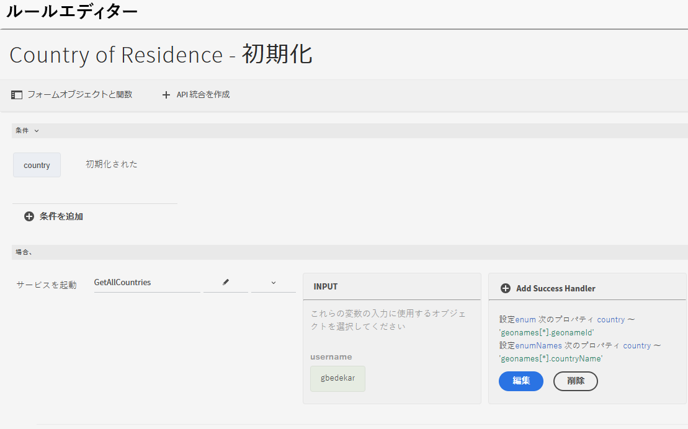
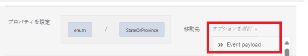
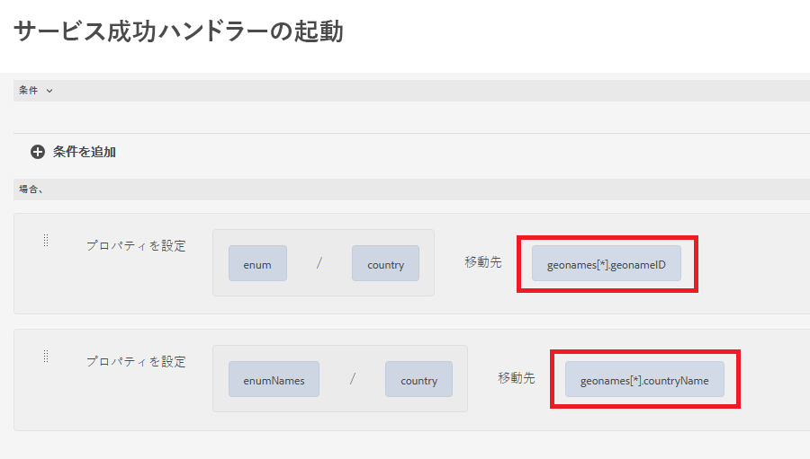
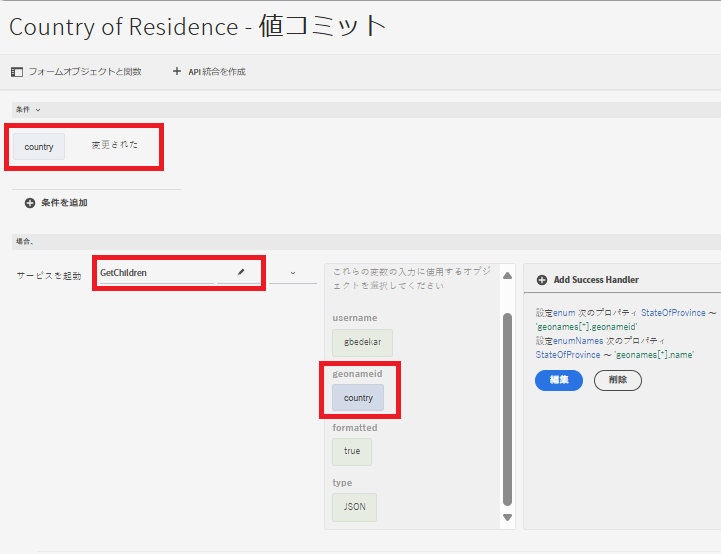
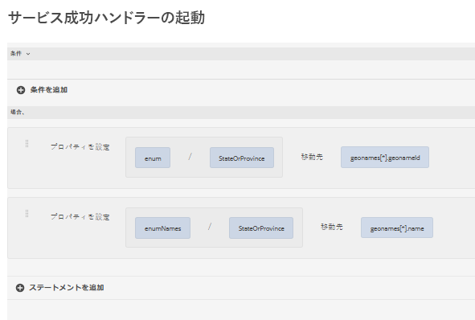

# ユニバーサルエディターを使用したフォームの作成

ユニバーサルエディターを使用して、次のフォームを作成します。フォームには 3 つのドロップダウンリストがあり、その値は API 統合を使用して入力されます

## 居住国

初期化時に、居住国ドロップダウンに API 呼び出しの結果が入力されます。

## 成功ハンドラー

成功ハンドラーは、geonames 配列の適切な値を使用して、国ドロップダウンリストの enum と enumNames を設定するように定義されました。geonames 配列は、イベントペイロードオプションで使用できます

## 子の値の取得

ユーザーが居住国ドロップダウンリストで選択を行うと、都道府県ドロップダウンリストに値が入力されます。選択した国に関連付けられた geonameId は、GetChildren API 統合への入力パラメーターとして渡されます

成功ハンドラーは、StateOrProvince ドロップダウンフィールドの enum／enumNames を設定するために定義されました

都道府県を選択すると、都道府県ドロップダウンリストに入力するために使用される上記のパターンに従って、市区町村ドロップダウンリストに入力できます。