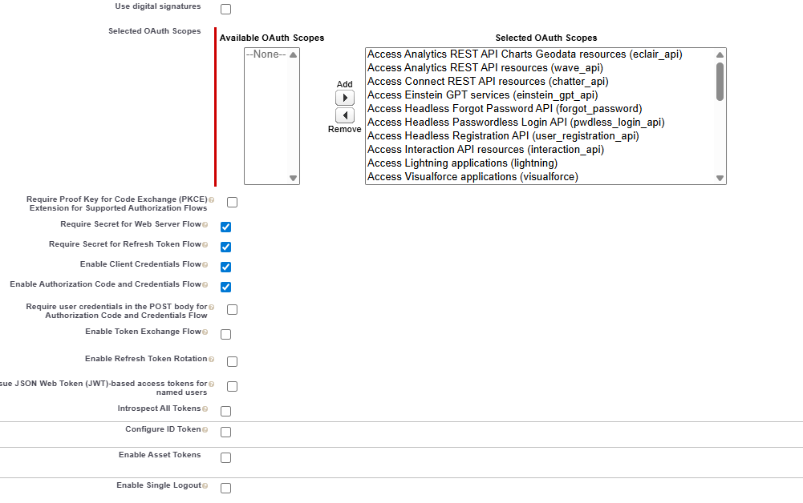
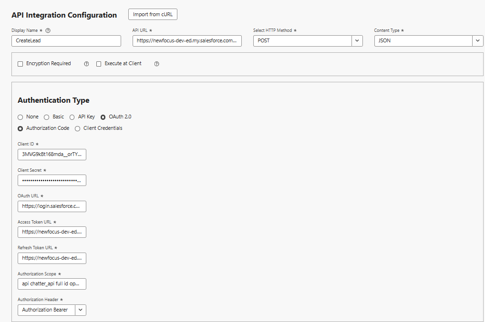
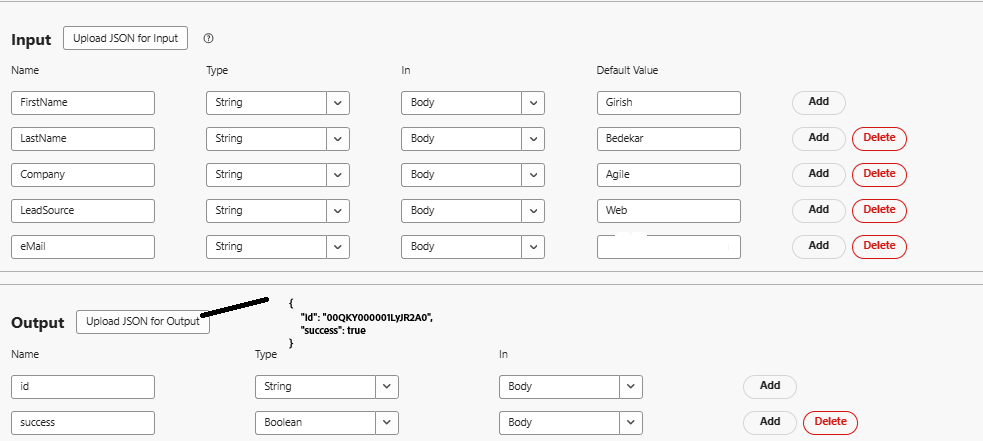
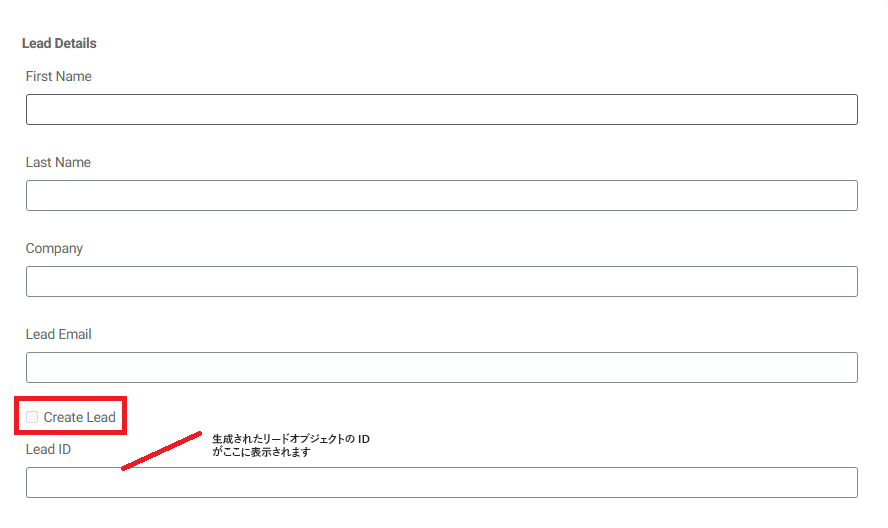
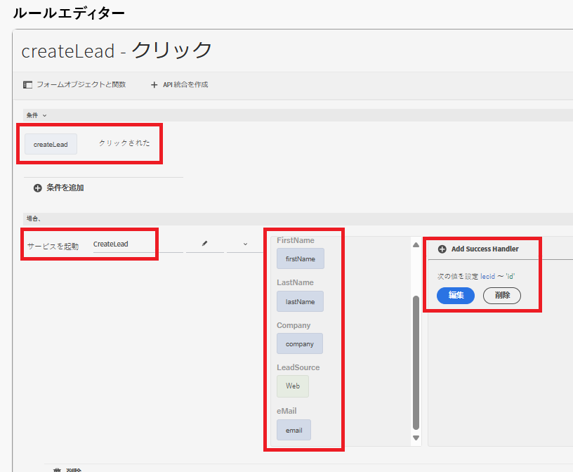

# API 統合を使用したSalesforce リードオブジェクトの作成

このユースケースでは、API 統合を使用してSalesforceでリードを作成する方法を説明します。 プロセスが完了すると、次の操作を実行できます。

[Salesforceで接続アプリケーション ](https://help.salesforce.com/s/articleView?id=platform.ev_relay_create_connected_app.htm&type=5) を設定して、安全な API アクセスを有効にします。

Web ブラウザーで動作しているコード（JavaScriptなど）が特定のオリジンからSalesforceと通信できるように CORS （クロスオリジンリソース共有）を設定し、次に示すようにオリジンを許可リストに追加します


## 接続されたアプリの設定

接続されたアプリでは、次の設定が使用されます。 要件に応じて、OAuth 範囲を割り当てることができます。


## API 統合を作成

| 名前 | 値 |
|--------------------------------|------------------|
| API url | https://`<your-domain>`d.my.salesforce.com/services/data/v32.0/sobjects/Lead |
| クライアント ID | 接続しているアプリに固有 |
| クライアントの秘密鍵 | 接続しているアプリに固有 |
| OAuth URL | https://login.salesforce.com/services/oauth2/authorize |
| トークン URL にアクセス | https://`<your-domain>`/services/oauth2/token |
| 更新トークン URL | https://`<your-domain>`/services/oauth2/token |
| 認証範囲 | api chatter_api full id openid refresh_token visualforce web |
| 認証ヘッダー | 認証 Bearer |



## 入力および出力パラメーター

次の JSON を使用して、API 呼び出しの入力パラメーターを定義し、出力パラメーターをマッピングします

```json
{
    "id": "00QKY000001LyJR2A0",
    "success": true
}
```



## フォームの作成

ユニバーサルエディターを使用してシンプルなアダプティブフォームを作成し、リードオブジェクトの詳細を次のようにキャプチャします


ルールエディターを使用して、「リードを作成」チェックボックスのクリックイベントを処理します。 以下に示すように、入力パラメーターを適切なフォームオブジェクトの値にマッピングします。 `leadid` の TextField オブジェクトに、新しく作成したリードオブジェクトの ID を表示します


## 統合のテスト

- フォームをプレビューします
- 意味のある値を入力します
- 「`Create Lead`」チェックボックスをオンにして、API 呼び出しをトリガーします
- 新しく作成されたリードオブジェクトのリード ID が `Lead ID` テキストフィールドに表示されます。
