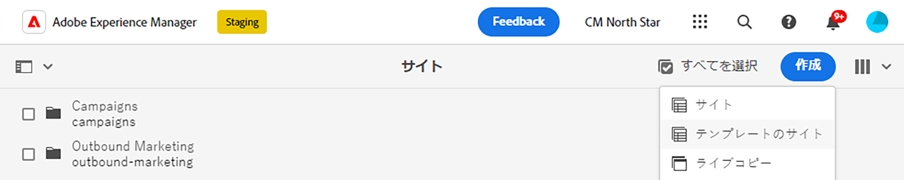
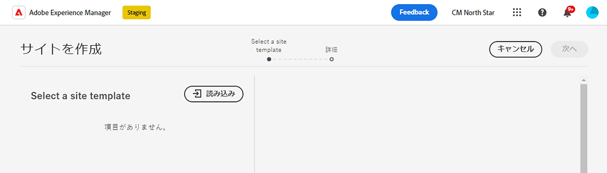
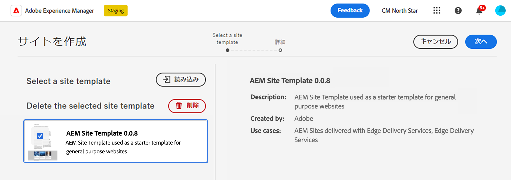
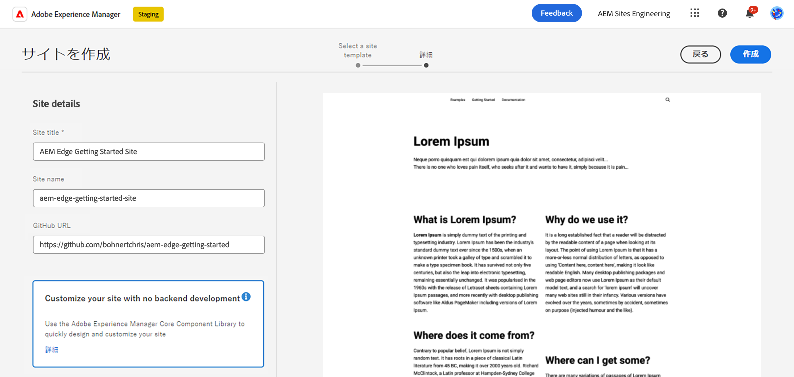
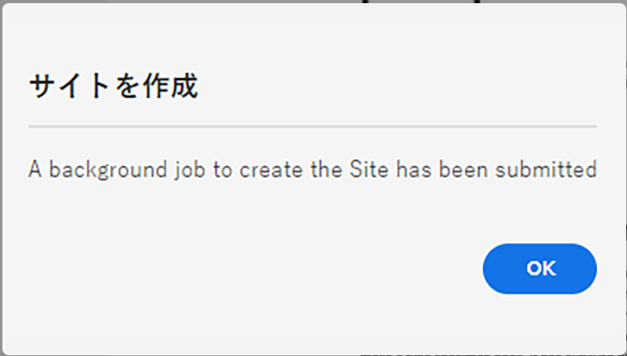
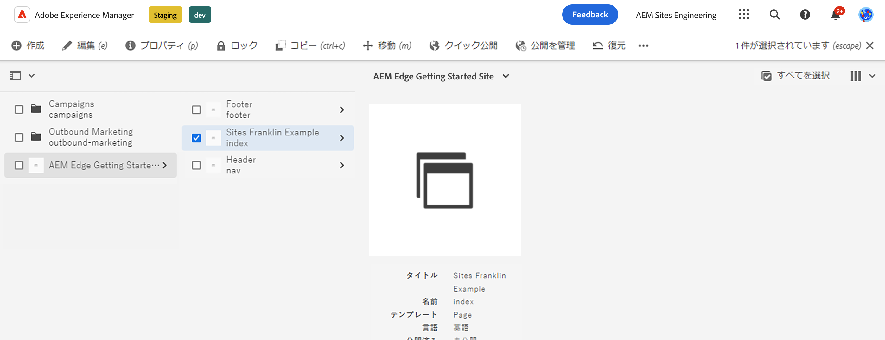
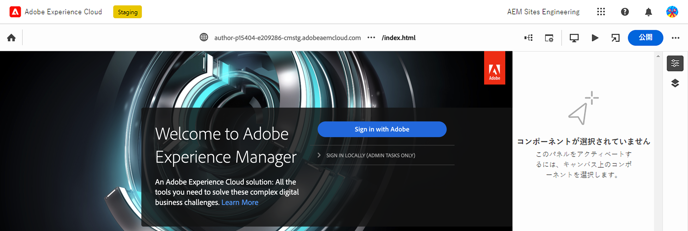
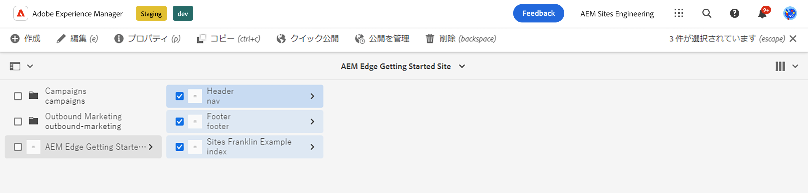
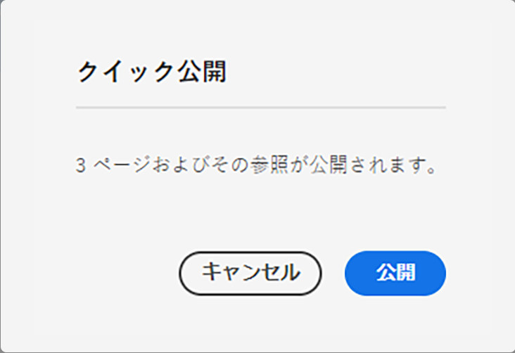

# AEMを使用したオーサリングEdge Delivery Services {#edge-dev-getting-started}

このガイドでは、Edge Delivery Servicesとコンテンツオーサリング用のユニバーサルエディターを使用して、新しいAdobe Experience Managerサイトを導入し、導入します。

{{aem-authoring-edge-early-access}}

## 前提条件 {#prerequisites}

このガイドを始める前に、の基本を既に理解し、次のようなEdge Delivery Servicesにアクセスできる必要があります。

* これで [エッジ配信サービスの口座です。](/help/edge/developer/tutorial.md)
* 次に対するアクセス権があります： [AEM Cloud Serviceサンドボックス。](/help/implementing/cloud-manager/getting-access-to-aem-in-cloud/introduction-sandbox-programs.md)
* お持ちの [は、同じサンドボックス環境でユニバーサルエディターを有効にしました。](/help/implementing/universal-editor/getting-started.md)

## 適切なエディタを選択します。 {#editor-choice}

AEMは、2 種類の異なるコンテンツエディターを提供し、状況に応じて、どのコンテンツエディターを使用するかを選択します。

* **ユニバーサルエディター**  — これは、新しいサイトのデフォルトの選択です。
* **AEM Page Editor**  — これは、既存のAEM SitesからEdge Delivery Servicesへの移行で選択する必要があります。

このガイドでは、ユニバーサルエディターを使用したEdge Delivery Servicesに関するAEMプロジェクトに焦点を当てます。 ドキュメントを見る [Edge Delivery Services向け開発](/help/edge/developing.md) を参照してください。

## AEMオーサリングの概要とEdge Delivery Services {#getting-started}

一度満たしたら [前提条件](#prerequisites) そして作った [ユニバーサルエディタを使用する選択](#editor-choice) 独自のプロジェクトで作業を開始できます。

### GitHub プロジェクトを作成する {#create-github-project}

まず、Adobeテンプレートに基づいて、GitHub に新しいプロジェクトを作成する必要があります。

1. に移動します。 [`https://github.com/adobe-rnd/aem-boilerplate-xwalk`](https://github.com/adobe-rnd/aem-boilerplate-xwalk) をクリックし、 **このテンプレートを使用** を選択し、 **新しいリポジトリを作成**.

   * このオプションを表示するには、GitHub にサインインする必要があります。

   

1. デフォルトでは、リポジトリが割り当てられます。 必要に応じて変更し、リポジトリの名前と説明を入力して、 **リポジトリを作成**.

   

1. 同じブラウザーの新しいタブで、に移動します。 [`https://github.com/apps/aem-code-sync`](https://github.com/apps/aem-code-sync) をクリックします。 **設定**.

   

1. クリック **設定** 前の手順で新しいリポジトリを作成した組織の場合。

   

1. AEM Code Sync GitHub ページで、 **リポジトリアクセス**&#x200B;を選択します。 **選択したリポジトリのみ**、前の手順で作成したリポジトリを選択し、 **保存**.

   

1. AEM Code Sync がインストールされると、確認画面が表示されます。 新しいリポジトリの「ブラウザー」タブに戻ります。

   

1. 次をクリック： `fstab.yaml` ファイルを開き、 **このファイルを編集** アイコンをクリックして編集します。

   

1. を編集します。 `fstab.yaml` ファイルを更新して、プロジェクトのマウントポイントを更新します。 デフォルトのGoogle Docs URL をAEM as a Cloud Serviceオーサリングインスタンスの URL に置き換えて、 **変更をコミット…**.

   * `https://<aem-author>/bin/franklin.delivery/<owner>/<repository>/main`
   * マウントポイントを変更すると、Edge Delivery Servicesはサイトのコンテンツをどこで見つけるかを指示します。

   

1. 必要に応じてコミットメッセージを追加し、「 **変更をコミット**&#x200B;を設定し、それらを直接に `main` 分岐。

   

1. リポジトリのルートに戻り、「 」をクリックします。 `paths.yaml` そして **このファイルを編集** アイコン。

   

1. デフォルトのマッピングを次で置き換えます。 `/content/<site-name>/:/` をクリックします。 **変更をコミット…**.

   * 独自の `<site-name>`. 後の手順で必要になります。
   * マッピングは、Edge Delivery Servicesに対して、AEMリポジトリ内のコンテンツをサイトの URL にマッピングする方法を指示します。

   

1. 必要に応じてコミットメッセージを追加し、「 **変更をコミット**&#x200B;を設定し、それらを直接に `main` 分岐。

   

### 新しいAEMサイトの作成と編集 {#create-aem-site}

GitHub プロジェクトが完成したら、プロジェクトで使用できる新しいAEMサイトを作成する必要があります。

>[!NOTE]
>
>ユニバーサルエディターを使用してサイトを編集するには、Chromium ベースのブラウザーを使用する必要があります。

1. Edge Delivery Servicesを使用した最新のAEMオーサリングサイトテンプレートを、 [プロジェクトSlackチャネル。](/help/edge/docs/slack.md)

1. AEMas a Cloud Serviceのオーサリングインスタンスにログインし、サイトコンソールに移動して、をタップまたはクリックします。 **作成** -> **テンプレートからのサイト**.

   

1. 次の日： **サイトテンプレートを選択** サイトの作成ウィザードのタブで、 **インポート** ボタンをクリックして、新しいテンプレートをインポートします。

   

1. AEMエンジニアリングから提供されるEdge Delivery Servicesを使用したAdobeオーサリングサイトテンプレートをアップロードします。

1. テンプレートがインポートされると、ウィザードに表示されます。 タップまたはクリックして対象のセグメントを選択し、タップまたはクリックします。 **次へ**.

   

1. 次のフィールドを入力し、をタップまたはクリックします。 **作成**.

   * **サイトのタイトル**  — サイトの説明的なタイトルを追加します。
   * **サイトのタイトル** - `<site-name>` で定義した [前の手順。](#create-github-project)
   * **GitHub URL**  — 前の手順で作成した GitHub プロジェクトの URL を使用します。

   

1. AEMは、ダイアログを使用してサイトの作成を確認します。 タップまたはクリック **OK** を閉じます。

   

1. サイトコンソールで、 `index.html` 新しく作成したサイトのをタップまたはクリックします。 **編集** 」と入力します。

   

1. ユニバーサルエディターが新しいタブで開きます。 タップまたはクリックする必要がある場合があります **ログインとAdobe** 認証してページを編集します。

   

これで、ユニバーサルエディターを使用してサイトを編集できます。 詳しくは、 [ユニバーサルエディターのドキュメント](/help/sites-cloud/authoring/universal-editor/authoring.md) を参照してください。

### 新しいサイトのパブリッシュ {#publishing}

ユニバーサルエディターを使用して新しいサイトの編集が完了したら、コンテンツを公開できます。

1. サイトコンソールで、新しいサイト用に作成したすべてのページを選択し、をタップまたはクリックします。 **クイック公開** 」と入力します。

   

1. タップまたはクリック **公開** をクリックして、プロセスを開始します。

   

1. 同じブラウザーで新しいタブを開き、新しいサイトの URL に移動します。

   * `https://main--<site-name>--<owner>.hlx.page`

1. 公開されたコンテンツを確認します。

   

## 次の手順 {#next-steps}

これで、Edge Delivery Servicesプロジェクトを使用したAEMの作業が完了し、独自のブロックの作成とスタイル設定を開始できます。

ガイドを参照してください [ユニバーサルエディタで使用するためのブロックの作成](/help/edge/create-block.md) を参照してください。
