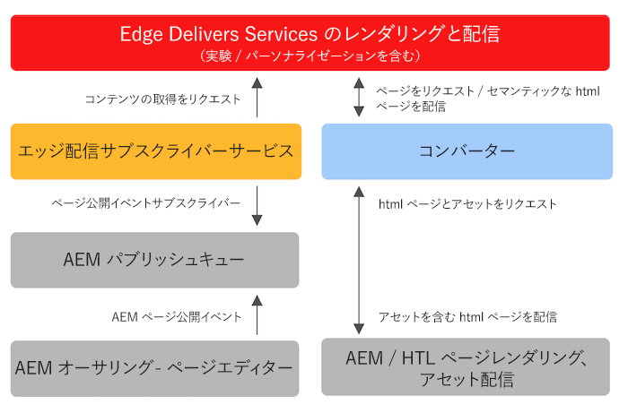

# 既存のAEMプロジェクトでのEdge Delivery Servicesの使用 {#existing-projects}

Edge Delivery Servicesの恩恵を受けるために、新しいAEMプロジェクトを待つ必要はありません。 Edge Delivery Servicesを既存のAEMプロジェクトに統合して、そのパフォーマンスの向上をすぐに活用できます。

## AEM Page Editor の制限事項 {#page-editor}

Edge Delivery Servicesが登場する前は、AEMで管理されるコンテンツは、AEMページエディターを使用して編集されていました。 プロジェクトがEdge Delivery Servicesの導入前に開始した場合、ページエディターを使用していることはほぼ確実です。

AEM Page Editor は、 [AEMコンポーネント](/help/implementing/developing/components/overview.md) 例： [コアコンポーネント。](https://experienceleague.adobe.com/docs/experience-manager-core-components/using/introduction.html?lang=ja) これらのコンポーネントは、Edge Delivery Servicesとは互換性がありません。 このため、既存のAEMプロジェクトにEdge Delivery Servicesを導入するには、次の 2 つの段階が必要です。

* [フェーズ 1 — フロントエンドの交換](#replace-front-end)
* [フェーズ 2 — ユニバーサルエディタに切り替え](#switch-ue)

## フェーズ 1 — フロントエンドの交換 {#replace-front-end}

フェーズ 1 では、既存のAEMサイト構造、コンポーネント、オーサリングツールを引き続き使用できます。 Web サイトのレンダリングは、JavaScript と CSS を使用するブロックを使用して再構築され、Edge Delivery Services経由で配信されます。

詳しくは、 [ビルドセクション](https://www.aem.live/docs/#build) Edge Delivery Servicesに関するドキュメントを参照して、ブロックの詳細と、Edge 配信サービス向けの開発方法を確認してください。

AEMでレンダリングされたHTML出力を変換してEdge Delivery Servicesに送信するには、App Builder 上のコンバーターが必要です。

フェーズ 2 では、AEMオーサー環境での HTL と Java を備えたAEMコアコンポーネント、Edge 配信環境での JS ベースのブロック、NodeJS ベースのコンバーターというテクノロジーの重複を排除して、プロセスを完了します。

## フェーズ 2 — ユニバーサルエディタに切り替え {#switch-ue}

このフェーズでは、AEMページエディターがユニバーサルエディターに置き換えられます。 ユニバーサルエディターはブロックを直接操作できるので、AEMコアコンポーネントとコンバーターは不要になりました。

## 使用の手引き {#how-to-get-started}

この機能にアクセスするには、Adobe担当者にお問い合わせください。
