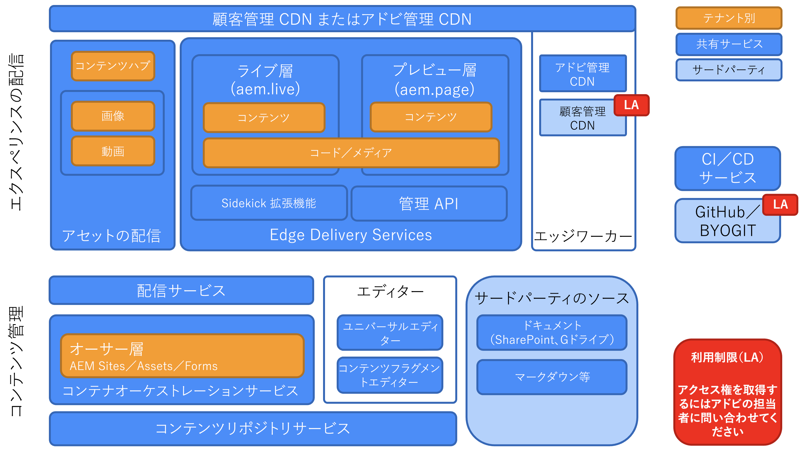
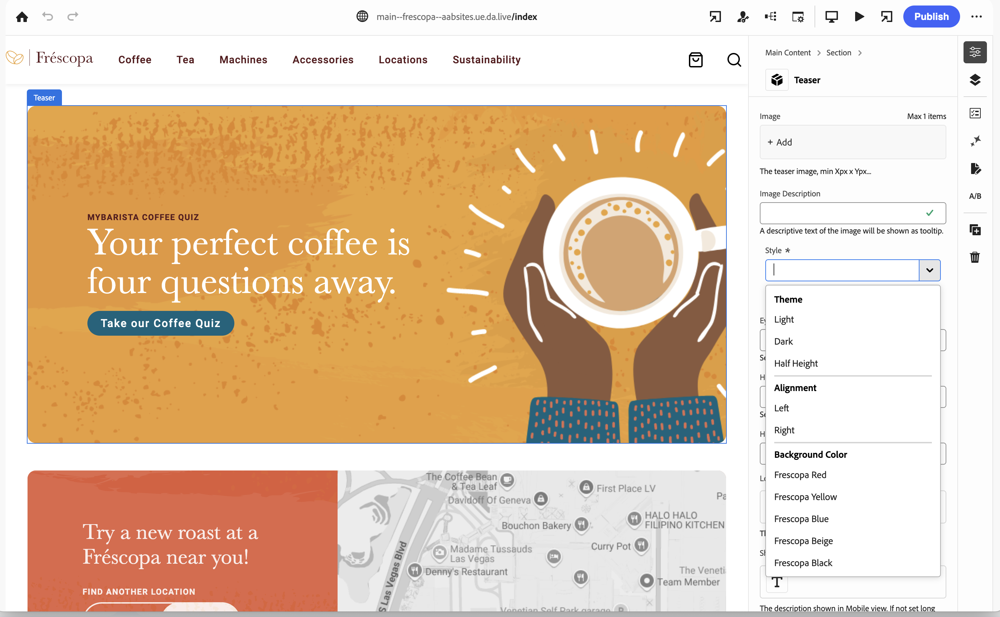

# Edge Delivery Services の概要 {#edge-delivery-services}

>[!TIP]
>
>**すぐに実践したい場合**
>
>Edge Delivery Services をすぐに実践する場合は、2 つのオプションがあります。
>
>* [事前定義済みのチュートリアル環境を使用して、すぐにオーサリングを開始 - 完全に設定され、すぐに使用できます。](https://www.aem.live/developer/ue-trial)
>* [aem.live のチュートリアルを参照する](https://www.aem.live/developer/ue-tutorial)ことにより、さらに詳しい情報を調べ、30 分以内に独自の環境を設定できます。

## Edge Delivery Services とは？ {#what-is-edge}

Edge Delivery Services は、web サイトの構築と配信の方法を再考し、速度、シンプルさ、拡張性を最適化する最新のコンテンツ配信フレームワークです。これは Adobe Experience Manager の中核となる部分であり、ネットワークの端でレンダリングと配信をユーザーに近い場所にプッシュし、より高速なデジタルエクスペリエンスを実現します。

これは、コンテンツ配信ネットワーク（CDN）に代わるものではありませんが、独自の CDN または含まれている [Adobe の管理による CDN とシームレスに統合されます。](/help/implementing/dispatcher/cdn.md)

## Edge Delivery Services を選ぶ理由？ {#why-edge}

### 検出性とトラフィックの増加 {#increase-traffic}

Edge Delivery の web サイトは、LLM 向けに最適化された検索エンジン（SEO）と最適化された生成エンジン（GEO）です。これにより、オーガニックトラフィックの既存および今後のすべてのソースで高い可視性と検出性が確保されます。**パフォーマンスファーストのエンドツーエンドアーキテクチャ**&#x200B;により、エンゲージメントにプラスの影響を与える楽しい顧客体験が保証されます。

### 開発者の効率 {#developer-efficientcy}

数ヶ月や数年ではなく、数日や数週間で運用を開始できます。Edge Delivery は、GitHub、自動再読み込みによるローカル開発、パフォーマンス、シンプルさなど、**現在の web 開発者**&#x200B;が好むすべてのツールを提供します。トランスパイル、バンドラー、設定、オーバーヘッドなどの複雑なものは一切ありません。

Edge Delivery はシンプルなので、AI コードの作成に最適な複雑なフレームワーク、ツール、プロセスを使用する必要はありません。プレーンな HTML、最新の CSS、vanilla JavaScript を使用して、優れたエクスペリエンスをこれまで以上に迅速に作成します。 仕事に集中し、新しいツールのトレーニングと学習に費やす時間を短縮します。

Edge Delivery を使用すると、すべての開発者が 100 の Lighthouse スコアを達成できます。

### 複数のコンテンツソースのサポート {#multiple-content-sources}

様々なソリューションのコンテンツを Edge Delivery と直接統合できます。これには、**既存の AEM インスタンスのすべてが含まれます**。作成者はコンテンツを管理して、**SharePoint などのあらゆるシステムから Edge Delivery に公開して**、既知のツールで速度を上げることができます。

### 構成可能なアーキテクチャ {#composable-architeture}

ヘッドレスでもヘッドフルでも、適切なコンテンツを適切な形式で配信し、適切な装飾を追加して、あらゆるチャネルで際立つエクスペリエンスにすることができます。

## 動作方法 {#how-does-it-work}

Edge Delivery Services は、web サイト上のコンテンツの柔軟なオーサリングを実現する、合成可能なサービスセットです。AEM パブリッシュ / Dispatcher や、AEM コアコンポーネントを使用してエクスペリエンスを構築する従来の方法に代わり、マルチクラウド SaaS ソリューションと純粋なフロントエンド開発アプローチを提供します。

Edge Delivery Services では GitHub を利用しているので、自身の GitHub リポジトリから直接コードを管理およびデプロイできます。新しいコンテンツは、再作成プロセスなしで即座に追加されます。

## オーサリング {#authoring}

### コンテキスト内編集 {#in-context-editing}

[ユニバーサルエディター](/help/implementing/universal-editor/introduction.md)は、ビジュアルプレビューを使用してコンテンツをリアルタイムかつコンテキストに沿って編集できる、カスタマイズ可能な WYSIWYG の一元的な編集ツールです。

* ユニバーサルエディターを使用した AEM オーサリングにより、ヘッドレスでもヘッドフルでも作成者の効率が向上します。
* ワークフローやガバナンスを含む AEM の包括的なコンテンツ管理機能を活用できます。
* 多数の拡張ポイントを活用して、独自のプロセスと統合をサポートします。
* サイトの機能は、GitHub で CSS と JavaScript を使用して開発できます。

### ドキュメントベースの編集 {#document-based-editing}

[もう 1 つのアプローチは、コンテンツをドキュメントとして管理する](https://www.aem.live/docs/authoring)ドキュメントベースのオーサリングです。Microsoft Word は一般的な選択肢です。多くの企業が SharePoint を導入しており、そこで最初のコンテンツが作成されるからです。新しいツールを学んだり、SharePoint からコンテンツを直接公開したりする必要はありません。Word では、コンテンツをコピーして AEM に貼り付ける手間が省けます。SharePoint を利用していないお客様は、Google Drive を代わりに使用することもできます。

## 運用上のテレメトリ {#telemetry}

Adobe Experience Manager では[運用上のテレメトリ](https://www.aem.live/docs/operational-telemetry)を使用して、Adobe Experience Manager を利用したサイトで機能とパフォーマンスの問題を検出および修正するために必要な運用データのみを収集します。運用上のテレメトリデータを使用すると、パフォーマンスの問題を診断し、実験の有効性を測定できます。運用上のテレメトリでは、[サンプリング](https://www.aem.live/docs/operational-telemetry#operational-telemetry-data-is-sampled)（すべてのページビューのごく一部のみをモニタリング）と、[個人を特定できる情報（PII）の適切な除外](https://www.aem.live/docs/operational-telemetry#what-data-is-being-collected)を通じて、訪問者のプライバシーを保護します。

## 探索の開始 {#start-exploring}

ユニバーサルエディターと Edge Delivery Services を使用した AEM オーサリングの概要：

* Edge Delivery Services ドキュメント [Edge Delivery Services](https://www.aem.live)
* ユニバーサルエディターを使用した AEM のオーサリングの概要については、aem.live ドキュメントの [Edge Delivery Services 向けの AEM を使用したオーサリング](https://www.aem.live/docs/aem-authoring)を参照してください。
* 開発者向けの概要については、aem.live ドキュメントの[はじめに - ユニバーサルエディターの開発者向けチュートリアル](https://www.aem.live/developer/ue-tutorial)を参照してください。

## Edge Delivery Services と他の Adobe Experience Cloud 製品 {#edge-other-products}

Edge Delivery Services は、Adobe Experience Manager の一部です。そのため、Edge Delivery Services と AEM Sites は、同じドメイン上に共存できます。これは、大規模な web サイトでの一般的なユースケースです。さらに、AEM Sites ページでは、Edge Delivery Services のコンテンツをシームレスに使用でき、その逆も同様です。

また、Edge Delivery Services を [Adobe Target](https://www.aem.live/developer/target-integration) および [Launch](https://experienceleague.adobe.com/ja/docs/experience-platform/tags/home) と共に使用することもできます。

## アドビからのヘルプの入手 {#getting-help}

アドビには、Edge Delivery Services に役立つ 3 つのレイヤーが用意されています。

* 一般的な問い合わせについては、[コミュニティリソース](#community-resources)に問い合わせてください。
* 特定の質問については、[製品コラボレーションチャネル](#collaboration-channel)にアクセスしてください。
* [サポートチケットをログに記録](#support-ticket)して、重大および重要な問題を&#x200B;**契約上のサポート SLA 内**&#x200B;で解決します。

### コミュニティリソースへのアクセス {#community-resources}

Adobe は、Edge Delivery Services、ユニバーサルエディターを使用した AEM オーサリング、ドキュメントベースのオーサリングに関して、最高のコミュニティエンゲージメントとサポートを提供することに尽力しています。

* [Experience League コミュニティ](https://adobe.ly/3Q6kTKl)に参加して、質問をしたり、フィードバックを共有したり、ディスカッションを始めたり、アドビの専門家や AEM アドバイザー／チャンプにサポートを求めたり、同じ意見を持つユーザーとリアルタイムでつながりを持つことができます。
* リアルタイムのインタラクションと迅速なアイデア交換を実現する一層カジュアルなプラットフォーム、[ディスコードチャネル](https://discord.gg/aem-live)に参加してください。

### サポートチケットのログ {#support-ticket}

{{support-ticket}}
