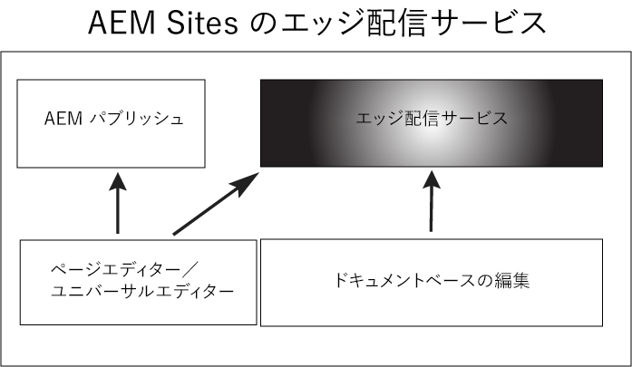

# はじめに —Edge Delivery Services {#getstart-edge}

Edge Delivery Servicesを活用すれば、AEMはエンゲージメントとコンバージョンを推進する優れたエクスペリエンスを提供します。 AEMは、作成と開発をすばやくおこなう、インパクトの大きいエクスペリエンスを提供することで、これを実現します。 これは、作成者が迅速に更新および公開でき、新しいサイトが迅速に起動する、迅速な開発環境を可能にする、合成可能なサービスのセットです。 したがって、Edge Delivery Servicesを使用すると、コンバージョンを改善し、コストを削減し、コンテンツの速度を大幅に向上できます。

Edge 配信を活用すると、次のことができます。

* 完璧な Lighthouse スコアで高速サイトを作成し、実際のユーザー監視 (RUM) を通じてサイトのパフォーマンスを継続的に監視します。
* コンテンツソースを分離してオーサリング効率を向上させます。 標準では、AEMオーサリングとドキュメントベースのオーサリングの両方を使用できます。 したがって、同じ Web サイト上で複数のコンテンツソースを操作できます。
* テストの作成、パフォーマンスへの影響なしでの実行、テスト勝者の実稼動への迅速なリリースを可能にする、組み込みの実験フレームワークを使用します。

## エッジ配信の仕組み {#edge-works}

次の図は、Microsoft Word（ドキュメントベースの編集）でコンテンツを編集し、Edge 配信に公開する方法を示しています。 また、様々なエディターを使用した従来のAEMの公開方法も示します。

エッジ配信は、Web サイト上でのコンテンツのオーサリング方法を柔軟に高めることができる、合成可能なサービスのセットです。 前述のように、 [AEM authoring](https://experienceleague.adobe.com/docs/experience-manager-cloud-service/content/sites/authoring/getting-started/concepts.html) および [ドキュメントベースのオーサリング](https://www.hlx.live/docs/authoring).

例えば、Microsoft Word またはGoogle Docs から直接コンテンツを使用できます。 つまり、これらのソースからのドキュメントは、Web サイト上のページになることがあります。 さらに、見出し、リスト、画像、フォント要素はすべて、初期ソースから Web サイトに転送できます。 新しいコンテンツは、再構築プロセスなしで即座に追加されます。

Edge 配信では GitHub を活用するので、顧客は GitHub リポジトリから直接コードを管理およびデプロイできます。 例えば、 GoogleドキュメントまたはMicrosoft Word にコンテンツを書き込み、 GitHub で CSS と JavaScript を使用してサイトの機能を開発できます。 準備が整ったら、Sidekickブラウザー拡張機能を使用して、コンテンツの更新をプレビューおよび公開できます。

参考情報：

* Edge 配信の開始方法について詳しくは、 [ビルド](https://www.hlx.live/docs/#build) の節を参照してください。
* Edge 配信を使用してコンテンツをオーサリングおよびパブリッシュする方法については、 [セクションを公開](https://www.hlx.live/docs/authoring).
* Web サイトプロジェクトを適切に起動する方法を理解するには、 [「Launch」セクション](https://www.hlx.live/docs/#launch).

## Edge Delivery Servicesおよびその他のAdobe Experience Cloud製品 {#edge-other-products}

Edge Delivery ServicesはAdobe Experience Managerに含まれているので、Edge 配信サイトとAEMサイトを同じドメイン上で共存させることができます。 これは、大規模な Web サイトの一般的な使用例です。 その上、Edge 配信のコンテンツをAEM Sitesページで容易に使用でき、その逆も可能です。

また、Edge Delivery Servicesは、Adobe Target、Analytics、Launch と組み合わせて使用することもできます。

## Edge Delivery Servicesへのアクセス {#getting-access}

Edge Delivery Servicesの使用を簡単に開始できます。 はじめに、 [はじめに — 開発者向けチュートリアル](https://www.hlx.live/developer/tutorial).

## Adobeからヘルプを取得する {#adobe-gethelp}

プロビジョニングしたAdobeコラボレーションチャネルを通じて製品製品チームと連携し（詳しくは、以下を参照）、製品の使用やベストプラクティスに関する質問に回答できます。 製品コラボレーションチャネルを介した会話に関連するサービスレベル用語 (SLT) は存在しないことに注意してください。 製品の問題が追加の調査とトラブルシューティングを必要とし、応答 SLT を満たす必要がある場合は、次の手順に従ってサポートチケットを送信できます。 [支援プロセス](https://experienceleague.adobe.com/?lang=ja&amp;support-tab=home#support).

Adobeには、Edge Delivery Servicesに役立つ 3 つのチャネルが用意されています。

* 一般的な問い合わせに関するコミュニティリソースに関する情報
* 特定の質問については、製品コラボレーションチャネルにアクセスしてください
* 重要な問題と重要な問題を解決するためのサポートチケットを記録する

### コミュニティリソースにアクセス {#community-resource}

Adobeは、コミュニティに対する最高のエンゲージメントとサポートを提供し、Edge Delivery Servicesとドキュメントベースのオーサリングに取り組んでいます。 参加する [Experience Leagueコミュニティ](https://adobe.ly/3Q6kTKl) 質問をしたり、意見を共有したり、ディスカッションを開始したり、Adobeの専門家やAEM Advisors/Champs に助けを求めたり、同じ意見を持つ人とリアルタイムでつながりを持つことができます。 また、 [Discord チャネル](https://discord.gg/aem-live)：リアルタイムのインタラクションと迅速なアイデア交換のための、より一般的なプラットフォームです。

### 製品コラボレーションチャネルへのアクセス方法 {#collab-channel}

お客様との直接Slackチャネルの価値を考慮すると、AEMをご利用のすべてのお客様は、エクスペリエンスの品質に関する迅速な更新、重要な更新、拡張レポートを目的とした通信チャネルを確立します。 組織に固有のSlackチャネルに参加するための招待メールがAdobeから届きます。

詳しくは、 [Slackボットの使用](https://www.hlx.live/docs/slack) ドキュメントを参照してください。

### サポートチケットのログ {#support-ticket}

Admin Consoleを使用してサポートチケットを記録する手順は次のとおりです。

1. 追加 **エッジ配信** チケットのタイトル。
2. 説明には、次の詳細を入力してください。

   * ライブ Web サイトの URL。 例： [www.mydomain.com].
   * 接触チャネル Web サイトの URL (.hlx URL)。

## 次の手順 {#whats-next}

まず、次の記事を確認します。 [使用Edge Delivery Services](/help/edge/using.md).

## 役立つリソース {#useful-resources}

Edge Delivery Servicesの詳細については、 [Edge Delivery Servicesドキュメント](https://www.hlx.live/docs/).
