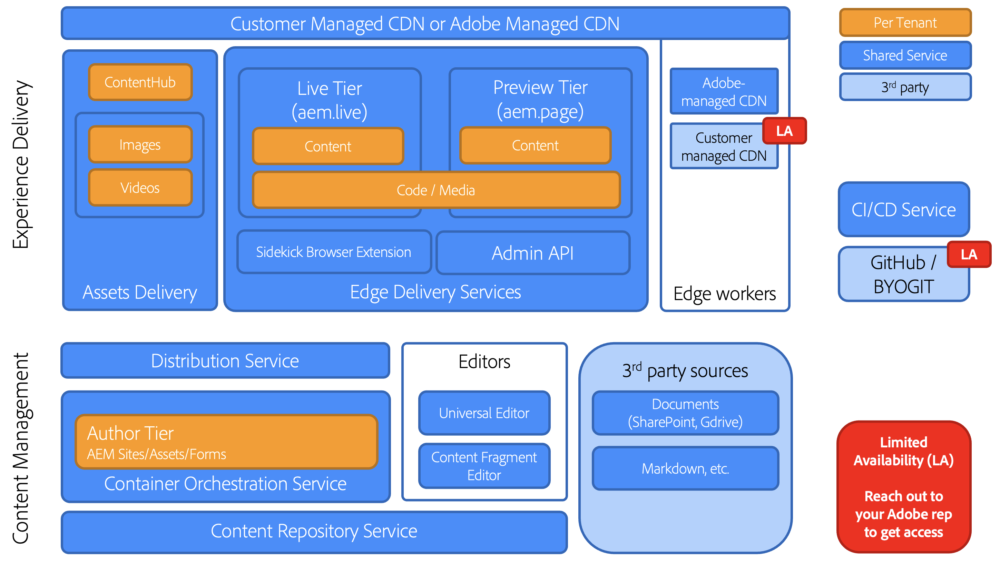

# Edge Delivery Services の概要 {#edge-delivery-services}

## Edge Delivery Servicesとは {#what-is-edge}

Edge Delivery Servicesは、web サイトの構築と配信の方法を再考し、速度、シンプルさ、拡張性を最適化する最新のコンテンツ配信フレームワークです。 これはAdobe Experience Managerの中核となる部分であり、ネットワークの端でレンダリングと配信をユーザーに近い場所にプッシュすることで、より高速なデジタルエクスペリエンスを実現します。

これは、コンテンツ配信ネットワーク（CDN）に代わるものではありませんが、独自の CDN または含まれている [Adobeの管理による CDN とシームレスに統合されます。](/help/implementing/dispatcher/cdn.md)

>[!TIP]
>
>**すぐに実践してみませんか？**
>
>すぐに実践したい場合は、[aem.live のチュートリアルを参照する](https://www.aem.live/developer/ue-tutorial)ことにより、30 分以内にAEM オーサリングを使用して独自のEdge Delivery Services プロジェクトを開始できます。

## Edge Delivery Servicesを選ぶ理由 {#why-edge}

### 検出性とトラフィックの増加 {#increase-traffic}

Edge Deliveryの web サイトは、LLM 向けに最適化された検索エンジン（SEO）と最適化された生成エンジン（GEO）です。 これにより、オーガニックトラフィックの既存および今後のすべてのソースで高い可視性と検出性が確保されます。 **パフォーマンスファーストのエンドツーエンドアーキテクチャ** により、エンゲージメントにプラスの影響を与える楽しい顧客体験が保証されます。

### 開発者の効率 {#developer-efficientcy}

数ヶ月や数年ではなく、数日や数週間で運用を開始できます。 Edge Deliveryは、GitHub、自動再読み込みローカル開発、パフォーマンス、シンプルさ、複雑さ **蒸散なし、バンドラーなし、設定なし、オーバーヘッドなし）のすべてのツール** 最新の web 開発者）を提供します。

Edge Deliveryはシンプルなので、AI コードの作成に最適な複雑なフレームワーク、ツール、プロセスを使用する必要はありません。 プレーンなHTML、最新の CSS、vanilla JavaScriptを使用して、優れたエクスペリエンスをこれまで以上に迅速に作成します。 仕事に集中し、新しいツールのトレーニングと学習に費やす時間を短縮します。

Edge Deliveryを使用すると、すべてのデベロッパーが 100 lighthouse スコアを達成できます。

### 複数のコンテンツソースのサポート {#multiple-content-sources}

様々なソリューションのコンテンツを、（既存のEdge Delivery インスタンスをすべて含む **AEMと直接統合でき** す。 作成者は、コンテンツを管理して **SharePointなどのあらゆるシステムからEdge Deliveryに公開して** 既知のツールで速度を上げることができます。

### 構成可能なアーキテクチャ {#composable-architeture}

ヘッドレスでもヘッドフルでも、適切なコンテンツを適切な形式で配信し、適切な装飾を追加することで、あらゆるチャネルで際立つエクスペリエンスにすることができます。

## 仕組み {#how-does-it-work}

Edge Delivery Services は、web サイト上のコンテンツの柔軟なオーサリングを実現する、合成可能なサービスセットです。AEM パブリッシュ/Dispatcherや、AEM コアコンポーネントを使用してエクスペリエンスを構築する従来の方法に代わり、マルチクラウド SaaS ソリューションと純粋なフロントエンド開発アプローチを提供します。

Edge Delivery Services では GitHub を利用しているので、自身の GitHub リポジトリから直接コードを管理およびデプロイできます。新しいコンテンツは、再作成プロセスなしで即座に追加されます。

## オーサリング {#authoring}

### コンテキスト内編集 {#in-context-editing}

[ ユニバーサルエディター ](/help/implementing/universal-editor/introduction.md) は、カスタマイズ可能なワンストップの場所で、視覚的なプレビューを使用してコンテンツをライブでコンテキスト内で編集できる、見たままが得られる（WYSIWYG）ものです。

* AEM オーサリングとユニバーサルエディターを使用すると、ヘッドレスであろうとヘッドフルであろうと、作成者の効率を向上させることができます。
* ワークフローやガバナンスを含む AEM の包括的なコンテンツ管理機能を活用できます。
* 多数の拡張ポイントを利用して、独自のプロセスや統合をサポートできます。
* サイトの機能は、GitHub で CSS と JavaScript を使用して開発できます。

### ドキュメントベースの編集 {#document-based-editing}

[ もう 1 つのアプローチは、コンテンツをドキュメントとして管理する ](https://www.aem.live/docs/authoring) ドキュメントベースのオーサリングです。 多くの企業は、最初のコンテンツが作成されるSharePointを用意しているので、Microsoft Word は一般的な選択肢です。 新しいツールを学んだり、SharePointからコンテンツを直接公開したりする必要はありません。Word では、コンテンツをコピーしてAEMに貼り付ける手間が省けます。 SharePointを利用していないお客様は、Google Drive を代わりに使用することもできます。

## 運用上の遠隔測定 {#telemetry}

Adobe Experience Managerでは [ 運用テレメトリ ](https://www.aem.live/docs/operational-telemetry) を使用して、Adobe Experience Managerを利用したサイトで機能とパフォーマンスの問題を検出および修正するために厳密に必要な運用データを収集します。 運用上のテレメトリデータを使用すると、パフォーマンスの問題を診断し、実験の有効性を測定できます。 運用上のテレメトリは、[ サンプリング ](https://www.aem.live/docs/operational-telemetry#operational-telemetry-data-is-sampled) （すべてのページビューのごく一部のみが監視されます）および [ 個人を特定できる情報の慎重な除外 ](https://www.aem.live/docs/operational-telemetry#what-data-is-being-collected) （PII）を通じて、訪問者のプライバシーを保持します。

## 調査を開始 {#start-exploring}

ユニバーサルエディターとEdge Delivery Servicesを使用したAEM オーサリングの基本を学びます。

* Edge Delivery Services ドキュメント [Edge Delivery Services](https://www.aem.live)
* ユニバーサルエディターを使用した AEM のオーサリングの概要については、aem.live ドキュメントの [Edge Delivery Services 向けの AEM を使用したオーサリング](https://www.aem.live/docs/aem-authoring)を参照してください。
* 開発者向けの概要については、aem.live ドキュメントの[はじめに - ユニバーサルエディターの開発者向けチュートリアル](https://www.aem.live/developer/ue-tutorial)を参照してください。

## Edge Delivery Services と他の Adobe Experience Cloud 製品 {#edge-other-products}

Edge Delivery Services は、Adobe Experience Manager の一部です。そのため、Edge Delivery Services と AEM Sites は、同じドメイン上に共存できます。これは、大規模な web サイトでの一般的なユースケースです。さらに、AEM Sites ページでは、Edge Delivery Services のコンテンツをシームレスに使用でき、その逆も同様です。

[Adobe Target](https://www.aem.live/developer/target-integration) や [Launch.](https://experienceleague.adobe.com/ja/docs/experience-platform/tags/home) でEdge Delivery Servicesを使用することもできます

## アドビからのヘルプの入手 {#getting-help}

Adobeには、Edge Delivery Servicesに役立つ 3 つのレイヤーが用意されています。

* 一般的な問い合わせについては、[コミュニティリソース](#community-resources)に問い合わせてください。
* 特定の質問については、[製品コラボレーションチャネル](#collaboration-channel)にアクセスしてください。
* [ サポートチケットをログに記録 ](#support-ticket) して、重大な問題や重大な問題 **契約上のサポートSLA内** を解決します。

### コミュニティリソースへのアクセス {#community-resources}

Adobe は、Edge Delivery Services、ユニバーサルエディターを使用した AEM オーサリング、ドキュメントベースのオーサリングに関して、最高のコミュニティエンゲージメントとサポートを提供することに尽力しています。

* [Experience League コミュニティ](https://adobe.ly/3Q6kTKl)に参加して、質問をしたり、意見を共有したり、ディスカッションを始めたり、アドビの専門家や AEM アドバイザー／チャンプにサポートを求めたり、同じ意見を持つユーザーとリアルタイムでつながりを持つことができます。
* リアルタイムのインタラクションと迅速なアイデア交換を実現する一層カジュアルなプラットフォーム、[ディスコードチャネル](https://discord.gg/aem-live)に参加してください。

### サポートチケットのログ {#support-ticket}

{{support-ticket}}
