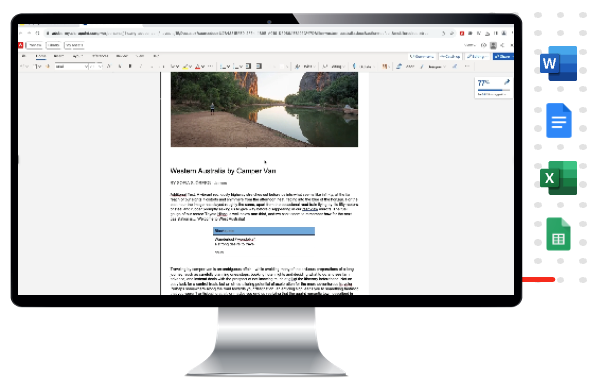

# Edge Delivery Services の概要 {#edge-delivery-services}

Edge Delivery により、AEM はエンゲージメントとコンバージョンを促進する優れたエクスペリエンスを提供します。そのために AEM では、迅速に作成および開発できるインパクトの強いエクスペリエンスを提供します。これは、作成者がサイトをすばやく更新および公開できて、新しいサイトが迅速にローンチされる迅速な開発環境を可能にする、構成可能なサービスセットです。したがって、Edge Delivery を使用すると、コンバージョンを向上させ、コストを削減し、コンテンツベロシティを最大限に高めることができます。

Edge 配信サービスを使用すると、次の操作を実行できます。

* 申し分ない Lighthouse スコアの高速サイトを作成し、実際の使用のモニタリング（RUM）を通じてサイトのパフォーマンスを継続的に監視します。
* コンテンツソースを分離することでオーサリング効率を向上させます。すぐに使用できる状態で、ユニバーサルエディターを使用したAEM オーサリングと、ドキュメントベースのオーサリングの両方を使用できます。 したがって、同じ web サイト上で複数のコンテンツソースを操作できます。
* 迅速なテスト作成、パフォーマンスに影響を与えない実行およびテスト勝者の実稼動環境への迅速なリリースが可能になる組み込みの実験フレームワークを使用します。

## ビジネスニーズに対するアジャイルな対応 {#agile-reaction}

アドビは、長年にわたって認められている業界のリーダーとして、新しい、有意義なコンテンツを迅速に作成して公開できることが、お客様にとっていかに重要であるかを理解しています。コンテンツ作成の拡大における一般的な課題は、市場によって明らかにされています。例えば、次のような課題が挙げられます。

1. **コンテンツに対する需要が成長し続けている。**
   * この需要を満たすには、新しいコンテンツ作成者を開拓する必要があります。
   * コンテンツ作成プロセスは、ビジネス全体で効果的に拡張する必要があります。
   * 作成者は、トレンドの変化に迅速に対応できる必要があります。
1. **オムニチャネルコンテンツが必要である。**
   * コンテンツの配信に関係なく、レイアウト制御が必要です。
   * 作成者には、コンテンツのレイアウトを直接変更できる権限が必要です。
1. **コンテンツの ROI を向上させるプレッシャーが高まっている。**
   * 作成者自身には、作成したコンテンツを最適化する能力が必要です。

これらのトレンドは、業界全体で一貫していることが証明されています。ただし、個々の要件はプロジェクトごとに必然的に異なります。Edge Delivery Services プロジェクトの目標は、ユーザーに適したソリューションを見つけることに焦点を当てることです。

1. **機能ではなく価値に焦点を当てる。** - AEM の広範な機能セットを見失うことなく、作成者に提供する最も最適化されたワークフローを決定します。
1. **AEM の柔軟性を活用する。** - AEM の機能を単独で使用する必要はありません。ユースケースごとに必要な機能を使用します。
1. **作成者の専門知識を活用する。** - 実際のコンテンツ作成者を最初からプロジェクトに関与させ、理にかなった機能を実装することで、必要な価値を確実に提供できるようにします。

作成者にとっての価値に焦点を当てることで、Edge Delivery Services プロジェクトは、コンテンツ作成者が直面している最新の業界のニーズを満たし、お客様を満足させるコンテンツを迅速に提供できます。

## コンテンツ作成者向けの柔軟なオーサリングツール {#overview}

Edge Delivery Services は、web サイト上のコンテンツの柔軟なオーサリングを実現する、構成可能なサービスセットです。[ ユニバーサルエディター ](/help/sites-cloud/authoring/author-publish.md) を使用した [AEM コンテンツ管理とコンテンツオーサリング、および [ ドキュメントベースのオーサリング ](/help/sites-cloud/authoring/universal-editor/authoring.md) の両方を使用 ](https://www.aem.live/docs/authoring) きます。

次の図は、Microsoft Word （ドキュメントベースのオーサリング）でコンテンツを編集し、ユニバーサルエディターを使用したAEM コンテンツのオーサリングと共にEdge Delivery Servicesに公開する方法を示しています。

Edge Delivery Services では GitHub を利用しているので、自身の GitHub リポジトリから直接コードを管理およびデプロイできます。新しいコンテンツは、再作成プロセスなしで即座に追加されます。

### ドキュメントベースのオーサリング {#document-based}

ドキュメントベースのオーサリングでは、Microsoft Word または Google Docs から直接コンテンツを使用して、それらのソースを web サイト上のページにすることができます。見出し、リスト、画像、フォント要素、ビデオはすべて、初期ソースから web サイトに転送できます。

* ドキュメントベースのオーサリングでは、すべてのマーケターが、既知のオーサリングツール（Microsoft Word、Google Docs など）を使用して、コンテンツを迅速に作成できます。
* ソースドキュメント内で直接作成、レビュー、公開できるので、コンテンツの作成が効率化されます。
* 既知のツールを使用するので、コンテンツ作成者にはオンボーディングが不要で、コンテンツの作成速度が向上します。
* サイトの機能は、GitHub で CSS と JavaScript を使用して開発できます。

ドキュメントベースのオーサリングに関するドキュメントの詳細な説明：

* aem の使用を開始する方法について詳しくは、Edge Delivery.live ドキュメントの [ ビルドの節 ](https://www.aem.live/docs/#build) を参照してください。
* Edge Deliveryを使用してコンテンツを作成および公開する方法については、[aem.live ドキュメントの公開の節 ](https://www.aem.live/docs/authoring) を参照してください。
* Web サイトプロジェクトを適切に起動する方法については、aem.live ドキュメントの [Launch」の節を参照してください ](https://www.aem.live/docs/#launch)

### ユニバーサルエディターを使用したAEMオーサリング{#wysiwyg-authoring}

WYSIWYG ユニバーサルエディターはカスタマイズ可能なワンストッププレースで、プレビューを表示しながらコンテンツをライブおよびコンテキスト内で編集できます。

* ユニバーサルエディターを使用したAEM オーサリングにより、ヘッドレスかヘッドフルかに関わらず、作成者の効率が向上します。
* ワークフローやガバナンスを含む AEM の包括的なコンテンツ管理機能を活用できます。
* 多数の拡張ポイントを活用して、独自のプロセスと統合をサポートします。
* サイトの機能は、GitHub で CSS と JavaScript を使用して開発できます。

ユニバーサルエディターとEdge Delivery Servicesを使用したAEM オーサリングの概要：

* ユニバーサルエディターを使用したAEMのオーサリングの概要については、aem.live ドキュメントの [AEM for Edge Delivery Servicesを使用したオーサリング ](https://www.aem.live/docs/aem-authoring) を参照してください。
* 開発者の概要については、aem.live ドキュメントのドキュメント [ はじめに – ユニバーサルエディターの開発者チュートリアル ](https://www.aem.live/developer/ue-tutorial) を参照してください。

### オーサリング方法の決定 {#authoring-method}

AEM の柔軟性により、オーサリングのニーズを確実に満たすことができます。アドビでは、お客様の要件に最適な方法（複数可）を決定するお手伝いをいたします。

* コンテンツ作成者を常に決定に関与させます。
* 複数のオーサリングメソッドを実装できます。
* オーサリング方法は、後からいつでも変更できます。
* 実装前ではなく、実装の一環として決定する必要があります。

## Edge Delivery Services と他の Adobe Experience Cloud 製品 {#edge-other-products}

Edge Delivery Services は、Adobe Experience Manager の一部です。そのため、Edge Delivery Services と AEM Sites は、同じドメイン上に共存できます。これは、大規模な web サイトでの一般的なユースケースです。さらに、AEM Sites ページでは、Edge Delivery Services のコンテンツをシームレスに使用でき、その逆も同様です。

AEMとEdge Delivery Servicesを使用して独自のプロジェクトを作成する方法については、aem.live ドキュメントの [ はじめに – ユニバーサルエディターの開発者用チュートリアル ](https://www.aem.live/developer/ue-tutorial) を参照してください。

また、[Adobe Target](https://www.aem.live/developer/target-integration)、[Real Use Monitoring （RUM） ](https://www.aem.live/developer/rum) および [Launch](https://experienceleague.adobe.com/ja/docs/experience-platform/tags/home) と共にEdge Delivery Servicesを使用して、サイトの使用状況とパフォーマンスを診断することもできます。

## アドビからのヘルプの入手 {#getting-help}

アドビでは、Edge Delivery Services に役立つ 3 つのチャネルを用意しています。

* 一般的な問い合わせについては、[コミュニティリソース](#community-resources)に問い合わせてください。
* 特定の質問については、[製品コラボレーションチャネル](#collaboration-channel)にアクセスしてください。
* [サポートチケットを記録](#support-ticket)して、重大な問題を解決してください。

### コミュニティリソースへのアクセス {#community-resources}

Adobeは、Edge Delivery Services、ユニバーサルエディターを使用したAEM オーサリング、ドキュメントベースのオーサリングに対する最高のコミュニティエンゲージメントとサポートでユーザーを支援することに全力を注いでいます。

* [Experience League コミュニティ](https://adobe.ly/3Q6kTKl)に参加して、質問をしたり、意見を共有したり、ディスカッションを始めたり、アドビの専門家や AEM アドバイザー／チャンプにサポートを求めたり、同じ意見を持つユーザーとリアルタイムでつながりを持つことができます。
* リアルタイムのインタラクションと迅速なアイデア交換を実現する一層カジュアルなプラットフォーム、[ディスコードチャネル](https://discord.gg/aem-live)に参加してください。

### 製品コラボレーションチャネルへのアクセス方法 {#collaboration-channel}

ユーザーとの直接的なコミュニケーションチャネルの価値を考慮し、すべての AEM プロジェクトでは、ローンチ時に、速度、重要なアップデートおよびエクスペリエンス品質に関する拡張レポートを利用できる Slack チャネルを確立します。組織に固有の Slack チャネルに参加するための招待メールがアドビから届きます。

詳しくは、[Slack ボットの使用](https://www.aem.live/docs/slack)のドキュメントを参照してください。

プロビジョニングされた製品コラボレーションチャネルを介してアドビ製品チームと連携し、製品の使用方法やベストプラクティスに関する質問に回答できます。製品コラボレーションチャネルを介したコミュニケーションに関連するサービスレベルターゲット（SLT）は存在しません。

### サポートチケットのログ {#support-ticket}

{{support-ticket}}
