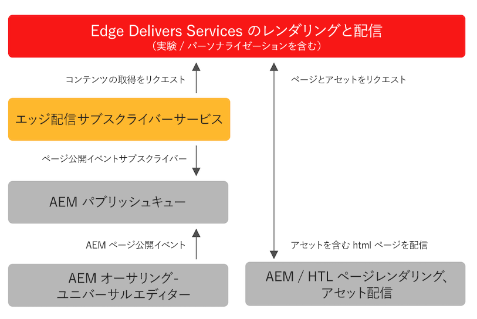

# Edge 配信サービス向けのコンテンツの公開 {#publishing-edge}

Edge 配信サービスを使用すると、コンテンツソースに関係なく、コンテンツの公開をシームレスに行えます。

* ドキュメントベースのコンテンツ - 詳しくは、Edge 配信サービスドキュメントの[公開の節](/help/edge/docs/authoring.md)を参照してください。
* AEM コンテンツ - 詳しくは、以下を参照してください。

## AEM からのフローの公開 {#publishing-flow}

ユニバーサルエディターを使用して AEM コンテンツをオーサリングする場合、公開は、ユニバーサルエディターで「**公開**」ボタンをクリックします。 [ユニバーサルエディターを使用したコンテンツの公開。](/help/sites-cloud/authoring/universal-editor/publishing.md)ドキュメントを参照してください

公開時の情報のフローは次のとおりです。作成者が公開を開始すると、このフローは自動的で、参考のためにそのフローがここで説明されています。

>[!NOTE]
>
>オーサリング UI またはワークフローから公開されるパスは、1 日に最大 5,000 個まで許可されます。 一括公開作業読み込みを作成する統合はサポートされていません。

1. コンテンツ作成者は、ユニバーサルエディターで AEM コンテンツを公開します。
1. 公開イベントがAdobeパイプラインキューにプッシュされます。
1. Edge Delivery Services公開サービスは、関連するイベントをEdge Delivery Services管理 API に転送します。
1. Edge Delivery は、AEMオーサーからセマンティックHTMLを取り込み、取り込みます。
1. AEM が公開ステータスで更新されます。

>[!NOTE]
>
>デフォルトでは、Edge Delivery Services管理 API は保護されておらず、認証なしでドキュメントを公開または非公開にするために使用できます。 管理 API の認証を設定するには、 [作成者用の認証の設定](https://www.aem.live/docs/authentication-setup-authoring)に設定する場合、プロジェクトは API_KEY でプロビジョニングされ、パブリッシュサービスへのアクセスを許可する必要があります。 [SlackのAdobeチームに連絡してください](/help/edge/docs/slack.md) 指導のために

## 使い始める方法 {#how-to-get-started}

この機能にアクセスするには、アドビ担当者にお問い合わせください。
