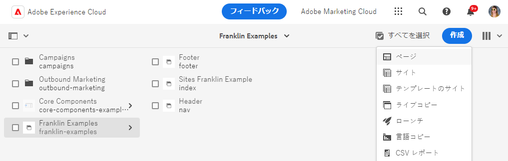
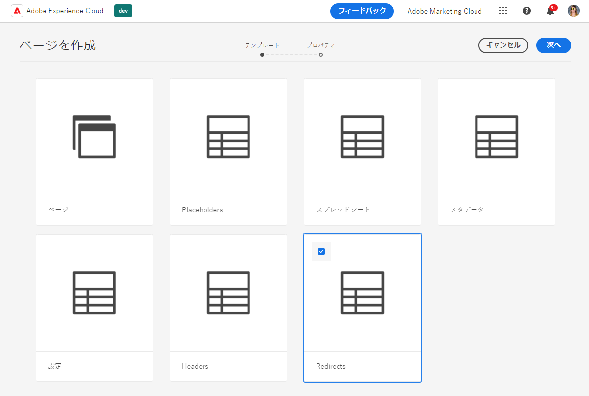
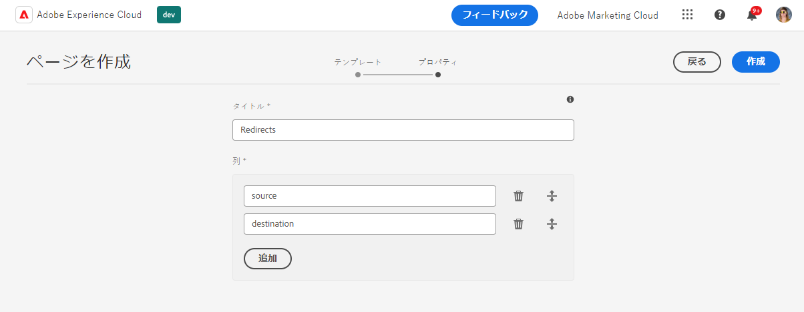
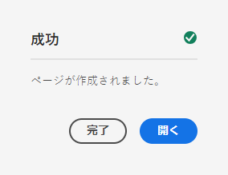
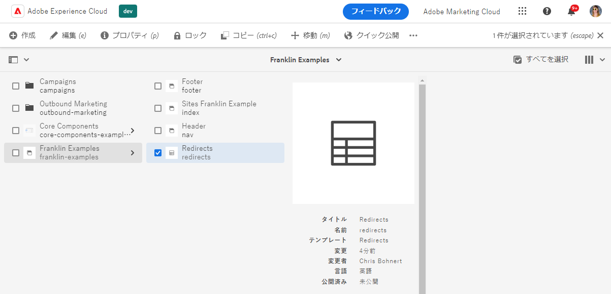
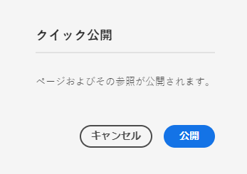
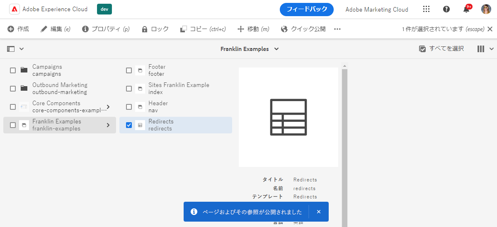
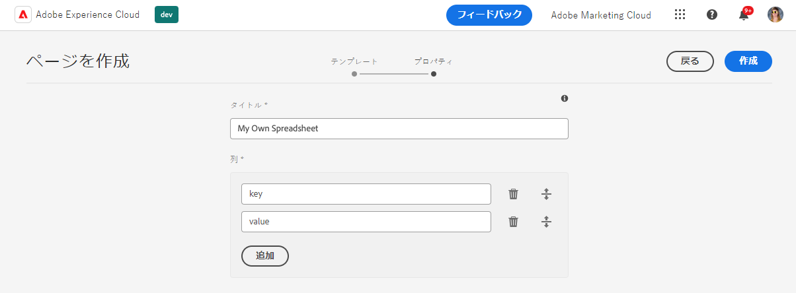

# スプレッドシートを使用した表形式データの管理 {#tabular-data}

スプレッドシートを使用して、Edge Delivery ServicesサイトでのAEMのメタデータやリダイレクトなど、様々な値の表形式データを管理する方法を説明します。

{{aem-authoring-edge-early-access}}

## ユースケース {#use-cases}

AEM with Edge Delivery Servicesサイトの場合、キーと値のマッピングなど、表形式のデータのリストを維持する必要があります。 メタデータやリダイレクトなど、様々な値のリストを使用できます。 エッジ配信サービスを使用すると、スプレッドシートという直感的なツールを使用して、このような表形式のリストを維持できます。 AEMは、これらのスプレッドシートを JSON ファイルに変換し、Web サイトや Web アプリケーションで容易に使用できるようにします。

一般的なユースケースを次に示します。

* [プレースホルダー](/help/edge/docs/placeholders.md)
* [メタデータ](/help/edge/docs/bulk-metadata.md)
* [ヘッダー](/help/edge/docs/custom-headers.md)
* [リダイレクト](/help/edge/docs/redirects.md)
* [設定](/help/edge/docs/setup-byo-cdn-push-invalidation.md) （CND 設定の場合など）

また、次の操作も可能です。 [スプレッドシートの作成](#own-spreadsheet) のマッピングを独自の目的で保存するためのあらゆる構造体。

このドキュメントでは、リダイレクトの例を使用して、このようなスプレッドシートの作成方法を説明します。 各使用例の詳細については、Edge Delivery Servicesドキュメントのリンク済みのトピックを参照してください。

>[!TIP]
>
>スプレッドシートの一般的なEdge Delivery Servicesの操作方法の詳細については、ドキュメントを参照してください [スプレッドシートと JSON。](/help/edge/developer/spreadsheets.md)

>[!TIP]
>
>スプレッドシートは、表形式のデータの維持にのみ使用する必要があります。 構造化データを保存する場合、 [AEMヘッドレス機能を確認する。](/help/headless/introduction.md)

## 前提条件 {#prerequisites}

AEM with プロジェクトのスプレッドシートを使用してマッピングを作成するには、最新のサイトEdge Delivery Servicesを使用してサイトを作成しておく必要があります。

ドキュメントを参照してください [Edge Delivery Servicesを使用したAEMオーサリングのための Developer Getting Guide](/help/edge/edge-dev-getting-started.md) を参照してください。

## スプレッドシートの作成 {#spreadsheet}

この例では、Edge Delivery ServicesサイトでAEMのリダイレクトを管理するスプレッドシートを作成します。 同じ手順を次に示します。 [その他のスプレッドシートタイプ](#other) を作成します。

1. AEMas a Cloud Serviceのオーサリングインスタンスにログインし、 **Sites** コンソールに移動し、スプレッドシートが必要なサイトのルートに移動します。 タップまたはクリック **作成** -> **ページ**.

   

1. 次の日： **テンプレート** ページを作成ウィザードの「 」タブで、「 **リダイレクト** テンプレートを選択し、タップまたはクリックします。 **次へ**.

   

1. The **プロパティ** ウィザードの「 」タブに、リダイレクト用のスプレッドシートのデフォルト値が表示されます。 「**作成**」をタップまたはクリックします。

   * **タイトル**  — この値はそのままにします。
   * **列**  — リダイレクトに必要な最小限の列は、事前入力されます。
      * **ソース**  — リダイレクトするページ
      * **宛先**  — リダイレクト先のページ

   

1. Adobe Analytics の **成功** ダイアログ、タップまたはクリック **開く**.

   

1. 新しいタブが開き、事前定義済みのスプレッドシートがエディターに読み込まれます。 **ソース** および **宛先** 列。 リダイレクトを定義するには、 **ソース** 列。 スプレッドシートの編集中、変更内容は自動的に保存されます。

   

   * The **ソース** は Web サイトのドメインに対する相対パスなので、相対パスのみが含まれます。
   * The **宛先** は、別の Web サイトにリダイレクトする場合は完全修飾 URL、独自の Web サイト内でリダイレクトする場合は相対パスにすることができます。
   * Tab キーを使用して、フォーカスを次のセルに移動します。
   * 必要に応じて、新しい行がスプレッドシートに追加されます。
   * 行を削除または移動するには、 **削除** 各行の末尾にあるアイコンと、各行の先頭にあるドラッグハンドル。

## Spreadsheet paths.json の公開 {#paths-json}

AEMでスプレッドシートのデータを公開するには、さらに `paths.json` ファイルに含める必要があります。

1. GitHub でプロジェクトのルートを開きます。

1. をタップまたはクリックします。 `paths.json` ファイルを開いて詳細を開き、 **編集** アイコン。

   

1. 新しいスプレッドシートを `redirects.json` リソース。

   ```json
   {
     "mappings": [
      "/content/<site-name>/:/",
      "/content/<site-name>/redirects:/redirects.json"
     ]
   }
   ```

1. クリック **変更をコミット…** 変更を保存するには、次の手順に従います。 `main`.

   * 次のいずれかにコミット `main` または、プロセスに従ってプル要求を作成します。

1. リダイレクトの定義が完了し、パスマッピングを更新したら、 **Sites** コンソール。

1. コンソールで作成したリダイレクトスプレッドシートをタップまたはクリックして選択し、をタップまたはクリックします。 **クイック公開** をクリックして、スプレッドシートを公開します。

   

1. Adobe Analytics の **クイック公開** ダイアログ、タップまたはクリック **公開**.

   

1. バナーで公開を確認します。

   

リダイレクトスプレッドシートが公開され、公開されてアクセスできるようになりました。

## その他のスプレッドシートタイプ {#other}

リダイレクトスプレッドシートの作成方法がわかったので、他の標準的なスプレッドシートタイプを作成できます。

* プレースホルダー
* メタデータ
* ヘッダー
* 設定

セクションで同じ手順に従うだけです [スプレッドシートを作成](#spreadsheet) および [paths.json を更新しました。](#paths-json) 適切なテンプレートを選択し、 `paths.json` ファイルに適切に書き込む。

の場合 [設定](https://www.aem.live/docs/configuration), [ヘッダー](https://www.aem.live/docs/custom-headers) および [メタデータ](https://www.aem.live/docs/bulk-metadata) マッピングを追加して、デフォルトの場所に公開してください。

* 設定： `/.helix/config.json`
* ヘッダー： `/.helix/headers.json`
* メタデータ： `/metadata.json`

また、 [独自のスプレッドシートを作成する](#own-spreadsheet) 任意の列を使用して、独自で使用できます。

>[!NOTE]
>
>Edge Delivery ServicesプロジェクトでAEMas a Cloud Serviceのインデックス作成を管理するために、スプレッドシートを作成する必要はありません。
>
>独自のインデックスを作成する場合は、 [このドキュメントに従う](https://www.aem.live/developer/indexing#setting-up-more-index-configurations) 独自の `helix-query.yaml` ファイル。

## 独自のスプレッドシートの作成 {#own-spreadsheet}

1. 「 」セクションの同じ手順に従います。 [スプレッドシートを作成します。](#spreadsheet)

1. テンプレートを選択する際に、「 」を選択します。 **スプレッドシート**.

1. Adobe Analytics の **プロパティ** 」タブを使用して、独自の列を追加できます。

   

   * Adobe Analytics の **列** セクション、タップまたはクリック **追加** をクリックして新しい列を追加します。
   * 列の名前を指定します。
   * 列を削除または再編成するには、 **削除** ハンドルアイコンをドラッグします。

1. リダイレクトスプレッドシートの指示に従って、スプレッドシートを作成し、公開します。

1. マッピングを `paths.json` ファイルに書き込まれます。
