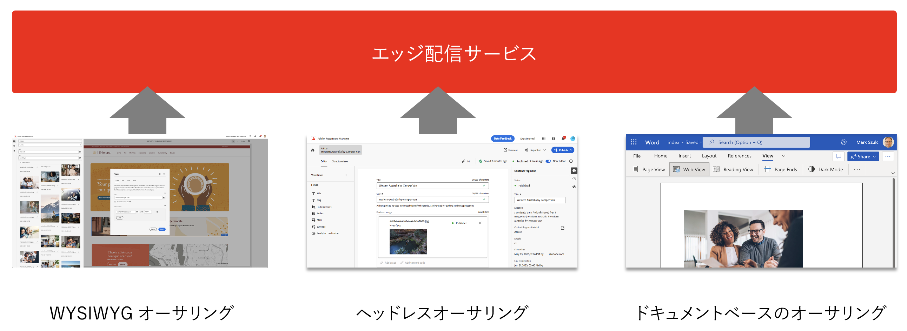
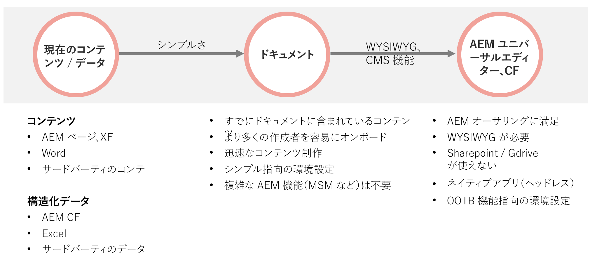

# AEM での Edge Delivery Services の使用 {#using-edge}

Edge Delivery Services はコンテンツソースから切り離されており、様々なコンテンツソースからコンテンツを取り込むことができます。つまり、選択したソースに関係なく、同じ web サイト上で複数のコンテンツソースをシームレスかつ効率的に公開できるようになります。

Edge Delivery Services を使用すると、作成者がコンテンツをすばやく更新して公開したり、新しいサイトを迅速に立ち上げたりできる、迅速な開発環境を作成できます。編集したコンテンツを、ほんの数秒でインターネット上に表示できます。

複数のコンテンツソースからの取り込みにより、ユーザーには最大限の柔軟性が提供されます。アドビでは、プロジェクトに最適なコンテンツソースを選択するのに役立つガイダンスを提供します。

コンテンツソースが事前定義されている場合や、柔軟性がない場合があります（例: プロジェクトで Sharepoint や Google ドライブを使用できない）。ただし、多くの場合、ツールは事前に定められておらず、ツールの選択に明確な区別はありません。

アドビの指針はシンプルさです。ドキュメントベースのオーサリングから開始し、必要に応じて複雑さを高めます。ツールの変更が必要な場合は、AEM の Edge 配信サービスの統合によってコンテンツの移行がカバーされます。

## オーサリング {#authoring-edge}

Edge 配信サービスを使用すると、オーサリングが簡単、迅速、柔軟に行えます。ドキュメントベースのオーサリングを使用してオーサリングを行うか、ユニバーサルエディターを使用して AWYSIWYG のオーサリングを行うかを選択できます。

詳しくは、[Edge 配信サービス向けのコンテンツのオーサリング](/help/edge/wysiwyg-authoring/authoring.md)を参照してください。

## 公開 {#publishing-edge}

Edge 配信サービスを使用すると、コンテンツソースに関係なく、コンテンツの公開をシームレスに行えます。

詳しくは、[Edge 配信サービス向けのコンテンツの公開](/help/edge/wysiwyg-authoring/publishing.md)を参照してください。

## 開発 {#developing-edge}

Edge 配信サービスは、ブロックの概念に基づいています。AEM には、プロジェクトのニーズに合わせて拡張できる事前定義済みのブロックの包括的なライブラリが付属しています。Edge 配信サービスプロジェクトのコードは、GitHub で管理されます。

詳しくは、[Edge Delivery Services を使用した WYSIWYG オーサリングの開発者向け入門ガイド](/help/edge/wysiwyg-authoring/edge-dev-getting-started.md)ドキュメントを参照してください。
