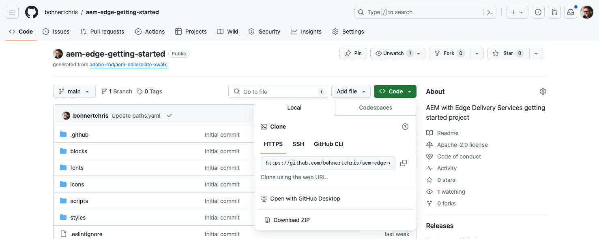
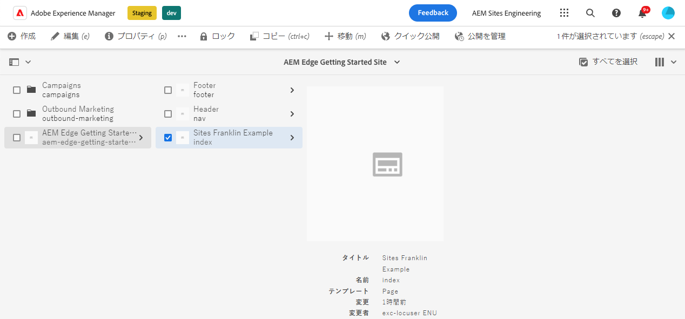
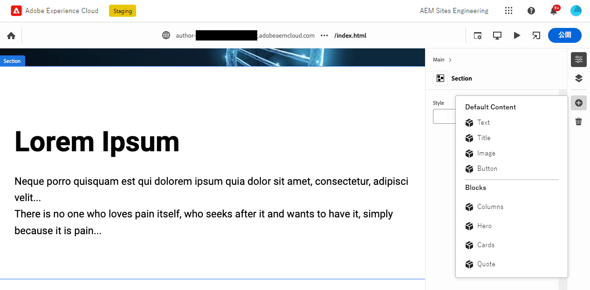
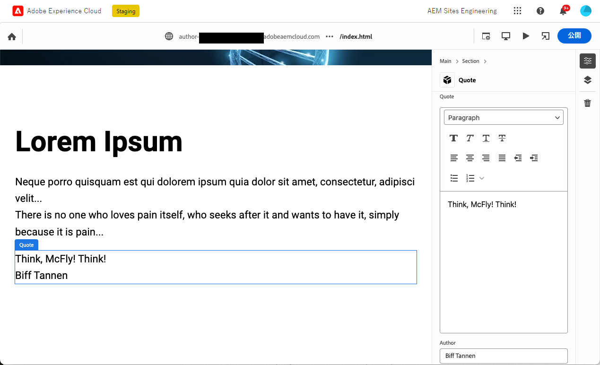
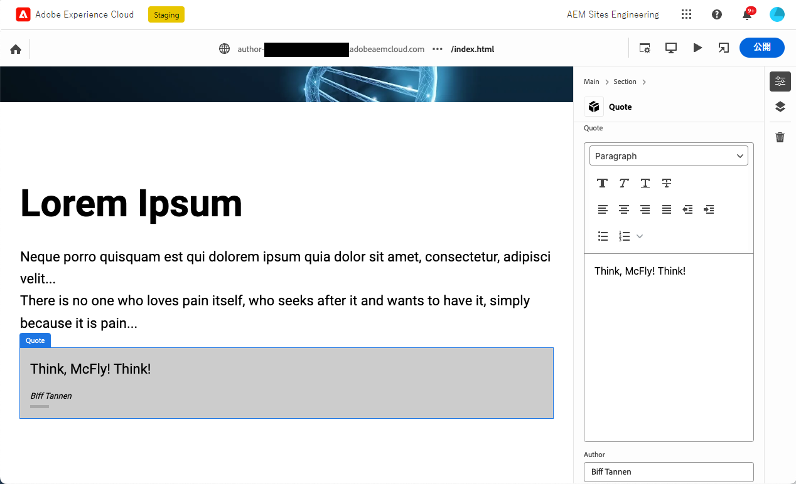

# ユニバーサルエディタで使用するために実装したブロックの作成 {#create-block}

Edge Delivery Services プロジェクトを使用した WYSIWYG オーサリングで、ユニバーサルエディターでの使用に対して実装されたブロックを作成する方法について説明します。

## 前提条件 {#prerequisites}

このガイドでは、Edge Delivery Services プロジェクトを使用した WYSIWYG オーサリングで、ユニバーサルエディター用に実装されたブロックを作成する方法を段階的に説明します。ここでは、コンポーネントの追加、ユニバーサルエディターでのコンポーネント定義の読み込み、ページの公開、ブロック装飾とスタイルの実装、実稼動環境への変更の反映および検証について説明します。このガイドを完了すると、独自のプロジェクト用に新しいブロックを作成してデプロイできます。

このガイドでは、Edge Delivery Services プロジェクトおよびユニバーサルエディターを使用した WYSIWYG オーサリングに関する既存の知識が必ず必要になります。このガイドを始める前に、Edge Delivery Services へのアクセス権を持ち、次の項目について基本事項を理解しておく必要があります。

* [Edge Delivery Service のチュートリアル](/help/edge/developer/tutorial.md)を完了していること。
* [AEM Cloud Service サンドボックス](/help/implementing/cloud-manager/getting-access-to-aem-in-cloud/introduction-sandbox-programs.md)にアクセスできること。
* [同じサンドボックス環境でユニバーサルエディターが有効になっている](/help/implementing/universal-editor/getting-started.md)こと。
* [Edge Delivery Services を使用した WYSIWYG オーサリングの開発者向け入門ガイド](/help/edge/wysiwyg-authoring/edge-dev-getting-started.md)を完了していること。

このガイドは、[Edge Delivery Services を使用した WYSIWYG オーサリングの開発者向け入門ガイド](/help/edge/wysiwyg-authoring/edge-dev-getting-started.md)で行った作業に基づいています。

## プロジェクトへの新しいブロックの追加 {#add-block}

このガイドでは、記憶に残る引用をページ上にレンダリングするブロックを作成します。

この例を簡素化するために、すべての変更はプロジェクトリポジトリの `main` ブランチに対して行われます。実際のプロジェクトでは、`main` に結合する前に、別のブランチで開発し、プルリクエスト経由ですべての変更を確認するという、[開発のベストプラクティスに従う必要があります](https://www.aem.live/docs/dev-collab-and-good-practices)。

アドビでは、次の 3 段階の方法でブロックを開発することをお勧めします。

1. ブロックの定義とモデルを作成し、確認した上で、実稼動環境に導入します。
1. 新しいブロックを使用してコンテンツを作成します。
1. 新しいブロックの装飾とスタイルを実装します。

次の引用ブロックの例は、この方法に従っています。

### ブロック定義とモデルの作成 {#create-block-model}

1. [Edge Delivery Services を使用した WYSIWYG オーサリングの開発者向け入門ガイド](/help/edge/wysiwyg-authoring/edge-dev-getting-started.md)で作成した GitHub プロジェクトをローカルにクローンし、選択したエディターで開きます。

* ここでは、説明のために Microsoft のコードを使用しています。



2. プロジェクトのルートにある `component-definition.json` ファイルを編集し、新しい引用ブロックに次の定義を追加して、ファイルを保存します。

>[!BEGINTABS]

>[!TAB JSON の例]

```json
{
  "title": "Quote",
  "id": "quote",
  "plugins": {
    "xwalk": {
      "page": {
        "resourceType": "core/franklin/components/block/v1/block",
        "template": {
          "name": "Quote",
          "model": "quote",
          "quote": "<p>Think, McFly! Think!</p>",
          "author": "Biff Tannen"
        }
      }
    }
  }
}
```

>[!TAB スクリーンショット]


>[!ENDTABS]

3. プロジェクトのルートにある `component-models.json` ファイルを編集し、新しい引用ブロックに次の[モデル定義](/help/implementing/universal-editor/field-types.md#model-structure)を追加して、ファイルを保存します。

* コンテンツモデルを作成する際に考慮すべき重要事項について詳しくは、[Edge Delivery Services プロジェクトを使用した WYSIWYG オーサリング用のコンテンツモデリング](/help/edge/wysiwyg-authoring/content-modeling.md)ドキュメントを参照してください。

>[!BEGINTABS]

>[!TAB JSON の例]

```json
{
  "id": "quote",
  "fields": [
     {
       "component": "richtext",
       "name": "quote",
       "value": "",
       "label": "Quote",
       "valueType": "string"
     },
     {
       "component": "text",
       "valueType": "string",
       "name": "author",
       "label": "Author",
       "value": ""
     }
   ]
}
```

>[!TAB スクリーンショット]


>[!ENDTABS]

4. プロジェクトのルートにある `component-filters.json` ファイルを編集し、[フィルター定義](/help/implementing/universal-editor/customizing.md#filtering-components)に引用ブロックを追加して、ブロックを任意のセクションに追加してファイルを保存できるようにします。

>[!BEGINTABS]

>[!TAB JSON の例]

```json
{
  "id": "section",
  "components": [
    "text",
    "image",
    "button",
    "title",
    "hero",
    "cards",
    "columns",
    "quote"
   ]
}
```

>[!TAB スクリーンショット]


>[!ENDTABS]

5. Git を使用して、これらの変更を `main` 分岐にコミットします。

* `main` へのコミットは、説明のみを目的としています。[ベストプラクティスに従って](https://www.aem.live/docs/dev-collab-and-good-practices)、実際のプロジェクト作業にはプルリクエストを使用します。

### ブロックを使用したコンテンツの作成 {#create-content}

基本的な引用ブロックが定義され、サンプルプロジェクトにコミットされたので、既存のページに引用ブロックを追加できます。

1. ブラウザーで、AEM as a Cloud Service にログインします。[Sites コンソールを使用して](/help/sites-cloud/authoring/basic-handling.md)、[Edge Delivery Services を使用した WYSIWYG オーサリングの開発者向け入門ガイド](/help/edge/wysiwyg-authoring/edge-dev-getting-started.md)で作成したサイトに移動し、ページを選択します。

   * この場合、説明のために `index` を使用しています。

   

1. コンソールのツールバーで「**編集**」をタップまたはクリックすると、ユニバーサルエディターが開きます。

   * ページを読み込むには、ユニバーサルエディターで「**Adobe でログイン**」をタップまたはクリックして AEM を認証する必要がある場合があります。

1. ユニバーサルエディターでセクションを選択します。プロパティパネルで、**追加**&#x200B;アイコンをタップまたはクリックし、メニューから新しい&#x200B;**引用**&#x200B;ブロックを選択します。

   * **追加**&#x200B;アイコンは、プラス記号です。
   * 選択したオブジェクトの青色のアウトラインに「**セクション**」というラベルの付いたタブがある場合、セクションが選択されていることがわかります。
   * この例では、**Lorem Ipsum** 見出しの少し上をタップまたはクリックすると、見出しと lorem ipsum テキストを含むセクションが選択されます。

   

1. ページがリロードされ、選択したセクションの下に引用ブロックが、`component-definitions.json` ファイルで指定したデフォルトのコンテンツと共に追加されます。

   * 引用ブロックは、他のブロックと同様に、インプレースまたはプロパティパネル内で選択および編集できます。
   * スタイル設定は、後の手順で適用します。

   

1. 引用のコンテンツが満たされたら、ユニバーサルエディターのツールバーにある「**公開**」ボタンをタップまたはクリックしてページを公開できます。

1. 公開済みのページに移動して、コンテンツが公開されたことを確認します。リンクは、`https://<branch>--<repo>--<owner>.hlx.page` のようになります

   

### ブロックのスタイル設定 {#style-block}

作業用の引用ブロックを作成したので、スタイル設定を適用できます。

1. プロジェクトのエディターに戻ります。

2. `blocks` フォルダーの下に `quote` フォルダーを作成します。


3. 新しい `quote` フォルダーに、次の JavaScript を追加してブロック装飾を実装する `quote.js` ファイルを追加し、ファイルを保存します。

>[!BEGINTABS]

>[!TAB JavaScript の例]

```javascript
export default function decorate(block) {
  const [quoteWrapper] = block.children;
 
  const blockquote = document.createElement('blockquote');
  blockquote.textContent = quoteWrapper.textContent.trim();
  quoteWrapper.replaceChildren(blockquote);
}
```

>[!TAB スクリーンショット]


>[!ENDTABS]

4. `quote` フォルダーに `quote.css` ファイルを追加し、次の CSS コードを追加してブロックのスタイル設定を定義し、ファイルを保存します。

>[!BEGINTABS]

>[!TAB CSS の例]

```css
.block.quote {
    background-color: #ccc;
    padding: 0 0 24px;
    display: flex;
    flex-direction: column;
    margin: 1rem 0;
}
 
.block.quote blockquote {
    margin: 16px;
    text-indent: 0;
}
 
.block.quote > div:last-child > div {
    margin: 0 16px;
    font-size: small;
    font-style: italic;
    position: relative;
}
 
.block.quote > div:last-child > div::after {
    content: "";
    display: block;
    position: absolute;
    left: 0;
    bottom: -8px;
    height: 5px;
    width: 30px;
    background-color: darkgray;
}
```

>[!TAB スクリーンショット]


>[!ENDTABS]

5. Git を使用して、これらの変更を `main` 分岐にコミットします。

* `main` へのコミットは、説明のみを目的としています。[ベストプラクティスに従って](https://www.aem.live/docs/dev-collab-and-good-practices)、実際のプロジェクト作業にプルリクエストを使用します。

6. プロジェクトのページを編集していたユニバーサルエディターの「ブラウザー」タブに戻り、ページをリロードしてスタイル設定されたブロックを表示します。

7. ページ上でスタイル設定された引用ブロックを表示します。



8. 公開済みページに移動して、変更が実稼動環境にプッシュされたことを確認します。リンクは、`https://<branch>--<repo>--<owner>.hlx.page` のようになります。


これで完了です。完全に機能し、スタイル設定された引用ブロックが作成されました。この例を基礎として、独自のプロジェクト固有のブロックを設計できます。

### ブロックオプション {#block-options}

特定の状況に基づいてブロックの外観や動作を少し変更する必要があるが、それ自体が新しいブロックになるほどの違いがない場合は、作成者が[ブロックオプション](content-modeling.md#type-inference)から選択できます。

ブロックに `classes` プロパティを追加すると、このプロパティは、単純なブロックの場合はテーブルヘッダーに、コンテナブロック内にある項目の場合は値リストとしてレンダリングされます。

```json
{
  "id": "simpleMarquee",
  "fields": [
    {
      "component": "text",
      "valueType": "string",
      "name": "marqueeText",
      "value": "",
      "label": "Marquee text",
      "description": "The text you want shown in your marquee"
    },
    {
      "component": "select",
      "name": "classes",
      "value": "",
      "label": "Background Color",
      "description": "The marquee background color",
      "valueType": "string",
      "options": [
        {
          "name": "Red",
          "value": "bg-red"
        },
        {
          "name": "Green",
          "value": "bg-green"
        },
        {
          "name": "Blue",
          "value": "bg-blue"
        }
      ]
    }
  ]
}
```

## 他の作業用ブランチの使用 {#other-branches}

このガイドでは、わかりやすくするために `main` ブランチに直接コミットするようにしました。サンプルリポジトリでの実験の場合、これは通常問題になりません。実際のプロジェクト作業では、`main` に結合する前に、別のブランチで開発し、プルリクエスト経由ですべての変更を確認することで、[開発のベストプラクティスに従う必要があります](https://www.aem.live/docs/dev-collab-and-good-practices)。

`main` ブランチで開発していない場合は、ユニバーサルエディターのロケーションバーに `?ref=<branch>` を追加して、ブランチからページを読み込むことができます。`<branch>` は、プロジェクトのプレビューまたはライブ URL（例：`https://<branch>--<repo>--<owner>.hlx.page`）に使用されるブランチ名です。

## ドキュメントベースのオーサリング用にブロックを再使用する {#reusing-blocks}

同じコンテンツモデルに従う場合は、ユニバーサルエディターを使用して WYSIWYG オーサリング用に作成したブロックを、ドキュメントベースのオーサリングに使用できます。

詳しくは、[WYSIWYG とドキュメントベースのオーサリング用のブロック](/help/edge/wysiwyg-authoring/wysiwyg-doc-blocks.md)を参照してください。

## 次の手順 {#next-steps}

これでブロックの作成方法がわかったので、コンテンツのセマンティックモデルを作成して効率的な開発者エクスペリエンスを実現する方法を理解することが不可欠です。

Edge Delivery プロジェクトでの WYSIWYG オーサリングにコンテンツモデリングがどのように機能するかについては、[Edge Delivery プロジェクトでの WYSIWYG オーサリング用のコンテンツモデリング](/help/edge/wysiwyg-authoring/content-modeling.md)のドキュメントを参照してください。

>[!TIP]
>
>コンテンツソースとして AEM as a Cloud Service を使用して WYSIWYG オーサリングを実行できる、新しい Edge Delivery Services プロジェクトの作成に関するエンドツーエンドのチュートリアルについては、[この AEM GEM ウェビナー](https://experienceleague.adobe.com/ja/docs/events/experience-manager-gems-recordings/gems2024/aem-authoring-and-edge-delivery)をご覧ください。

