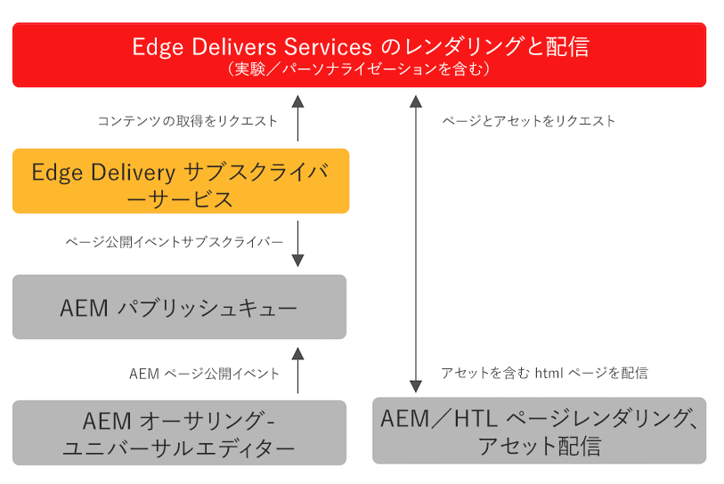

# Edge 配信サービス向けのコンテンツの公開 {#publishing-edge}

Edge 配信サービスを使用すると、コンテンツソースに関係なく、コンテンツの公開をシームレスに行えます。

* ドキュメントベースのコンテンツ - 詳しくは、Edge 配信サービスドキュメントの[公開の節](/help/edge/docs/authoring.md)を参照してください。
* AEM コンテンツ - 詳しくは、以下を参照してください。

## AEM からのフローの公開 {#publishing-flow}

ユニバーサルエディターを使用して AEM コンテンツをオーサリングする場合、公開は、ユニバーサルエディターで「**公開**」ボタンをクリックします。 [ユニバーサルエディターを使用したコンテンツの公開。](/help/sites-cloud/authoring/universal-editor/publishing.md)ドキュメントを参照してください

公開時の情報のフローは次のとおりです。作成者が公開を開始すると、このフローは自動的で、参考のためにそのフローがここで説明されています。

>[!NOTE]
>
>オーサリング UI から、またはワークフローによって公開されるパスは、1 日あたり最大 5000 個まで許可されます。一括公開のワークロードを作成する統合はサポートされていません。より大きな容量が必要なプロジェクトの場合は、[VIP プログラム](https://www.aem.live/vip/intake)に提案してください。

1. コンテンツ作成者は、ユニバーサルエディターで AEM コンテンツを公開します。
1. 公開イベントはアドビのパイプラインキューにプッシュされます。
1. Edge Delivery Services 公開サービスは、関連するイベントを Edge Delivery Admin API に転送します。
1. Edge Delivery は、AEM オーサーからセマンティック HTML を取得し取り込みます。
1. AEM が公開ステータスでアップデートされます。

>[!NOTE]
>
>デフォルトでは、Edge Delivery Services Admin API は、保護されていないので、認証なしでドキュメントを公開または非公開にするために使用できます。[Configuring Authentication for Authors](https://www.aem.live/docs/authentication-setup-authoring) に記載されているように Admin API の認証を設定するには、公開サービスへのアクセス権を付与する API_KEY を使用してプロジェクトをプロビジョニングする必要があります。ガイダンスについては、[Slack でアドビチームにお問い合わせください](/help/edge/docs/slack.md)。

