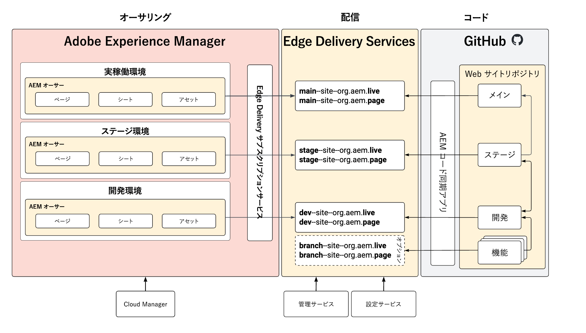

# repoless のステージ環境と実稼働環境 {#repoless-stage-prod}

単一のコードベースを repoless で活用して、ステージング環境と実稼動環境に個別のサイトを設定する方法を説明します。

## 概要 {#overview}

ステージング環境とは別に、実稼動環境用のサイト設定が必要になる場合があります。ステージング環境と実稼動環境の個別設定のために 2 つ目のサイトを設定することは、[マルチサイト管理に必要な設定](/help/edge/wysiwyg-authoring/repoless-msm.md)と同様です。実際、必要に応じて、MSM のサイト構造と組み合わせることができます。

このドキュメントでは、個別のステージング環境と実稼動環境の典型的な例を使用します。必要な環境ごとに個別に環境を作成できます。

## 要件 {#requirements}

repoless のステージ環境と実稼動環境を設定するには、まず次のタスクを実行する必要があります。

* このドキュメントは、[Edge Delivery Services での WYSIWYG オーサリングの開発者向けスタートガイド](/help/edge/wysiwyg-authoring/edge-dev-getting-started.md)に基づいて、プロジェクトのサイトを既に作成していることを前提としています。
* [プロジェクトの repoless 機能が既に有効になっている](/help/edge/wysiwyg-authoring/repoless.md)必要があります。

## 設定 {#configuration}

このドキュメントでは、同じコードベースを使用して、プロジェクトに別の実稼動サイトを設定する方法について説明します。次のことが想定されています。

* ステージングサイトは設定済みで、実稼動サイトの設定を作成する必要がある。
* AEM オーサリングのコンテンツ構造が類似している。
* ステージングと実稼動では、同じパスマッピングが使用される。

この例では、wknd というプロジェクトの実稼動サイトが既に作成されていて、GitHub リポジトリも wknd という名前であると想定されています。

個別の実稼動サイトを設定するには、次の 2 つの手順があります。

1. [実稼動環境用に新しい Edge Delivery Services サイトを作成する](#create-edge-site)。
1. [実稼動サイト用に AEM のクラウド設定を更新する](#update-cloud-configuration)。

### 実稼動環境用の新しい Edge Delivery Services サイトの作成 {#create-edge-site}

1. 認証トークンとプログラム用のテクニカルアカウントを取得します。
   * プログラムの[アクセストークン](/help/edge/wysiwyg-authoring/repoless.md#access-token)と[テクニカルアカウントを取得](/help/edge/wysiwyg-authoring/repoless.md#access-control)する方法について詳しくは、**サイト間でのコードの再利用**&#x200B;のドキュメントを参照してください。
1. 設定サービスに対して次の呼び出しを実行して、新しいサイトを作成します。以下の点を考慮してください。
   * POST URL のプロジェクト名は、作成する新しいサイト名である必要があります。この例では `wknd-prod` です。
   * `code` の設定は、最初のプロジェクト作成に使用した設定と同じである必要があります。
   * `content`／`source`／`url` は、作成する新しいサイトの名前に合わせて変更する必要があります。この例では `wknd-prod` です。
   * つまり、POST URL のサイト名と `content`／`source`／`url` は同じである必要があります。
   * `admin` ブロックを調整して、サイトへの完全な管理アクセス権を持つユーザーを定義します。
      * これはメールアドレスの配列です。
      * ワイルドカード `*` を使用できます。
      * 詳しくは、[作成者の認証設定](https://www.aem.live/docs/authentication-setup-authoring#default-roles)のドキュメントを参照してください。

   ```text
   curl --request POST \
     --url https://admin.hlx.page/config/<your-github-org>/sites/wknd-prod.json \
     --header 'x-auth-token: <your-token>' \
     --header 'Content-Type: application/json' \
     --data '{
       "code": {
           "owner": "<your-github-org>",
           "repo": "wknd",
           "source": {
               "type": "github",
               "url": "https://github.com/<your-github-org>/wknd"
           }
       },
       "content": {
           "source": {
               "url": "https://author-p<programID>-e<environmentID>.adobeaemcloud.com/bin/franklin.delivery/<your-github-org>/wknd-prod/main",
               "type": "markup",
               "suffix": ".html"
           }
       },
       "access": {
           "admin": {
               "role": {
                   "admin": [
                       "<email>@<domain>.<tld>"
                   ],
                   "config_admin": [
                       "<tech-account-id>@techacct.adobe.com"
                   ]
               },
               "requireAuth": "auto"
           }
       }
   }'
   ```

1. 設定サービスに対して次の呼び出しを実行して、新しいサイトのパスマッピングを追加します。

   ```text
   curl --request POST \
     --url https://admin.hlx.page/config/<your-github-org>/sites/wknd-prod/public.json \
     --header 'x-auth-token: <your-token>' \
     --header 'Content-Type: application/json' \
     --data '{
       "paths": {
           "mappings": [
               "/content/wknd/:/"
           ],
           "includes": [
               "/content/wknd/"
           ]
       }
   }'
   ```

`https://main--wknd-prod--<your-github-org>.aem.page/config.json` を呼び出し、返される JSON のコンテンツを確認することで、新しいサイトのパブリック設定が機能していることを確認します。

### 実稼動サイト用の AEM のクラウド設定の更新 {#update-cloud-configuration}

実稼動用 AEM は、専用の実稼動サイトに対して前のセクションで作成した新しい Edge Delivery サイトを使用するように設定されている必要があります。この例では、実稼動環境の `/content/wknd` の下にあるコンテンツが、作成した `wknd-prod` サイトを使用するように設定されている必要があります。

1. AEM 実稼動インスタンスにログインし、**ツール**／**クラウドサービス**／**Edge Delivery Services 設定**&#x200B;に移動します。
1. プロジェクト用に自動作成された設定を選択します。
1. ツールバーの「**プロパティ**」をタップまたはクリックします。
1. **Edge Delivery Services 設定**&#x200B;ウィンドウで、次の操作を行います。
   * 「**組織**」フィールドに GitHub 組織を入力します。
   * サイト名を、前のセクションで作成したサイトの名前に変更します。この場合は、`wknd-prod` となります。
   * プロジェクトのタイプを **aem.live with repoless config setup** に変更します。
1. 「**保存して閉じる**」をタップまたはクリックします。

## 設定の確認 {#verify}

必要な設定の変更をすべて行ったら、すべてが想定どおりに動作していることを確認します。

1. AEM 実稼働オーサーインスタンスにログインします。
1. **ナビゲーション**／**Sites** に移動して、**Sites コンソール**&#x200B;に移動します。
1. サイトのページを選択します。
1. ツールバーの「**編集**」をタップまたはクリックします。
1. ページがユニバーサルエディターで適切にレンダリングされ、サイトルートと同じコードを使用していることを確認します。
1. ページを変更して、再公開します。
1. そのページの新しい Edge Delivery Services サイト（`https://main--wknd-prod--<your-github-org>.aem.page`）にアクセスします。

変更が反映されている場合は、個別の実稼動サイト設定が正しく機能しています。

## 使用方法 {#usage}

repoless のステージング環境と実稼動環境でプロジェクトを設定したら、それらのコードを個別に管理できます。次の図は、AEM、Edge Delivery Services サイトおよび GitHub リポジトリ内の様々な環境におけるコンテンツの関係を示しています。


