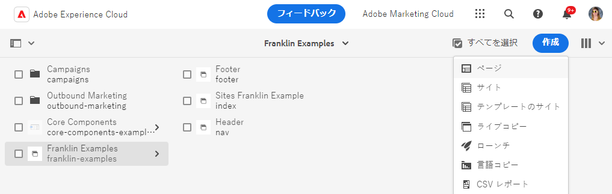
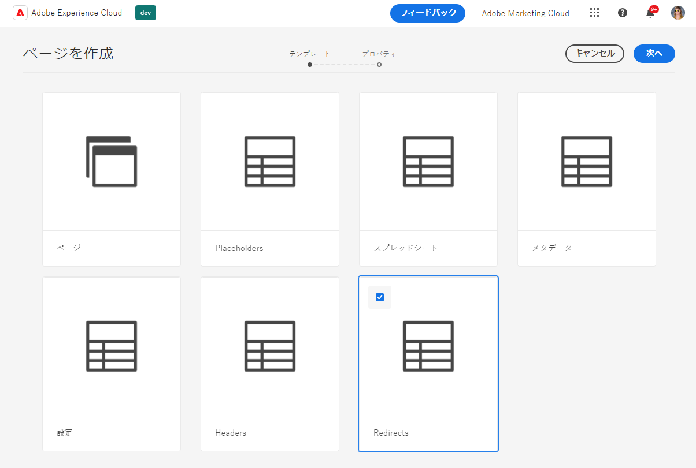
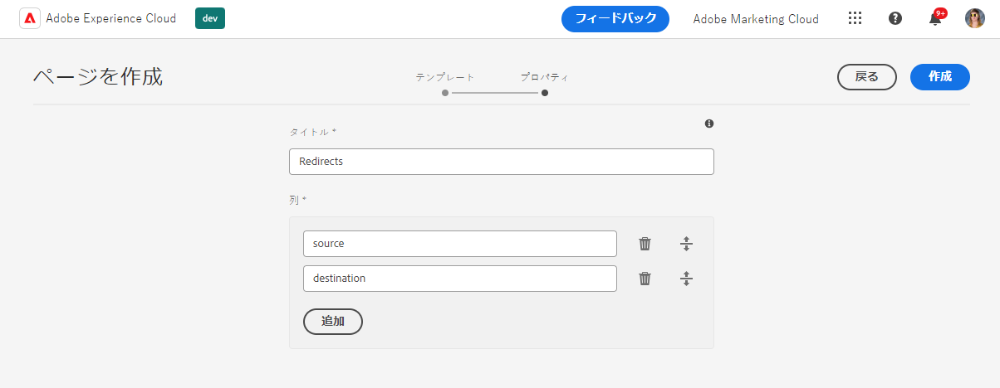
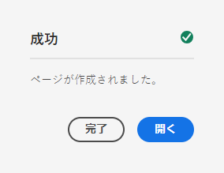
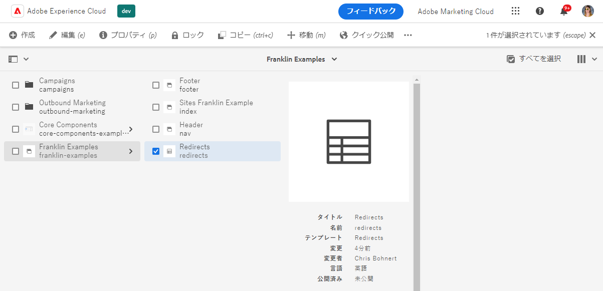
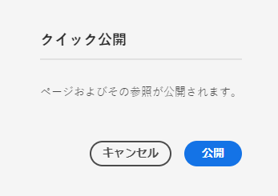
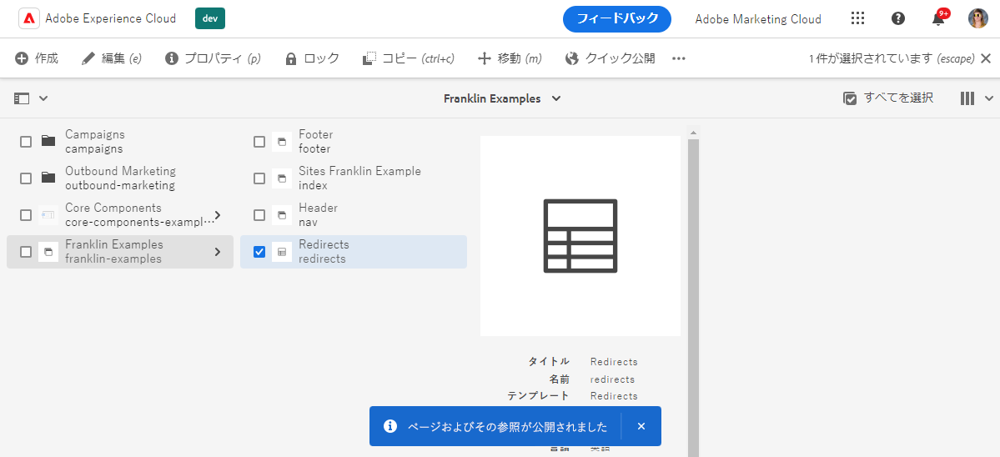
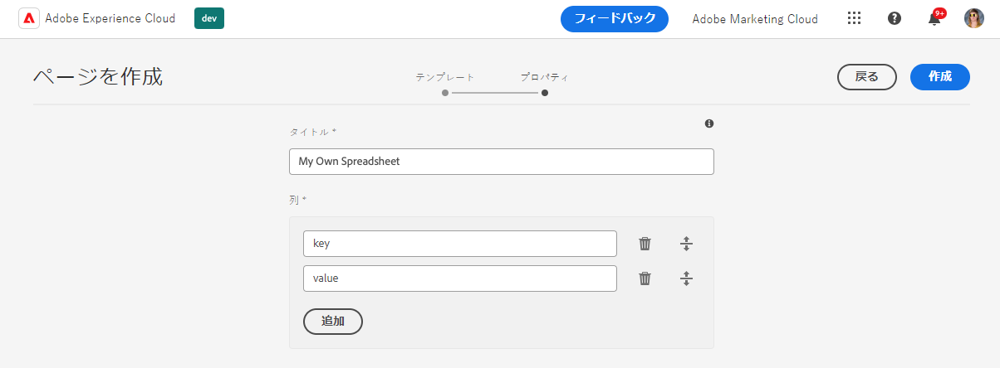

# スプレッドシートを使用した表形式データの管理 {#tabular-data}

スプレッドシートを使用して、Edge Delivery Services を使用した AEM のサイトのメタデータやリダイレクトなど、様々な値の表形式データを管理する方法を説明します。

## ユースケース {#use-cases}

Edge Delivery Services を使用した AEM のサイトでは、キーと値のマッピングなど、表形式のデータのリストを維持する必要があります。これらは、メタデータやリダイレクトなど、様々な値のリストにすることができます。Edge Deliver Services を使用すると、スプレッドシートという直感的なツールを使用して、このような表形式のリストを管理できます。AEM は、これらのスプレッドシートを JSON ファイルに変換し、web サイトや web アプリケーションで容易に使用できるようにします。

一般的なユースケースを次に示します。

* [プレースホルダー](/help/edge/docs/placeholders.md)
* [メタデータ](/help/edge/docs/bulk-metadata.md)
* [ヘッダー](/help/edge/docs/custom-headers.md)
* [リダイレクト](/help/edge/docs/redirects.md)
* [設定](/help/edge/docs/setup-byo-cdn-push-invalidation.md)（CND 設定など）

さらに、任意の構造の[スプレッドシートを作成](#own-spreadsheet)して、独自の目的でマッピングを保存できます。

このドキュメントでは、リダイレクトの例を使用して、このようなスプレッドシートの作成方法を説明します。各ユースケースについて詳しくは、Edge Delivery Services ドキュメントのリンク済みのトピックを参照してください。

>[!TIP]
>
>スプレッドシートの一般的な Edge Delivery Services の操作方法について詳しくは、[スプレッドシートと JSON](/help/edge/developer/spreadsheets.md) のドキュメントを参照してください。

>[!TIP]
>
>スプレッドシートは、表形式のデータの管理にのみ使用する必要があります。構造化データを保存する場合、[AEM のヘッドレス機能を確認してください。](/help/headless/introduction.md)

## 前提条件 {#prerequisites}

Edge Delivery Services を使用した AEM プロジェクトでスプレッドシートを使ってマッピングを作成するには、最新のサイトテンプレートを使用してサイトを作成しておく必要があります。

ドキュメントを参照してください [Edge Delivery Servicesを使用した WYSIWYG オーサリングの開発者向け入門ガイド](/help/edge/wysiwyg-authoring/edge-dev-getting-started.md) を参照してください。

## スプレッドシートの作成 {#spreadsheet}

この例では、Edge Delivery Services を使用した AEM のサイトでのリダイレクトを管理するスプレッドシートを作成します。作成する[その他のスプレッドシートタイプ](#other)にも同じ手順を適用します。

1. AEM as a Cloud Service のオーサリングインスタンスにログインし、**Sites** コンソールに移動し、スプレッドシートが必要なサイトのルートに移動します。**作成**／**ページ**&#x200B;をタップまたはクリックします。

   

1. ページ作成ウィザードの「**テンプレート**」タブで、**リダイレクト**&#x200B;テンプレートをタップまたはクリックして選択し、「**次へ**」をタップまたはクリックします。

   

1. ウィザードの「**プロパティ**」タブに、リダイレクトスプレッドシートのデフォルト値が表示されます。「**作成**」をタップまたはクリックします。

   * **タイトル** - この値はそのままにします。
   * **列** - リダイレクトに必要な最小限の列が事前入力されています。
      * **ソース** - リダイレクトするページ
      * **宛先** - リダイレクト先のページ

   

1. **成功**&#x200B;ダイアログで、「**開く**」をタップまたはクリックします。

   

1. 新しいタブが開き、事前定義済みの「**ソース**」および「**宛先**」の列を含むスプレッドシートがエディターに読み込まれます。リダイレクトを定義するには、「**ソース**」列の空の行をタップまたはクリックします。スプレッドシートを編集すると、変更内容は自動的に保存されます。

   

   * **ソース**&#x200B;は web サイトのドメインに対して相対的なものなので、相対パスのみが含まれます。
   * **宛先**&#x200B;は、別の web サイトにリダイレクトする場合は完全修飾 URL、独自の web サイト内でリダイレクトする場合は相対パスにすることができます。
   * Tab キーを使用して、フォーカスを次のセルに移動します。
   * エディターは、必要に応じて、新しい行をスプレッドシートに追加します。
   * 行を削除または移動するには、各行の末尾にある「**削除**」アイコンと、各行の先頭にあるドラッグハンドルを使用します。

## スプレッドシートの paths.json の公開 {#paths-json}

AEM でスプレッドシートのデータを公開するには、さらにプロジェクトの `paths.json` ファイルを更新する必要があります。

1. GitHub でプロジェクトのルートを開きます。

1. `paths.json` ファイルをタップまたはクリックして詳細を開き、「**編集**」アイコンをタップまたはクリックします。

   

1. 新しいスプレッドシートを `redirects.json` リソースにマップする行を追加します。

   ```json
   {
     "mappings": [
      "/content/<site-name>/:/",
      "/content/<site-name>/redirects:/redirects.json"
     ]
   }
   ```

1. 「**変更をコミット…**」をクリックして、変更を `main` に保存します。

   * `main` にコミットするか、プロセスに従ってプルリクエストを作成します。

1. リダイレクトの定義が完了し、パスマッピングを更新したら、**Sites** コンソールに戻ります。

1. コンソールで作成したリダイレクトスプレッドシートをタップまたはクリックして選択し、アクションバーの「**クイック公開**」をタップまたはクリックして、スプレッドシートを公開します。

   

1. **クイック公開**&#x200B;ダイアログで、「**公開**」をタップまたはクリックします。

   

1. バナーで公開を確認します。

   

リダイレクトスプレッドシートが公開され、公にアクセスできるようになりました。

## その他のスプレッドシートタイプ {#other}

リダイレクトスプレッドシートの作成方法がわかったので、他の標準的なスプレッドシートタイプを作成できます。

* プレースホルダー
* メタデータ
* ヘッダー
* 設定

「[スプレッドシートを作成](#spreadsheet)」および「[paths.json を更新](#paths-json)」セクションと同じ手順に従い、適切なテンプレートを選択して、`paths.json` ファイルを適切に更新します。

「[設定](https://www.aem.live/docs/configuration)」、「[ヘッダー](https://www.aem.live/docs/custom-headers)」、「[メタデータ](https://www.aem.live/docs/bulk-metadata)」については、デフォルトの場所に公開するためのマッピングを必ず追加してください。

* 設定：`/.helix/config.json`
* ヘッダー：`/.helix/headers.json`
* メタデータ：`/metadata.json`

また、任意の列を含む[独自のスプレッドシートを作成](#own-spreadsheet)して、独自に使用することもできます。

>[!NOTE]
>
>Edge Delivery Services プロジェクトで AEM as a Cloud Service のインデックス作成を管理するために、スプレッドシートを作成する必要はありません。
>
>独自のインデックスを作成する場合は、[このドキュメントに従って](https://www.aem.live/developer/indexing#setting-up-more-index-configurations)、独自の `helix-query.yaml` ファイルを作成してください。

## 独自のスプレッドシートの作成 {#own-spreadsheet}

1. 「[スプレッドシートの作成](#spreadsheet)」セクションと同じ手順に従います。

1. テンプレートを選択する際に、「**スプレッドシート**」を選択します。

1. ウィザードの「**プロパティ**」タブを使用して、独自の列を追加できます。

   

   * 「**列**」セクションで、「**追加**」をタップまたはクリックして新しい列を追加します。
   * 列の名前を指定します。
   * 列を削除または再編成するには、「**削除**」アイコンおよびドラッグハンドルアイコンを使用します。

1. リダイレクトスプレッドシートの指示に従って、スプレッドシートを作成し、公開します。

1. リダイレクトスプレッドシートの指示に従って、マッピングを `paths.json` ファイルに追加します。

