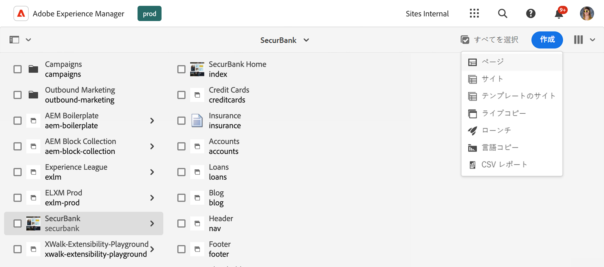
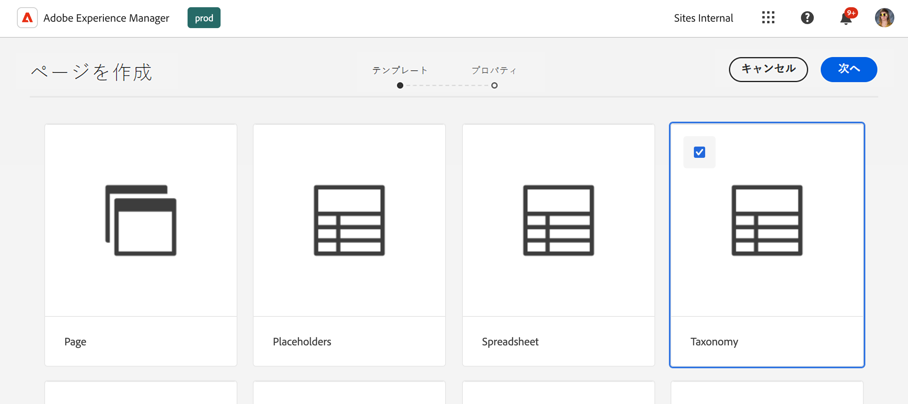
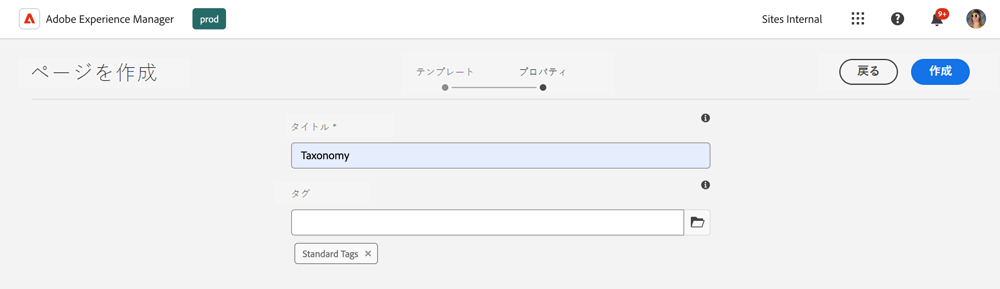
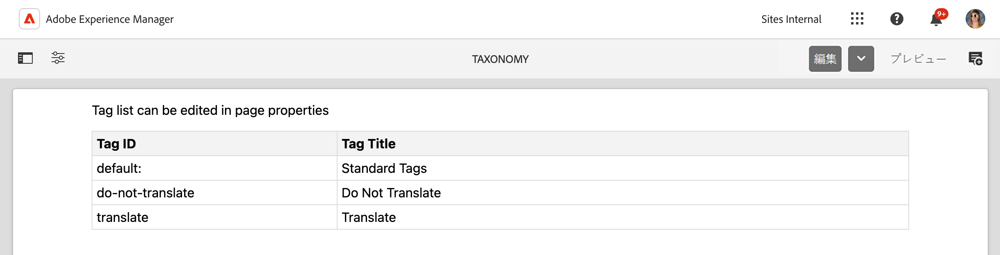
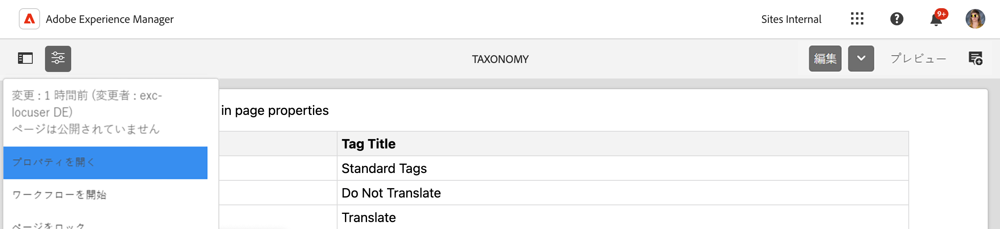

# 分類データの管理 {#managing-taxonomy-data}

Edge Delivery Services サイトで、AEM でタグを使用する分類データの管理方法について説明します。

## はじめに {#introduction}

タグ付けは、ページの整理と管理に役立つ重要な機能です。AEM の[タグ付けコンソール](/help/sites-cloud/administering/tags.md#tagging-console)を使用すると、豊富なタグの分類を作成してページを整理できます。

これらのタグは、コンテンツを整理する際にユーザーや作成者だけでなく、読者にとっても役立ちます。タグとその分類は、ページ上のコンポーネントで使用して、読者がコンテンツを移動するのに役立ちます。

ユニバーサルエディターは、タグの ID でのみ機能します。コンテンツの分類ページを作成すると、これらのタグの説明がすべての言語でユニバーサルエディターに公開され、コンテンツをレンダリングする際にその情報を使用できます。

## 分類ページの作成 {#creating}

分類は、[AEM内の他のページ ](/help/sites-cloud/authoring/sites-console/creating-pages.md) と同様に作成されます。

1. [**Sites** コンソール ](/help/sites-cloud/authoring/sites-console/introduction.md) に移動します。

1. 分類を作成する場所を選択します。

1. **作成**／**ページ**&#x200B;をタップまたはクリックします。

   

1. **ページを作成**&#x200B;ウィザードの「**テンプレート**」タブで、**分類**&#x200B;テンプレートを選択し、「**次へ**」をタップまたはクリックします。

   

1. **ページを作成**&#x200B;ウィザードの「**プロパティ**」タブで、ページに意味のある&#x200B;**タイトル**&#x200B;を入力し、「**タグ**」フィールドで[タグピッカーを使用](/help/sites-cloud/authoring/sites-console/tags.md)して、分類に含めるタグまたは名前空間を選択します。

   

1. 「**作成**」をタップまたはクリックします。

分類ページが作成されます。**成功** ダイアログで、「**完了** ダイアログをタップまたはクリックしてメッセージを解除するか、「**開く [ をタップまたはクリックして、** ページエディター ](/help/sites-cloud/authoring/page-editor/introduction.md) でページを編集することができます。

次の手順で使用するのに、分類ページの結果のページ名をメモしておきます。

## 分類ページの編集 {#editing}

AEM の他のページと同様に、分類ページの編集を開始します。

1. [**Sites** コンソール ](/help/sites-cloud/authoring/sites-console/introduction.md) に移動します。

1. 編集する分類を選択します。

1. アクションバーの「**編集**」をタップまたはクリックします。

1. ページエディターが開き、分類が表示されます。

   * 分類ページは、ページエディターでは読み取り専用です。

   

1. ツールバーの&#x200B;**ページ情報**&#x200B;アイコンをタップまたはクリックし、「**プロパティを開く**」を選択します。

   

1. **ページプロパティ**&#x200B;ウィンドウでは、ページの名前を更新し、タグセレクターを使用して分類に含まれるタグと名前空間を更新できます。

   

1. 「**保存して閉じる**」をタップまたはクリックします。

分類のコンテンツは選択したタグと名前空間から自動的に生成されるので、ページエディターに表示されるページは読み取り専用です。これらは、分類のコンテンツを自動的に生成する一種のフィルターとして機能します。したがって、エディターでページを直接編集する必要はありません。

AEM では、基になるタグと名前空間を更新すると、分類ページのコンテンツが自動的に更新されます。ただし、変更をユーザーが使用できるようにするには、変更後に[分類を再公開](#publishing)する必要があります。

## 分類の公開に関する paths.json の更新 {#paths-json}

[Edge Delivery Services サイトの表形式データの管理と公開 ](/help/edge/wysiwyg-authoring/tabular-data.md) の場合と同様に、分類データを公開できるように、プロジェクトの `paths.json` ファイルを更新する必要があります。

1. GitHub でプロジェクトのルートを開きます。

1. `paths.json` ファイルをタップまたはクリックして詳細を開き、「**編集**」アイコンをタップまたはクリックします。

   

1. 新しい分類ページを `.json` リソースにマッピングする行を追加します。

   ```json
   {
     "mappings": [
      "/content/<site-name>/:/",
      "/content/<site-name>/<taxonomy-page-name>:/<taxonomy-json-name>.json"
     ]
   }
   ```

   * 作成 `<taxonomy-page-name>` た [ 分類ページ ](#creating) の名前と一致する必要があります。
   * `<taxonomy-json-name>` には、任意の有効な名前を指定できます。

1. 「**変更をコミット…**」をクリックして、変更を `main` に保存します。

   * `main` にコミットするか、プロセスに従ってプルリクエストを作成します。

このプロセスは、分類ページごとに 1 回だけ実行する必要があります。完了したら、分類を公開できます。

>[!TIP]
>
>パスマッピングについて詳しくは、「[Edge Delivery Servicesのパスマッピング ](/help/edge/wysiwyg-authoring/path-mapping.md)」を参照してください。

## 分類の公開 {#publishing}

分類は、公開されるまでユニバーサルエディターやユーザーには提供されません。

分類ページは、他のページと同様に、[ ツールバーの **クイック公開** または **公開を管理** アイコンを使用 ](/help/sites-cloud/authoring/sites-console/publishing-pages.md) して公開されます。

分類ページは、次の操作を行うたびに再公開する必要があります。

* 分類ページを編集。
* 分類ページに含まれるタグおよび名前空間を編集または追加。

新しい分類ページを作成する場合は、まず [ プロジェクト内の `paths.json` ファイルへのマッピングを追加 ](#paths-json) する必要があります。

## 分類情報へのアクセス {#accessing}

分類を公開すると、その情報はユニバーサルエディターで活用され、ユーザーに表示されます。

次のアドレスで、JSON データとして分類にアクセスできます。

`https://<branch>--<repository>--<owner>.aem.page/<taxonomy-json-name>.json`

[ 分類をプロジェクトの `paths.json` ファイルにマッピング ](#paths-json) する際に定義した `<taxonomy-json-name>` を使用します。 分類データは、次の例のように JSON データとして返されます。

```json
{
  "total": 3,
  "offset": 0,
  "limit": 3,
  "data": [
    {
      "tag": "default:",
      "title": "Standard Tags"
    },
    {
      "tag": "do-not-translate",
      "title": "Do Not Translate"
    },
    {
      "tag": "translate",
      "title": "Translate"
    }
  ],
  "columns": [
    "tag",
    "title"
  ],
  ":type": "sheet"
}
```

この JSON データは、分類を更新して再公開すると、自動的に更新されます。アプリでは、ユーザーのこの情報にプログラムでアクセスできます。

[ 複数の言語でタグを管理する場合 ](/help/sites-cloud/administering/tags.md#managing-tags-in-different-languages)、ISO2 言語コードを `sheet=` パラメーターの値として渡すことで、それらの言語にアクセスできます。

## 追加のタグプロパティの公開 {#additional-properties}

デフォルトでは、分類には `tag` と `title` の値が含まれています [ 前の例 ](#accessing)。 追加のタグプロパティを公開するように分類を設定できます。 この例では、タグの説明を公開します。

1. Sites コンソールを使用して、作成した分類を選択します。
1. ツールバーの「**プロパティ**」アイコンをタップまたはクリックします。
1. 「**その他のプロパティ**」セクションで、「**追加**」をタップまたはクリックしてフィールドを追加します。
1. 新しいフィールドに、公開する JRC プロパティ名を入力します。この場合は、タグの説明に `jcr:description` と入力します。
1. 「**保存して閉じる**」をタップまたはクリックします。
1. 分類を選択したまま、ツールバーの「**クイック公開**」をタップまたはクリックします。

これで [ 分類にアクセスすると ](#accessing)、タグの説明（または公開するために選択したプロパティ）が JSON に含まれます。

```json
{
  "total": 3,
  "offset": 0,
  "limit": 3,
  "data": [
    {
      "tag": "default:",
      "title": "Standard Tags",
      "jcr:description": "These are the standard tags"
    },
    {
      "tag": "do-not-translate",
      "title": "Do Not Translate",
      "jcr:description": "Tag to mark pages that should not be translated"
    },
    {
      "tag": "translate",
      "title": "Translate",
      "jcr:description": "Tag to mark pages that should be translated"
    }
  ],
  "columns": [
    "tag",
    "title",
    "jcr:description"
  ],
  ":type": "sheet"
}
```
