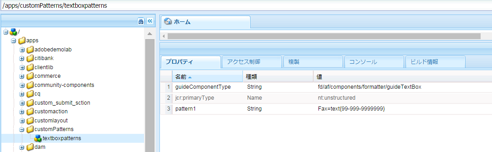

# アダプティブフォームの式 {#adaptive-form-expressions}

アダプティブフォームは、ダイナミックなスクリプト機能によってエンドユーザーのフォームへの入力作業を最適化および簡素化します。式を記述することで、フィールドやパネルのダイナミックな表示／非表示など、様々な動作を追加できるようになります。また、レポートを作成する計算指標フィールドを追加したり、フィールドを読み取り専用にしたり、検証ロジックを追加したりすることもできます。動的動作は、ユーザー入力や事前入力データに基づいています。

アダプティブフォームの式言語は JavaScript™ です。すべての式は、有効な JavaScript™ の式で、アダプティブフォームのスクリプトモデル API を使用しています。これらの式は、特定のタイプの値を返します。アダプティブフォームクラス、イベント、オブジェクトおよびパブリック API の完全なリストについては、「[アダプティブフォーム用 JavaScript™ ライブラリ API リファレンス](https://helpx.adobe.com/jp/experience-manager/6-5/forms/javascript-api/index.html)」を参照してください。

## 式を記述するためのベストプラクティス {#best-practices-for-writing-expressions}

* 式を記述したり、フィールドやパネルにアクセスしたりする場合は、フィールド名またはパネル名を使用します。フィールドの値にアクセスするには、value プロパティを使用します。例：`field1.value`
* フォームをまたぐフィールド名およびパネル名には、一意の名前を使用します。式を記述する際に使用したフィールド名と競合する可能性を回避できます。
* 複数行にわたる式を記述する場合、セミコロンを使用してステートメントを終了します。

## 繰り返しパネルを含む式のベストプラクティス {#best-practices-for-expressions-involving-repeating-panel}

繰り返しパネルは、スクリプト API または事前入力済みデータを使用した、動的に追加または削除されたパネルのインスタンスです。<!--  For detailed information about using repeating panel, see [creating forms with repeatable sections](creating-forms-repeatable-sections.md). -->

* 繰り返しパネルを作成するには、パネルダイアログで設定を開いて、最大カウントの値を 1 より上に設定します。
* 繰り返しパネル設定の最小カウントの値は、1 またはそれ以上に設定できますが、最大値を超えることはできません。
* 式が繰り返しパネルのフィールドを参照する場合、その式のフィールド名は、一番近い繰り返し要素に解決されます。
* アダプティブフォームには、合計、カウント、最小値、最大値、フィルターなど、繰り返し可能なパネルの計算を簡素化するためのいくつかの特別な機能があります。機能の完全なリストについては、「[アダプティブフォーム用 JavaScript™ ライブラリ API リファレンス](https://helpx.adobe.com/jp/aem-forms/6/javascript-api/af.html)」を参照してください。
* 以下に、繰り返しパネルのインスタンスを操作するための API を示します。

   * パネルインスタンスを追加する場合：`panel1.instanceManager.addInstance()`
   * 繰り返しパネルのインデックスを取得する場合：`panel1.instanceIndex`
   * パネルの instanceManager を取得する場合：`_panel1 or panel1.instanceManager`
   * パネルのインスタンスを削除する場合：`_panel1.removeInstance(panel1.instanceIndex)`

## 式のタイプ {#expression-types}

アダプティブフォームでは、式を記述して、フィールドやパネルのダイナミックな表示／非表示などの動作を追加できます。また、式を記述することで、計算指標フィールドを追加したり、フィールドを読み取り専用にしたり、検証ロジックを追加したりすることもできます。アダプティブフォームは、以下の式をサポートします。

* **[アクセス式](#access-expression-enablement-expression)**：フィールドを有効／無効にします。
* **[式の計算](#calculate-expression)**：フィールドの値を自動計算します。
* **[クリック式](#click-expression)**：ボタンのクリックイベント時のアクションを処理します。
* **[初期化スクリプト](#initialization-script)：**&#x200B;フィールドの初期化時にアクションを実行します。
* **[オプション式](#options-expression)**：ドロップダウンリストを動的に入力します。
* **[要約式](#summary)**：アコーディオンのタイトルを動的に計算します。
* **[検証式](#validate-expression)**：フィールドを検証します。
* **[値コミットスクリプト](#value-commit-script)：**&#x200B;フィールドの値が変更された後でフォームのコンポーネントを変更します。
* **[表示式](#visibility-expression)**：フィールドおよびパネルの表示をコントロールします。
* **[ステップ完了の式](#step-completion-expression)**：ユーザーがウィザードの次のステップへ進むのを防ぎます。

### アクセス式（イネーブルメント式） {#access-expression-enablement-expression}

アクセス式を使用してフィールドを有効／無効にできます。式でフィールドの値が使用されている場合、フィールドの値が変更されると常に式がトリガーされます。

**適用先**：フィールド

**戻り値のタイプ**：式は、フィールドが有効か無効かを表すブール値を返します。**true** はフィールドが有効であることを表し、**false** はフィールドが無効であることを表します。

**例**：**field1** の値が **X** に設定されている場合にのみフィールドを有効にするためのアクセス式は、`field1.value == "X"` です。

### 計算式 {#calculate-expression}

式の計算は、式を使用してフィールドの値を自動計算するのに使用されます。通常、この式には、他のフィールドの value プロパティを使用します。例えば、`field2.value + field3.value` のようになります。`field2` または `field3`の値が変わるたびに、式が再トリガーされ、値が再計算されます。

**適用先**：フィールド

**戻り値のタイプ**：式は、式の結果が表示されるフィールドに対応する値を返します（例えば、小数値）。

**例**：2 つのフィールドの合計を **field1** に表示する計算式は、`field2.value + field3.value` です。

### クリック式 {#click-expression}

クリック式は、ボタンのクリックイベント時に実行されるアクションを処理します。すぐに使用できる GuideBridge は、送信、検証など、クリック式と共に使用される様々な機能を実行するための API を提供します。API の完全なリストについては、「[GuideBridge API](https://helpx.adobe.com/jp/aem-forms/6/javascript-api/GuideBridge.html)」を参照してください。

**適用先**：ボタンフィールド

**戻り値のタイプ**：クリック式は、値を返しません。式が値を返した場合、その値は無視されます。

**例**：値 **AEM Forms** を含むボタンのクリックアクションでテキストボックス **textbox1** に入力するためのボタンのクリック式は、`textbox1.value="AEM Forms"` です。

### 初期化スクリプト {#initialization-script}

アダプティブフォームが初期化されると、初期化スクリプトがトリガーされます。シナリオによっては、初期化スクリプトは以下のような方法で動作します。

* アダプティブフォームがデータの事前入力なしでレンダリングされると、初期化スクリプトは、フォームが初期化された後で実行されます。
* アダプティブフォームがデータの事前入力ありでレンダリングされると、スクリプトは、事前入力操作が完了した後で実行されます。
* アダプティブフォームのサーバーサイドの再検証がトリガーされると、初期化スクリプトが実行されます。

**適用先**：フィールドおよびパネル

**戻り値のタイプ**：初期化スクリプトの式は、値を返しません。式が値を返した場合、その値は無視されます。

**例**：データの事前入力シナリオで、値が null として保存されたときにフィールドにデフォルト値 `'Adaptive Forms'` を入力するための初期化スクリプト式は、`if(this.value==null) this.value='Adaptive Forms';` です。

### オプション式 {#options-expression}

オプション式は、ドロップダウンリストのフィールドのオプションを動的に入力するために使用されます。

**適用先**：ドロップダウンリストフィールド

**戻り値のタイプ**：オプション式は、文字列値の配列を返します。それぞれの値は、**男性**&#x200B;のような単純な文字列である場合や、**1=男性**&#x200B;のようなキーと値のペアである場合があります。

**例**：別のフィールドの値に基づいてフィールドの値を入力するには、単純なオプション式を指定します。例えば、別のフィールドの&#x200B;**婚姻ステータス**&#x200B;の式に基づいて、フィールド&#x200B;**子供の数**&#x200B;を入力するための式は、以下のようになります。

**`marital_status.value == "married" ? ["1=One", "2=two"] : ["0=Zero"]`.**

**marital_status** フィールドの値が変わる場合は、常に式が再トリガーされます。REST サービスからドロップダウンリストに入力することもできます。<!-- For detailed information, see [Dynamically populating dropdowns](dynamically-populate-dropdowns.md). -->

### 要約式 {#summary}

要約式は、アコーディオンレイアウトパネルの子パネルのタイトルを動的に計算します。要約式はルールで指定できます。タイトルはフォームフィールドまたはカスタムロジックを使用して評価されます。式は、フォームが起動すると実行されます。フォームを事前入力する場合、式は、データが事前入力されてから、または式に使用されている依存するフィールドの値が変更されたときに実行されます。

要約式は、通常、アコーディオンレイアウトパネルの子の繰り返し処理に使用され、子パネルごとに意味のあるタイトルを作成します。

**適用先**：レイアウトがアコーディオンとして設定されているパネルの直接の子であるパネル。

**戻り値のタイプ**：式は、アコーディオンのタイトルとなる文字列を返します。

**例：**&quot;Account number : &quot; + textbox1.value

### 検証式 {#validate-expression}

検証式は、特定の式を使用してフィールドを検証するために使用されます。通常、この式は、フィールドの値と共に正規表現を使用して、フィールドの検証を行います。フィールドの値が変更されると、式が再トリガーされ、フィールドの検証ステータスが再計算されます。

**適用先**：フィールド

**戻り値のタイプ**：式は、フィールドの検証ステータスを表すブール値を返します。**false** はそのフィールドが無効であることを表し、**true** はそのフィールドが有効であることを表します。**例**：英国の郵便番号を表すフィールドの検証式を以下に示します。

(**this.value** &amp;&amp; `this.value.match(/^(GIR 0AA|[A-Z]{1,2}\d[A-Z0-9]? ?[0-9][A-Z]{2}\s*)$/i) == null) ? false : true`

この例では、空でない値がパターンに一致しない場合、式は、そのフィールドが有効でないことを示すために **false** を返します。

>[!NOTE]
>
>必須または必須でないフィールドの検証式を記述する場合、その式は、フィールドの表示ステータスに関係なく評価されます。非表示のフィールドの検証を停止するには、初期化または値コミットスクリプトの validationsDisabled プロパティを true に設定します。例：`this.validationsDisabled=true`

### 値コミットスクリプト {#value-commit-script}

値コミットスクリプトがトリガーされるのは、以下のような場合です。

* ユーザーが UI からフィールドの値を変更した場合。
* 別のフィールドの値が変更されたので、フィールドの値がプログラムによって変更された場合。

**適用先**：フィールド

**戻り値のタイプ**：値コミットスクリプトの式は、値を返しません。式が値を返した場合、その値は無視されます。

**例**：コミット時にフィールドに入力されたアルファベットを大文字を変換する場合に使用される値コミット式を以下に示します。`this.value=this.value.toUpperCase()`

>[!NOTE]
>
>フィールドの値がプログラムによって変更された場合、値コミットスクリプトの実行を無効にできます。無効にするには、https://&#39;[server]:[port]&#39;/system/console/configMgr に移動して、**互換性のある Adaptive Forms のバージョン**&#x200B;を **AEM Forms 6.1** に変更します。以降、値コミットスクリプトは、ユーザーがフィールドの値を UI から変更した場合にのみ実行されます。

### 表示式 {#visibility-expression}

表示式は、フィールド／パネルの表示を制御するのに使用されます。通常、表示式にはフィールドの value プロパティが使用され、値が変更されるたびに再トリガーされます。

**適用先**：フィールドおよびパネル

**戻り値のタイプ**：式は、フィールド／パネルが表示されているか否かを表すブール値を返します。**false** はフィールドまたはパネルが非表示であることを表し、true はフィールドまたはパネルが表示されていることを表します。

**例**：**field1** の値が&#x200B;**男性**&#x200B;に設定されている場合にのみ表示されるパネルの表示式を以下に示します。`field1.value == "Male"`

### 手順完了式 {#step-completion-expression}

ステップ完了の式は、ユーザーがウィザードの次のステップへ進むのを防ぎます。これらの式は、パネルにウィザードのレイアウト（1 度に 1 ステップずつ表示するマルチステップフォーム）がある場合に使用されます。ユーザーは、現在のセクションで必要なすべての値が入力されて有効である場合にのみ、次のステップ、パネルまたはサブセクションに移動できます。

**適用先**：ウィザードに設定された項目がレイアウトされたパネル。

**戻り値のタイプ**：式は、既存のパネルが有効か無効かを表すブール値を返します。**True** は、現在のパネルが有効で、ユーザーが次のパネルに移動できることを表します。

**例**：様々なパネルに表示されるフォームでは、次のパネルに移動する前に、現在のパネルが検証されます。このような場合は、ステップ完了の式を使用します。一般的に、これらの式には GuideBridge 検証 API が使用されます。ステップ完了の式の一例：`window.guideBridge.validate([],this.panel.navigationContext.currentItem.somExpression)`

## アダプティブフォームにおける検証 {#validations-in-adaptive-form}

アダプティブフォームにフィールド検証を追加するには、複数の方法があります。検証チェックがフィールドに追加された場合、**True** はフィールドに入力された値が有効であることを示します。**False** は値が無効であることを示します。フィールドの中および外にタブを設定すると、エラーメッセージは生成されません。

フィールドに検証を追加するには、以下の手順を実行します。

### 必須 {#required}

コンポーネントを必須にするには、コンポーネントの&#x200B;**編集**&#x200B;ダイアログで、**タイトルとテキスト／必須**&#x200B;オプションを選択します。また、適切な必須メッセージも追加できます（オプション）。

### 検証パターン {#validation-patterns}

フィールドに利用可能な、すぐに使用できる検証パターンが複数あります。検証パターンを選択するには、コンポーネントの **編集** ダイアログで、「**パターン**」セクションを見つけて、「**パターン**」を選択します。**パターン**&#x200B;テキストボックスで、独自のカスタム検証パターンを作成できます。検証ステータスは、入力されたデータが検証パターンに準拠している場合にのみ **True** を返し、それ以外の場合は **False** を返します。<!-- To write your own custom validation pattern, see [Picture clause support for HTML5 forms](picture-clause-support.md). -->

### 検証式 {#validation-expressions}

フィールドの検証は、別のフィールドの式を使用して計算することもできます。これらの式は、コンポーネントの&#x200B;**編集**&#x200B;ダイアログにある「**スクリプト**」タブの「**検証スクリプト**」フィールド内で記述されます。フィールドの検証ステータスは、式が返す値に依存します。このような式の記述方法について詳しくは、「[検証式](adaptive-form-expressions.md#p-validate-expression-p)」を参照してください。

## 追加情報 {#additional-information}

### フィールドの表示形式の使用 {#using-field-display-format}

表示形式は、異なる形式でデータを表示するのに使用できます。例えば、ハイフンを使用した電話番号、郵便番号または日付選択を表示するための表示形式を使用できます。表示形式は、コンポーネントの編集ダイアログにある「**パターン**」セクションから選択できます。前述の検証パターンに類似したカスタム表示パターンを記述することもできます。

### GuideBridge - API とイベント {#guidebridge-apis-and-events}

GuideBridge は、ブラウザーのメモリーモデルでアダプティブフォームとやり取りするのに使用できる API のコレクションです。Guide Bridge API、クラスメソッド、公開されたイベントについて詳しくは、「[アダプティブフォーム用 JavaScript™ ライブラリ API リファレンス](https://helpx.adobe.com/jp/aem-forms/6/javascript-api/)」を参照してください。

>[!NOTE]
>
>式に GuideBridge イベントリスナーを使用しないことをお勧めします。

#### 様々な式での GuideBridge の使用方法 {#guidebridge-usage-in-various-expressions}

* フォームフィールドをリセットするには、ボタンのクリック式で `guideBridge.reset()` API をトリガーします。同様に、クリック式として呼び出すことができる送信 API `guideBridge.submit()`**があります。**

* `setFocus()` API を使用して、様々なフィールドまたはパネル間でフォーカスを設定できます（パネルの場合、フォーカスは自動的に最初のフィールドに設定されます）。`setFocus()` には、パネル間ナビゲーション、前／次のトラバーサル、特定のフィールドへのフォーカスの設定など、幅広いオプションが用意されています。例えば、次のパネルに移動するには、`guideBridge.setFocus(this.panel.somExpression, &#39;nextItem&#39;) を使用します。

* アダプティブフォームやその特定のパネルを検証するには、`guideBridge.validate(errorList, somExpression).` を使用します。

#### 式外での GuideBridge の使用 {#using-guidebridge-outside-expressions-nbsp}

GuideBridge API を式の外で使用することもできます。例えば、GuideBridge API を使用して、アダプティブフォームをホストしているページ HTML とフォームモデルの間の通信を設定できます。また、フォームをホストしている Iframe の親から取得した値を設定することもできます。

前述の例で GuideBridge API を使用するには、GuideBridge のインスタンスを取得します。インスタンスを取得するには、`window` オブジェクトの `bridgeInitializeStart` イベントをリッスンします。

```javascript
window.addEventListener("bridgeInitializeStart", function(evnt) {

     // get hold of the guideBridge object

     var gb = evnt.detail.guideBridge;

     //wait for the completion of AF

     gb.connect(function (){

        //this function is called after Adaptive Form is initialized

     })

})
```

>[!NOTE]
>
>AEM では、clientLib にコードを記述して、ページに含めることをお勧めします（ページの header.jsp または footer.jsp）

フォームが初期化された後（`bridgeInitializeComplete` イベントがディスパッチされた後）に GuideBridge を使用するには、`window.guideBridge` を使用して GuideBridge インスタンスを取得します。`guideBride.isConnected` API を使用して、GuideBridge 初期化ステータスを確認できます。

#### GuideBridge イベント {#guidebridge-events}

また、GuideBridge は、ホスティングページ上の外部スクリプト用に特定のイベントを提供します。外部スクリプトは、これらのイベントをリッスンして様々な操作を実行できます。例えば、フォームのユーザー名が変更される場合は、ページのヘッダーに表示される名前も常に変更されます。これらのイベントについて詳しくは、「[アダプティブフォーム用 JavaScript™ ライブラリ API リファレンス](https://helpx.adobe.com/jp/aem-forms/6/javascript-api/GuideBridge.html)」を参照してください。

以下のコードを使用してハンドラーを登録します。

```javascript
guideBridge.on("elementValueChanged", function (event, data)  {

      // execute some logic when value of a field is changed

});
```

### フィールドのカスタムパターンの作成 {#creating-custom-patterns-for-a-field}

前述のように、アダプティブフォームでは、作成者が検証または表示形式のパターンを提供できます。すぐに使用できるパターンの使用に加えて、アダプティブフォームコンポーネントに再利用可能なカスタムパターンを定義することもできます。例えば、テキストフィールドや数値フィールドを定義できます。定義したら、指定したタイプのコンポーネントのすべてのフォームでこれらのパターンを使用できます。例えば、テキストフィールドのカスタムパターンを作成して、アダプティブフォームのテキストフィールドで使用できます。コンポーネントの編集ダイアログでパターンセクションにアクセスすることで、カスタムパターンを選択できます。<!-- For details about Pattern definition or format, see [Picture clause support for HTML5 forms](picture-clause-support.md).-->

特定のフィールドタイプのカスタムパターンを作成して、同じタイプの他のフィールドに再利用するには、以下の手順を実行します。

1. オーサーインスタンスで CRXDE Lite に移動します。
1. カスタムパターンを管理するためのフォルダーを作成します。/apps ディレクトリの下で、タイプ sling:folder のノードを作成します。例えば、`customPatterns` という名前でノードを作成します。このノードの下で、タイプ `nt:unstructed` の別のノードを作成して、`textboxpatterns` という名前を付けます。このノードには、追加したい様々なカスタムパターンが含まれています。
1. 作成したノードの「プロパティ」タブを開きます。例えば、`textboxpatterns` の「プロパティ」タブを開きます。このノードに `guideComponentType` プロパティを追加して、その値を *fd/af/components/formatter/guideTextBox* に設定します。

1. このプロパティの値は、パターンを定義するフィールドに応じて変わります。数値フィールドの場合、`guideComponentType` プロパティの値は、*fd/af/components/formatter/guideNumericBox* です。日付選択フィールドの値は、*fd/af/components/formatter/guideDatepicker* す。
1. `textboxpatterns` ノードにプロパティを割り当てることで、カスタムパターンを追加できます。名前の付いたプロパティ（例えば、`pattern1`）を追加して、追加するパターンにその値を設定します。例えば、値が Fax=text{99-999-9999999} のプロパティ `pattern1` を追加します。パターンは、アダプティブフォームで使用するすべてのテキストボックスで使用できます。

   

   カスタムパターンの作成
