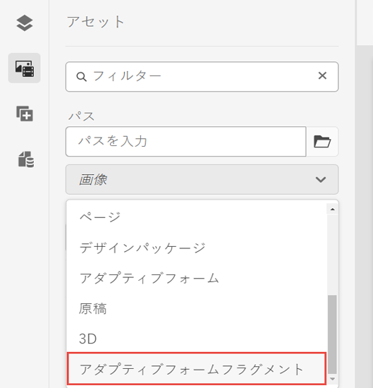

# アダプティブフォームフラグメント {#adaptive-form-fragments}

 これはプレリリース機能で、 [プレリリースチャネル](https://experienceleague.adobe.com/docs/experience-manager-cloud-service/content/release-notes/prerelease.html#new-features). 

すべてのフォームは特定の目的のために設計されていますが、ほとんどのフォームには、名前や住所、家族の詳細、収入の詳細などの個人の詳細を提供するセグメントなど、一般的なセグメントがいくつかあります。 フォーム開発者は、新しいフォームを作成するたびに、これらの共通セグメントを作成する必要があります。

アダプティブフォームには、パネルやフィールドグループなどのフォームセグメントを 1 回だけ作成するための便利な機能が用意されています。作成したフォームセグメントは、アダプティブフォームで再利用することができます。これらの再利用可能でスタンドアロンのセグメントは、アダプティブフォームフラグメントと呼ばれます。

フォームフラグメントは複数のフォームにシームレスに統合され、一貫性のあるプロフェッショナルな外観のフォームを効率的に作成できます。 フォームフラグメントは、「一度変更してすべてに反映」機能を通じて、再利用性、標準化、ブランドの一貫性を確保します。 1 か所でおこなわれた更新が、これらのフラグメントを利用するすべてのフォームに自動的に反映されるので、メンテナンス性と効率性が向上します。

フラグメントを 1 つのドキュメントに複数回追加し、そのコンポーネントのデータ連結プロパティを使用して、フラグメントを別々のデータソースやスキーマに結び付けることができます。 例えば、永続的な住所、通信先、請求先の住所に同じ住所フラグメントを使用し、それをデータソースやスキーマの別のフィールドに接続することができます。

## フォームフラグメントを作成する {#create-a-fragment}

アダプティブフォームフラグメントは、最初から作成することも、パネルをフラグメントとして既存のアダプティブフォームに保存することもできます。 フォームフラグメントを作成するには：

1. https://でAEM Formsインスタンスにログインします。[*hostname*]:[*ポート*]/aem/forms.html.
1. クリック **作成/アダプティブフォームフラグメント**.
1. フラグメントのタイトル、名前、説明およびタグを指定します。 フラグメントには一意の名前を指定してください。 同じ名前の別のフラグメントが既に存在する場合、フラグメントの作成に失敗します。
1. フォームテンプレートを選択します。 コアコンポーネントベースのアダプティブFormsまたは基盤コンポーネントベースのアダプティブForms用のフォームフラグメントを作成できます。
   * コアコンポーネントベースのフォームのフォームフラグメントを作成するには、コアコンポーネントベースのテンプレートを選択します。
   * 基盤コンポーネントベースのフォーム用のフォームフラグメントを作成するには、基盤コンポーネントテンプレートを選択します。 例えば、 /libs/fd/af/templateForFragment/defaultFragmentTemplate のように指定します。

   コアコンポーネントベースのフォーム用のフォームフラグメントを作成する場合は、「フォームテーマを選択」オプションを使用して、コアコンポーネントベースのテーマを選択します。

1. 「**フォームモデル**」タブをクリックして開き、「**次から選択**」ドロップダウンメニューから、フラグメントに対して次のいずれかのモデルを選択します。

   

   * **なし**：フォームモデルを使用しないで最初からフラグメントを作成するときに指定します。

     >[!NOTE]
     >
     >基盤コンポーネントベースのフラグメントに比べて、コアコンポーネントベースのフラグメントの利点は、単一のアダプティブフォーム内のフォームモデルに結び付けられていない、複数のコアコンポーネントベースのフラグメントを使用できる点です。

   * **スキーマ**:AEM Formsにアップロードされた XML または JSON スキーマを使用してフラグメントを作成する場合に指定します。 アップロードするか、使用可能な XML スキーマまたは JSON スキーマからフラグメントのフォームモデルとして選択できます。 XML スキーマを選択する場合、選択したスキーマ内に存在する complexType を **[!UICONTROL XML スキーマの複合型]** 」ドロップダウンボックスを使用します。 JSON スキーマを選択する場合、選択したスキーマ内に存在するスキーマ定義を **[!UICONTROL JSON スキーマの定義]** 」ドロップダウンボックスを使用します。
   * **フォームデータモデル**：フォームデータモデルを使用してフラグメントを作成する場合に指定します。 フォームデータモデル内の 1 つのデータモデルオブジェクトのみに基づいて、アダプティブフォームフラグメントを作成できます。 フォームデータモデル定義ドロップダウンを展開します。指定したフォームデータモデル内のすべてのデータモデルオブジェクトが一覧表示されます。 リストからデータモデルオブジェクトを選択します。

   

1. 「**作成**」をクリックし、次に「**開く**」をクリックして、編集モードでデフォルトテンプレートを使ってフラグメントを開きます。編集モードでは、任意のアダプティブフォームコンポーネントをフラグメントに追加できます。

<!-- For information about Adaptive Form components, see [Introduction to authoring Adaptive Forms](../../forms/using/introduction-forms-authoring.md). --> また、フラグメントのフォームモデルとして XML スキーマまたは XDP フォームテンプレートを選択した場合は、フォームモデル階層を示す新しいタブがコンテンツファインダーに表示されます。 これにより、フォームモデルの要素をフラグメントにドラッグ&amp;ドロップできます。 追加されたフォームモデル要素はフォームコンポーネントに変換されますが、関連する XDP または XSD の元のプロパティは保持されます。

スキーマまたはフォームデータモデルに基づくアダプティブフォームフラグメントが作成されると、フォームデータモデルまたはスキーマ要素が、アダプティブフォームエディターのコンテンツブラウザーの「データソース」タブに表示されます。 フォームモデルの要素をフラグメントにドラッグ&amp;ドロップできます。 追加されたフォームモデル要素はフォームコンポーネントに変換され、関連するスキーマの元のプロパティは保持されます。

## フラグメントをアダプティブフォームに追加する {#insert-a-fragment-in-an-adaptive-form}

アダプティブフォームフラグメントをアダプティブフォームに追加するには、次の手順を実行します。

1. アダプティブフォームを編集モードで開きます。
1. 次を追加： **アダプティブフォームフラグメント** コンポーネントをフォームに追加します。
1. 次をクリック： **Assets** コンテンツブラウザーのサイドバー。 アセットブラウザーで、パスの下の **アダプティブフォームフラグメント** オプション。 フォームのモデルに応じて、フォームで使用可能なすべてのアダプティブFormsフラグメントが表示されます。

   

1. アダプティブフォームフラグメントを **アダプティブフォームフラグメント** コンポーネントをアダプティブフォームに追加します。

   >[!NOTE]
   >
   >アダプティブフォームフラグメントは、アダプティブフォーム内からのオーサリングでは有効になっていません。 また、JSON ベースのアダプティブフォームで XSD ベースのフラグメントを使用することも、XSD ベースのアダプティブフォームで JSON ベースのフラグメントを使用することもできません。

アダプティブフォームフラグメントは、アダプティブフォームを参照して追加され、スタンドアロンのアダプティブフォームフラグメントと同期されたままになります。 つまり、アダプティブフォームフラグメントに加えた変更は、そのフラグメントがアダプティブFormsに組み込まれるすべてのインスタンスに反映されます。

### フラグメントのアダプティブフォーム内への埋め込み {#embed-a-fragment-in-adaptive-form}

アダプティブフォーム内にアダプティブフォームフラグメントを埋め込むには、  icon 追加されたフラグメントのパネルツールバー

埋め込まれたフラグメントはスタンドアロンのフラグメントとリンクされなくなります。埋め込まれたフラグメント内のコンポーネントは、アダプティブフォーム内から編集できます。

<!-- 
## Configure fragment appearance {#configure-fragment-appearance}

Any fragment you insert in Adaptive Forms appears as a placeholder image. The placeholder displays titles of up to a maximum of ten child panels in the fragment. You can configure AEM Forms to show the complete fragment instead of the placeholder image.

Perform the following steps to show complete fragments in forms:

1. Go to AEM web console configuration page at https:[*host*]:[*port*]/system/console/configMgr.

1. Search and click **[!UICONTROL Adaptive Form and Interactive Communication Web Channel Configuration]** to open it in edit mode.
1. Disable **[!UICONTROL Enable Placeholder in place of Fragment]** checkbox to show complete fragments rather than the placeholder image.

-->

### フラグメント内でのフラグメントの使用 {#using-fragments-within-fragments}

ネストされたアダプティブフォームフラグメントを作成できます。つまり、別のフラグメント内にフラグメントをドラッグ&amp;ドロップし、ネストされたフラグメント構造を持つことができます。

## データ連結のためのフラグメントの自動マッピング {#auto-mapping-of-fragments-for-data-binding}

XFA フォームテンプレートまたは XSD 複合タイプを使用してアダプティブフォームフラグメントを作成し、フラグメントをアダプティブフォームにドラッグ&amp;ドロップすると、XFA フラグメントまたは XSD 複合タイプは、フラグメントモデルルートを XFA フラグメントまたは XSD 複合タイプにマッピングする対応のアダプティブフォームフラグメントに自動的に置き換えます。

コンポーネントの編集ダイアログから、フラグメントアセットとその連結を変更できます。

連結されたアダプティブフォームフラグメントをAEMコンテンツファインダーのアダプティブフォームフラグメントライブラリからドラッグ&amp;ドロップし、アダプティブフォームフラグメントパネルの編集コンポーネントダイアログから正しいバインド参照を指定することもできます。

## フラグメントの管理 {#manage-fragments}

AEM Forms UI を使用して、アダプティブフォームフラグメントに対して複数の操作を実行できます。

1. `https://[hostname]/aem/forms.html` にアクセスします。

1. クリック **選択** AEM Forms UI ツールバーで、アダプティブフォームフラグメントを選択します。 ツールバーには、選択したアダプティブフォームフラグメントに対して実行できる次の操作が表示されます。

<table>
 <tbody>
  <tr>
   <td>
<strong>操作</strong>
 </td>
   <td>
<strong>説明</strong>
 </td>
  </tr>
  <tr>
   <td>
編集
 </td>
   <td>
選択したアダプティブフォームフラグメントを編集モードで開きます。    
 </td>
  </tr>
  <tr>
   <td>
プロパティ
 </td>
   <td>
プロパティパネルを開きます。 プロパティパネルから、プロパティの表示と編集、プレビューの生成、選択したフラグメントのサムネール画像のアップロードをおこなうことができます。 詳しくは、「<a>メタデータの管理</a>」を参照してください。    
 </td>
  </tr>
  <tr>
   <td>
コピー
 </td>
   <td>
選択したフラグメントをコピーします。 貼り付けボタンがツールバーに表示されます。    
 </td>
  </tr>
  <tr>
   <td>
ダウンロード
 </td>
   <td>
選択されているフラグメントをダウンロードします。    
 </td>
  </tr>
  <tr>
   <td>
プレビュー
 </td>
   <td>
フラグメントを HTML でプレビューするか、あるいは XML ファイルからのデータをフラグメントとマージしてカスタムプレビューを生成するかのオプションが与えられます。詳しくは、 <a>フォームのプレビュー</a>.    
 </td>
  </tr>
  <tr>
   <td>
レビューの開始／レビューの管理
 </td>
   <td>
選択されているフラグメントのレビューを開始したり管理したりできます。詳しくは、 <a>レビューの作成と管理</a>.    
 </td>
  </tr>
  <tr>
   <td>
辞書を追加
 </td>
   <td>
選択されているフラグメントをローカライズするための辞書を生成します。詳しくは、 <a>アダプティブFormsのローカライズ</a>.    
 </td>
  </tr>
  <tr>
   <td>
公開／非公開
 </td>
   <td>
選択されているフラグメントを公開／非公開します。    
 </td>
  </tr>
  <tr>
   <td>
削除
 </td>
   <td>
選択されているフラグメントを削除します。    
 </td>
  </tr>
 </tbody>
</table>

## フラグメントで作業するときの考慮事項 {#key-points-to-remember-when-working-with-fragments}

* フラグメント名が一意であることを確認します。 同じ名前の既存のフラグメントが存在する場合、フラグメントの作成に失敗します。
* XDP ベースのアダプティブフォームでは、別の XDP フラグメントを含むフラグメントとしてパネルを保存すると、生成されるフラグメントは子 XDP フラグメントに自動的にバインドされます。XSD ベースのアダプティブフォームでは、生成されるフラグメントはスキーマルートにバインドされます。
* アダプティブフォームフラグメントを作成すると、CRXDe Lite でアダプティブフォームの guideContainer ノードに似たフラグメントノードが作成されます。
* 異なるフォームデータモデルを使用するアダプティブフォーム内のフラグメントはサポートされていません。 例えば、XSD ベースのアダプティブフォームでは、XDP ベースのフラグメントはサポートされていません（その逆についても同様です）。
* アダプティブフォームフラグメントは、AEMコンテンツファインダーの「アダプティブフォームフラグメント」タブを通じて使用できます。
* スタンドアロンのアダプティブフォームフラグメント内の式、スクリプト、スタイルは、アダプティブフォームに参照によって挿入されたり埋め込まれたりしても保持されます。
* アダプティブフォーム内から、参照によって挿入されたアダプティブフォームフラグメントを編集することはできません。 編集するには、スタンドアロンのアダプティブフォームフラグメントを編集するか、フラグメントをアダプティブフォームに埋め込みます。
* アダプティブフォームを発行する場合は、アダプティブフォーム内で参照によって挿入されたスタンドアロンのアダプティブフォームフラグメントを発行する必要があります。
* 更新されたアダプティブフォームフラグメントを再発行すると、その変更は、フラグメントが使用されているアダプティブフォームの発行済みインスタンスに反映されます。
* 検証コンポーネントが含まれているアダプティブフォームの場合、匿名ユーザーはサポートされません。また、アダプティブフォームフラグメントで検証コンポーネントを使用することはお勧めしません。
* （**Mac のみ**）フォームフラグメント機能がすべてのシナリオで正しく動作するようにするには、/private/etc/hosts ファイルに次のエントリを追加します。
  `127.0.0.1 <Host machine>` **ホストマシン**：AEM Forms がデプロイされている Apple Mac マシン。

## リファレンスフラグメント {#reference-fragments}

フォームの作成に使用できる参照用アダプティブフォームフラグメントを使用できます。
<!-- For more information, see [Reference Fragments](../../forms/using/reference-adaptive-form-fragments.md). -->
