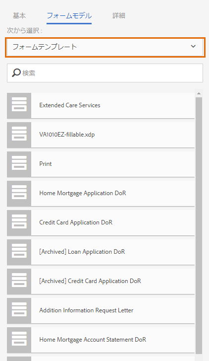
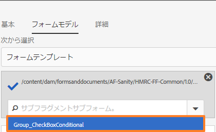
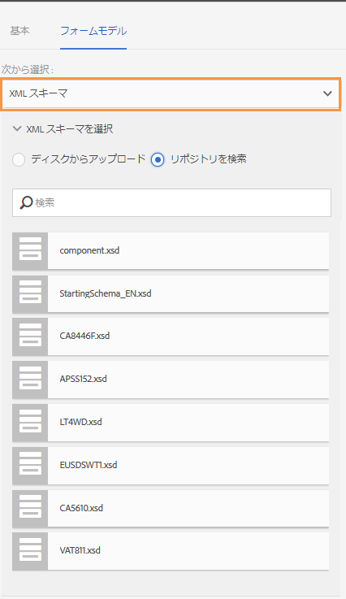
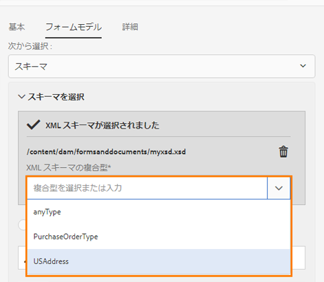
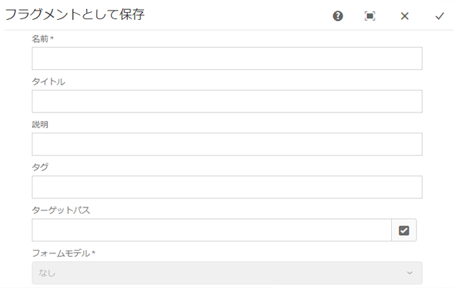
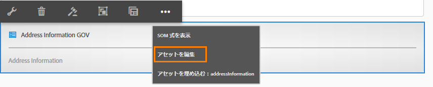
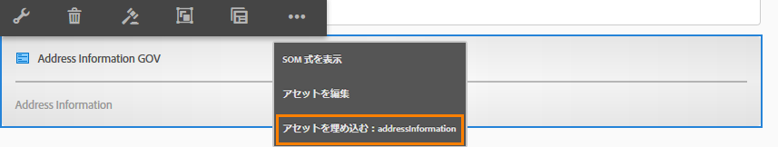

# アダプティブフォームフラグメント{#adaptive-form-fragments}

すべてのフォームは特定の目的用に設計されますが、ほとんどのフォームには、いくつかの共通するセグメントがあります（例：名前と住所、家族の詳細、収入の詳細などの個人情報などを入力するためのセグメント）。フォームの開発者は、新しいフォームを作成するたびに、こうした共通セグメントを作成する必要があります。

アダプティブフォームには、パネルやフィールドグループなどのフォームセグメントを 1 回だけ作成するための便利な機能が用意されています。作成したフォームセグメントは、アダプティブフォームで再利用することができます。この再利用可能なスタンドアロンのセグメントは、アダプティブフォームフラグメントといいます。

## フラグメントの作成 {#create-a-fragment}

アダプティブフォームフラグメントは、最初から作成することも、既存のアダプティブフォーム内にパネルをフラグメントとして保存することもできます。

### フラグメントを最初から作成 {#create-fragment-from-scratch}

1. [!DNL AEM Forms] オーサーインスタンス（https://[*hostname*]:[*port*]/aem/forms.html）にログインします。
1. **作成／アダプティブフォームフラグメント**&#x200B;をクリックします。
1. フラグメントのタイトル、名前、説明、タグを指定します。

   >[!NOTE]
   >
   >フラグメントには一意の名前を指定します。同じ名前を持つ別のフラグメントが既に存在する場合、フラグメントの作成は失敗します。

1. 「**フォームモデル**」タブをクリックして開き、「**次から選択**」ドロップダウンメニューから、フラグメントに対して次のいずれかのモデルを選択します。

   * **なし**：フォームモデルを使用しないで最初からフラグメントを作成するときに指定します。
   * **フォームテンプレート**：[!DNL AEM Forms] にアップロードされた XDP テンプレートを使用してフラグメントを作成するときに指定します。フラグメントのフォームモデルとして適当な XDP テンプレートを選択してください。

   

   選択したフォームテンプレート内でフラグメントとしてマークされたサブフォームも表示されます。ドロップダウンリストから、アダプティブフォームフラグメントのサブフォームを選択できます。

   

   さらに、ドロップダウンボックスでサブフォームのための SOM 式を指定することで、フォームテンプレート内でフラグメントとしてマークされていないサブフォームを使用したアダプティブフォームフラグメントを作成することもできます。

   * **XML スキーマ**：[!DNL AEM Forms] にアップロードされた XML スキーマを使用して、フラグメントを作成するときに指定します。アップロードするかまたはフラグメントのフォームモデルとして使用可能な XML スキーマから選択できます。

   

   ドロップダウンボックスから選択されたスキーマにある complexType を選択することで、アダプティブフォームフラグメントを作成することもできます。

   

1. 「**作成**」をクリックし、次に「**開く**」をクリックして、編集モードでデフォルトテンプレートを使ってフラグメントを開きます。

編集モードでは、AEM サイドキックから任意のアダプティブフォームコンポーネントをフラグメントにドラッグアンドドロップできます。<!-- For information about Adaptive Form components, see Introduction to authoring Adaptive Forms. -->

さらに、フラグメントのフォームモデルとして、XML スキーマまたは XDP フォームテンプレートを選択していた場合は、フォームモデル階層を示す新しいタブがコンテンツファインダーに表示されます。これにより、フォームモデルエレメントをフラグメントにドラッグアンドドロップできます。追加されたフォームモデルエレメントはフォームコンポーネントに変換されますが、関連の XDP または XSD からの元のプロパティは保持されます。

### パネルをフラグメントとして保存 {#save-panel-as-a-fragment}

1. アダプティブフォームフラグメントとして保存するパネルが含まれているアダプティブフォームを開きます。
1. パネルツールバーで、「**[!UICONTROL フラグメントとして保存]**」をクリックします。フラグメントとして保存ダイアログが開きます。

   >[!NOTE]
   >
   >フラグメントとして保存しているパネルに子パネルが含まれている場合、生成されるフラグメントにはこれらの子パネルが含まれます。

1. フラグメント作成ダイアログで、次の情報を指定します。

   * **名前**：フラグメントの名前。デフォルト値はパネルのエレメント名です。このフィールドは必須です。
      >[!NOTE]
      >
      >フラグメントには一意の名前を指定します。同じ名前を持つ別のフラグメントが既に存在する場合、フラグメントの作成は失敗します。

   * **タイトル**：フラグメントのタイトル。デフォルト値はパネルのタイトルです。

   * **説明**：フラグメントの説明。

   * **タグ**：フラグメントのタグメタデータ。

   * **ターゲットパス**：フラグメントが保存されるリポジトリーパス。パスを指定しない場合、フラグメントと同じ名前を持つノードが、アダプティブフォームを含むノードの横に作成されます。フラグメントはこのノードに保存されます。

   * **フォームモデル**：アダプティブフォームのフォームモデルに応じて、このフィールドには「**XML スキーマ**」、「**フォームテンプレート**」、または「**なし**」が表示されます。このフィールドは編集できません。

   * **フラグメントモデルルート**：XSD ベースのアダプティブフォームにのみ表示されます。フラグメントモデルのルートを指定します。ドロップダウンリストから **/** または XSD 複合タイプを選択できます。フラグメントを別のアダプティブフォームで再利用できるのは、複合タイプをフラグメントモデルルートとして選択した場合のみです。**/** をフラグメントモデルルートとして選択した場合、ルートからの完全な XSD ツリーは、「アダプティブフォームデータモデル」タブに表示されます。複合タイプのフラグメントモデルルートの場合、選択した複合タイプの子孫のみが、「アダプティブフォームデータモデル」タブに表示されます。

   * **XSD 参照**：XSD ベースのアダプティブフォームにのみ表示されます。XML スキーマの場所を表示します。

   * **XDP 参照**：XDP ベースのアダプティブフォームにのみ表示されます。XDP フォームテンプレートの場所を表示します。

   

   フラグメントとして保存ダイアログボックス

1. 「**OK**」をクリックします。

   パネルがリポジトリー内の指定した場所またはデフォルトの場所に保存されます。アダプティブフォームでは、パネルがフラグメントのスナップショットによって置き換えられます。以下に示すように、「一般情報」パネルとその子パネル、個人情報、アドレスは、フラグメントとして保存されます。

   フラグメントを編集するには、パネルツールバーで「**[!UICONTROL アセットを編集]**」をクリックします。フラグメントが新しいタブまたはウィンドウ上に編集モードで開きます。

   

## フラグメントの操作 {#working-with-fragments}

### フラグメントの外観の設定 {#configure-fragment-appearance}

アダプティブフォームに挿入したフラグメントはすべてプレースホルダーの画像として表示されます。プレースホルダーには、フラグメント内の子パネルのタイトルが最大 10 個まで表示されます。[!DNL AEM Forms] を設定することにより、プレースホルダーの画像の代わりにすべてのフラグメントを表示することができます。

次の手順を実行して、フォームのフラグメントをすべて表示します。

1. AEM Web コンソールの設定ページ（https:[*host*]:[*port*]/system/console/configMgr）に移動します。

1. 「**[!UICONTROL Adaptive Form 設定サービス]**」を検索してクリックし、編集モードで開きます。
1. 「**[!UICONTROL フラグメントの代わりにプレースホルダーを有効にする]**」チェックボックスを無効にして、プレースホルダーの画像の代わりにすべてのフラグメントを表示します。

### アダプティブフォームへのフラグメントの挿入 {#insert-a-fragment-in-an-adaptive-form}

作成したアダプティブフォームフラグメントは、AEM コンテンツファインダーの「アダプティブフォームフラグメント」タブに表示されます。アダプティブフォームフラグメントをアダプティブフォーム内に挿入するには、次の手順を実行します。

1. アダプティブフォームフラグメントを挿入するアダプティブフォームを編集モードで開きます。
1. サイドバーの「**Assets** 」をクリックします。アセットブラウザーで、ドロップダウンリストから「**アダプティブフォームフラグメント**」を選択します。

   すべてのアダプティブフォームフラグメントを表示することも、あるいはフォームモデル（フォームテンプレート、XML スキーマ、またはベーシック）に基づいてフィルタリングすることもできます。

1. アダプティブフォームフラグメントをアダプティブフォームにドラッグアンドドロップします。

   >[!NOTE]
   >
   >アダプティブフォーム内で、アダプティブフォームフラグメントはオーサリング用として使用できません。また、JSON ベースのアダプティブフォームで XSD ベースのフラグメントを使用することも、XSD ベースのアダプティブフォームで JSON ベースのフラグメントを使用することもできません。

アダプティブフォームフラグメントは、アダプティブフォーム内の参照により挿入され、スタンドアロンのアダプティブフォームフラグメントと同期されます。このことは、アダプティブフォームフラグメントが更新されるとその変更がフラグメントが使用されているすべてのアダプティブフォーム内に反映されることを意味します。

### フラグメントのアダプティブフォーム内への埋め込み {#embed-a-fragment-in-adaptive-form}

次のサンプル画像に示されているように、追加されたフラグメントのパネルツールバー上にある「**アセットの埋め込み： &lt;*fragmentName*>**」ボタンをクリックすることで、アダプティブフォームフラグメントをアダプティブフォームに埋め込むことができます。

>[!NOTE]
>
>埋め込まれたフラグメントはスタンドアロンのフラグメントとリンクされなくなります。埋め込まれたフラグメント内のコンポーネントは、アダプティブフォーム内から編集できます。

### フラグメント内でのフラグメントの使用 {#using-fragments-within-fragments}

入れ子のアダプティブフォームフラグメントを作成できます。このことはフラグメント内に別のフラグメントをドラッグ＆ドロップし、入れ子のフラグメント構造を構築できることを意味します。

### フラグメントの変更 {#change-fragments}

アダプティブフォームフラグメントパネルのコンポーネントの編集ダイアログ内で **フラグメントアセットを選択** プロパティを使用することで、アダプティブフォームのフラグメントを別のフラグメントで置き換えたり変更したりできます。

## データ連結のためのフラグメントの自動マッピング {#auto-mapping-of-fragments-for-data-binding}

XFA フォームテンプレートまたは XSD 複合タイプを使用してアダプティブフォームフラグメントを作成しフラグメントをアダプティブフォームにドラッグアンドドロップすると、XFA フラグメントまたは XSD 複合タイプは、フラグメントモデルルートが XFA フラグメントまたは XSD 複合タイプにマッピングされている対応アダプティブフォームフラグメントによって自動的に置換されます。

コンポーネントの編集ダイアログから、フラグメントアセットとそのバインディングを変更できます。

>[!NOTE]
>
>また、AEM コンテンツファインダーのアダプティブフォームフラグメントライブラリからバインドされたアダプティブフォームフラグメントをドラッグアンドドロップし、アダプティブフォームフラグメントパネルのコンポーネントの編集ダイアログから正しいバインド参照を与えることもできます。

## フラグメントの管理 {#manage-fragments}

[!DNL AEM Forms] UI を使用して、アダプティブフォームフラグメントに対して複数の操作を実行できます。

1. `https://[hostname]:'port'/aem/forms.html` にアクセスします。

1. [!DNL AEM Forms] UI ツールバーで「**選択**」をクリックし、アダプティブフォームフラグメントを選択します。ツールバーには、選択されているアダプティブフォームフラグメントに対して実行できる次の操作が表示されます。

<table>
 <tbody>
  <tr>
   <td>
<strong>操作</strong>
 </td>
   <td>
<strong>説明</strong>
 </td>
  </tr>
  <tr>
   <td>
次を開きます：
 </td>
   <td>
選択されているアダプティブフォームフラグメントを編集モードで開きます。    
 </td>
  </tr>
  <tr>
   <td>
プロパティを表示
 </td>
   <td>
プロパティパネルを開きます。プロパティパネルから、プロパティを表示し編集したり、プレビューを生成したり、選択したフラグメントのサムネイル画像をアップロードしたりできます。詳しくは、「<a href="manage-form-metadata.md" target="_blank">メタデータの管理</a>」を参照してください。    
 </td>
  </tr>
  <tr>
   <td>
コピー
 </td>
   <td>
選択されているフラグメントをコピーします。貼り付けボタンがツールバーに表示されます。    
 </td>
  </tr>
  <tr>
   <td>
ダウンロード
 </td>
   <td>
選択されているフラグメントをダウンロードします。    
 </td>
  </tr>
  <tr>
   <td>
プレビュー
 </td>
   <td>
フラグメントを HTML でプレビューするか、あるいは XML ファイルからのデータをフラグメントとマージしてカスタムプレビューを生成するかのオプションが与えられます。 <!-- For more information, see <a href="previewing-forms.md" target="_blank">Previewing a form</a>.    -->
 </td>
  </tr>
  <tr>
   <td>
レビューの開始／レビューの管理
 </td>
   <td>
選択されているフラグメントのレビューを開始したり管理したりできます。<!-- For more information, see <a href="create-reviews-forms.md" target="_blank">Creating and managing reviews</a>.    
 --> </td>
  </tr>
  <tr>
   <td>
辞書の作成
 </td>
   <td>
選択されているフラグメントをローカライズするための辞書を生成します。<!-- For more information, see <a href="lazy-loading-adaptive-forms.md" target="_blank">Localizing Adaptive Forms</a>.    --> 
 </td>
  </tr>
  <tr>
   <td>
公開／非公開
 </td>
   <td>
選択されているフラグメントを公開／非公開します。    
 </td>
  </tr>
  <tr>
   <td>
削除
 </td>
   <td>
選択されているフラグメントを削除します。    
 </td>
  </tr>
 </tbody>
</table>

## フラグメントを含むアダプティブフォームのローカライズ {#localizing-adaptive-form-containing-fragments}

アダプティブフォームフラグメントを含むアダプティブフォームをローカライズするには、フラグメントとフォームを別々にローカライズする必要があります。考え方としては、フラグメントを一度ローカライズし、それを複数のアダプティブフォーム内で再利用します。

>[!NOTE]
>
>フラグメント内のローカリゼーションキーは、アダプティブフォームの XLIFF ファイル内には表示されません。

## フラグメントを操作するときの考慮事項 {#key-points-to-remember-when-working-with-fragments}

* フラグメント名が一意であることを確認します。同じ名前の既存のフラグメントが存在する場合、フラグメントの作成は失敗します。
* XDP ベースのアダプティブフォームでは、別の XDP フラグメントを含むフラグメントとしてパネルを保存すると、生成されるフラグメントは子 XDP フラグメントに自動的にバインドされます。XSD ベースのアダプティブフォームでは、生成されるフラグメントはスキーマルートにバインドされます。
* アダプティブフォームフラグメントを作成すると、フラグメントノードが作成されます。これは CRXDE Lite における、アダプティブフォームの guideContainer ノードに類似したものです。
* 異なるフォームデータモデルを使用するアダプティブフォーム内のフラグメントは、サポートされていません。例えば、XSD ベースのアダプティブフォームでは、XDP ベースのフラグメントはサポートされていません（その逆についても同様です）。
* アダプティブフォームフラグメントは、AEM コンテンツファインダー内の「アダプティブフォームフラグメント」タブを通して使用するようになっています。
* スタンドアロンのアダプティブフォームフラグメント内の式、スクリプト、またはスタイルは、アダプティブフォームの参照によって挿入されたときや、埋め込まれたときにも保持されます。
* アダプティブフォームフラグメントを編集することはできません。これはアダプティブフォーム内から参照によって挿入されたものです。編集するには、スタンドアロンのアダプティブフォームフラグメントを編集するか、アダプティブフォームにフラグメントを埋め込みます。
* アダプティブフォームを公開する場合は、参照によってアダプティブフォームに挿入されたスタンドアロンのアダプティブフォームフラグメントを公開する必要があります。
* 更新されたアダプティブフォームフラグメントを再公開すると、フラグメントが使用されているアダプティブフォームの公開済みインスタンスに変更が反映されます。
* 検証コンポーネントが含まれているアダプティブフォームの場合、匿名ユーザーはサポートされません。また、アダプティブフォームフラグメントで検証コンポーネントを使用することはお勧めしません。
* （**Mac のみ**）フォームフラグメント機能がすべてのシナリオで正しく動作するようにするには、/private/etc/hosts ファイルに次のエントリを追加します。
   `127.0.0.1 <Host machine>` **ホストマシン**：[!DNL AEM Forms] がデプロイされている Apple Mac マシン。

## リファレンスフラグメント {#reference-fragments}

フォームを作成するために使用できるリファレンスアダプティブフォームフラグメントが提供されています。詳しくは、[リファレンスフラグメント](reference-adaptive-form-fragments.md)を参照してください。
