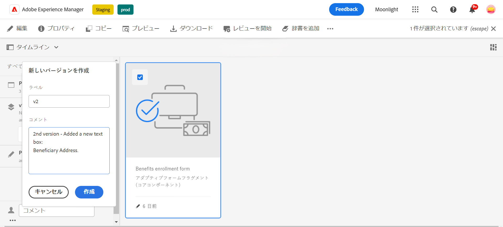
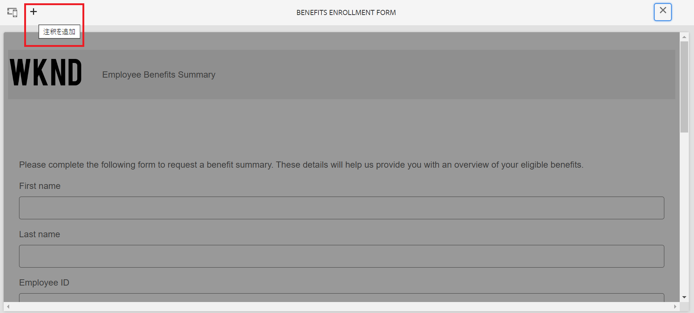

# アダプティブフォームのバージョン管理、レビューおよびコメント

<!--Before you can use versionings, comments, and annotations in an Adaptive Form, you must ensure you have [enabled Adaptive Form Core Components](
https://experienceleague.adobe.com/en/docs/experience-manager-cloud-service/content/forms/setup-configure-migrate/enable-adaptive-forms-core-components).-->

<!--Adaptive Form Core Components facilitates to add versionings, comments, and annotations to a form. These features helps form authors and users to enhance the form development process where they can create multiple versions of a form, collaborate and add their comments to a form, and add annotations to form components.-->

これはプレリリース機能で、[プレリリースチャネル](https://experienceleague.adobe.com/docs/experience-manager-cloud-service/content/release-notes/prerelease.html?lang=ja#new-features)を通してアクセスできます。

アダプティブフォームのコアコンポーネントは、フォーム作成者がバージョン管理、コメントおよび注釈をフォームに組み込むことができる機能を提供します。これらの機能を使用すると、ユーザーはフォームの複数のバージョンを作成および管理し、コメントを通じて共同作業でディスカッションを行い、特定のフォームコンポーネントに注釈を添付できることで、フォーム開発プロセスが効率化され、フォーム作成全体のエクスペリエンスが向上します。

## アダプティブフォームのバージョン管理 {#adaptive-form-versioning}

アダプティブフォームのバージョン管理は、フォームにバージョンを追加するのに役立ちます。フォーム作成者は、フォームの複数のバージョンを簡単に作成し、最終的にビジネス目標に適したバージョンを使用できます。さらに、フォームユーザーは、フォームを以前のバージョンに戻すこともできます。また、作成者は、フォームの 2 つのバージョンをプレビューして比較することが容易になるので、UI の観点からフォームをより適切に分析できます。各アダプティブフォームのバージョン管理機能について詳しく見ていきましょう。

### フォームのバージョンの作成 {#create-a-form-version}

フォームのバージョンを作成するには、次の手順に従います。

1. フォームを作成するか、既存のフォームを使用します。
1. AEM UI で、**[!UICONTROL フォーム]**／**[!UICONTROL フォームとドキュメント]**&#x200B;に移動し、**フォーム**&#x200B;を選択します。
1. 左側のパネルの選択ドロップダウンで、「**[!UICONTROL バージョン]**」を選択します。
   
1. 左下のパネルにある **3 つのドット**&#x200B;をクリックし、「**[!UICONTROL バージョンとして保存]**」をクリックします。
1. ここで、フォームのバージョンにラベルを指定し、コメントを通じてフォームに関する情報を提供できます。
   

### フォームのバージョンの更新 {#update-a-form-version}

アダプティブフォームを編集および更新する際に、新しいバージョンをフォームに追加します。最後の節で示した手順に従って、画像に示すようにフォームの新しいバージョンに名前を付けます。

### フォームのバージョンを元に戻す {#revert-a-form-version}

フォームのバージョンを以前のバージョンに戻すには、フォームのバージョンを選択し、「**[!UICONTROL このバージョンに戻る]**」をクリックします。

### フォームのバージョンの比較 {#compare-form-versions}

フォーム作成者は、プレビュー目的で 2 つの異なるバージョンのフォームを比較できます。バージョンを比較するには、フォームのバージョンを選択し、「**[!UICONTROL 現在のバージョンと比較]**」をクリックします。プレビューモードで 2 つの異なるフォームのバージョンが表示されます。

## コメントの追加 {#add-comments}

レビューとは、1 人以上のレビュー担当者に対してフォームへのコメントを許可するメカニズムです。フォームユーザーは誰でもフォームにコメントしたり、コメントを通じてフォームをレビューしたりできます。フォームにコメントするには、「**[!UICONTROL フォーム]**」を選択し、フォームに&#x200B;**[!UICONTROL コメント]**&#x200B;を追加します。

>[!NOTE]
> 上記で説明したように、アダプティブフォームのコアコンポーネントでコメントを使用すると、フォーム機能の[フォームへのレビューの作成と管理](/help/forms/create-reviews-forms.md)が無効になります。

## 注釈の追加 {#adaptive-form-annotations}

多くの場合、フォームグループのユーザーは、レビューの目的で、例えば、フォームの特定のタブやフォームのコンポーネントに注釈を追加する必要があります。このような場合、作成者は注釈を使用できます。フォームに注釈を追加するには、次の手順を実行します。

1. **[!UICONTROL 編集]**&#x200B;モードでフォームを開きます。

1. 画像に示すように、右上のパネルにある&#x200B;**追加アイコン**をクリックします。
   

1. 画像に示すように、左上のパネルにある&#x200B;**追加アイコン**をクリックして、注釈を追加します。
   

1. これで、コメントを追加したり、複数のカラーでスケッチを描画してフォームコンポーネントを作成したりできます。

1. フォームに追加したすべての注釈を表示するには、フォームを選択すると、画像に示すように、左側のパネルに追加した注釈が表示されます。

   

## 関連トピック {#see-also}

{{see-also}}
