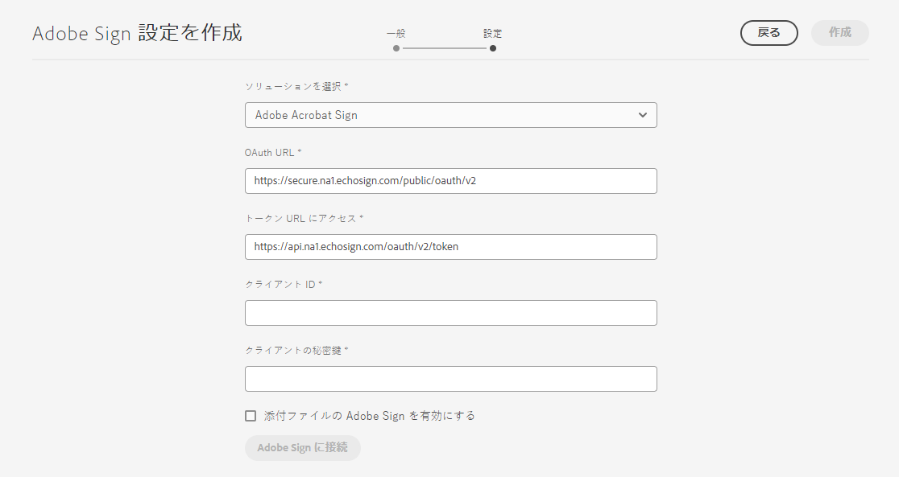
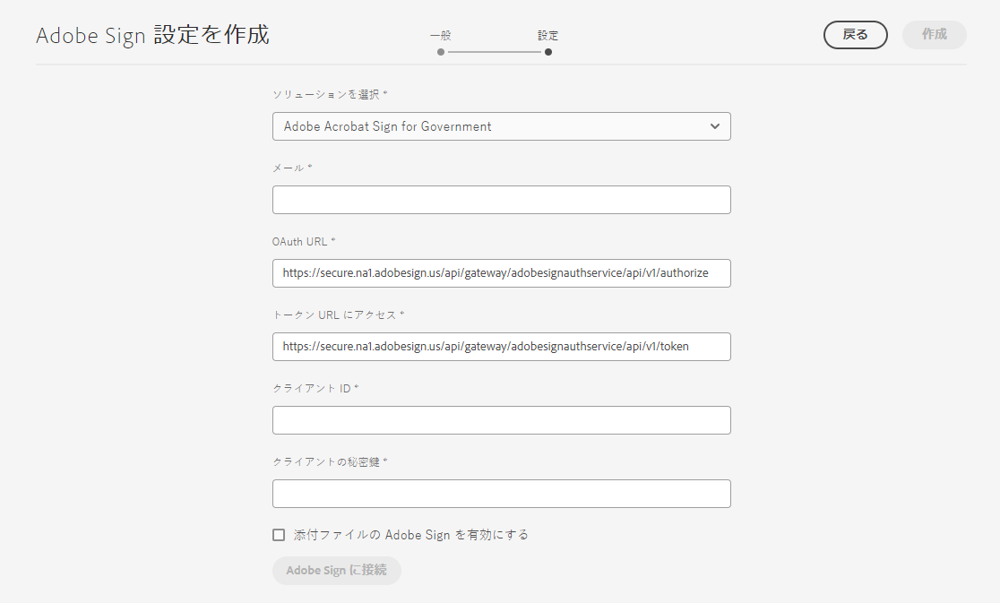

# [!DNL AEM Forms] as a Cloud Service と [!DNL Adobe Acrobat Sign] の接続 {#integrate-adobe-sign-with-aem-forms}

| バージョン | 記事リンク |
| -------- | ---------------------------- |
| AEM 6.5 | [ここをクリックしてください](https://experienceleague.adobe.com/docs/experience-manager-65/forms/adaptive-forms-advanced-authoring/template-editor.html?lang=ja) |
| AEM as a Cloud Service | この記事 |

[!DNL Adobe Acrobat Sign] により、アダプティブフォームや AEM ワークフローの電子サインワークフローを有効にできます。電子サインを使用すると、法務、販売、給与、人事管理など、様々な分野におけるドキュメント処理ワークフローが改善されます。

[!DNL Adobe Acrobat Sign] とアダプティブフォームの一般的なシナリオでは、ユーザーがアダプティブフォームに入力してサービスを申し込みます。例えば、クレジットカードの申込フォームや住民サービスフォームなどです。ユーザーが申込フォームの入力、送信、署名を行うと、追加のアクションのためにサービスプロバイダーにそのフォームが送信されます。サービスプロバイダーは受信した申込フォームを確認し、[!DNL Adobe Acrobat Sign] を使用して申請を承認します。AEM Forms は、Adobe Acrobat Sign および Adobe Acrobat Sign Solutions for Government の両方をサポートしています。ライセンスと要件に応じて、次のいずれかのソリューションと AEM Forms を統合または接続できます。

* [AEM Forms と Adobe Acrobat Sign の接続](#adobe-sign)
* [AEM Forms と Adobe Acrobat Sign Solutions for Government を接続](#adobe-acrobat-sign-for-government)

## AEM Forms と Adobe Acrobat Sign の接続 {#adobe-sign}

**[!DNL AEM Forms]** と **[!DNL Adobe Acrobat Sign]** を接続するには、前提条件セクションに示すソフトウェアとアカウントを設定して、Forms as a Cloud Service のオーサーインスタンスとパブリッシュインスタンスで Adobe Sign Cloud Service を設定します。

### AEM Forms と Adobe Acrobat Sign を接続するための前提条件 {#prerequisites-for-adobe-sign}

[!DNL Adobe Acrobat Sign] を [!DNL AEM Forms] に統合するには、以下の設定が必要になります。

1. 有効な [Adobe Acrobat Sign デベロッパーアカウント](https://acrobat.adobe.com/jp/ja/sign/developer-form.html)。
1. [Adobe Acrobat Sign API アプリケーション](https://www.adobe.io/apis/documentcloud/sign/docs.html#!adobedocs/adobe-sign/master/gstarted/create_app.md)。
1. [!DNL Adobe Acrobat Sign] API アプリケーションの資格情報（クライアント ID およびクライアントの秘密鍵）。
1. （行政 ID に基づいた認証の場合のみ）行政 ID 認証による[認証方法を有効にします](https://helpx.adobe.com/jp/sign/using/adobesign-authentication-government-id.html#AuditReport)。

### AEM Forms のオーサーインスタンスおよびパブリッシュインスタンスと Adobe Acrobat Sign の接続 {#configure-adobe-sign-with-aem-forms}

上記の前提条件の準備が完了したら、以下の手順により、オーサーインスタンス上の [!DNL AEM Forms] を使用して [!DNL Adobe Acrobat Sign] を設定します。

1. AEM Forms のオーサーインスタンスで、**[!UICONTROL ツール]** ／**[!UICONTROL 一般]**／**[!UICONTROL 設定ブラウザー]**&#x200B;に移動します。
1. **[!UICONTROL 設定ブラウザー]**&#x200B;ページで「**[!UICONTROL 作成]**」を設定します。
1. **[!UICONTROL 設定を作成]**&#x200B;ダイアログで、設定の&#x200B;**[!UICONTROL タイトル]**&#x200B;を指定し、「**[!UICONTROL クラウド設定]**」を有効にして「**[!UICONTROL 作成]**」を選択します。これにより、Cloud Services 用の設定コンテナが作成されます。フォルダー名にスペースが含まれていないことを確認します。
1. **[!UICONTROL ツール]**／**[!UICONTROL Cloud Services]**／**[!UICONTROL Adobe Acrobat Sign]** に移動し、上記の手順で作成した設定コンテナを開きます。

   >[!NOTE]
   >
   >アダプティブフォームを作成する際に、**[!UICONTROL 設定コンテナ]**&#x200B;フィールドにコンテナ名を指定します。

1. 設定ページで「**[!UICONTROL 作成]**」を選択して、AEM Forms 内に [!DNL Adobe Acrobat Sign] の設定を作成します。
1. **[!UICONTROL Adobe Acrobat Sign 設定を作成]**&#x200B;ページの「**[!UICONTROL 一般]**」タブで、設定の&#x200B;**[!UICONTROL 名前]**&#x200B;を指定して「**[!UICONTROL 次へ]**」を選択します。必要に応じて&#x200B;**[!UICONTROL タイトル]**&#x200B;を指定し、設定の&#x200B;**[!UICONTROL サムネ―ル]**&#x200B;を参照して選択することもできます。

1. これで、**[!UICONTROL ソリューションを選択]**&#x200B;して、[!DNL Adobe Acrobat Sign] を選択できます。

   <!---->
   

<!--

[create URL](#create-a-redirect-url-for-your-aem-instance)
 -->

1. 現在のブラウザーウィンドウに存在する URL をメモ帳にコピーし、URL から `/ui#/aem` の部分を削除します。この修正した URL は、後の手順で [!DNL Adobe Acrobat Sign] アプリケーションと [!DNL AEM Forms] を設定する際に必要です。「**[!UICONTROL 次へ]**」を選択します。

1. 「**[!UICONTROL 設定]**」タブで、
   * 「**[!UICONTROL OAuth URL]**」フィールドには、Adobe Sign データベースシャードを含むデフォルトの URL が含まれます。URL の形式は次の通りです。

     `https://<shard>/public/oauth/v2`

     次に例を示します。
     `https://secure.na1.echosign.com/public/oauth/v2`

   * **[!UICONTROL トークン URL にアクセス]** フィールドには、Adobe Sign データベースシャードを含むデフォルトの URL が含まれます。URL の形式は次の通りです。

     `https://<shard>/oauth/v2/token`

     次に例を示します。
     `https://api.na1.echosign.com/oauth/v2/token`

   各パラメーターの意味は次のとおりです。

   **na1** は、デフォルトのデータベースシャードを参照します。データベースシャードの値を更新することができます。[!DNL &#x200B; Adobe Acrobat Sign] クラウド設定で、[正しいシャード](https://helpx.adobe.com/jp/sign/using/identify-account-shard.html)をポイントしていることを確認します。

   >[!NOTE]
   >
   >* **Adobe Acrobat Sign 設定を作成**&#x200B;ページを開いたままにします。閉じないでください。 **クライアント ID** および&#x200B;**クライアント秘密鍵**&#x200B;は、以降の手順で説明するように、[!DNL Adobe Acrobat Sign] アプリケーションの OAuth 設定を行った後に取得できます。
   > * Adobe Sign アカウントにログインした後、**[!UICONTROL Acrobat Sign API]**／**[!UICONTROL API 情報]**／**[!UICONTROL REST API メソッドのドキュメント]**／**[!UICONTROL OAuth アクセストークン]**&#x200B;に移動して、Adobe Sign OAuth URL およびアクセストークン URL に関連する情報にアクセスします。

1. 以下の手順により、[!DNL Adobe Acrobat Sign] アプリケーション用に OAuth 設定を構成します。

   1. ブラウザーウィンドウを開き、[!DNL Adobe Acrobat Sign] 開発者アカウントにログインします。
   1. [!DNL AEM Forms] 用に設定されているアプリケーションを選択し、「**[!UICONTROL アプリケーションの OAuth を設定]**」を選択します。
   1. 前述の手順（手順 8）でコピーした URL を「**[!UICONTROL リダイレクト URL]**」ボックスに追加して「**[!UICONTROL 保存]**」をクリックします。
   1. [!DNL Adobe Acrobat Sign] アプリケーションに対して以下の範囲を有効にして、「**[!UICONTROL 保存]**」をクリックします。

   * [!DNL aggrement_read]
   * [!DNL aggrement_write]
   * [!DNL aggrement_send]
   * [!DNL widget_read]
   * [!DNL widget_write]
   * [!DNL workflow_read]

   >[!NOTE]
   > 手順 12 で示したように、スコープ修飾子を `self` から `account` にAEM UI から直接変更できます。

   [!DNL Adobe Acrobat Sign] アプリケーション用に OAuth 設定を構成してキーを取得するための詳しい手順については、開発者用ドキュメントの[アプリケーション用に OAuth 設定を構成する](https://www.adobe.io/apis/documentcloud/sign/docs.html#!adobedocs/adobe-sign/master/gstarted/configure_oauth.md)を参照してください。

   

1. **[!UICONTROL Adobe Acrobat Sign 設定を作成]**&#x200B;ページに戻ります。「**[!UICONTROL 設定]**」タブで、「**[!UICONTROL クライアント ID]**（アプリケーション ID）と&#x200B;**[!UICONTROL クライアントシークレット]**」の値を指定します。前述の手順で作成した [Adobe Acrobat Sign アプリケーションのクライアント ID とクライアントシークレット](https://opensource.adobe.com/acrobat-sign/developer_guide/helloworld.html#get-the-app-id-and-secret)を使用します。

1. [!UICONTROL &#x200B; 認証範囲 &#x200B;] セクションでは、必要に応じてプレフィックス「self」または「account」を範囲に追加することで、範囲を「account」または「self」に変更できます。
   

1. 「**[!UICONTROL 添付ファイルの Adobe Acrobat Sign を有効にする]**」オプションを選択すると、アダプティブフォームに添付されているファイルが、署名用に送信された対応する [!DNL Adobe Acrobat Sign] ドキュメントに添付されます。

1. 「**[!UICONTROL Adobe Acrobat Sign に接続]**」を選択します。資格情報の入力画面が表示されたら、[!DNL Adobe Acrobat Sign] アプリケーションの作成時に使用した&#x200B;**ユーザー名**&#x200B;と&#x200B;**パスワード**&#x200B;を入力します。`your developer account` へのアクセスを確認するメッセージが表示されたら、「**[!UICONTROL アクセスを許可]**」をクリックします。資格情報が正しく、[!DNL AEM Forms] が [!DNL Adobe Acrobat Sign] 開発者アカウントにアクセスできるようにした場合は、次のような成功メッセージが表示されます。

   

1. 「**[!UICONTROL 作成]**」を選択して、[!DNL Adobe Acrobat Sign] 設定を作成します。

1. 設定を選択し、「**[!UICONTROL 公開]**」をクリックします&#x200B;**[!UICONTROL 。]**&#x200B;これにより、対応するパブリッシュ環境に設定が複製されます。

1. 開発者、ステージ、実稼働用のインスタンス（残っているいずれか）で上記の手順をすべて繰り返し、お使いの環境用に [!DNL Adobe Acrobat Sign] を [!DNL AEM Forms] で設定する作業を完了します。

これで、[アダプティブフォームに Adobe Acrobat Sign フィールドを追加する機能を使用](working-with-adobe-sign.md)できるようになりました。[!DNL Adobe Acrobat Sign] 用に有効化するすべてのアダプティブフォームに、Cloud Service に使用する設定コンテナを追加してください。設定コンテナは、アダプティブフォームのプロパティから指定できます。

>[!NOTE]
>
> Adobe Sign サンドボックスを設定するには、[Adobe Sign](#adobe-sign) で説明した手順と同じ設定手順に従います。

#### トラブルシューティング {#resolve-config-error}

[!DNL Adobe Acrobat Sign] を [!DNL AEM Forms] と接続すると、次の画像に示すように、「`Unable to authorize access because the client configuration is invalid: invalid_request`」というエラーが発生します。これを解決するには、下記の手順に従います。


1. 現在のブラウザーウィンドウに存在する URL をメモ帳にコピーし、URL から `/ui#/aem` の部分を削除します。
1. ブラウザーウィンドウを開き、[!DNL Adobe Acrobat Sign] 開発者アカウントにログインします。
1. [!DNL AEM Forms] 用に設定されているアプリケーションを選択し、「**[!UICONTROL アプリケーションの OAuth を設定]**」を選択します。
1. 上記の手順でコピーした URL を「**[!UICONTROL リダイレクト URL]**」ボックスに追加して「**[!UICONTROL 保存]**」をクリックします。

## AEM Forms と Adobe Acrobat Sign Solutions for Government を接続 {#adobe-acrobat-sign-for-government}

AEM Forms と Adobe Acrobat Sign Solutions for Government の接続は、複数の手順で構成されます。以下が含まれます。

* AEM インスタンスのリダイレクト URL の作成
* リダイレクト URL とスコープを Adobe Sign Solutions for Government チームと共有
* Adobe Sign チームからの資格情報の受信
* 受け取った資格情報を使用して AEM Forms を Adobe Acrobat Sign Solutions for Government と接続


AEM Formsas a Cloud Service は、開発環境、ステージ環境、実稼動環境を提供します。まずは開発環境を Adobe Acrobat Sign Solutions for Government に接続し、後でステージ環境と運用環境に接続することができます。

### 事前準備 {#prerequisites-for-adobe-sign-for-acrobat-sign-for-government}

AEM Forms と Adobe Acrobat Sign Solution の接続を開始する前に、[Adobe Acrobat Sign Solutions for Government](https://opensource.adobe.com/acrobat-sign/signgov/gstarted.html#account-provisioning) アカウントがプロビジョニングされていることを確認してください。


### AEM Forms as a Cloud Service を Adobe Acrobat Sign Solutions for Government に接続 {#connect-adobe-acrobat-sign-for-government}

#### AEM インスタンスのリダイレクト URL を作成

1. Forms as a Cloud Service のオーサーインスタンスで、**[!UICONTROL ツール]**／**[!UICONTROL 一般]**／**[!UICONTROL 設定ブラウザー]**&#x200B;に移動します。
1. **[!UICONTROL 設定ブラウザー]**&#x200B;ページで「**[!UICONTROL 作成]**」を選択します。
1. **[!UICONTROL 設定を作成]**&#x200B;ダイアログで、設定の&#x200B;**[!UICONTROL タイトル]**&#x200B;を指定し、「**[!UICONTROL クラウド設定]**」を有効にして「**[!UICONTROL 作成]**」を選択します。これにより、Cloud Services 用の設定コンテナが作成されます。フォルダー名にスペースが含まれていないことを確認します。
1. **[!UICONTROL ツール]**／**[!UICONTROL Cloud Services]**／**[!UICONTROL Adobe Acrobat Sign]** に移動し、上記の手順で作成した設定コンテナを開きます。アダプティブフォームを作成する際に、「**[!UICONTROL 設定コンテナ]**」フィールドにコンテナ名を指定します。
1. 設定ページで「**[!UICONTROL 作成]**」を選択して、AEM Forms 内に [!DNL Adobe Acrobat Sign] の設定を作成します。
1. 現在のブラウザーウィンドウの URL をメモ帳にコピーし、URL から `/ui#/aem` を削除します。この URL は `re-direct URL` と呼ばれます。
次のセクションでは、`re-direct URL` と `Scopes` を Adobe Sign チームと共有し、認証情報（クライアント ID とクライアントシークレット）を要求します。

#### リダイレクト URL とスコープを Adobe Sign チームと共有し、資格情報を受け取る

Adobe Acrobat Sign for Government Solutions チームには、AEM Forms と Adobe Acrobat Sign Solutions for Government との接続を可能にする資格情報（クライアント ID とクライアントの秘密鍵）を生成するために、Adobe Acrobat Sign アプリケーション（下記）で `re-direct URL` および特定のスコープを有効にする必要があります。

前の節の最後の手順で作成して書き留めた `scopes`（下記）と `re-direct URL` を、Adobe Acrobat Sign for Government Solution 担当者（[Adobe Professional Services チームメンバー](https://opensource.adobe.com/acrobat-sign/signgov/gstarted.html#password)）と共有します。

**_スコープ_**

* [!DNL aggrement_read]
* [!DNL aggrement_write]
* [!DNL aggrement_send]
* [!DNL widget_read]
* [!DNL widget_write]
* [!DNL workflow_read]
* [!DNL offline_access]

担当者が資格情報を生成し、共有します。次の節では、資格情報（クライアント ID とクライアントの秘密鍵）を使用して、AEM Forms を Adobe Acrobat Sign Solutions for Government に接続します。

#### 受け取った資格情報を使用して、AEM Forms を Adobe Acrobat Sign Solutions for Government に接続する

1. ブラウザーで `re-direct URL` を開きます。「[AEM インスタンスにリダイレクト URL を作成](#create-a-redirect-url-for-your-aem-instance)」セクションの最後の手順で `re-direct URL` を作成し、書き留めました。

1. **[!UICONTROL Adobe Sign 設定を作成]**&#x200B;ページの「**[!UICONTROL 一般]**」タブで、設定の&#x200B;**[!UICONTROL 名前]**&#x200B;を指定して「**[!UICONTROL 次へ]**」を選択します。必要に応じて&#x200B;**[!UICONTROL タイトル]**&#x200B;を指定し、設定の&#x200B;**[!UICONTROL サムネ―ル]**&#x200B;を参照して選択することもできます。「**[!UICONTROL 次へ]**」をクリックします。

1. **[!UICONTROL Adobe Sign 設定を作成]**&#x200B;ページの「**[!UICONTROL 設定]**」タブの、「**[!UICONTROL ソリューションを選択]**」オプションで、[!DNL Adobe Acrobat Sign Solutions for Government] を選択します。


   

1. 「**[!UICONTROL メール]**」フィールドで、Adobe Acrobat Sign Solutions for Government アカウントに関連付けられたメールアドレスを指定します。

1. 「**[!UICONTROL 設定]**」タブで、
   * 「**[!UICONTROL OAuth URL]**」フィールドには、Adobe Sign データベースシャードを含むデフォルトの URL が含まれます。URL の形式は次の通りです。

     `https://<shard>/api/gateway/adobesignauthservice/api/v1/authorize`

     次に例を示します。
     `https://secure.na1.adobesign.us/api/gateway/adobesignauthservice/api/v1/authorize`

   * **[!UICONTROL トークン URL にアクセス]** フィールドには、Adobe Sign データベースシャードを含むデフォルトの URL が含まれます。URL の形式は次の通りです。

     `https://<shard>/api/gateway/adobesignauthservice/api/v1/token`

     次に例を示します。
     `https://secure.na1.adobesign.us/api/gateway/adobesignauthservice/api/v1/token`

   各パラメーターの意味は次のとおりです。

   **na1** は、デフォルトのデータベースシャードを参照します。データベースシャードの値を更新することができます。[!DNL &#x200B; Adobe Acrobat Sign] クラウド設定で、[正しいシャード](https://helpx.adobe.com/jp/sign/using/identify-account-shard.html)をポイントしていることを確認します。

   >[!NOTE]
   >
   > * Adobe Sign アカウントにログインした後、**[!UICONTROL Acrobat Sign API]**／**[!UICONTROL API 情報]**／**[!UICONTROL REST API メソッドのドキュメント]**／**[!UICONTROL OAuth アクセストークン]**&#x200B;に移動して、Adobe Sign oAuth URL とアクセストークン URL に関連する情報にアクセスします。

1. 前の節で、Adobe Acrobat Sign for Government Solution 担当者（[Adobe Professional Services チームメンバー]）が共有した資格情報を [**[!UICONTROL クライアント ID]** と&#x200B;**[!UICONTROL クライアントの秘密鍵]**] として使用します。

1. 「**[!UICONTROL 添付ファイルの Adobe Acrobat Sign を有効にする]**」オプションを選択すると、アダプティブフォームに添付されているファイルが、署名用に送信された対応する [!DNL Adobe Acrobat Sign] ドキュメントに添付されます。

1. 「**[!UICONTROL Adobe Sign に接続]**」を選択します。資格情報の入力画面が表示されたら、[!DNL Adobe Acrobat Sign] アプリケーションの作成時に使用したユーザー名とパスワードを入力します。`your developer account` へのアクセスを確認するメッセージが表示されたら、「**[!UICONTROL アクセスを許可]**」をクリックします。資格情報が正しく、[!DNL AEM Forms] が [!DNL Adobe Acrobat Sign] 開発者アカウントにアクセスできるようにした場合は、次のような成功メッセージが表示されます。

   

   <!-- > When prompted for credentials, provide username and password of the account used while creating [!DNL Adobe Acrobat Sign] application. When asked to confirm access for `your developer account`, Click **[!UICONTROL Allow Access]**. -->

1. 「**[!UICONTROL 作成]**」を選択して、設定を作成します。

1. 設定を選択し、「**[!UICONTROL 公開]**」をクリックします&#x200B;**[!UICONTROL 。]**&#x200B;これにより、対応するパブリッシュ環境に設定が複製されます。

1. 開発者、ステージ、実稼動用のインスタンス（残っているいずれか）で上記の手順をすべて繰り返し、お使いの環境用に [!DNL Adobe Acrobat Sign Solutions for Government] を [!DNL AEM Forms] で設定する作業を完了します。

[アダプティブフォーム](working-with-adobe-sign.md)または [AEM ワークフロー](/help/forms/aem-forms-workflow-step-reference.md#sign-document-step-sign-document-step)に Adobe Acrobat Sign フィールドを追加できるようになりました。[!DNL Adobe Acrobat Sign] に対して有効化するすべてのアダプティブフォームに、クラウドサービス設定に使用する設定コンテナを必ず追加してください。設定コンテナは、アダプティブフォームのプロパティから指定できます。

## [!DNL Adobe Acrobat Sign] スケジューラーを設定して署名ステータスを同期する {#configure-adobe-sign-scheduler-to-sync-the-signing-status}

AEM Forms as a Cloud Service では、定義された間隔で署名者のステータスを確認するスケジューラーサービスを提供します。スケジューラーサービスを設定するシナリオを以下に示します。

* 「[フォームを送信（すべての受信者が署名行為を完了した後）](/help/forms/working-with-adobe-sign.md#select-adobe-sign-cloud-service-and-signing-order)」を使用してドキュメントに署名した場合、フォームはすべての署名者がフォームに署名した後にのみ送信されます。
* 「[AEM ワークフローの署名ステップ](/help/forms/aem-forms-workflow-step-reference.md#sign-document-step)」を使用してドキュメントに署名した場合、署名ステップは、すべての署名者がドキュメントに署名するのを待ってから、ワークフローの次のステップに進みます。

デフォルトでは、[!DNL Adobe Acrobat Sign] スケジューラーサービスは、24 時間ごとに署名者の応答を確認（ポーリング）します。現在の環境に合わせて、このデフォルト値を変更することができます。

デフォルトの間隔を変更するには、**Adobe Acrobat Sign 設定サービス**&#x200B;の設定の **sign.status.exp** プロパティに [cron 式](https://en.wikipedia.org/wiki/Cron#CRON_expression)を指定します。

例えば、毎日午前 0 時に設定サービスを実行するには、**Adobe Acrobat Sign 設定サービス**&#x200B;設定の **sign.status.exp** プロパティを `0 0 0 1/1 * ? *` に指定します。次の JSON ファイルに、設定サービスを毎日午前 0 時に実行するサンプルを示します。

```json
{
  "sign.status.exp":"0 0 0 1/1 * ? *"
}
```

設定の値をセットするには、[AEM SDK を使用して OSGi 設定を生成](https://experienceleague.adobe.com/docs/experience-manager-cloud-service/implementing/deploying/configuring-osgi.html?lang=ja#generating-osgi-configurations-using-the-aem-sdk-quickstart)し、Cloud Service インスタンスに[設定をデプロイ](https://experienceleague.adobe.com/docs/experience-manager-cloud-service/implementing/using-cloud-manager/deploy-code.html?lang=ja#deployment-process)します。

## よくある質問

* **Q:iframe でAdobe Sign GovCloud Signature ページをレンダリングできますか？**
* **A:** はい。iframe でAdobe Sign GovCloud Signature ページをレンダリングできます。

>[!MORELIKETHIS]
>
>* [手書き署名を使用したフォームの E 署名](/help/forms/signing-forms-using-scribble.md)
>* [アダプティブフォームでの Adobe Acrobat Sign 使用に関するベストプラクティス](https://medium.com/adobetech/using-adobe-sign-to-e-sign-an-adaptive-form-heres-the-best-way-to-do-it-dc3e15f9b684)
