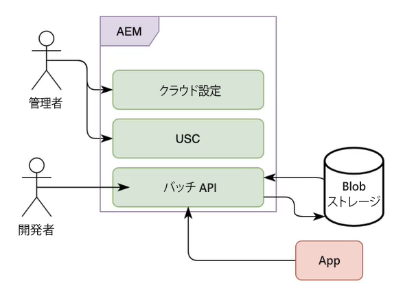

# Forms as a Cloud Service の通信バッチ処理

通信サービスでは、ビジネス通信、ドキュメント、声明書、請求処理レター、給付通知、請求処理レター、月次請求書、ウェルカムキットなど、ブランド志向でパーソナライズされたコミュニケーションを作成、組み立て、提供できます。通信 API を使用して、テンプレート（XFA または PDF）と顧客データを組み合わせ、PDF、PS、PCL、DPL、IPL、ZPL 形式のドキュメントを生成できます。

通信サービスは、オンデマンドおよびスケジュールされたドキュメント生成用に API を提供します。オンデマンドに同期 API を、スケジュールされたドキュメント生成にバッチ API（非同期 API）を使用できます。

* 同期 API は、オンデマンド、低遅延および単一レコードドキュメントを生成するユースケースに適しています。これらの API は、ユーザーアクションに基づいたユースケースにより適しています。例えば、ユーザーがフォームに入力した後にドキュメントを生成する場合などです。

* バッチ API（非同期 API）は、スケジュールに沿った高スループットの複数ドキュメント生成のユースケースに適しています。これらの API は、バッチでドキュメントを生成します。例えば、毎月生成される電話料金、クレジットカード明細、給付計算書などです。

<!-- The following skills are required to create templates and use HTTP APIs: 

* Understanding of Adobe Forms Designer or Acrobat Forms to create templates

* Understanding of HTTP APIs and experience of using HTTP APIs

* Basic understanding of Adobe Experience Manager -->

## バッチ操作 {#batch-operations}

バッチ操作とは、一連のレコードに対して、スケジュールされた間隔で類似したタイプの複数ドキュメントを生成するプロセスです。バッチ操作には、設定（定義）と実行という 2 つの部分があります。

* **設定（定義）**：バッチ設定には、生成されたドキュメントに設定する様々なアセットとプロパティに関する情報が格納されます。例えば、XDP または テンプレートに関する詳細と使用する顧客データの場所、および出力 PDF ドキュメントの様々なプロパティの指定を提供します。

* **実行**：バッチ操作を開始するには、バッチ設定名をバッチ実行 API に渡します。

### バッチ操作のコンポーネント {#components-of-a-batch-operations}

**クラウド設定**：Experience Manager クラウド設定は、顧客が所有する Microsoft Azure ストレージに Experience Manager インスタンスを接続する際に役立ちます。顧客が所有する Microsoft Azure アカウントの資格情報を指定して、そのアカウントに接続できます。

**バッチデータストア設定（USC）**：バッチデータ設定は、バッチ API 用の BLOB ストレージの特定のインスタンスを設定する場合に役立ちます。顧客が所有する Microsoft Azure BLOB ストレージ内で入力および出力の場所を指定できます。

**バッチ API**：バッチ設定を作成し、この設定に基づいてバッチを実行して、PDF または XDP テンプレートをデータと結合し、PDF、PS、PCL、DPL、IPL、ZPL 形式の出力を生成できます。通信機能は、設定管理とバッチ実行のためのバッチ API を提供します。

**ストレージ**：通信 API は、顧客が所有する Microsoft Azure クラウドストレージを使用して、顧客レコードを取得し、生成されたドキュメントを保存します。Microsoft Azure ストレージは Experience Manager Cloud Service 設定で設定します。

**アプリ**：バッチ API を使用してドキュメントを生成して使用するカスタムアプリケーション。

## バッチ操作を使用して複数のドキュメントを生成 {#generate-multiple-documents-using-batch-operations}

バッチ操作を使用すると、複数のドキュメントをスケジュールされた間隔で生成できます。

>[!VIDEO](https://video.tv.adobe.com/v/338349)

バッチ操作を使用してドキュメントを生成する方法については、ビデオを参照するか、以下の手順を実行してください。ビデオで使用されている API リファレンスドキュメントは、.yaml 形式で入手できます。[バッチ API](assets/batch-api.yaml) ファイルをダウンロードし、Postman にアップロードして API の機能を確認し、ビデオの手順に従います。

### 前提条件 {#pre-requisites}

バッチ API を使用するために必要なものは、次のとおりです。

* [Microsoft Azure ストレージアカウント](https://docs.microsoft.com/ja-jp/azure/storage/common/storage-account-create)
* PDF または XDP テンプレート
* [テンプレートと結合するデータ](#form-data)
* Experience Manager 管理者権限を持つユーザー

### 環境の設定 {#setup-your-environment}

バッチ操作を使用する前に、次の手順に従います。

* Microsoft Azure Blob ストレージへの顧客データ（XML ファイル）のアップロード
* クラウド設定の作成
* バッチデータストア設定の作成
* テンプレートおよびその他のアセットの Experience Manager Forms Cloud Service インスタンスへのアップロード

### 顧客データ（XML ファイル）の Azure ストレージへのアップロード

Microsoft Azure ストレージで、[コンテナ](https://docs.microsoft.com/ja-jp/azure/vs-azure-tools-storage-explorer-blobs)を作成し、コンテナ内の[フォルダー](https://docs.microsoft.com/ja-jp/azure/storage/blobs/storage-quickstart-blobs-portal)に[顧客データ（XML）をアップロード](https://docs.microsoft.com/ja-jp/azure/vs-azure-tools-storage-explorer-blobs#managing-blobs-in-a-blob-container)します。

>[!NOTE]
>
>Microsoft Azure ストレージを設定して、スケジュールされた間隔で、入力フォルダーを自動的に消去したり、出力フォルダーのコンテンツを別の場所に移動したりできます。ただし、フォルダーを参照するバッチ操作がまだ実行中の場合に、フォルダーが消去されないようにしてください。

### クラウド設定の作成 {#create-a-cloud-configuration}

クラウド設定によって、Experience Manager インスタンスは Microsoft Azure ストレージに接続されます。クラウド設定を作成するには：

1. ツール／クラウドサービス／Azure ストレージに移動
1. 設定をホストするフォルダーを開き、「作成」をクリックします。グローバルフォルダーを使用するか、フォルダーを作成します。
1. サービスに接続するための設定名と資格情報を指定します。[Microsoft Azure ストレージポータルからこれらの資格情報を取得](https://docs.microsoft.com/ja-jp/azure/storage/common/storage-account-keys-manage?tabs=azure-portal#view-account-access-keys)できます。
1. 「作成」をクリックします。

これで、Experience Manager インスタンスを Microsoft Azure ストレージに接続し、必要に応じてコンテンツの保存と読み取りに使用する準備が整いました。

### バッチデータストア設定の作成 {#create-batch-data-store-configuration}

バッチデータ設定は、入力および出力用のコンテナおよびフォルダーを設定する場合に役立ちます。顧客レコードをソースフォルダーに保持すると、生成されたドキュメントは出力先フォルダーに配置されます。

設定を作成するには：

1. ツール／Forms／統合ストレージコネクタに移動します。
1. 設定をホストするフォルダーを開き、「作成」をクリックします。グローバルフォルダーを使用するか、フォルダーを作成します。
1. 設定のタイトルと名前を指定します。ストレージで、「Microsoft Azure ストレージ」を選択します。
1. 「ストレージ設定のパス」で、顧客が所有する Azure ストレージアカウントの資格情報を含むクラウド設定を参照して選択します。
1. ソースフォルダーで、Azure ストレージコンテナの名前とレコードを含むフォルダーを指定します。
1. 出力先フォルダーで、Azure ストレージコンテナのパスと、生成されたドキュメントを保存するフォルダーを指定します。
1. 「作成」をクリックします。

これで、Experience Manager インスタンスが Microsoft Azure ストレージに接続され、Microsoft Azure ストレージ上の特定の場所にデータを取得して送信するように設定されました。

### テンプレートおよびその他のアセットの Experience Manager インスタンスへのアップロード {#upload-templates-and-other-assets-to-your-AEM-instance}

通常、組織には複数のテンプレートがあります。例えば、クレジットカード明細、福利厚生明細、請求申込用にそれぞれ 1 つずつテンプレートがあります。このような XDP および PDF テンプレートをすべて Experience Manager インスタンスにアップロードします。テンプレートをアップロードするには：

1. Experience Manager インスタンスを開きます。
1. フォーム／フォームとドキュメントに移動します。
1. 作成／フォルダーをクリックし、フォルダーを作成します。フォルダーを開きます。
1. 作成／ファイルをアップロードをクリックし、テンプレートをアップロードします。

## バッチ API を使用したドキュメントの生成 {#use-batch-API-to-generate-documents}

バッチ API を使用するには、バッチ設定を作成し、その設定に基づいてバッチを実行します。API ドキュメントには、バッチを作成および実行するための API、対応するパラメーター、考えられるエラーに関する情報が記載されています。[API 定義ファイル](assets/batch-api.yaml)をダウンロードし、[Postman](https://go.postman.co/home) または類似のソフトウェアにアップロードして、バッチ操作を作成および実行するための API をテストできます。

### バッチの作成 {#create-a-batch}

バッチを作成するには、 `POST /config` API を使用します。HTTP リクエストの本文に次の必須プロパティを含めます。

* **configName**：バッチの一意の名前を指定します。例：`wknd-job`
* **dataSourceConfigUri**：バッチデータストア設定の場所を指定します。設定の相対パスまたは絶対パスを指定できます。例：`/conf/global/settings/forms/usc/batch/wknd-batch`
* **outputTypes**：出力形式として PDF および PRINT を指定します。PRINT 出力タイプを使用する場合は、`printedOutputOptionsList` プロパティに、少なくとも 1 つの印刷オプションを指定します。印刷オプションはレンダリングタイプによって識別されるので、現在のところ、同じレンダリングタイプを持つ複数の印刷オプションは許可されていません。サポートされる形式は、PS、PCL、DPL、IPL および ZPL です。

* **テンプレート**：テンプレートの絶対パスまたは相対パスを指定します。例：`crx:///content/dam/formsanddocuments/wknd/statements.xdp`

相対パスを指定する場合は、コンテンツルートも指定します。コンテンツルートの詳細については、 API ドキュメントを参照してください。

<!-- For example, you include the following JSON in the body of HTTP APIs to create a batch named wknd-job: -->

`GET /config /[configName]` を使用して、バッチ設定の詳細を確認できます。

### バッチの実行 {#run-a-batch}

バッチを実行するには、`POST /config /[configName]/execution` を使用します。例えば、wknd-demo という名前のバッチを実行するには、/config/wknd-demo/execution を使用します。サーバーはリクエストを受け入れると、HTTP 応答コード 202 を返します。API はペイロードを返しません（サーバーで実行されているバッチジョブの HTTP 応答のヘッダーに含まれるユニークコード（実行識別子）を除く）。この実行識別子を使用して、バッチのステータスを取得できます。

>[!NOTE]
>
>バッチの実行中は、対応するソースおよび出力先フォルダー、データソース設定、Microsoft Azure クラウド設定に変更を加えないでください。

### バッチステータスの確認 {#status-of-a-batch}

バッチステータスを取得するには、`GET /config /[configName]/execution/[execution-identifier]` を使用します。実行識別子は、バッチ実行リクエストに対する HTTP 応答のヘッダーに含まれます。

ステータスリクエストの応答には、ステータスセクションが含まれます。バッチジョブのステータス、既にパイプラインに存在する（既に読み取られ、処理中の）レコード数、各 outputType／renderType のステータス（処理中、成功、失敗した項目の数）に関する詳細が提供されます。ステータスには、バッチジョブの開始時刻と終了時刻、およびエラーに関する情報（存在する場合）も含まれます。終了時刻は、バッチ実行が実際に完了する時刻 -1 です。

>[!NOTE]
>
>* 複数の PRINT 形式を要求する場合、ステータスには複数のエントリが含まれます。例えば、PRINT/ZPL、PRINT/IPL などです。
>* バッチジョブは、すべてのレコードを同時に読み取るわけではなく、ジョブはレコードを継続的に読み取り、レコード数を増分していきます。したがって、すべてのレコードが読み取られるまで、ステータスは -1 を返します。

### 生成されたドキュメントの表示 {#view-generated-documents}

ジョブの完了時に、生成されたドキュメントがバッチデータストア設定で指定した出力先にある `success` フォルダーに保存されます。エラーが発生した場合、サービスは `failure` フォルダーを作成します。エラーのタイプと理由に関する情報が提供されます。

次の例を参考にして説明します。入力データファイル `record1.xml` と 2 つの出力タイプ `PDF` と `PCL` があるとします。次に、宛先の場所には 2 つのサブフォルダー `pdf` と `pcl`（出力タイプごとに 1 つ）が含まれます。PDF の生成が成功したとすると、`pdf` サブフォルダーに `success` サブフォルダーが含まれ、そのサブフォルダーには実際に生成された PDF ドキュメント `record1.pdf` が含まれます。PCL の生成が失敗したとすると、`pcl` サブフォルダーに `failure` サブフォルダーが含まれ、そのサブフォルダーにはエラーファイル `record1.error.txt` が含まれます。このエラーファイルにはエラーの詳細が含まれます。さらに、宛先の場所には `__tmp__` という一時フォルダーが含まれ、バッチ実行時に必要な特定のファイルを格納します。宛先フォルダーを参照するアクティブなバッチ実行がない場合は、このフォルダーを削除できます。

>[!NOTE]
>
>バッチの処理は、入力レコードの数とテンプレートの複雑さに応じて、時間がかかる場合があります。数分待ってから、出力ファイルの保存先フォルダーを確認してください。

## API リファレンスドキュメント

API から提供されるすべてのパラメーター、認証方法および各種サービスの詳細については、API リファレンスドキュメントを参照してください。API リファレンスドキュメントは、.yaml 形式で入手できます。[バッチ API](assets/batch-api.yaml) ファイルをダウンロードし、postman にアップロードして API の機能を確認できます。

>[!MORELIKETHIS]
>
>* [AEM Forms as a Cloud Service の概要](/help/forms/aem-forms-cloud-service-communications-introduction.md)
>* [アダプティブフォームおよび通信 API 用のAEM Forms as a Cloud Service アーキテクチャ](/help/forms/aem-forms-cloud-service-architecture.md)
>* [通信処理 - 同期 API](/help/forms/aem-forms-cloud-service-communications.md)
>* [通信処理 - バッチ API](/help/forms/aem-forms-cloud-service-communications-batch-processing.md)