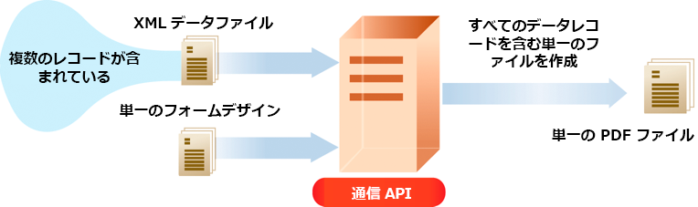

# AEM Forms as a Cloud Service 通信 API {#frequently-asked-questions}

| バージョン | 記事リンク |
| -------- | ---------------------------- |
| AEM 6.5 | [ここをクリックしてください](https://experienceleague.adobe.com/docs/experience-manager-65/forms/use-document-services/overview-aem-document-services.html) |
| AEM as a Cloud Service | この記事 |

通信機能は、ビジネス文書、ステートメント、請求処理レター、特典通知、毎月の請求書、ウェルカムキットなど、ブランド承認済みのパーソナライズされた標準的なドキュメントを作成するのに役立ちます。

この機能には、ドキュメントを生成および操作するための API が用意されています。オンデマンドでドキュメントを生成または操作することも、バッチジョブを作成して、定義された間隔で複数のドキュメントを生成することもできます。通信 API は以下を提供します。

* 効率化されたオンデマンドおよびバッチドキュメント生成機能。

* PDF ドキュメントをオンデマンドで結合、並べ替えおよび検証する機能。

* 外部システムとの統合を容易にする HTTP API。オンデマンド操作（低遅延）用とバッチ操作（高スループット操作）用に別々の API が含まれています。

* データへのセキュリティで保護されたアクセス。通信 API は、顧客が指定したデータリポジトリにのみ接続してデータにアクセスするので、通信の安全性が高くなります。

API から提供されるすべてのパラメーター、認証方法および各種サービスの詳細については、[API リファレンスドキュメント](https://developer.adobe.com/experience-cloud/experience-manager-apis/api/experimental/document/)を参照してください。API リファレンスドキュメントは、.yaml 形式でも入手できます。.yaml ファイルをダウンロードし、Postman にアップロードして API の機能を確認できます。

<!-- 

A credit card statement can be created using Communications APIs. This sample statement uses same template but separate data for each customer depending on their usage of credit card.

-->

## ドキュメント生成

コミュニケーションドキュメント生成 API は、テンプレート（XFA または PDF）と顧客データ（XML）を組み合わせて、PDF 形式や PS、PCL、DPL、IPL、ZPL 形式などの印刷形式でドキュメントを生成するのに役立ちます。これらの API は、[XML データ](communications-known-issues-limitations.md#form-data)を含んだ PDF および XFA テンプレートを利用して、単一のドキュメントをオンデマンドで生成したり、複数のドキュメントをバッチジョブで生成したりすることができます。

通常、[Designer](use-forms-designer.md) を使用してテンプレートを作成し、通信 API を使用してテンプレートにデータを結合します。アプリケーションは、出力ドキュメントをネットワークプリンター、ローカルプリンター、またはアーカイブ用のストレージシステムに送信できます。標準ワークフローとカスタムワークフローの例を次に示します。

ユースケースによっては、これらのドキュメントを Web サイトまたはストレージサーバーからダウンロードできるようにすることもできます。

ドキュメント生成 API の例を以下に示します。

### PDF ドキュメントの作成 {#create-pdf-documents}

ドキュメント生成 API を使用すると、フォームデザインと XML フォームデータに基づく PDF ドキュメントを作成できます。結果として出力されるのは非インタラクティブ PDF ドキュメントです。つまり、ユーザーはフォームデータの入力や変更はできません。基本ワークフローは、XML フォームデータをフォームデザインと結合して PDF ドキュメントを作成することです。次の図は、フォームデザインと XML フォームデータを結合して PDF ドキュメントを生成するところを示しています。

図：PDF ドキュメントを作成するための一般的なワークフロー

### PostScript（PS）、Printer Command Language（PCL）、Zebra Printing Language（ZPL）ドキュメントの作成 {#create-PS-PCL-ZPL-documents}

ドキュメント生成 API を使用して、XDP フォームデザインまたは PDF ドキュメントに基づく PostScript（PS）、Printer Command Language（PCL）および Zebra Printing Language（ZPL）のドキュメントを作成できます。これらの API は、フォームデザインとフォームデータを結合してドキュメントを生成します。ドキュメントをファイルに保存し、カスタムプロセスを開発してファイルをプリンターに送信することができます。

<!-- ### Processing batch data to create multiple documents

Communications APIs can create separate documents for each record within an XML batch data source. The APIs can also create a single document that contains all records (this functionality is the default). Assume that an XML data source contains ten records and you instruct the APIs to create a separate document for each record (for example, PDF documents). As a result, the APIs generate ten PDF documents.

The following illustration also shows Communications APIs processing an XML data file that contains multiple records. However, assume that you instruct the APIs to create a single PDF document that contains all data records. In this situation, the APIs generate one document that contains all the records.

The following illustration shows Communications APIs processing an XML data file that con tains multiple records. Assume that you instruct the Communications APIs to create a separate PDF document for each data record. In this situation, the APIs generates a separate PDF document for each data record.

 -->

### バッチデータの処理による複数のドキュメントの作成 {#processing-batch-data-to-create-multiple-documents}

ドキュメント生成 API を使用して、XML バッチデータソース内のレコードごとに別個のドキュメントを作成できます。ドキュメントは一括モードと非同期モードで生成できます。コンバージョンの様々なパラメーターを設定し、バッチ処理を開始できます。

<!-- You can can also create a single document that contains all records (this functionality is the default).  Assume that an XML data source contains ten records and you have a requirement to create a separate document for each record (for example, PDF documents). You can use the Communication APIs to generate ten PDF documents. -->

<!-- The following illustration shows the Communication APIs processing an XML data file that contains multiple records. However, assume that you instruct the Communication APIs to create a single PDF document that contains all data records. In this situation, the Communication APIs generate one document that contains all the records.

The following illustration shows the Communication APIs processing an XML data file that contains multiple records. Assume that you instruct the Communication APIs to create a separate PDF document for each data record. In this situation, the Communication APIs generates a separate PDF document for each data record.

For detailed information on using Batch APIs, see Communication APIs: Processing batch data to create multiple documents. 

### Flatten interactive PDF documents {#flatten-interactive-pdf-documents}

You can use document generation APIs to transform an interactive PDF document (for example, a form) to a non-interactive PDF document. An interactive PDF document lets users enter or modify data located in the PDF document fields. The process of transforming an interactive PDF document to a non-interactive PDF document is called flattening. When a PDF document is flattened, a user cannot modify the data located in the document's fields. One reason to flatten a PDF document is to ensure that data cannot be modified.

You can flatten the following types of PDF documents:

* Interactive PDF documents created in Designer (that contain XFA streams).

* Acrobat PDF forms

If you attempt to flatten a non-interactive PDF document, an exception occurs.

### Retain Form State {#retain-form-state}

An interactive PDF document contains various elements that constitute a form. These elements may include fields (to accept or display data), buttons (to trigger events), and scripts (commands to perform a specific action). Clicking a button may trigger an event that changes the state of a field. For example, choosing a gender option may change the color of a field or the appearance of the form. This is an example of a manual event causing the form state to change.

When such an interactive PDF document is flattened using the Communications APIs, the state of the form is not retained. To ensure that the state of the form is retained even after the form is flattened, set the Boolean value _retainFormState_ to True to save and retain the state of the form. -->

## ドキュメント操作

通信機能のドキュメント操作（ドキュメント変換）API は、PDF ドキュメントを組み合わせたり並べ替えたりするのに役立ちます。通常は、DDX を作成し、それをドキュメント操作 API に送信して、ドキュメントをアセンブリしたり並べ替えたりします。[DDX ドキュメント](https://helpx.adobe.com/content/dam/help/en/experience-manager/forms-cloud-service/ddxRef.pdf)には、ソースドキュメントを使用して 1 組の必要なドキュメントを生成する方法についての指示が記述されています。DDX リファレンスドキュメントは、サポートされているすべての操作に関する詳細な情報を提供します。ドキュメント操作の例を以下に示します。

### PDF ドキュメントのアセンブリ

ドキュメント操作 API を使用すると、複数の PDF または XDP ドキュメントを 1 つの PDF ドキュメントまたは PDF ポートフォリオに組み合わせることができます。次に、PDF ドキュメントのアセンブリ方法を示します。

* 単純な PDF ドキュメントのアセンブリ
* PDF ポートフォリオの作成
* 暗号化ドキュメントのアセンブリ
* ベイツナンバリングを使用したドキュメントのアセンブリ
* ドキュメントの統合およびアセンブリ

図：複数の PDF ドキュメントからの単一 PDF ドキュメントのアセンブリ

### PDF ドキュメントのディスアセンブリ

ドキュメント操作 API を使用して PDF ドキュメントを分割できます。また、ソースドキュメントからページを抽出したり、しおりの位置を境にソースドキュメントを分割することもできます。通常、このタスクは PDF ドキュメントが最初に多数の個別ドキュメント（明細書など）から作成された場合に役立ちます。

* ソースドキュメントからのページの抽出
* しおりに基づいたソースドキュメントの分割

図：しおりに基づいたソースドキュメントの複数のドキュメントへの分割

>[!NOTE]
>
> AEM Forms には、PDF ファイルとシームレスに統合できる様々な組み込みフォントが用意されています。サポートされているフォントのリストを表示するには、[こちらをクリック](/help/forms/supported-out-of-the-box-fonts.md)してください。

<!-- 

## Document utilities

Document utilities synchronous APIs helps you convert documents between PDF and XDP file formats, and query information about a PDF document. For example, you can determine whether a PDF document contains comments or attachments.

### Retrieve PDF document properties

You can [query a PDF document](https://developer.adobe.com/experience-manager-forms-cloud-service-developer-reference/references/pdf-utility-sync/#tag/Document-Extraction/) for the following information:

* Is a PDF Document: Check whether the source document is a PDF document.
* Is a fillable form: Check whether the source PDF document is a fillable form.
* Form Type: Retrieve the form type of the document.
* Check for Attachments: Check whether the source PDF document has any attachments.
* Check for Comments: Check whether the source PDF document has any review comments.
* Is a PDF Package: Check whether the document is a PDF package.
* Get the PDF Version: Retrieve the [version of the PDF document](https://en.wikipedia.org/wiki/History_of_PDF).
* Recommended Acrobat Version: Retrieve the required version of Acrobat (Reader) to open the PDF document.
* Is an XFA Document: Check whether the source PDF document is an XFA-based PDF document.
* Is Shell PDF: Check whether the source PDF document is shell PDF. A shell PDF contains only an XFA stream, font and image resources, and one page that is either blank or contains a warning that the document must be opened using Acrobat or Adobe Reader. The shell PDF is used with PDF transformation to optimize delivery of PDFForm transformations only.
* Get the XFA Version: Retrieve the [XFA Version for an XFA-based PDF document](https://en.wikipedia.org/wiki/XFA#XFA_versions).

### Convert PDF Documents into XDP Documents

The [PDF to XDP API](https://developer.adobe.com/experience-manager-forms-cloud-service-developer-reference/references/pdf-utility-sync/#tag/Document-Conversion) converts a PDF document to an XDP file. For a PDF document to be successfully converted to an XDP file, the PDF document must contain an XFA stream in the dictionary. -->

## ドキュメント抽出

ドキュメント抽出機能は、早期導入プログラムに基づいています。早期導入プログラムに参加し、機能へのアクセスをリクエストするには、公式メール ID から aem-forms-ea@adobe.com にメールを送信してください。

ドキュメント抽出サービスを使用すると、使用権限、PDF プロパティ、メタデータなど、PDF ドキュメントのプロパティを取得できます。ドキュメント抽出機能は次のとおりです。

* PDF に添付ファイル、コメント、Acrobat バージョンなどが含まれているかどうかなど、PDF ドキュメントのプロパティを取得します。
* PDF ドキュメントで有効な使用権限を抽出すると、Adobe Acrobat Reader 拡張機能のために、PDF ドキュメントに対して有効または無効になっている使用権限を取得できます。
* PDF ドキュメント内に存在するメタデータ情報を取得します。メタデータは、ドキュメントに関する情報（テキストやグラフィックなど、ドキュメントの内容と区別されるもの）です。Adobe Extensive Metadata Platform（XMP）は、ドキュメントのメタデータを処理するための標準です。XMP ユーティリティサービスを使用すると、PDF ドキュメントから XMP メタデータを取得し、XMP メタデータを PDF ドキュメントに書き出すことができます。

API が提供するすべてのパラメーター、認証方法および各種サービスについて詳しくは、[API リファレンスドキュメント](https://developer.adobe.com/experience-cloud/experience-manager-apis/api/experimental/document/)を参照してください。API リファレンスドキュメントは、.yaml 形式でも入手できます。.yaml ファイルをダウンロードし、Postman にアップロードして API の機能を確認できます。

<!--

 The XMP Utilities Service capability is under Early Adopter Program. You can write to aem-forms-ea@adobe.com from your official email id to join the early adopter program and request access to the capability. 

### XMP Utilities {#XMP-utilities}

 The XMP Utilities Service capability is under Early Adopter Program. You can write to aem-forms-ea@adobe.com from your official email id to join the early adopter program and request access to the capability. 

PDF documents contain metadata, which is information about the document (as distinguished from the contents of the document, such as text and graphics). The Adobe Extensible Metadata Platform (XMP) is a standard for handling document metadata. The XMP Utilities service can retrieve and save XMP metadata from PDF documents and import XMP metadata into PDF documents.

-->

## ドキュメントのコンバージョン

### PDF/A 準拠ドキュメントへのコンバージョンと検証

通信ドキュメント変換 API は、PDF ドキュメントを PDF/A 準拠ドキュメントにコンバージョンするのに役立ちます。API を使用すると、PDF ドキュメントを PDF/A 準拠ドキュメントにコンバージョンしたり、PDF ドキュメントが PDF/A に準拠しているかどうかを判断したりできます。PDF/A は、ドキュメントのコンテンツを長期保存するためのアーカイブ形式です。フォントはドキュメントに埋め込まれ、ファイルは非圧縮になります。その結果、通常、PDF/A ドキュメントは標準の PDF ドキュメントよりも大きくなります。なお、PDF/A ドキュメントには、オーディオおよびビデオのコンテンツは含まれません。サポートされる PDF/A 準拠標準には、PDF/A-1a、1b、2a、2b、3a、3b が含まれます。

### PDF を XDP にコンバージョン {#convert-pdf-to-xdp}

PDFを XDP にコンバージョン機能は、早期導入プログラムに基づいています。早期導入プログラムに参加し、機能へのアクセスをリクエストするには、公式メール ID から aem-forms-ea@adobe.com にメールを送信してください。

PDF ドキュメントを XDP ファイルにコンバージョンします。PDF ドキュメントを XDP ファイルに正常にコンバージョンするには、PDF ドキュメントのディクショナリ内に XFA ストリームが含まれている必要があります。

## ドキュメント保証 {#doc-assurance}

DocAssurance サービスには、以下の署名 API と暗号化 API が含まれています。

### Signature API

Signature API を使用すると、組織は配布および受信する Adobe PDF ドキュメントのセキュリティとプライバシーを保護できます。<!--This service uses digital signatures and certification to ensure that only intended recipients can alter documents. -->セキュリティ機能がドキュメント自体に適用され、ドキュメントは、ライフサイクル全体にわたって常に安全で制御されます。オフラインでダウンロードされる場合や組織に送り返される場合、ファイアウォールの範囲外でもドキュメントの安全性が保たれます。Signature API を使用して、次のタスクを実行できます。

* 表示される署名フィールドを PDF ドキュメントに追加します。
* 非表示の署名フィールドを PDF ドキュメントに追加します。
* PDF ドキュメント内の指定した署名フィールドに署名します。
* PDF ドキュメントの証明
* PDF ドキュメント内の指定した署名フィールドから署名を削除します
* PDF ドキュメントから指定した署名フィールドを削除します。

早期導入プログラムでは、PDF ドキュメントから指定した署名フィールドから署名を削除することや、指定した署名フィールドを削除することができます。早期導入プログラムに参加し、機能へのアクセスをリクエストするには、公式メール ID から aem-forms-ea@adobe.com にメールを送信してください。

<!--

### Remove Signature APIs

The Remove Signature API helps to remove an existing digital signatures from a PDF document. This API is useful when you need to update or revise a signed document and reapply signatures. It maintains document integrity while effectively clearing signatures from specific pages or the entire file. Use cases include re-signing documents with updated data or clearing previous approvals for revised versions.

### Remove Signature Field APIs

The Remove Signature Field API is tailored for removing signature fields from a PDF document. This is ideal when you need to delete empty or unused signature fields to streamline document presentation. It enables users to eliminate signature fields without impacting other form fields or the document structure, making it easier to create cleaner, final versions of a document that no longer require signatures.

-->

### 暗号化 API

暗号化 API を使用すると、ドキュメントの暗号化および復号が可能になります。ドキュメントが暗号化されると、その内容が読み取れなくなります。許可されたユーザーは、ドキュメントを復号化して、コンテンツにアクセスできます。PDF ドキュメントがパスワードで暗号化されている場合、Adobe Reader または Adobe Acrobat でドキュメントを表示するには、ユーザーはオープンパスワードを指定する必要があります。<!-- Likewise, if a PDF document is encrypted with a certificate, the user must decrypt the PDF document with the public key that corresponds to the certificate (private key) that was used to encrypt the PDF document.-->

暗号化 API を使用して、次のタスクを実行できます。

* パスワードで PDF ドキュメントを暗号化します。
* PDF ドキュメントからパスワードベースの暗号化を削除します。
* PDF ドキュメントに適用されるセキュリティのタイプを取得します。
* PDF ドキュメントに適用されたセキュリティ タイプを返します。

Signature API と Encryption API は両方とも [同期 API](#types-of-communications-apis-types) です。

### ドキュメントユーティリティ {#doc-utility}

同期 API を備えたドキュメントユーティリティは、PDF ファイル形式と XDP ファイル形式の間でドキュメントをコンバージョンするのに役立ちます。ドキュメントに使用権限を適用し、ドキュメントから有効な使用権限を抽出します。PDF ドキュメントに関する情報のクエリを実行します。<!-- determines whether a PDF document contains comments or attachments and more, and use document transformation services for XMP utilities-->使用権限 API の詳細を以下に示します。

#### 使用権限 API（Reader Extension）

使用権限 API（Reader Extension）の機能は、早期導入プログラムに基づいています。早期導入プログラムに参加し、機能へのアクセスをリクエストするには、公式のメール ID で aem-forms-ea@adobe.com までメールを送信してください。

Usage Rights の機能を使用すると、追加の使用権限を付与して Adobe Reader の機能を拡張することで、組織内でインタラクティブ PDF ドキュメントを簡単に共有できます。このサービスは Adobe Reader 7.0 以降で動作し、PDF ドキュメントに使用権限を追加します。これにより、PDF ドキュメントを Adobe Reader で開いた場合には通常使用できない機能（ドキュメントへのコメントの追加、フォームへの入力、ドキュメントの保存など）がアクティブになります。

PDF ドキュメントに適切な使用権限が追加されている場合、受信者は Adobe Reader 内で次の作業を行うことができます。

* オンラインまたはオフラインで PDF ドキュメントおよびフォームを完成させ、追加された情報を保持しつつ、記録のためにコピーをローカル保存することを受信者に対して許可する。
* PDF ドキュメントをローカルのハードドライブに保存し、元のドキュメントと追加されたコメント、データまたは添付ファイルを保持する。
* PDF ドキュメントにファイルおよびメディアクリップを添付する。
* 業界標準の公開鍵基盤（PKI）テクノロジーを使用して電子署名を適用することによって、PDF ドキュメントの署名および認証を行う。
* 入力が完了した PDF ドキュメントまたは注釈が付いた PDF ドキュメントを電子的に送信する。
* 内部データベースおよび web サービスへの直感的な開発フロントエンドとして PDF ドキュメントおよびフォームを使用する。
* レビュー担当者は直観的なマークアップツールを使用してドキュメントにコメントを追加できるよう、PDF ドキュメントを他のユーザーと共有する。使用できるツールには、電子付箋、スタンプ、ハイライト、および取り消し線が含まれます。これらと同じ機能は Acrobat でも利用できます。
* バーコードフォームのデコードをサポートします。

これらの特別な使用権限の機能は、使用権限を付与された PDF ドキュメントを Adobe Reader で開くと自動的にアクティブになります。権限を付与されたドキュメントの編集を終了すると、これらの機能は Adobe Reader で再度無効になります。ユーザーが権限を付与された別のドキュメントを受け取るまで、これらの機能は無効のままです。

#### 使用権限の有効化と無効化

PDF Reader サービスを拡張する様々な使用権限の機能を次に示します。

* **バーコードのデコード**：PDF ドキュメント内のバーコードをデコードします。

* **コメント**：PDF ドキュメントにオフラインでコメントします。

* **オンラインでコメント**：PDF ドキュメントにオンラインでコメントします。

* **デジタル署名**：PDF ドキュメントにデジタル署名を追加します。

* **動的フォームフィールド**：PDF ドキュメントにフォームフィールドを追加します。

* **動的フォームページ**：PDF ドキュメントにフォームページを追加します。

* **埋め込みファイル**：PDF ドキュメント内にファイルを埋め込みます。

* **フォームデータの読み込み**：PDF ドキュメントにフォームデータを読み込みます。

* **フォームデータの書き出し**：PDF ドキュメントにフォームデータを書き出します。

* **フォームの入力**：PDF ドキュメント内のフォームフィールドに入力します。

* **オンラインフォーム**：PDF ドキュメントから web サービスまたはデータベースにアクセスします。

* **スタンドアロンで送信**：PDF ドキュメントからフォームデータをオフラインで送信します。

#### その他の機能

* **メッセージ**：1 つ以上の使用権限が適用された PDF ドキュメントを開いた際に Adobe Acrobat Reader 内に表示されるメッセージ。
* **パスワードをロック解除**：暗号化された PDF ドキュメントを開く際に必要なパスワード。通常、これはドキュメントを開くパスワードですが、PDF ドキュメントが権限パスワードでさらに保護されている場合は、いずれかを使用して開くことができます。

## 通信 API のタイプ {#types}

通信は、オンデマンドおよびバッチでのドキュメント生成用に HTTP API を提供します。

* **[同期 API](https://developer.adobe.com/experience-manager-forms-cloud-service-developer-reference/)** は、オンデマンド、低遅延、単一レコードのドキュメント生成シナリオに適しています。これらの API は、ユーザーアクションに基づいたユースケースにより適しています。例えば、ユーザーがフォームへの入力を完了した後にドキュメントを生成するような場合です。

* **[バッチ API（非同期 API）](https://developer.adobe.com/experience-manager-forms-cloud-service-developer-reference/)**&#x200B;は、スケジュール化された、高スループットの、複数のドキュメント生成シナリオに適しています。これらの API は、バッチでドキュメントを生成します。例えば、毎月生成される電話料金請求書、クレジットカード明細書、給付計算書などです。

## オンボーディング

通信機能は、Forms as a Cloud Service ユーザー向けのスタンドアロンおよびアドオンモジュールとして利用できます。アクセスをリクエストする場合は、アドビセールスチームまたはアドビ担当者にお問い合わせください。お客様の組織で機能にアクセスできるように設定し、組織の管理者に必要な権限を付与します。管理者は、API を使用するためのアクセス権限を、組織内の Forms as a Cloud Service 開発者（ユーザー）に付与することができます。

オンボーディング後、Forms as a Cloud Service 環境で通信機能を有効にするには：

1. Cloud Manager にログインし、AEM Forms as a Cloud Service インスタンスを開きます。

1. 「プログラムを編集」オプションを開き、「ソリューションとアドオン」タブに移動して、「**[!UICONTROL Forms - 通信]**」オプションを選択します。

   

   「**[!UICONTROL Forms - デジタル登録]**」オプションを既に有効にしてある場合は、「**[!UICONTROL Forms - 通信アドオン]**」オプションを選択します。

   

1. 「**[!UICONTROL 更新]**」をクリックします。

1. ビルドパイプラインを実行します。ビルドパイプラインが正常に完了すると、お使いの環境で通信 API が有効になります。

>[!NOTE]
>
> ドキュメント操作 API を有効にし設定するには、次のルールを [Dispatcher 設定](setup-local-development-environment.md#forms-specific-rules-to-dispatcher)に追加します。
>
> `# Allow Forms Doc Generation requests`
> `/0062 { /type "allow" /method "POST" /url "/adobe/forms/assembler/*" }`

<!--

Communication help you combine a template and XML data to generate print documents in various formats. The service lets you generate documents in synchronous and batch modes. The APIs enables you to create applications that let you:

  * Generate documents by populating template files (PDF and XDP) with XML data.
  * Generate output forms in various formats, including non-interactive PDF print streams.

Consider a scenario where you have one or more templates and multiple records of XML data for each template. You can use Communications APIs to generate a print document for each record.  You can also combine the records into a single document.  The result is a non-interactive PDF document. A non-interactive PDF document does not let users enter data into its fields.

 There are two main Communications APIs. The _generatePDFOutput_ generates PDFs, while the _generatePrintedOutput_ generates PostScript, ZPL, and PCL formats. These APIs are available as REST endpoints on your environment, both on author and publish instances. Since the publish instances are configured to scale faster than the author instances, it is recommended use these APIs via publish instances.

The first parameter of both the operations accept the path and name of the template file (for example, ExpenseClaim.xdp). You can specify a fully qualified path, reference path of your AEM Repository, or path of a binary file. The second parameter accepts an XML document that is merged with the template while generating the output document.  

The [API reference documentation](https://documentcloud.adobe.com/link/track?uri=urn:aaid:scds:US:b1223732-ae0f-4921-bdc0-c31e48b56044) provides detailed information about all the parameters, authentication methods, and various services provided by APIs. The API reference documentation is also available in the .yaml format. You can download the .yaml for [Batch APIs](assets/batch-api.yaml) or [non-Batch API.yaml](assets/non-batch-api.yaml) file and upload it to postman to check functionality of APIs.

>[!VIDEO](https://video.tv.adobe.com/v/335771)

Uploading Communication APIs .yaml file to postman to check functionality of APIs.

## Using the Communications APIs {#workflows}

Typically, you create a template using [Designer](use-forms-designer.md) and use communications APIs ( generatePDFOutput and generatePrintedOutput) to:

* Convert these templates to various formats, including PDF, PostScript, ZPL, and PCL.
* Merge XML form data with a form design to generate a document.
* Generate a document without merging XML form data into the document. However, the primary workflow is merging data into the document.

Then, the output document is stored to a file. You can design custom workflows to send the file to a network printer, a local printer, or to a storage system for archival. A typical out of the box and custom workflows look like the following:

### Create PDF documents {#create-pdf-documents}

You can use the _generatePDFOutput_ API to create PDF document that is based on a form design and XML form data. The output is a non-interactive PDF document. That is, users cannot enter or modify form data. A basic workflow is to merge XML form data with a form design to create a PDF document. The following illustration shows the merging of a form design and XML form data to produce a PDF document.

### Create PostScript (PS), Printer Command Language (PCL), Zebra Printing Language (ZPL) document {#create-PS-PCL-ZPL-documents}

You can use Communications APIs to create PostScript (PS), Printer Command Language (PCL), and Zebra Printing Language (ZPL) document that are based on an XDP form design or PDF document. The _generatePrintedOutput_ API merges a form design with form data to generate a document. You can save the document to a file and develop a custom process to send it to a printer.

 ### Processing batch data to create multiple documents

Communications APIs can create separate documents for each record within an XML batch data source. The APIs can also create a single document that contains all records (this functionality is the default). Assume that an XML data source contains ten records and you instruct the APIs to create a separate document for each record (for example, PDF documents). As a result, the APIs generate ten PDF documents.

The following illustration also shows Communications APIs processing an XML data file that contains multiple records. However, assume that you instruct the APIs to create a single PDF document that contains all data records. In this situation, the APIs generate one document that contains all the records.

The following illustration shows Communications APIs processing an XML data file that contains multiple records. Assume that you instruct the Communications APIs to create a separate PDF document for each data record. In this situation, the APIs generates a separate PDF document for each data record.

### Processing batch data to create multiple documents {#processing-batch-data-to-create-multiple-documents}

You create separate documents for each record within an XML batch data source. You can can also create a single document that contains all records (this functionality is the default). Assume that an XML data source contains ten records and you have a requirement to create a separate document for each record (for example, PDF documents). You can use the Communication APIs to generate ten PDF documents.

The following illustration shows the Communication APIs processing an XML data file that contains multiple records. However, assume that you instruct the Communication APIs to create a single PDF document that contains all data records. In this situation, the Communication APIs generate one document that contains all the records.

The following illustration shows the Communication APIs processing an XML data file that contains multiple records. Assume that you instruct the Communication APIs to create a separate PDF document for each data record. In this situation, the Communication APIs generates a separate PDF document for each data record.

For detailed information on using Batch APIs, see Communication APIs: Processing batch data to create multiple documents.

### Flatten interactive PDF documents {#flatten-interactive-pdf-documents}

You can use the Communications APIs to transform an interactive PDF document (for example, a form) to a non-interactive PDF document. An interactive PDF document lets users enter or modify data located in the PDF document fields. The process of transforming an interactive PDF document to a non-interactive PDF document is called flattening. When a PDF document is flattened, a user cannot modify the data located in the document's fields. One reason to flatten a PDF document is to ensure that data cannot be modified.

You can flatten the following types of PDF documents:

* Interactive PDF documents created in Designer (that contain XFA streams).

* Acrobat PDF forms

If you attempt to flatten a non-interactive PDF document, an exception occurs.

### Retain Form State {#retain-form-state}

An interactive PDF document contains various elements that constitute a form. These elements may include fields (to accept or display data), buttons (to trigger events), and scripts (commands to perform a specific action). Clicking a button may trigger an event that changes the state of a field. For example, choosing a gender option may change the color of a field or the appearance of the form. This is an example of a manual event causing the form state to change.

When such an interactive PDF document is flattened using the Communications APIs, the state of the form is not retained. To ensure that the state of the form is retained even after the form is flattened, set the Boolean value _retainFormState_ to True to save and retain the state of the form.  -->

## 関連トピック {#see-also}

* [通信処理 - 同期 API](/help/forms/aem-forms-cloud-service-communications.md)
* [通信処理 - バッチ API](/help/forms/aem-forms-cloud-service-communications-batch-processing.md)
* [アダプティブフォームおよび通信 API 用の AEM Forms as a Cloud Service アーキテクチャ](/help/forms/aem-forms-cloud-service-architecture.md)
