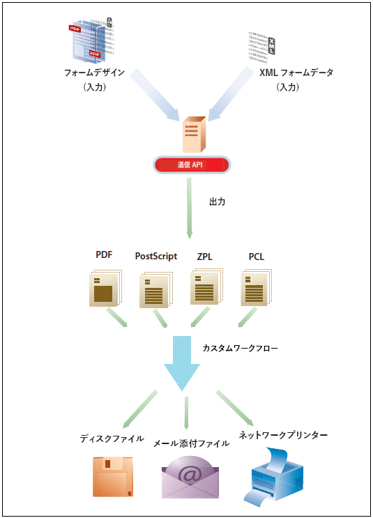
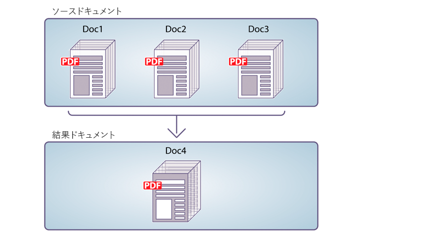
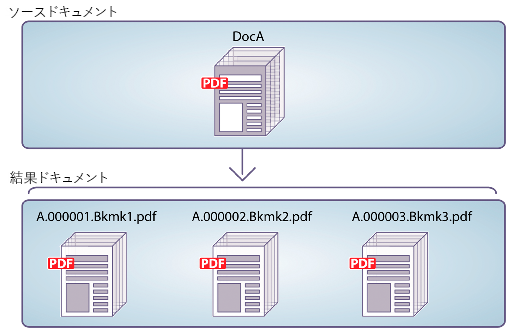

# AEM Forms as a Cloud Service 通信 API {#communications-apis-overview}

> **バージョンの可用性**
>
> * **AEM 6.5**：[AEM ドキュメントサービスの概要](https://experienceleague.adobe.com/docs/experience-manager-65/forms/use-document-services/overview-aem-document-services.html)
> * **AEM as a Cloud Service**：この記事

## はじめに

AEM Forms as a Cloud Service の通信 API は、ビジネスニーズに合わせてブランド承認、パーソナライズおよび標準化されたドキュメントを作成するのに役立ちます。これらの強力な API を使用すると、オンデマンドでも大量のバッチプロセスでも、プログラムでドキュメントを生成、操作、保護できます。

### 主なメリット

* **効率化されたドキュメント生成** - テンプレートと顧客データを結合して、パーソナライズされたドキュメントを作成します。
* **強力なドキュメント操作** - プログラムで PDF ドキュメントを組み合わせ、並べ替え、検証します。
* **柔軟なデプロイメントオプション** - 低遅延のニーズにはオンデマンド API を使用し、高スループット操作にはバッチ API を使用します。
* **強化されたセキュリティ** - 電子署名、証明書、暗号化を適用して機密ドキュメントを保護します。
* **クラウドネイティブアーキテクチャ** - メンテナンスのオーバーヘッドなしで、スケーラブルで安全なクラウドインフラストラクチャを活用します。

## API 機能の概要

通信 API では、次の機能領域に整理された包括的なドキュメント処理機能セットを提供します。

| ドキュメントの生成 | ドキュメント操作 | ドキュメント抽出 | ドキュメントのコンバージョン | ドキュメント保証 |
|---------------------|----------------------|---------------------|---------------------|-------------------|
| PDF や印刷形式など、様々な形式のデータとテンプレートを結合して、パーソナライズされたドキュメントを生成します。 | PDF ドキュメントをプログラムで組み合わせ、並べ替え、検証して、新しいドキュメントパッケージを作成します。 | PDF ドキュメントからプロパティ、メタデータ、コンテンツを抽出し、さらに処理します。 | アーカイブのニーズに合わせた PDF/A コンプライアンス検証を含む、様々な形式間でドキュメントを変換します。 | 電子署名、証明書、暗号化を適用して、ドキュメントを安全に保護します。 |

API から提供されるすべてのパラメーター、認証方法および各種サービスの詳細については、[API リファレンスドキュメント](https://developer.adobe.com/experience-cloud/experience-manager-apis/api/experimental/document/)を参照してください。API リファレンスドキュメントは、.yaml 形式でも入手できます。.yaml ファイルをダウンロードし、Postman にアップロードして API の機能を確認できます。

## 適用性とユースケース

### 保険

## AEM Formsで保険証券ドキュメントを生成できますか？

はい。AEM Formsでは、フォームを通じて取得したテンプレートと構造化データを使用して、ポリシー関連ドキュメントを生成できます。

## AEM Formsは大規模な保険業務を処理できますか？

はい。Adobe Managed Servicesまたはプライベートクラウドのレコメンデーションアーキテクチャを使用してAEM Formsをデプロイすると、大量のフォーム送信と企業規模のワークロードがサポートされます。

## ドキュメントの生成

コミュニケーションドキュメント生成 API は、テンプレート (XFA または PDF) とお客様データ (XML) を組み合わせて、PDF 形式や AFP (Advanced Function Presentation) 形式、PS、PCL、DPL、IPL、ZPL 形式などの印刷形式でドキュメントを生成するのに役立ちます。 これらの API は、[XML データ](communications-known-issues-limitations.md#form-data)が含まれる PDF および XFA の各テンプレートを使用して、単一のドキュメントをオンデマンドで、複数のドキュメントをバッチジョブで生成することができます。

通常、[Designer](use-forms-designer.md) を使用してテンプレートを作成し、通信 API を使用してテンプレートにデータを結合します。アプリケーションは、出力ドキュメントをネットワークプリンター、ローカルプリンター、またはアーカイブ用のストレージシステムに送信できます。標準ワークフローとカスタムワークフローの例を次に示します。

ユースケースによっては、これらのドキュメントを Web サイトまたはストレージサーバーからダウンロードできるようにすることもできます。

### 主なドキュメント生成機能

#### PDF/AFP 電子フォーマットのドキュメントを作成

ドキュメント生成 API を使用すると、フォームデザインと XML フォームデータに基づいて PDF または AFP 形式のドキュメントを作成できます。 結果として出力されるのは非インタラクティブな PDF ドキュメントです。 つまり、ユーザーはフォームデータの入力や変更はできません。 基本ワークフローは、XML フォームデータをフォームデザインと結合してドキュメントを作成することです。 次の図は、フォームデザインと XML フォームデータを結合して PDF ドキュメントを生成する様子を示しています。

図：ドキュメントを作成するための一般的なワークフロー

次の表に、AFP 形式と PDF 形式の違いを示します。

| **機能** | **AFP（Advanced Function Presentation）** | **PDF（Portable Document Format）** |
|---------------------------|--------------------------------------------------------------------|-------------------------------------------------------------|
| **目的** | トランザクションドキュメントの大量の印刷と生成 | 汎用ドキュメントの共有と表示 |
| **ユースケース** | 銀行明細書、請求書、保険書類 | 電子書籍、フォーム、レポート、履歴書、マニュアル |
| **プラットフォーム接触チャネル** | IBM による開発 | アドビによる開発 |
| **構造** | 構造化されたフィールドとオブジェクトを使用したページ指向の形式 | ページ指向だが固定されたレイアウト |
| **編集可能** | 実稼動印刷用に設計されており、編集されることはほとんどない | 様々なツール（Adobe Acrobat など）を使用して編集できます |
| **ファイルサイズとパフォーマンス** | 高速印刷環境でのパフォーマンスに最適 | 一括出力には適さず、サイズも大きくなる可能性がある |
| **インタラクティブ機能** | 最小限または全くない、静的なページ | フォーム、リンク、JavaScript などのインタラクティブ要素に対応 |
| **出力制御** | プリンタのレイアウトをきめ細かく制御 | 画面および印刷用に最適化されたビジュアルレイアウト |
| **フォントとグラフィック** | フォントとリソースの参照を使用、解釈にはレンダラーが必要 | フォントと画像をファイルに直接埋め込む |

ドキュメント生成 API は、生成された PDF ドキュメントまたは AFP ドキュメントを返します。 また、オプションで、生成された PDF を Azure Blob Storage にアップロードすることもできます。

ドキュメント生成 API を使用して生成された PDF を Azure Blob Storage 機能にアップロードすることは、[早期導入プログラム](/help/forms/early-access-ea-features.md)で行うことができます。早期導入プログラムに登録し、機能へのアクセスをリクエストするには、公式メール ID から aem-forms-ea@adobe.com にメールを送信してください。

#### PostScript（PS）、Printer Command Language（PCL）、Zebra Printing Language（ZPL）ドキュメントの作成 {#create-PS-PCL-ZPL-documents}

ドキュメント生成 API を使用して、XDP フォームデザインまたは PDF ドキュメントに基づく PostScript（PS）、Printer Command Language（PCL）および Zebra Printing Language（ZPL）のドキュメントを作成できます。これらの API は、フォームデザインとフォームデータを結合してドキュメントを生成します。ドキュメントをファイルに保存し、カスタムプロセスを開発してファイルをプリンターに送信することができます。

#### バッチデータの処理による複数のドキュメントの作成 {#processing-batch-data-to-create-multiple-documents}

ドキュメント生成 API を使用して、XML バッチデータソース内のレコードごとに別個のドキュメントを作成できます。ドキュメントは一括モードと非同期モードで生成できます。コンバージョンの様々なパラメーターを設定し、バッチ処理を開始できます。

## ドキュメント操作

通信機能のドキュメント操作（ドキュメント変換）API は、PDF ドキュメントを組み合わせたり並べ替えたりするのに役立ちます。通常は、DDX を作成し、それをドキュメント操作 API に送信して、ドキュメントをアセンブリしたり並べ替えたりします。[DDX ドキュメント](https://helpx.adobe.com/content/dam/help/en/experience-manager/forms-cloud-service/ddxRef.pdf)には、ソースドキュメントを使用して 1 組の必要なドキュメントを生成する方法についての指示が記述されています。DDX リファレンスドキュメントには、サポートされているすべての操作に関する詳細情報が記述されています。

### 主なドキュメント操作機能

#### PDF ドキュメントのアセンブリ

ドキュメント操作 API を使用すると、複数の PDF または XDP ドキュメントを 1 つの PDF ドキュメントまたは PDF ポートフォリオに組み合わせることができます。次に、PDF ドキュメントのアセンブリ方法を示します。

* 単純な PDF ドキュメントのアセンブリ
* PDF ポートフォリオの作成
* 暗号化ドキュメントのアセンブリ
* ベイツナンバリングを使用したドキュメントのアセンブリ
* ドキュメントの統合およびアセンブリ

図：複数の PDF ドキュメントからの単一 PDF ドキュメントのアセンブリ

#### PDF ドキュメントのディスアセンブリ

ドキュメント操作 API を使用して PDF ドキュメントを分割できます。また、ソースドキュメントからページを抽出したり、しおりの位置を境にソースドキュメントを分割することもできます。通常、このタスクは PDF ドキュメントが最初に多数の個別ドキュメント（明細書など）から作成された場合に役立ちます。

* ソースドキュメントからのページの抽出
* しおりに基づいたソースドキュメントの分割

図：しおりに基づいたソースドキュメントの複数のドキュメントへの分割

>[!NOTE]
>
> AEM Forms には、PDF ファイルとシームレスに統合できる様々なビルトインのフォントが用意されています。サポートされているフォントのリストを表示するには、[こちらをクリック](/help/forms/supported-out-of-the-box-fonts.md)してください。

## ドキュメント抽出

ドキュメント抽出機能は、早期導入プログラムに基づいています。早期導入プログラムに参加し、機能へのアクセスをリクエストするには、公式メール ID から aem-forms-ea@adobe.com にメールを送信してください。

ドキュメント抽出サービスを使用すると、使用権限、PDF プロパティ、メタデータなど、PDF ドキュメントのプロパティを取得できます。ドキュメント抽出機能は次のとおりです。

* PDF に添付ファイル、コメント、Acrobat バージョンなどが含まれているかどうかなど、PDF ドキュメントのプロパティを取得します。
* PDF ドキュメントで有効な使用権限を抽出すると、Adobe Acrobat Reader 拡張機能のために、PDF ドキュメントに対して有効または無効になっている使用権限を取得できます。
* PDF ドキュメント内に存在するメタデータ情報を取得します。メタデータは、ドキュメントに関する情報（テキストやグラフィックなど、ドキュメントの内容と区別されるもの）です。Adobe Extensive Metadata Platform（XMP）は、ドキュメントのメタデータを処理するための標準です。XMP ユーティリティサービスを使用すると、PDF ドキュメントから XMP メタデータを取得し、XMP メタデータを PDF ドキュメントに書き出すことができます。

API が提供するすべてのパラメーター、認証方法および各種サービスについて詳しくは、[API リファレンスドキュメント](https://developer.adobe.com/experience-cloud/experience-manager-apis/api/experimental/document/)を参照してください。API リファレンスドキュメントは、.yaml 形式でも入手できます。.yaml ファイルをダウンロードし、Postman にアップロードして API の機能を確認できます。

## ドキュメントのコンバージョン

### PDF/A 準拠ドキュメントへのコンバージョンと検証

通信ドキュメント変換 API は、PDF ドキュメントを PDF/A 準拠ドキュメントにコンバージョンするのに役立ちます。API を使用すると、PDF ドキュメントを PDF/A 準拠ドキュメントにコンバージョンしたり、PDF ドキュメントが PDF/A に準拠しているかどうかを判断したりできます。PDF/A は、ドキュメントのコンテンツを長期保存するためのアーカイブ形式です。フォントはドキュメントに埋め込まれ、ファイルは非圧縮になります。その結果、通常、PDF/A ドキュメントは標準の PDF ドキュメントよりも大きくなります。なお、PDF/A ドキュメントには、オーディオおよびビデオのコンテンツは含まれません。サポートされる PDF/A 準拠標準には、PDF/A-1a、1b、2a、2b、3a、3b が含まれます。

### PDF を XDP にコンバージョン {#convert-pdf-to-xdp}

PDFを XDP にコンバージョン機能は、早期導入プログラムに基づいています。早期導入プログラムに参加し、機能へのアクセスをリクエストするには、公式メール ID から aem-forms-ea@adobe.com にメールを送信してください。

PDF ドキュメントを XDP ファイルにコンバージョンします。PDF ドキュメントを XDP ファイルに正常にコンバージョンするには、PDF ドキュメントのディクショナリ内に XFA ストリームが含まれている必要があります。

## ドキュメント保証 {#doc-assurance}

DocAssurance サービスには、以下の署名 API と暗号化 API が含まれています。

### Signature API

Signature API を使用すると、組織は配布および受信する Adobe PDF ドキュメントのセキュリティとプライバシーを保護できます。<!--This service uses digital signatures and certification to ensure that only intended recipients can alter documents. -->セキュリティ機能がドキュメント自体に適用され、ドキュメントは、ライフサイクル全体にわたって常に安全で制御されます。オフラインでダウンロードされる場合や組織に送り返される場合、ファイアウォールの範囲外でもドキュメントの安全性が保たれます。Signature API を使用して、次のタスクを実行できます。

* 表示される署名フィールドを PDF ドキュメントに追加します。
* 非表示の署名フィールドを PDF ドキュメントに追加します。
* PDF ドキュメント内の指定した署名フィールドに署名します。
* PDF ドキュメントの証明
* PDF ドキュメント内の指定した署名フィールドから署名を削除します
* PDF ドキュメントから指定した署名フィールドを削除します。

早期導入プログラムでは、PDF ドキュメントから指定した署名フィールドから署名を削除することや、指定した署名フィールドを削除することができます。早期導入プログラムに参加し、機能へのアクセスをリクエストするには、公式メール ID から aem-forms-ea@adobe.com にメールを送信してください。

### 暗号化 API

暗号化 API を使用すると、ドキュメントの暗号化および復号が可能になります。ドキュメントが暗号化されると、その内容が読み取れなくなります。許可されたユーザーは、ドキュメントを復号化して、コンテンツにアクセスできます。PDF ドキュメントがパスワードで暗号化されている場合、Adobe Reader または Adobe Acrobat でドキュメントを表示するには、ユーザーはオープンパスワードを指定する必要があります。<!-- Likewise, if a PDF document is encrypted with a certificate, the user must decrypt the PDF document with the public key that corresponds to the certificate (private key) that was used to encrypt the PDF document.-->

暗号化 API を使用して、次のタスクを実行できます。

* パスワードで PDF ドキュメントを暗号化します。
* PDF ドキュメントからパスワードベースの暗号化を削除します。
* PDF ドキュメントに適用されるセキュリティのタイプを取得します。
* PDF ドキュメントに適用されたセキュリティ タイプを返します。

Signature API と Encryption API は両方とも [同期 API](#types-of-communications-apis-types) です。

### ドキュメントユーティリティ {#doc-utility}

同期 API を備えたドキュメントユーティリティは、PDF ファイル形式と XDP ファイル形式の間でドキュメントをコンバージョンするのに役立ちます。ドキュメントに使用権限を適用し、ドキュメントから有効な使用権限を抽出します。PDF ドキュメントに関する情報のクエリを実行します。<!-- determines whether a PDF document contains comments or attachments and more, and use document transformation services for XMP utilities-->使用権限 API の詳細を以下に示します。

#### 使用権限 API（Reader Extension）

使用権限 API（Reader Extension）の機能は、早期導入プログラムに基づいています。早期導入プログラムに参加し、機能へのアクセスをリクエストするには、公式のメール ID で aem-forms-ea@adobe.com までメールを送信してください。

Usage Rights の機能を使用すると、追加の使用権限を付与して Adobe Reader の機能を拡張することで、組織内でインタラクティブ PDF ドキュメントを簡単に共有できます。このサービスは Adobe Reader 7.0 以降で動作し、PDF ドキュメントに使用権限を追加します。これにより、PDF ドキュメントを Adobe Reader で開いた場合には通常使用できない機能（ドキュメントへのコメントの追加、フォームへの入力、ドキュメントの保存など）がアクティブになります。

PDF ドキュメントに適切な使用権限が追加されている場合、受信者は Adobe Reader 内で次の作業を行うことができます。

* オンラインまたはオフラインで PDF ドキュメントおよびフォームを完成させ、追加された情報を保持しつつ、記録のためにコピーをローカル保存することを受信者に対して許可する。
* PDF ドキュメントをローカルのハードドライブに保存し、元のドキュメントと追加されたコメント、データまたは添付ファイルを保持する。
* PDF ドキュメントにファイルおよびメディアクリップを添付する。
* 業界標準の公開鍵基盤（PKI）テクノロジーを使用して電子署名を適用することによって、PDF ドキュメントの署名および認証を行う。
* 入力が完了した PDF ドキュメントまたは注釈が付いた PDF ドキュメントを電子的に送信する。
* 内部データベースおよび web サービスへの直感的な開発フロントエンドとして PDF ドキュメントおよびフォームを使用する。
* レビュー担当者は直観的なマークアップツールを使用してドキュメントにコメントを追加できるよう、PDF ドキュメントを他のユーザーと共有する。使用できるツールには、電子付箋、スタンプ、ハイライト、および取り消し線が含まれます。これらと同じ機能は Acrobat でも利用できます。
* バーコードフォームのデコードをサポートします。

これらの特別な使用権限の機能は、使用権限を付与された PDF ドキュメントを Adobe Reader で開くと自動的にアクティブになります。権限を付与されたドキュメントの編集を終了すると、これらの機能は Adobe Reader で再度無効になります。ユーザーが権限を付与された別のドキュメントを受け取るまで、これらの機能は無効のままです。

#### 使用権限の有効化と無効化

PDF Reader サービスを拡張する様々な使用権限の機能を次に示します。

* **バーコードのデコード**：PDF ドキュメント内のバーコードをデコードします。

* **コメント**：PDF ドキュメントにオフラインでコメントします。

* **オンラインでコメント**：PDF ドキュメントにオンラインでコメントします。

* **デジタル署名**：PDF ドキュメントにデジタル署名を追加します。

* **動的フォームフィールド**：PDF ドキュメントにフォームフィールドを追加します。

* **動的フォームページ**：PDF ドキュメントにフォームページを追加します。

* **埋め込みファイル**：PDF ドキュメント内にファイルを埋め込みます。

* **フォームデータの読み込み**：PDF ドキュメントにフォームデータを読み込みます。

* **フォームデータの書き出し**：PDF ドキュメントにフォームデータを書き出します。

* **フォームの入力**：PDF ドキュメント内のフォームフィールドに入力します。

* **オンラインフォーム**：PDF ドキュメントから web サービスまたはデータベースにアクセスします。

* **スタンドアロンで送信**：PDF ドキュメントからフォームデータをオフラインで送信します。

#### その他の機能

* **メッセージ**：1 つ以上の使用権限が適用された PDF ドキュメントを開いた際に Adobe Acrobat Reader 内に表示されるメッセージ。
* **パスワードをロック解除**：暗号化された PDF ドキュメントを開く際に必要なパスワード。通常、これはドキュメントを開くパスワードですが、PDF ドキュメントが権限パスワードでさらに保護されている場合は、いずれかを使用して開くことができます。

## 通信 API のタイプ {#types}

通信は、オンデマンドおよびバッチでのドキュメント生成用に HTTP API を提供します。

* **[同期 API](https://developer.adobe.com/experience-manager-forms-cloud-service-developer-reference/)** は、オンデマンド、低遅延、単一レコードのドキュメント生成シナリオに適しています。これらの API は、ユーザーアクションに基づいたユースケースにより適しています。例えば、ユーザーがフォームへの入力を完了した後にドキュメントを生成するような場合です。

* **[バッチ API（非同期 API）](https://developer.adobe.com/experience-manager-forms-cloud-service-developer-reference/)**&#x200B;は、スケジュール化された、高スループットの、複数のドキュメント生成シナリオに適しています。これらの API は、バッチでドキュメントを生成します。例えば、毎月生成される電話料金請求書、クレジットカード明細書、給付計算書などです。

## オンボーディング

通信機能は、Forms as a Cloud Service ユーザー向けのスタンドアロンおよびアドオンモジュールとして利用できます。アクセスをリクエストする場合は、アドビセールスチームまたはアドビ担当者にお問い合わせください。お客様の組織で機能にアクセスできるように設定し、組織の管理者に必要な権限を付与します。管理者は、API を使用するためのアクセス権限を、組織内の Forms as a Cloud Service 開発者（ユーザー）に付与することができます。

オンボーディング後、Forms as a Cloud Service 環境で通信機能を有効にするには：

1. Cloud Manager にログインし、AEM Forms as a Cloud Service インスタンスを開きます。

1. 「プログラムを編集」オプションを開き、「ソリューションとアドオン」タブに移動して、「**[!UICONTROL Forms - 通信]**」オプションを選択します。

   

   「**[!UICONTROL Forms - デジタル登録]**」オプションを既に有効にしてある場合は、「**[!UICONTROL Forms - 通信アドオン]**」オプションを選択します。

   

1. 「**[!UICONTROL 更新]**」をクリックします。

1. ビルドパイプラインを実行します。ビルドパイプラインが正常に完了すると、お使いの環境で通信 API が有効になります。

>[!NOTE]
>
> ドキュメント操作 API を有効にし設定するには、次のルールを [Dispatcher 設定](setup-local-development-environment.md#forms-specific-rules-to-dispatcher)に追加します。
>
> `# Allow Forms Doc Generation requests`
> `/0062 { /type "allow" /method "POST" /url "/adobe/forms/assembler/*" }`

## その他のリソース {#see-also}

* [通信処理 - 同期 API](/help/forms/aem-forms-cloud-service-communications.md)
* [通信処理 - バッチ API](/help/forms/aem-forms-cloud-service-communications-batch-processing.md)
* [AEM Forms as a Cloud Service アーキテクチャ](/help/forms/aem-forms-cloud-service-architecture.md)
* [API リファレンスドキュメント](https://developer.adobe.com/experience-cloud/experience-manager-apis/api/experimental/document/)
* [早期導入プログラム機能](/help/forms/early-access-ea-features.md)
