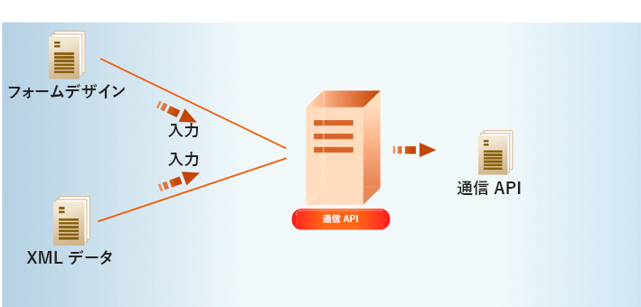

# AEM Forms as a Cloud Service Communications を使用 {#frequently-asked-questions}

**AEM Formsas a Cloud Service通信機能はベータ版です。**

通信機能は、ビジネス文書、ステートメント、請求処理レター、特典通知、毎月の請求書、ウェルカムキットなど、ブランド志向でパーソナライズされた標準的なドキュメントを作成するのに役立ちます。

オンデマンドでドキュメントを生成することも、バッチジョブを作成して、定義された間隔で複数のドキュメントを生成することもできます。通信 API は以下を提供します。

* 合理化されたオンデマンドおよびバッチドキュメント生成機能

* 既存のシステムと簡単に統合するための HTTP API。 オンデマンド（低遅延）およびバッチ操作（高スループット操作）用の個別の API が含まれます。 これにより、ドキュメントの生成が効率的になります。

* データへのセキュリティで保護されたアクセス。通信 API は、顧客が指定したデータリポジトリにのみ接続してデータにアクセスしますが、データのローカルコピーを作成しないため、通信の安全性が高くなります。

クレジットカード明細は、通信 API を使用して作成できます。 このサンプル文は同じテンプレートを使用していますが、クレジットカードの使用状況に応じて、顧客ごとに別々のデータを使用します。

## 仕組み?

通信は、[XML データ](#form-data)を含む [PDF および XFA テンプレート](#supported-document-types)を利用して、オンデマンドで単一のドキュメントを生成したり、定義した間隔で複数のドキュメントをバッチジョブで生成することができます。

通信 API は、テンプレート（XFA または PDF）と顧客データ（[XML データ](#form-data)）を組み合わせて、PDF 形式や PS、PCL、DPL、IPL、ZPL 形式などの印刷形式でドキュメントを生成するのに役立ちます。

通常、テンプレートを作成するには、 [Designer](use-forms-designer.md) コミュニケーション API を使用して、データをテンプレートと結合します。 アプリケーションは、出力ドキュメントをネットワークプリンター、ローカルプリンター、またはアーカイブ用のストレージシステムに送信できます。標準ワークフローとカスタムワークフローの例を次に示します。

ユースケースによっては、これらのドキュメントを Web サイトまたはストレージサーバーからダウンロードできるようにすることもできます。

## 通信 API

通信は、オンデマンドおよびバッチでのドキュメント生成用に HTTP API を提供します。

* **[同期 API](https://adobedocs.github.io/experience-manager-forms-cloud-service-developer-reference/api/sync/)** は、オンデマンド、低遅延、単一レコードのドキュメント生成シナリオに適しています。これらの API は、ユーザーアクションに基づいたユースケースにより適しています。例えば、ユーザーがフォームへの入力を完了した後にドキュメントを生成するような場合です。

* **[バッチ API（非同期 API）](https://adobedocs.github.io/experience-manager-forms-cloud-service-developer-reference/api/batch/)**&#x200B;は、スケジュール化された、高スループットの、複数のドキュメント生成シナリオに適しています。これらの API は、バッチでドキュメントを生成します。例えば、毎月生成される電話料金、クレジットカード明細、給付計算書などです。

通信 API の主な使用方法は次のとおりです。

### PDF ドキュメントの作成 {#create-pdf-documents}

通信 API を使用して、フォームデザインと XML フォームPDFに基づくデータドキュメントを作成できます。 結果として出力されるのは非インタラクティブ PDF ドキュメントです。つまり、ユーザーはフォームデータの入力や変更はできません。基本ワークフローは、XML フォームデータをフォームデザインと結合して PDF ドキュメントを作成することです。次の図は、フォームデザインと XML フォームデータを結合して PDF ドキュメントを生成するところを示しています。

### PostScript（PS）、Printer Command Language（PCL）、Zebra Printing Language（ZPL）ドキュメントの作成 {#create-PS-PCL-ZPL-documents}

通信 API を使用して、XDP フォームデザインまたは PDF ドキュメントに基づく PS、PCL および ZPL ドキュメントを作成できます。これらの API は、フォームデザインとフォームデータを結合してドキュメントを生成するのに役立ちます。 ドキュメントをファイルに保存し、カスタムプロセスを開発してファイルをプリンターに送信することができます。

<!-- ### Processing batch data to create multiple documents

Communications APIs can create separate documents for each record within an XML batch data source. The APIs can also create a single document that contains all records (this functionality is the default). Assume that an XML data source contains ten records and you instruct the APIs to create a separate document for each record (for example, PDF documents). As a result, the APIs generate ten PDF documents.

The following illustration also shows Communications APIs processing an XML data file that contains multiple records. However, assume that you instruct the APIs to create a single PDF document that contains all data records. In this situation, the APIs generate one document that contains all of the records.

The following illustration shows Communications APIs processing an XML data file that contains multiple records. Assume that you instruct the Communications APIs to create a separate PDF document for each data record. In this situation, the APIs generates a separate PDF document for each data record.

 -->

### バッチデータの処理による複数のドキュメントの作成 {#processing-batch-data-to-create-multiple-documents}

XML バッチデータソース内のレコードごとに、別々のドキュメントを作成できます。ドキュメントは一括モードと非同期モードで生成できます。コンバージョンの様々なパラメーターを設定し、バッチ処理を開始できます。<!-- You can can also create a single document that contains all records (this functionality is the default).  Assume that an XML data source contains ten records and you have a requirement to create a separate document for each record (for example, PDF documents). You can use the Communication APIs to generate ten PDF documents. -->

<!-- The following illustration shows the Communication APIs processing an XML data file that contains multiple records. However, assume that you instruct the Communication APIs to create a single PDF document that contains all data records. In this situation, the Communication APIs generate one document that contains all of the records.

The following illustration shows the Communication APIs processing an XML data file that contains multiple records. Assume that you instruct the Communication APIs to create a separate PDF document for each data record. In this situation, the Communication APIs generates a separate PDF document for each data record.

For detailed information on using Batch APIs, see Communication APIs: Processing batch data to create multiple documents. -->

### インタラクティブ PDF ドキュメントの統合 {#flatten-interactive-pdf-documents}

通信 API を使用して、インタラクティブ PDF ドキュメント（フォームなど）を非インタラクティブ PDF ドキュメントに変換できます。インタラクティブ PDF ドキュメントでは、ユーザーは PDF ドキュメントフィールドにデータを入力したり、このフィールドのデータを変更したりできます。インタラクティブ PDF ドキュメントを非インタラクティブ PDF ドキュメントに変換するプロセスは「統合」と呼ばれます。PDF ドキュメントを統合すると、ユーザーはドキュメントのフィールドにあるデータを変更できなくなります。PDF ドキュメントを統合する理由の 1 つは、データを変更できないようにすることです。

次のタイプの PDF ドキュメントを統合できます。

* Designer で作成されたインタラクティブ PDF ドキュメント（XFA ストリームを含む）

* Acrobat PDF フォーム

非インタラクティブ PDF ドキュメントを統合しようとすると、例外が発生します。

### フォーム状態の保持 {#retain-form-state}

インタラクティブ PDF ドキュメントには、フォームを構成する様々な要素が含まれています。これらの要素には、フィールド（データを受け取るまたは表示する）、ボタン（イベントをトリガーする）、スクリプト（特定のアクションを実行するコマンド）などがあります。ボタンをクリックすると、フィールドの状態を変更するイベントがトリガーされる可能性があります。例えば、性別オプションを選択すると、フィールドの色やフォームの外観が変わる場合があります。これは、フォームの状態変化を引き起こす手動イベントの例です。

通信 API を使用してこのようなインタラクティブ PDF ドキュメントを統合した場合、フォームの状態は保持されません。フォームが統合された後もフォームの状態が確実に保持されるようにするには、ブール値 _retainFormState_ を True に設定して、フォームの状態を保存し保持します。

## オンボーディング 

通信は、Forms as a Cloud Service のユーザー向けのスタンドアロンおよびアドオンモジュールとして利用できます。AdobeのセールスチームまたはAdobe担当者に連絡して、アクセス権を要求できます。

お客様の組織で変換サービスを使用できるように設定し、組織の管理者に対して必要な権限を設定します。管理者は、API を使用するためのアクセス権限を、組織内の AEM Forms 開発者（ユーザー）に付与することができます。

転送後に、Formsas a Cloud Service環境で通信を有効にするには、次の手順を実行します。

1. Cloud Manager にログインし、AEM Forms as a Cloud Service インスタンスを開きます。

1. 「プログラムを編集」オプションを開き、「ソリューションとアドオン」タブに移動して、「**[!UICONTROL Forms - 通信]**」オプションを選択します。

   

   既に **[!UICONTROL Forms — デジタル登録]** オプションを選択し、 **[!UICONTROL Forms - Communications Add-On]** オプション。

   

1. 「**[!UICONTROL 更新]**」をクリックします。

1. ビルドパイプラインを実行します。

ビルドパイプラインが正常に完了すると、お使いの環境で通信 API が有効になります。

<!--

Communication help you combine a template and XML data to generate print documents in various formats. The service allows you to generate documents in synchronous and batch modes. The APIs enables you to create applications that let you:

  * Generate documents by populating template files (PDF and XDP) with XML data.
  * Generate output forms in various formats, including non-interactive PDF print streams.

Consider a scenario where you have one or more templates and multiple records of XML data for each template. You can use Communications APIs to generate a print document for each record.  You can also combine the records into a single document.  The result is a non-interactive PDF document. A non-interactive PDF document does not let users enter data into its fields.

 There are two main Communications APIs. The _generatePDFOutput_ generates PDFs, while the _generatePrintedOutput_ generates PostScript, ZPL, and PCL formats. These APIs are available as REST endpoints on your environment, both on author and publish instances. Since the publish instances are configured to scale faster than the author instances, it is recommended use these APIs via publish instances.

The first parameter of both the operations accept the path and name of the template file (for example ExpenseClaim.xdp). You can specify a fully qualified path, reference path of your AEM Repository, or path of a binary file. The second parameter accepts an XML document that is merged with the template while generating the output document.  

The [API reference documentation](https://documentcloud.adobe.com/link/track?uri=urn:aaid:scds:US:b1223732-ae0f-4921-bdc0-c31e48b56044) provides detailed information about all the parameters, authentication methods, and various services provided by APIs. The API reference documentation is also available in the .yaml format. You can download the .yaml for [Batch APIs](assets/batch-api.yaml) or [non-Batch API.yaml](assets/non-batch-api.yaml) file and upload it to postman to check functionality of APIs.

>[!VIDEO](https://video.tv.adobe.com/v/335771)

Uploading Communication APIs .yaml file to postman to check functionality of APIs.

## Using the Communications APIs {#workflows}

Typically, you create a template using [Designer](use-forms-designer.md) and use communications APIs ( generatePDFOutput and generatePrintedOutput) to:

* Convert these templates to various formats, including PDF, PostScript, ZPL, and PCL.
* Merge XML form data with a form design to generate a document.
* Generate a document without merging XML form data into the document. However, the primary workflow is merging data into the document.

Then, the output document is stored to a file. You can design custom workflows to send the file to a network printer, a local printer, or to a storage system for archival. A typical out of the box and custom workflows look like the following:

### Create PDF documents {#create-pdf-documents}

You can use the _generatePDFOutput_ API to create PDF document that is based on a form design and XML form data. The output is a non-interactive PDF document. That is, users cannot enter or modify form data. A basic workflow is to merge XML form data with a form design to create a PDF document. The following illustration shows the merging of a form design and XML form data to produce a PDF document.

### Create PostScript (PS), Printer Command Language (PCL), Zebra Printing Language (ZPL) document {#create-PS-PCL-ZPL-documents}

You can use Communications APIs to create PostScript (PS), Printer Command Language (PCL), and Zebra Printing Language (ZPL) document that are based on a XDP form design or PDF document. The _generatePrintedOutput_ API merges a form design with form data to generate a document. You can save the document to a file and develop a custom process to send it to a printer.

 ### Processing batch data to create multiple documents

Communications APIs can create separate documents for each record within an XML batch data source. The APIs can also create a single document that contains all records (this functionality is the default). Assume that an XML data source contains ten records and you instruct the APIs to create a separate document for each record (for example, PDF documents). As a result, the APIs generate ten PDF documents.

The following illustration also shows Communications APIs processing an XML data file that contains multiple records. However, assume that you instruct the APIs to create a single PDF document that contains all data records. In this situation, the APIs generate one document that contains all of the records.

The following illustration shows Communications APIs processing an XML data file that contains multiple records. Assume that you instruct the Communications APIs to create a separate PDF document for each data record. In this situation, the APIs generates a separate PDF document for each data record.

### Processing batch data to create multiple documents {#processing-batch-data-to-create-multiple-documents}

You create separate documents for each record within an XML batch data source. You can can also create a single document that contains all records (this functionality is the default). Assume that an XML data source contains ten records and you have a requirement to create a separate document for each record (for example, PDF documents). You can use the Communication APIs to generate ten PDF documents.

The following illustration shows the Communication APIs processing an XML data file that contains multiple records. However, assume that you instruct the Communication APIs to create a single PDF document that contains all data records. In this situation, the Communication APIs generate one document that contains all of the records.

The following illustration shows the Communication APIs processing an XML data file that contains multiple records. Assume that you instruct the Communication APIs to create a separate PDF document for each data record. In this situation, the Communication APIs generates a separate PDF document for each data record.

For detailed information on using Batch APIs, see Communication APIs: Processing batch data to create multiple documents.

### Flatten interactive PDF documents {#flatten-interactive-pdf-documents}

You can use the Communications APIs to transform an interactive PDF document (for example, a form) to a non-interactive PDF document. An interactive PDF document lets users enter or modify data located in the PDF document fields. The process of transforming an interactive PDF document to a non-interactive PDF document is called flattening. When a PDF document is flattened, a user cannot modify the data located in the document’s fields. One reason to flatten a PDF document is to ensure that data cannot be modified.

You can flatten the following types of PDF documents:

* Interactive PDF documents created in Designer (that contain XFA streams).

* Acrobat PDF forms

If you attempt to flatten a non-interactive PDF document, an exception occurs.

### Retain Form State {#retain-form-state}

An interactive PDF document contains various elements that constitute a form. These elements may include fields (to accept or display data), buttons (to trigger events), and scripts (commands to perform a specific action). Clicking a button may trigger an event that changes the state of a field. For example, choosing a gender option may change the color of a field or the appearance of the form. This is an example of a manual event causing the form state to change.

When such an interactive PDF document is flattened using the Communications APIs, the state of the form is not retained. To ensure that the state of the form is retained even after the form is flattened, set the Boolean value _retainFormState_ to True to save and retain the state of the form.  -->
