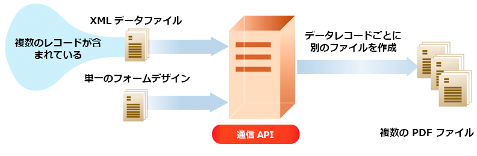

# AEM Forms as a Cloud Service 通信 API {#communications-apis-overview}

> **バージョンの可用性**
>
> * **AEM 6.5**: [AEM ドキュメントサービスの概要 ](https://experienceleague.adobe.com/docs/experience-manager-65/forms/use-document-services/overview-aem-document-services.html)
> * **AEM as a Cloud Service**：この記事

## はじめに

AEM Forms as a Cloud Serviceの通信 API を使用すると、ビジネスニーズに合わせて、ブランド承認済みのパーソナライズされた標準化されたドキュメントを作成できます。 これらの強力な API を使用すると、ドキュメントをプログラムで生成、操作、保護できます。ドキュメントは、オンデマンドの場合でも、大量のバッチプロセスの場合でも同様です。

### 主なメリット

* **効率的なドキュメント生成** - テンプレートを顧客データと結合して、パーソナライズされたドキュメントを作成します
* **強力なドキュメント操作** - PDF ドキュメントをプログラムで結合、並べ替えおよび検証します
* **柔軟なデプロイメントオプション** – 低レイテンシのニーズに対してオンデマンド API を使用し、高スループットの操作に対してバッチ API を使用します
* **セキュリティの強化** - デジタル署名、証明書、暗号化を適用して、機密ドキュメントを保護します
* **クラウドネイティブアーキテクチャ** - メンテナンスのオーバーヘッドなしで、スケーラブルで安全なクラウドインフラストラクチャを活用

## 主な機能

通信 API は、次の機能領域に整理されたドキュメント処理機能の包括的なセットを提供します。

| ドキュメント生成 | ドキュメント操作 | ドキュメント抽出 | ドキュメントのコンバージョン | ドキュメント保証 |
|---------------------|----------------------|---------------------|---------------------|-------------------|
| PDFや印刷形式など、様々な形式のデータを使用してテンプレートを結合し、パーソナライズされたドキュメントを生成する。 | PDF ドキュメントをプログラムで組み合わせ、並べ替え、検証して、新しいドキュメントパッケージを作成します。 | さらに処理するために、PDF ドキュメントからプロパティ、メタデータおよびコンテンツを抽出する。 | アーカイブのニーズに応じてPDF/A のコンプライアンス検証を含め、複数のフォーマット間でドキュメントを変換できます。 | デジタル署名、証明書、暗号化を適用して、ドキュメントの保護と保護を行います。 |

## ドキュメント生成

通信機能のドキュメント生成 API は、テンプレート（XFA またはPDF）と顧客データ（XML）を組み合わせて、PDFおよび様々な印刷形式（PS、PCL、DPL、IPL、ZPL）でパーソナライズされたドキュメントを作成します。

### ドキュメント生成の仕組み

典型的なワークフローを以下に示します。

1. [Designer](use-forms-designer.md) を使用したテンプレートの作成
2. テンプレートに入力する XML データの準備
3. 通信 API を使用したテンプレートとデータの結合
4. 目的の形式での出力ドキュメントの生成

### PDF ドキュメントの作成

Document Generation API を使用すると、XML データをフォームテンプレートと結合して、非インタラクティブなPDF ドキュメントを作成することができます。

生成された PDF は、ダウンロードを通じてユーザーに配信したり、リポジトリに保存したり、オプションで Azure Blob Storage にアップロードしたりできます。

 生成された PDF の Azure Blob Storage へのアップロードは、[ 早期導入プログラム ](/help/forms/early-access-ea-features.md) を通じて利用できます。 参加するには、公式メールでaem-forms-ea@adobe.comにお問い合わせください。

### 印刷形式ドキュメントの作成

次のような印刷形式でドキュメントを生成します。
* PostScript（PS）
* プリンタコマンド言語（PCL）
* Zebra 印刷言語（ZPL）

これらのフォーマットは、大量の印刷操作や特殊な印刷ニーズに最適です。

### 複数ドキュメントのバッチ処理

バッチ API を使用して大量のドキュメントを効率的に処理します。

バッチ処理では、次のことが可能です。

* XML データソース内のレコードごとに別個のドキュメントを生成します
* パフォーマンスを向上させるためにドキュメントを非同期で処理
* バッチ処理の様々なコンバージョンパラメーターの設定

## ドキュメント操作

ドキュメント操作 API を使用すると、PDF ドキュメントをプログラムで組み合わせたり、並べ替えたり、変換したりできます。

### ドキュメント アセンブリ

複数のPDFまたは XDP ドキュメントを 1 つの包括的なドキュメントに結合する：

ドキュメントアセンブリの機能は次のとおりです。
* 複数のソースからの単純なPDF ドキュメントの作成
* PDF ポートフォリオの構築
* 暗号化されたドキュメントのアセンブリ
* 法的文書に通し番号を追加する
* インタラクティブフォームの統合とアセンブリ

### ドキュメントの分割

大きなPDF ドキュメントを、より小さく、管理しやすいコンポーネントに分割します。

ドキュメントの分割では、次のことができます。
* ソースドキュメントからの特定ページの抽出
* しおりに基づいたドキュメントの分割
* 大規模なコンパイルからの論理ドキュメントセットの作成

>[!NOTE]
>
> AEM Formsには、PDF ファイルとシームレスに統合される多くの組み込みフォントが含まれています。 サポートされているすべてのフォントのリストについては、[ ここをクリック ](/help/forms/supported-out-of-the-box-fonts.md) を参照してください。

## ドキュメント抽出

 ドキュメント抽出は、[ 早期導入プログラム ](/help/forms/early-access-ea-features.md) を通じて利用できます。 参加するには、公式メールでaem-forms-ea@adobe.comにお問い合わせください。

ドキュメント抽出 API を使用すると、PDF ドキュメントから次のような情報を取得できます。

* ドキュメントプロパティ（入力可能なフォームか、添付ファイルがあるかなど）
* 使用権限と権限
* Adobe Extensible Metadata Platform （XMP）を使用したメタデータ情報

この機能は、特にドキュメント管理システム、アーカイブ・ソリューション、ワークフロー自動化に役立ちます。

## ドキュメントのコンバージョン

### PDF/A の変換と検証

長期的なアーカイブを目的として、標準のPDF ドキュメントをPDF/A 形式に変換します。

* PDF/A-1a、1b、2a、2b、3a、3b のコンプライアンス規格のサポート
* PDF/A 準拠の検証
* 埋め込みフォントと非圧縮コンテンツでドキュメントの整合性を維持

### PDFから XDP への変換

PDFから XDP への変換は、[ 早期導入プログラム ](/help/forms/early-access-ea-features.md) を通じて利用できます。 参加するには、公式メールでaem-forms-ea@adobe.comにお問い合わせください。

XFA ストリームを含むPDF ドキュメントを XDP 形式に変換して、テンプレートの編集や再利用を行うことができます。

## ドキュメント保証 {#doc-assurance}

Document Assuranceには、ドキュメントのライフサイクルを通じてドキュメントを保護するための署名 API と暗号化 API が含まれています。

### Signature API

デジタル署名と証明書によるPDF ドキュメントの保護：

* 表示または非表示の署名フィールドの追加
* デジタル署名フィールドへの署名
* 整合性のためのドキュメントの認証
* ドキュメントからの署名の削除
* ドキュメントからの署名フィールドの削除

 署名の削除と署名フィールドの削除は、[ 早期導入プログラム ](/help/forms/early-access-ea-features.md) を通じて利用できます。 参加するには、公式メールでaem-forms-ea@adobe.comにお問い合わせください。

### 暗号化 API

暗号化によるドキュメント・コンテンツの保護：

* パスワードでPDF ドキュメントを暗号化
* パスワードベースの暗号化を削除
* ドキュメントに適用するセキュリティの種類を決定する
* 保護されたドキュメントからのセキュリティ情報の取得

### ドキュメントユーティリティ {#doc-utility}

ドキュメントユーティリティには、PDF ドキュメントを操作するための追加機能が用意されています。

#### 使用権限 API（Reader Extension）

 使用権限（Reader拡張機能）は、[ 早期導入プログラム ](/help/forms/early-access-ea-features.md) を通じて利用できます。 参加するには、公式メールでaem-forms-ea@adobe.comにお問い合わせください。

PDF ドキュメントに使用権限を付与し、次のような機能を有効にして、Adobe Reader の機能を拡張します。

* フォームへの入力と保存
* コメントと注釈の追加
* デジタル署名
* 添付ファイル
* フォームデータのインポート/エクスポート
* Web サービスおよびデータベースへのアクセス

使用可能な使用権限は次のとおりです。

* **フォームインタラクション**：フォームの入力、フォームデータの読み込み/書き出し、動的フォームフィールド/ページ
* **注釈**：コメント（オンラインおよびオフライン）、デジタル署名
* **ドキュメント処理**：埋め込みファイル、スタンドアロンで送信、バーコードのデコード
* **Online Services**：オンラインのForms、web サービスへのアクセス

## 通信 API のタイプ {#types}

通信では、様々なユースケースに合わせて次の 2 種類の API が提供されます。

### 同期 API

**最適な対象**：オンデマンドで低遅延の単一ドキュメント生成
**ユースケース**：ユーザートリガーのドキュメント生成、インタラクティブアプリケーション
**ドキュメント**:[ 同期 API リファレンス ](https://developer.adobe.com/experience-manager-forms-cloud-service-developer-reference/)

### バッチ API （非同期）

**最適な対象**：スケジュールに沿った高スループットの複数ドキュメント生成
**ユースケース**：月次明細書、請求、通知、予定レポート
**ドキュメント**: [Batch API リファレンス ](https://developer.adobe.com/experience-manager-forms-cloud-service-developer-reference/)

## 通信 API の概要

### オンボーディングプロセス

通信は、Forms as a Cloud Service ユーザー向けのスタンドアロンモジュールまたはアドオンとして利用できます。

1. アクセス権をリクエストする場合は、Adobe営業担当またはAdobe担当者にお問い合わせください
2. Adobeによって組織のアクセスが有効になり、管理者権限が付与されます
3. その後、管理者は、組織内の開発者にアクセス権を付与できます

### 環境での通信の有効化

Forms as a Cloud Service環境で通信を有効にするには、次の手順に従います。

1. Cloud Managerにログインし、AEM Forms as a Cloud Service インスタンスを開きます
2. 「プログラムを編集」オプションを開き、「ソリューションとアドオン」タブに移動します。
3. 「**[!UICONTROL Forms - コミュニケーション]**」オプションを選択します

   

   既に **[!UICONTROL Forms - デジタル登録]** を有効にしている場合は、代わりに **[!UICONTROL Forms - コミュニケーションアドオン]** オプションを選択します。

   

4. 「**[!UICONTROL 更新]**」をクリックします
5. ビルドパイプラインの実行 – 正常に完了すると、通信 API が有効になります

>[!NOTE]
>
> ドキュメント操作 API を有効にするには、次のルールを [Dispatcher設定 ](setup-local-development-environment.md#forms-specific-rules-to-dispatcher) に追加します。
>
> `# Allow Forms Doc Generation requests`
> `/0062 { /type "allow" /method "POST" /url "/adobe/forms/assembler/*" }`

## API リファレンスドキュメント {#api-reference}

通信 API はいくつかの機能カテゴリに分類されており、それぞれのカテゴリには詳細なリファレンスドキュメントが付属しています。 これらの API リファレンスは、エンドポイント、パラメーター、リクエスト/応答の形式、認証要件に関する包括的な情報を提供します。

### ドキュメント生成 API

| API | 説明 | 参照リンク |
|-----|-------------|----------------|
| ドキュメント生成 – 同期 | インタラクティブなシナリオで、待ち時間の短いオンデマンドでのドキュメント生成 | [API リファレンス ](https://developer.adobe.com/experience-manager-forms-cloud-service-developer-reference/api/output-sync/) |
| ドキュメント生成 – バッチ | スケジュールされたオペレーションのために大量のドキュメントを非同期で処理 | [API リファレンス ](https://developer.adobe.com/experience-manager-forms-cloud-service-developer-reference/api/output-batch/) |

### ドキュメント操作 API

| API | 説明 | 参照リンク |
|-----|-------------|----------------|
| ドキュメント操作 – 同期 | DDX 命令を使用したPDF ドキュメントの結合、分割、変換 | [API リファレンス ](https://developer.adobe.com/experience-manager-forms-cloud-service-developer-reference/api/assembler-sync/) |

### Document Assurance API

| API | 説明 | 参照リンク |
|-----|-------------|----------------|
| DocAssurance – 同期 | デジタル署名、証明書、暗号化、および Reader 拡張機能の適用 | [API リファレンス ](https://developer.adobe.com/experience-manager-forms-cloud-service-developer-reference/api/docassurance/) |

### 共通の API パラメーター

各 API カテゴリには固有のパラメーターがありますが、一般的なパラメーターとしては次のものがあります。

#### ドキュメント生成パラメーター

| パラメーター | 型 | 必須 | 説明 |
|-----------|------|----------|-------------|
| `template` | 文字列 | はい | XDP またはPDF テンプレートファイルへのパス |
| `data` | 文字列 | いいえ | テンプレートと結合する XML データ |
| `outputOptions` | オブジェクト | いいえ | 出力ドキュメントの設定オプション |

#### ドキュメント操作パラメーター

| パラメーター | 型 | 必須 | 説明 |
|-----------|------|----------|-------------|
| `ddx` | 文字列 | はい | ドキュメントの組み立てまたは分解の DDX 命令 |
| `inputDocuments` | オブジェクト | はい | 処理する入力ドキュメントのマップ |
| `outputOptions` | オブジェクト | いいえ | 出力ドキュメントの設定オプション |

#### Document Assuranceのパラメーター

| パラメーター | 型 | 必須 | 説明 |
|-----------|------|----------|-------------|
| `inputPDF` | 文字列 | はい | セキュリティで保護または署名するPDF ドキュメントを入力 |
| `certificateAlias` | 文字列 | 条件付き | 署名操作のための証明書のエイリアス |
| `credentialPassword` | 文字列 | 条件付き | 署名に使用する資格情報のパスワード |

パラメーターの詳細、認証要件、リクエストや応答の例については、上記の表でリンクされている特定の API リファレンスドキュメントを参照してください。

## その他のリソース {#see-also}

* [通信処理 - 同期 API](/help/forms/aem-forms-cloud-service-communications.md)
* [通信処理 - バッチ API](/help/forms/aem-forms-cloud-service-communications-batch-processing.md)
* [AEM Forms as a Cloud Serviceのアーキテクチャ](/help/forms/aem-forms-cloud-service-architecture.md)
* [API リファレンスドキュメント ](https://developer.adobe.com/experience-cloud/experience-manager-apis/api/experimental/document/)
* [早期導入プログラムの機能](/help/forms/early-access-ea-features.md)
