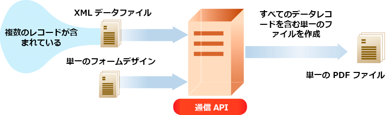

# AEM Formsas a Cloud Service通信 API の使用 {#frequently-asked-questions}

**通信機能はベータ版です。**

通信 API を使用すると、XDP テンプレート、XDP ベースの PDF ドキュメントおよび Acrobat Forms（AcroForm）を XML データと組み合わせて様々な形式の印刷用ドキュメントを生成することができ、以下の機能を備えたアプリケーションを作成できます。

- テンプレートファイルに XML データを格納することで、最終形式のドキュメントを生成します。

- 非インタラクティブ PDF 印刷ストリームを含む様々な形式のフォームを生成する

- XFA フォームの PDF ファイルから印刷用 PDF を生成する。

- ソーステンプレートを用いて複数のデータセットを結合することにより、PDF、PostScript、PCL および ZPL の各種形式のドキュメントを一括生成する

例えば、1 つ以上のテンプレートが存在しており、各テンプレートには XML データの複数のレコードがあるシナリオを考えてみましょう。通信 API を使用して、各レコードの印刷用ドキュメントを生成できます。<!-- You can also combine the records into a single document. -->結果は非インタラクティブ PDF ドキュメントになります。非インタラクティブ PDF ドキュメントのフィールドには、ユーザーがデータを入力することはできません。

API から提供されるすべての API、パラメーター、認証方法および各種サービスの詳細については、[API リファレンスドキュメント](https://documentcloud.adobe.com/link/track?uri=urn:aaid:scds:US:b1223732-ae0f-4921-bdc0-c31e48b56044)を参照してください。API リファレンスドキュメントは、.yaml 形式でも入手できます。[batch-api.yaml](assets/batch-api.yaml) または [non-batch-api.yaml](assets/non-batch-api.yaml) ファイルをダウンロードし、postman にアップロードして API の機能を確認できます。

>[!VIDEO](https://video.tv.adobe.com/v/335771)

通信 API の .yaml ファイルを postman にアップロードして API の機能を確認

>[!NOTE]
>
>通信 API にアクセスできるのは、forms-users グループのメンバーだけです。

## 通信の有効化

Formsas a Cloud Service環境で通信を有効にするには：

1. Cloud Manager にログインし、AEM Formsas a Cloud Serviceインスタンスを開きます。

1. 「プログラムを編集」オプションを開き、「ソリューションとアドオン」タブに移動して、 **[!UICONTROL Forms — コミュニケーション]** オプション。

   <!-- 

    If you have already enabled the **[!UICONTROL Forms - Digital Enrollment]** option, then select the **[!UICONTROL Forms - Communications Add-On]** option.  

    <!--  -->

1. 「**[!UICONTROL 更新]**」をクリックします。

1. ビルドパイプラインを実行します。

ビルドパイプラインが正常に完了すると、お使いの環境で通信 API が有効になります。

## 通信 API の使用 {#workflows}

通常は、[Designer](use-forms-designer.md) を使用してテンプレートを作成し、通信 API を使用して以下を行います。

- これらのテンプレートを PDF、PostScript、ZPL、PCL などの様々な形式に変換する。
- XML フォームデータをフォームデザインと結合してドキュメントを生成する。
- XML フォームデータをドキュメントに結合せずにドキュメントを生成する。ただし、データをドキュメントに結合するのが本来のワークフローです。

次に、出力ドキュメントがファイルに保存されます。カスタムワークフローを設計して、このファイルをネットワークプリンター、ローカルプリンターまたはアーカイブ用のストレージシステムに送信できます。標準ワークフローとカスタムワークフローの例を次に示します。


### PDF ドキュメントの作成 {#create-pdf-documents}

_generatePDFOutput_ API を使用すると、フォームデザインと XML フォームデータに基づく PDF ドキュメントを作成できます。結果として出力されるのは非インタラクティブ PDF ドキュメントです。つまり、ユーザーはフォームデータの入力や変更はできません。基本ワークフローは、XML フォームデータをフォームデザインと結合して PDF ドキュメントを作成することです。次の図は、フォームデザインと XML フォームデータを結合して PDF ドキュメントを生成するところを示しています。


### PostScript（PS）、Printer Command Language（PCL）、Zebra Printing Language（ZPL）ドキュメントの作成 {#create-PS-PCL-ZPL-documents}

通信 API を使用して、XDP フォームデザインまたは PDF ドキュメントに基づく PS、PCL および ZPL ドキュメントを作成できます。_generatePrintedOutput_ API は、フォームデザインとフォームデータを結合してドキュメントを生成します。ドキュメントをファイルに保存し、カスタムプロセスを開発してファイルをプリンターに送信することができます。

<!-- ### Processing batch data to create multiple documents

Communications APIs can create separate documents for each record within an XML batch data source. The APIs can also create a single document that contains all records (this functionality is the default). Assume that an XML data source contains ten records and you instruct the APIs to create a separate document for each record (for example, PDF documents). As a result, the APIs generate ten PDF documents.

The following illustration also shows Communications APIs processing an XML data file that contains multiple records. However, assume that you instruct the APIs to create a single PDF document that contains all data records. In this situation, the APIs generate one document that contains all of the records.

The following illustration shows Communications APIs processing an XML data file that contains multiple records. Assume that you instruct the Communications APIs to create a separate PDF document for each data record. In this situation, the APIs generates a separate PDF document for each data record.

 -->

### バッチデータの処理による複数のドキュメントの作成 {#processing-batch-data-to-create-multiple-documents}

XML バッチデータソース内のレコードごとに、別々のドキュメントを作成できます。ドキュメントは一括モードと非同期モードで生成できます。コンバージョンの様々なパラメーターを設定し、バッチ処理を開始できます。<!-- You can can also create a single document that contains all records (this functionality is the default).  Assume that an XML data source contains ten records and you have a requirement to create a separate document for each record (for example, PDF documents). You can use the Communication APIs to generate ten PDF documents. -->

<!-- The following illustration shows the Communication APIs processing an XML data file that contains multiple records. However, assume that you instruct the Communication APIs to create a single PDF document that contains all data records. In this situation, the Communication APIs generate one document that contains all of the records.



The following illustration shows the Communication APIs processing an XML data file that contains multiple records. Assume that you instruct the Communication APIs to create a separate PDF document for each data record. In this situation, the Communication APIs generates a separate PDF document for each data record.


For detailed information on using Batch APIs, see Communication APIs: Processing batch data to create multiple documents. -->

### インタラクティブ PDF ドキュメントの統合 {#flatten-interactive-pdf-documents}

通信 API を使用して、インタラクティブ PDF ドキュメント（フォームなど）を非インタラクティブ PDF ドキュメントに変換できます。インタラクティブ PDF ドキュメントでは、ユーザーは PDF ドキュメントフィールドにデータを入力したり、このフィールドのデータを変更したりできます。インタラクティブ PDF ドキュメントを非インタラクティブ PDF ドキュメントに変換するプロセスは「統合」と呼ばれます。PDF ドキュメントを統合すると、ユーザーはドキュメントのフィールドにあるデータを変更できなくなります。PDF ドキュメントを統合する理由の 1 つは、データを変更できないようにすることです。

次のタイプの PDF ドキュメントを統合できます。

- Designer で作成されたインタラクティブ PDF ドキュメント（XFA ストリームを含む）

- Acrobat PDF フォーム

非インタラクティブ PDF ドキュメントを統合しようとすると、例外が発生します。

### フォーム状態の保持 {#retain-form-state}

インタラクティブ PDF ドキュメントには、フォームを構成する様々な要素が含まれています。これらの要素には、フィールド（データを受け取るまたは表示する）、ボタン（イベントをトリガーする）、スクリプト（特定のアクションを実行するコマンド）などがあります。ボタンをクリックすると、フィールドの状態を変更するイベントがトリガーされる可能性があります。例えば、性別オプションを選択すると、フィールドの色やフォームの外観が変わる場合があります。これは、フォームの状態変化を引き起こす手動イベントの例です。

通信 API を使用してこのようなインタラクティブ PDF ドキュメントを統合した場合、フォームの状態は保持されません。フォームが統合された後もフォームの状態が確実に保持されるようにするには、ブール値 _retainFormState_ を True に設定して、フォームの状態を保存し保持します。

### 通信 API の考慮事項 {#considerations-for-communications-apis}

#### フォームデータ {#form-data}

通信 API は、通常 Designer で作成されるフォームデザインと、XML フォームデータの両方を入力として受け付けます。ドキュメントにデータを入力するには、入力先となるすべてのフォームフィールドの XML フォームデータに XML 要素が存在する必要があります。XML 要素名は、フィールド名と一致する必要があります。XML 要素がフォームフィールドに対応していない場合や、XML 要素名がフィールド名と一致しない場合、XML 要素は無視されます。XML 要素の表示順序を一致させる必要はありません。対応する値で XML 要素が指定される点が重要です。

次のローン申し込みフォームサンプルについて考えてみましょう。


このフォームデザインにデータを結合するには、フォームに対応する XML データソースを作成します。次の XML は、住宅ローン申し込みフォームサンプルに対応する XML データソースを表しています。

```XML
<?xml version="1.0" encoding="UTF-8" ?>
- <xfa:datasets xmlns:xfa="http://www.xfa.org/schema/xfa-data/1.0/">
- <xfa:data>
- <data>
    - <Layer>
        <closeDate>1/26/2007</closeDate>
        <lastName>Johnson</lastName>
        <firstName>Jerry</firstName>
        <mailingAddress>JJohnson@NoMailServer.com</mailingAddress>
        <city>New York</city>
        <zipCode>00501</zipCode>
        <state>NY</state>
        <dateBirth>26/08/1973</dateBirth>
        <middleInitials>D</middleInitials>
        <socialSecurityNumber>(555) 555-5555</socialSecurityNumber>
        <phoneNumber>5555550000</phoneNumber>
    </Layer>
    - <Mortgage>
        <mortgageAmount>295000.00</mortgageAmount>
        <monthlyMortgagePayment>1724.54</monthlyMortgagePayment>
        <purchasePrice>300000</purchasePrice>
        <downPayment>5000</downPayment>
        <term>25</term>
        <interestRate>5.00</interestRate>
    </Mortgage>
</data>
</xfa:data>
</xfa:datasets>
```

#### サポートされているドキュメントタイプ {#supported-document-types}

通信 API のレンダリング機能に完全にアクセスするには、XDP ファイルを入力として使用することをお勧めします。場合によっては、PDF ファイルを使用できます。ただし、PDF ファイルを入力として使用する場合は、次のような制限があります。

- XFA ストリームを含んでいない PDF ドキュメントは、PostScript、PCL または ZPL としてレンダリングできません。通信 API は、XFA ストリーム（Designer で作成されたフォーム）を使用して PDF ドキュメントをレーザー形式およびラベル形式にレンダリングできます。PDF ドキュメントが署名済み、証明済み、（AEM Forms Reader Extensions サービスを使用して適用された）使用権限を含んでいる、のいずれかの場合、これらの印刷形式にはレンダリングできません。

<!-- * Run-time options such as PDF version and tagged PDF are not supported for Acrobat forms. They are valid for PDF forms that contain XFA streams; however, these forms cannot be signed or certified. 

#### Email support {#email-support}

For email functionality, you can create a process in AEM Workflows that uses the Email Step. A workflow represents a business process that you are automating. -->

#### 印刷可能領域 {#printable-areas}

デフォルトの 0.25 インチの印刷不能な余白は、ラベルプリンターでは正確ではなく、プリンターによって異なります。また、ラベルサイズによっても異なります。0.25 インチの余白を維持するか、余白を減らすことをお勧めします。ただし、印刷不能な余白を増やさないことをお勧めします。そうしないと、印刷可能領域内の情報が正しく印刷されません。

必ず、プリンターに合った XDC ファイルを使用してください。例えば、ドキュメントを 200 dpi のプリンターに送信する場合は 300 dpi のプリンター用の XDC ファイルを選択しないようにします。

#### スクリプト {#scripts}

通信 API で使用されるフォームデザインには、サーバー上で実行されるスクリプトを含めることができます。フォームデザインに、クライアント上で実行されるスクリプトが含まれていないことを確認します。フォームデザインスクリプトの作成について詳しくは、Designer のヘルプを参照してください。

<!-- #### Working with Fonts
 Document Considerations for Working with Fonts>> -->

#### フォントマッピング {#font-mapping}

フォントがクライアントコンピューターにインストールされている場合は、Designer のドロップダウンリストで使用できます。フォントがインストールされていない場合は、フォント名を手動で指定する必要があります。Designer の「見つからないフォントを置換して保存」オプションはオフにできます。それ以外の場合、XDP ファイルを Designer で保存すると、置換フォント名が XDP ファイルに書き込まれます。つまり、プリンター常駐フォントは使用されません。

プリンター常駐フォントを使用するフォームをデザインするには、プリンターで使用可能なフォントと一致する書体名を Designer で選択します。PCL または PostScript でサポートされているフォントのリストは、対応するデバイスプロファイル（XDC ファイル）に記載されています。または、フォントマッピングを作成して、プリンター常駐フォント以外のフォントを、別の書体名のプリンター常駐フォントにマッピングすることもできます。例えば、PostScript シナリオでは、Arial® フォントへの参照をプリンター常駐の Helvetica® 書体にマッピングできます。

2 種類の OpenType® フォントが存在します。1 つは、PCL でサポートされている TrueType OpenType® フォントです。もう 1 つは CFF OpenType® です。PDF および PostScript 出力では、埋め込みの Type-1、TrueType および OpenType® フォントがサポートされています。PCL 出力では、埋め込みの TrueType フォントがサポートされています。

Type-1 フォントと OpenType® フォントは、PCL 出力には埋め込まれません。Type-1 および OpenType® フォントで書式設定されたコンテンツは、サイズが大きく生成に時間がかかる可能性があるビットマップ画像としてラスタライズおよび生成されます。

ダウンロードされたフォントや埋め込まれたフォントは、PostScript、PCL または PDF 出力の生成時に自動的に置換されます。つまり、生成された出力には、生成されたドキュメントを適切にレンダリングするために必要なフォントグリフのサブセットのみ含まれます。

#### デバイスプロファイルファイルの操作（XDC ファイル） {#working-with-xdc-files}

デバイスプロファイル（XDC ファイル）は、XML 形式のプリンター記述ファイルです。このファイルを使用すると、通信 API がレーザープリンターまたはラベルプリンター形式でドキュメントを出力できます。通信 API で使用する XDC ファイルは次のとおりです。

- hppcl5c.xdc

- hppcl5e.xdc

- ps_plain_level3.xdc

- ps_plain.xdc

- zpl300.xdc

- zpl600.xdc

- zpl300.xdc

- ipl300.xdc

- ipl400.xdc

- tpcl600.xdc

- dpl300.xdc

- dpl406.xdc

- dpl600.xdc

ドキュメントを作成するために、これらのファイルを変更する必要はありません。ただし、ビジネス要件に合わせて変更することはできます。

これらのファイルは、特定のプリンターの機能（常駐フォント、用紙トレイ、ステープル機能など）をサポートするサンプル XDC ファイルです。これらのサンプルは、デバイスプロファイルを使用したプリンターの設定方法を理解するために提供されています。また、同じ製品ラインの類似プリンターに対応する XDC ファイルの出発点でもあります。

#### XCI 設定ファイルの操作 {#working-with-xci-files}

通信 API では、XCI 設定ファイルを使用して、出力を単一パネルとするかページ分割するかを制御するといったタスクを実行します。このファイル内の設定は編集できますが、通常、値を変更することはありません。<!-- The default.xci file is located in the svcdata\XMLFormService folder. -->

変更した XCI ファイルを通信 API の使用時に渡すことができます。その際は、デフォルトファイルのコピーを作成し、ビジネス要件に合わせて変更する必要がある値のみを変更し、変更した XCI ファイルを使用します。

通信 API は、まずデフォルトの XCI ファイル（または変更された XCI ファイル）を使用します。次に、通信 API を使用して指定された値が適用されます。これらの値は XCI 設定よりも優先されます。

XCI オプションを次の表に示します。

| XCI オプション | 説明 |
| ------------------------------------- | ----------------------------------------------------------------------------------------------------------------------------------------------------------------------------------------------------------------------------------------------------------------------------------------------------------------------------------------------------------------------------------------------------------------------------------------------------------------------------------------------------------- |
| config/present/pdf/creator | ドキュメント情報ディクショナリの Creator エントリを使用して、ドキュメント作成者を識別します。このディクショナリについては、PDF リファレンスガイドを参照してください。 |
| config/present/pdf/producer | ドキュメント情報ディクショナリの Producer エントリを使用して、ドキュメントプロデューサーを識別します。このディクショナリについては、PDF リファレンスガイドを参照してください。 |
| config/present/layout | 出力を単一ページとするか連続ページとするかを制御します。 |
| config/present/pdf/compression/level | PDF ドキュメントの生成時に使用する圧縮レベルを指定します。 |
| config/present/pdf/scriptModel | 出力 PDF ドキュメントに XFA 固有の情報を含めるかどうかを制御します。 |
| config/present/common/data/adjustData | 結合後に XFA アプリケーションでデータを調整するかどうかを制御します。 |
| config/present/pdf/renderPolicy | ページコンテンツをサーバー側で生成するか、後でクライアント側で生成するかを制御します。 |
| config/present/common/locale | 出力ドキュメントで使用するデフォルトのロケールを指定します。 |
| config/present/destination | present 要素に含まれている場合は、出力形式を指定します。openAction 要素に含まれている場合は、インタラクティブクライアントでドキュメントを開いたときに実行されるアクションを指定します。 |
| config/present/output/type | ファイルに適用する圧縮の種類または生成する出力の種類を指定します。 |
| config/present/common/temp/uri | フォームの URI を指定します。 |
| config/present/common/template/base | フォームデザインの URI のベースを指定します。この要素がない場合や空の場合は、フォームデザインの場所がベースとして使用されます。 |
| config/present/common/log/to | ログデータまたは出力データの書き込み先を制御します。 |
| config/present/output/to | ログデータまたは出力データの書き込み先を制御します。 |
| config/present/script/currentPage | ドキュメントを開いたときの初期ページを指定します。 |
| config/present/script/exclude | どのイベントを無視するかを AEM Forms サーバーまたは通信 API に指示します。 |
| config/present/pdf/linearized | 出力 PDF ドキュメントを線形化するかどうかを制御します。 |
| config/present/script/runScripts | AEM Forms で実行されるスクリプトのセットを制御します。 |
| config/present/pdf/tagged | 出力 PDF ドキュメントへのタグの組み込みを制御します。タグは、PDF のコンテキストでは、ドキュメントの論理構造を公開するためにドキュメントに組み込まれる追加情報です。タグは、アクセシビリティの支援や書式の再設定に役立ちます。例えば、スクリーンリーダーがテキストの途中でページ番号を読み上げてしまわないように、ページ番号を装飾としてタグ付けすることができます。タグを使用すると、ドキュメントの有用性が高まる反面、ドキュメントのサイズが大きくなり、作成にかかる処理時間も長くなります。 |
| config/present/pdf/version | 生成する PDF ドキュメントのバージョンを指定します。 |

### 既知の問題

- テンプレートおよび XCI 設定ファイルのサイズが 16 KB を超えていることを確認してください。

- データ xml ファイルに XML 宣言ヘッダーが含まれていないことを確認してください。例：`<?xml version="1.0" encoding="UTF-8"?>`

- バッチ設定の場合、OutputType（PDF、PRINT）と RenderType（PostScript、PCL、IPL、ZPL など）の値の組み合わせのインスタンスは 1 つだけ許可されています。

- バッチの実行中に、バッチ設定で使用されるデータソース USC 設定／Azure クラウド設定を変更しないでください。実行後でも更新が必要な場合は、既存のバッチ設定で使用されている設定を更新する代わりに、設定のコピーを作成します。

### ベストプラクティス

- AEM Cloud Service が使用するクラウド領域で、データファイルの blob コンテナストアをホストすることをお勧めします。

<!-- Using API

 There are two main Communications APIs. The _generatePDFOutput_ generates PDFs, while the _generatePrintedOutput_ generates PostScript, ZPL, and PCL formats. These APIs are available as HTTP endpoints on your environment, both on author and publish instances. Since the publish instances are configured to scale faster than the author instances, it is recommended use these APIs via publish instances.

The first parameter of both the operations accept the path and name of the template file (for example ExpenseClaim.xdp). You can specify a fully qualified path, reference path of your AEM Repository, or path of a binary file. The second parameter accepts an XML document that is merged with the template while generating the output document. -->


