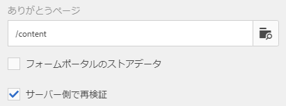
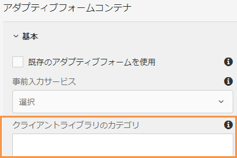

# アダプティブFormsでサポートされている送信アクション

アダプティブフォームを使用すると、魅力的でレスポンシブ、かつ動的でアダプティブなフォームを作成できます。フォームを効率的に設計および管理するための直感的なユーザーインターフェイスと、すぐに使用できる一連のコンポーネントを提供します。 様々な送信アクションを設定して、OneDrive、SharePoint、Workfront Fusion などのサービスにフォームデータを送信できます。

送信アクションは、ユーザーがアダプティブフォームの **[!UICONTROL 送信]** ボタンをクリックしたするときにトリガーされます。 Forms as a Cloud Serviceには、すぐに使用できる送信アクションがいくつか用意されています。 組み込みの送信アクションを使用すると、次のことができます。

* フォームデータをメールで簡単に送信
* データの送信中に、Microsoft® Power Automate のフローまたは AEM ワークフローを開始します。
* フォームデータを Microsoft® SharePoint Server、Microsoft® Azure Blob Storage、または Microsoft® OneDrive に直接送信します。
* フォームデータモデル（FDM）を使用して、設定済みのデータソースにデータをシームレスに送信します。
* データを REST エンドポイントに送信すると便利です。

## アダプティブFormsでサポートされている送信アクション

AEM forms には、次の標準の送信アクションが用意されています。

* [メールを送信](/help/forms/configure-submit-action-send-email.md)
* [Power Automate フローを呼び出す](/help/forms/forms-microsoft-power-automate-integration.md)
* [SharePoint に送信](/help/forms/configure-submit-action-sharepoint.md)
* [Workfront Fusion を起動する](/help/forms/submit-adaptive-form-to-workfront-fusion.md)
* [フォームデータモデル（FDM）を使用して送信](/help/forms/using-form-data-model.md)
* [Azure Blob Storage への送信](/help/forms/configure-submit-action-azure-blob-storage.md)
* [REST エンドポイントに送信](/help/forms/configure-submit-action-restpoint.md)
* [OneDrive に送信](/help/forms/configure-submit-action-onedrive.md)
* [AEM ワークフローを起動](/help/forms/configure-submit-action-workflow.md)
* [Marketo Engage に送信](/help/forms/submit-adaptive-form-to-marketo-engage.md)
* [Adobe Experience Platform（AEP）への送信 ](/help/forms/aem-forms-aep-connector.md)
* [スプレッドシートに送信](/help/forms/forms-submission-service.md)

アダプティブフォームを他のストレージ設定に送信することもできます。

* [Salesforce アプリケーションにアダプティブフォームを接続](/help/forms/aem-forms-salesforce-integration.md)
* [Microsoft へのアダプティブフォームの接続](/help/forms/ms-dynamics-odata-configuration.md)

## 複数のオーサリングタイプでの送信アクションのサポート

次の表に、AEM Formsで使用されるフォームオーサリングメソッドに基づいてサポートされる送信アクションを示します。

| 送信アクション | [基盤コンポーネント](/help/forms/configuring-submit-actions.md) | [コアコンポーネント](/help/forms/configure-submit-actions-core-components.md) | [ユニバーサルエディター](/help/forms/configure-submit-action-eds-forms.md#submit-actions-supported-by-adaptive-forms-created-in-universal-editor) | [ ドキュメントベースのForms](/help/forms/configure-submit-action-eds-forms.md#supported-submit-actions-for-document-based-forms) |
|----------------------------|------------------------|------------------|------------------|------------------------|
| メールの送信 | ✅ サポート | ✅ サポート | ✅ サポート |                        |
| Power Automate フロー | ✅ サポート | ✅ サポート | ✅ サポート |                        |
| SharePoint に送信 | ✅ サポート | ✅ サポート | ✅ サポート |                        |
| Workfront Fusion | ✅ サポート | ✅ サポート | ✅ サポート |                        |
| FDM を使用した送信 | ✅ サポート | ✅ サポート | ✅ サポート |                        |
| AEPへの送信 | ✅ サポート | ✅ サポート | ✅ サポート |                        |
| Azure Blob Storage | ✅ サポート | ✅ サポート | ✅ サポート |                        |
| REST エンドポイントへの送信 | ✅ サポート | ✅ サポート | ✅ サポート |                        |
| Marketo Engage に送信 | ✅ サポート | ✅ サポート | ✅ サポート |                        |
| OneDrive に送信 | ✅ サポート | ✅ サポート | ✅ サポート |                        |
| AEM ワークフローを起動 | ✅ サポート | ✅ サポート | ✅ サポート |                        |
| スプレッドシートに送信 |                        |                  | ✅ サポート | ✅ サポート |

## アダプティブフォームにおけるサーバー側の再検証

通常、どのようなオンラインデータ取得システムでも、ビジネスルールを適用するために、開発者はクライアントサイドに何らかの JavaScript 検証を配置します。しかし、最新のブラウザーでは、エンドユーザーが Web Browser DevTools Console などの様々な手法を使用してこれらの検証を回避し、手動で送信を行える方法が存在します。このような手法は、アダプティブフォームにも有効です。フォーム開発者は、多様な検証ロジックを作成できますが、エンドユーザーは、これらの検証ロジックを回避し、無効なデータをサーバーに送信できます。無効なデータは、フォーム作成者が適用したビジネスルールを破ることになります。

サーバーサイドの再検証機能は、アダプティブフォーム作成者がアダプティブフォームのデザイン中に指定した検証を、サーバー上でも実行するための機能です。これは、フォームの検証で表されるデータ送信の漏洩やビジネスルール違反の可能性を阻止します。

### サーバーで検証されるもの

サーバーで再実行される、アダプティブフォームのすぐに使用できる（OOTB）すべてのフィールド検証を以下に示します。

* 必須
* 検証パターン形式文字列
* 検証式

サイドバーにある「アダプティブフォームコンテナ」の「**[!UICONTROL サーバー側で再検証]**」を使用して、現在のフォームのサーバーサイド検証を有効または無効にします。

**サーバーサイド検証の有効化**

エンドユーザーがこれらの検証を回避してフォームを送信した場合、サーバーが再度検証を行います。サーバーサイドでの検証が失敗した場合、送信処理が停止します。ユーザーには、元のフォームが再度表示されます。取得されたデータおよび送信されたデータは、エラーとしてユーザーに表示されます。

>[!NOTE]
>
>サーバーサイド検証により、フォームモデルが検証されます。検証のために別個のクライアントライブラリを作成し、1 つのクライアントライブラリに HTML のスタイルや DOM 操作を混在させないことをお勧めします。

<!--### Supporting Custom functions in Validation Expressions {#supporting-custom-functions-in-validation-expressions-br}

At times, if there are **complex validation rules**, the exact validation script reside in custom functions and author calls these custom functions from field validation expression. To make this custom function library known and available while performing server-side validations, the form author can configure the name of AEM client library under the **[!UICONTROL Basic]** tab of Adaptive Form Container properties as shown below.

Supporting Custom functions in Validation Expressions

Author can configure customJavaScript library per Adaptive Form. In the library, only keep the reusable functions, which have dependency on jquery and underscore.js third-party libraries.

Refer to the following articles to learn how to create custom functions for:

* [Adaptive Forms based on Foundation Components](/help/forms/rule-editor.md#custom-functions-in-rule-editor)
* [Adaptive Forms based on Core Components](/help/forms/create-and-use-custom-functions.md)
* [Adaptive Forms authored using Document-Based Authoring](/help/edge/docs/forms/rules-forms.md#create-a-custom-function)
* [Adaptive Forms created using the Universal Editor](/help/edge/docs/forms/universal-editor/rule-editor-universal-editor.md#create-a-custom-function)

## Error handling on Submit Action {#error-handling-on-submit-action}

As a part of AEM security and hardening guidelines, configure custom error pages such as 400.jsp, 404.jsp, and 500.jsp. These handlers are called, when on submitting a form 400, 404, or 500 errors appear. The handlers are also called when these error codes are triggered on the Publish node. You can also create JSP pages for other HTTP error codes.

When you prefill a form data model (FDM), or schema based Adaptive Form with XML or JSON data complaint to a schema that is data does not contain `<afData>`, `<afBoundData>`, and `</afUnboundData>` tags, then the data of unbounded fields of the Adaptive Form is lost. The schema can be an XML schema, JSON schema, or a Form Data Model (FDM). Unbounded fields are Adaptive Form fields without the `bindref` property.-->

## 関連トピック

{{af-submit-action}}

