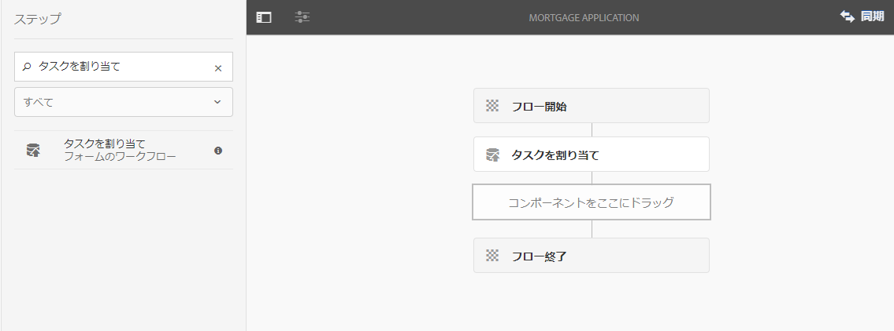
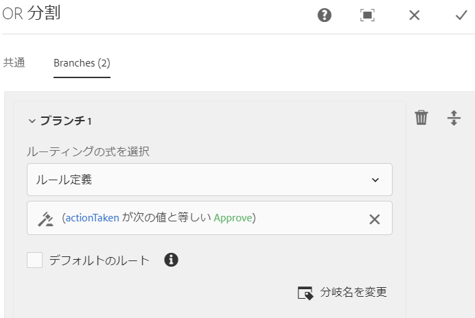
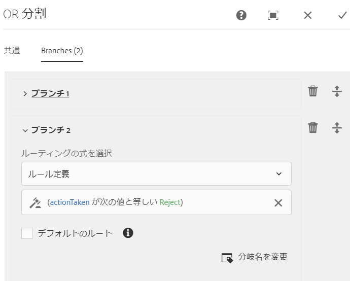
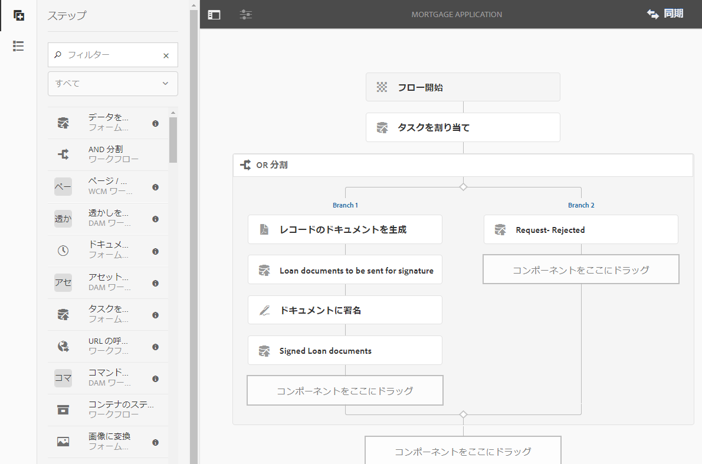

# OSGi 上の Forms 中心のワークフロー {#forms-centric-workflow-on-osgi}

企業は、数百も数千ものフォーム、様々なバックエンドシステム、オンラインまたはオフラインのデータソースからデータを収集します。 また、データに関する意思決定を行うための動的なユーザーセットもあります。これには、反復的なレビューと承認のプロセスが含まれます。

大規模な組織や事業では、内部および外部のオーディエンスのレビューや承認プロセスと併せて、反復タスクを実施しています。例えば、PDF ドキュメントを別フォーマットへ変換します。これらのタスクは、手動で行うと多くの時間とリソースを要します。企業には、後で事前定義された形式で使用するために、ドキュメントにデジタル署名し、フォームデータをアーカイブする法的要件もあります。

## OSGi 上の Forms 中心のワークフローの導入 {#introduction-to-forms-centric-workflow-on-osgi}

AEM ワークフローを使用することで、アダプティブフォームベースのワークフローをすばやく構築することができます。これらのワークフローは、レビューと承認、ビジネスプロセスフローに使用して、ドキュメントサービスを開始し、Adobe Sign署名ワークフローと統合したり、同様の操作をおこなうことができます。 例えば、クレジットカードの申請処理、従業員の休暇承認ワークフロー、フォームの PDF ドキュメントとしての保存などです。さらに、これらのワークフローは組織内だけでなく、ネットワークファイアウォールを越えて使用することもできます。

OSGi での Forms 中心のワークフローを使用すると、JEE スタックに本格的なプロセス管理機能をインストールしなくても、OSGi スタックで様々なタスクのワークフローを迅速に構築およびデプロイできます。ワークフローの開発と管理では、従来の AEM ワークフロー機能と AEM インボックス機能を使用します。ワークフローにより、複数のソフトウェアシステム、ネットワーク、部門、組織にわたる実際のビジネスプロセスを自動化するための基礎が構築されます。

これらのワークフローを一度設定すると、それ以降は、手動でワークフローをトリガーして定義済みプロセスを実行することも、ユーザーによるフォーム<!-- or [correspondence management](cm-overview.md) letter-->の送信時にワークフローをプログラムで実行することもできます。<!-- With this enhanced AEM Workflow capabilities, [!DNL AEM Forms] offers two distinct, yet similar, capabilities. As part of your deployment strategy, you need to decide which one works for you. See a [comparison](capabilities-osgi-jee-workflows.md) of the Forms-centric AEM Workflows on OSGi and Process Management on JEE. Moreover, for the deployment topology see, [Architecture and deployment topologies for [!DNL AEM Forms]]((aem-forms-architecture-deployment.md). -->

OSGi 上の Forms 中心のワークフローは、[AEM インボックス](https://experienceleague.adobe.com/docs/experience-manager-cloud-service/sites/authoring/getting-started/inbox.html?lang=ja#authoring)を拡張し、AEM ワークフローエディターに追加のコンポーネント（手順）を提供することで、[!DNL AEM Forms] 中心のワークフローをサポートします。<!-- The extended AEM Inbox has functionalities similar to [[!DNL AEM Forms] Workspace](introduction-html-workspace.md). Along with managing human-centric workflows (Approval, Review, and so on), you can use AEM workflows to automate [document services](https://experienceleague.adobe.com/docs/experience-manager-65/developing/extending-aem/extending-workflows/workflows-step-ref.html#extending-aem)-related operations (for example, Generate PDF) and electronically signing (Adobe Sign) documents. -->

すべての [!DNL AEM Forms] ワークフロー手順で変数の使用が可能です。変数を使用すると、ワークフロー手順で、実行時に複数の手順にわたってメタデータを保持および渡すことができます。様々なタイプの変数を作成して、様々なタイプのデータを保存できます。変数コレクション（配列）を作成して、関連する同じタイプのデータのインスタンスを複数保存することもできます。一般に、変数または変数のコレクションを使用するのは、変数が保持する値に基づいて決定する必要がある場合、またはプロセスで後で必要になる情報を保存する場合です。これらの Forms 中心のワークフローコンポーネント（手順）で変数を使用する方法について詳しくは、 [OSGi での Forms 中心のワークフロー - 手順リファレンス](aem-forms-workflow-step-reference.md) を参照してください。変数の作成と管理については、[AEM ワークフローの変数](variable-in-aem-workflows.md)を参照してください。

次の図は、OSGi 上の Forms 中心のワークフローを作成、実行、監視するためのエンドツーエンドの手順を示します。

## 適用性とユースケース

### 保険

## AEM Formsは保険承認ワークフローをサポートしていますか？

はい。AEM Formsは、ワークフローベースのレビューと承認をサポートしており、保険業務の一環として調整者のレビュー、マネージャーの承認、再作業のループを実現します。

## AEM Formsは保険向けの maker-checker プロセスをサポートしていますか。

はい。AEM Forms ワークフローは、メーカーによるチェックのパターンに対応するように設定し、データ入力と承認のロール間で職務を分離できます。

## AEM Formsは保険金請求または申請のステータスをトラッキングできますか？

はい。AEM Formsのワークフローを使用すると、保険会社は、ビジネスプロセスの様々な段階でフォームの送信と処理のステータスをトラッキングできます。

## AEM Formsは引き受けワークフローをサポートしていますか？

はい、ワークフローと統合を使用して実行できます。 AEM Formsは、アプリケーションデータを引き受けシステムや決定システムに送ることができる、ワークフロー駆動型プロセスとバックエンドの統合をサポートしています。

## AEM Formsは、保険業務に関する監査証跡をサポートしていますか。

はい。AEM Formsは、ワークフロー履歴、アクセス制御、システムログを通じて監査性をサポートしており、保険会社が内部および外部の監査ニーズを満たすのに役立ちます。

## 事前準備 {#before-you-start}

* ワークフローは、実世界のビジネスのプロセスを表すものです。実際のビジネスプロセスを維持し、ビジネスプロセスの参加者のリストを準備します。 また、ワークフローの作成を開始する前にコラテラル（アダプティブフォーム、PDF ドキュメントなど）を準備しましょう。
* ワークフローには複数のステージが含まれることがあります。これらのステージは、AEM インボックスに表示され、ワークフローの進捗を分かりやすくします。ビジネスプロセスを論理ステージに分割します。
* AEM ワークフローのタスクの割り当て手順で、メール通知をユーザーや担当者に送信するように設定することができます。これにより、[メール通知を有効にする](#configure-email-service)ことができます。
* ワークフローでは、電子署名にAdobe記号を使用することもできます。 ワークフローで Adobe Sign を使用する予定がある場合、ワークフローで使用する前に、 [Adobe Sign の設定を [!DNL AEM Forms]](adobe-sign-integration-adaptive-forms.md) で行う必要があります。

## ワークフローモデルを作成する {#create-a-workflow-model}

ワークフローモデルは、ビジネスプロセスのロジックとフローで構成されます。また、一連の手順で構成されています。これらの手順は、AEM のコンポーネントです。必要に応じて、ワークフロー手順をパラメーターやスクリプトを使用してさらに機能性や制御が高くなるように拡張することができます。初期状態で使用できる AEM 手順に加えて、[!DNL AEM Forms] ではいくつかの手順が用意されています。AEM と [!DNL AEM Forms] の手順の詳細なリストについては、[AEM ワークフロー手順のリファレンス](https://experienceleague.adobe.com/docs/experience-manager-65/developing/extending-aem/extending-workflows/workflows-step-ref.html?lang=ja#extending-aem)と [OSGi 上の Forms 中心のワークフロー - 手順のリファレンス](aem-forms-workflow.md)を参照してください。

AEM には、提供されているワークフロー手順を使用してワークフローモデルを作成するための直感的なユーザーインターフェイスが用意されています。ワークフローモデルを作成するためのステップごとの手順については、「[ワークフローモデルの作成](https://experienceleague.adobe.com/docs/experience-manager-cloud-service/sites/authoring/workflows/overview.html?lang=ja#workflows)」を参照してください。次の例では承認およびレビューワークフローでワークフローモデルを作成するためのステップごとの手順が示されています。

>[!NOTE]
>
>ワークフローモデルを作成または編集するには、workflow-editor グループのメンバーである必要があります。

### 承認およびレビューのワークフローモデルの作成 {#create-a-model-for-an-approval-and-review-workflow}

承認およびレビューのワークフローは、人間による判断の介入を必要とするタスクに使用されます。次の例では、窓口の銀行員が記入する住宅ローン申し込み用のワークフローモデルを作成します。申し込み書が記入されると、承認に送られます。その後、承認されたアプリケーションは申込者に送信され、Adobe Sign を使用した電子署名が求められます。

この例は、下記に添付されたパッケージとしてご利用いただけます。パッケージマネージャーを使ってサンプルをインポートしてインストールします。また、アプリケーションのワークフローモデルを手動で作成するには、次の手順を実行します。

この例では、金融機関の担当者が記入する住宅ローン申し込みのためのワークフローモデルを作成します。申し込み書が記入されると、承認に送られます。その後、承認された申し込み書はお客様に送信され、Adobe Sign を使用した電子署名が求められます。パッケージマネージャーを使ってサンプルを読み込んでインストールできます。

[ファイルを入手](assets/example-mortgage-loan-application.zip)

1. ワークフローモデルコンソールを開きます。デフォルトの URL は、`https://[server]:[port]/libs/cq/workflow/admin/console/content/models.html/etc/workflow/models`
1. 「**作成**」を選択してから、「**モデルを作成**」を選択します。「ワークフローモデルを追加」のダイアログが表示されます。
1. 「**タイトル**」と「**名前**」（オプション）を入力します。例えば、住宅ローン申し込みと入力します。「**完了**」を選択します。
1. 作成したワークフローモデルを選択して「**編集**」をクリックします。これで、ワークフローステップを追加してビジネスロジックを構築できるようになりました。新しいワークフローモデルを初めて作成する場合、次のものが含まれます。

   * 手順：フローの開始と終了。これらの手順は、ワークフローの始まりと終わりを表します。これらの手順は必須で、編集または削除できません。
   * 「手順 1」という名称の参加者手順の例。この手順は、作業項目を管理者ユーザーに割り当てるように設定されています。この手順を削除します。

1. メール通知を有効にします。OSGi でフォーム中心のワークフローを設定して、ユーザーまたは担当者にメール通知を送信できます。メール通知を有効にするには、以下の設定を実行します。

   1. AEM Configuration Manager（`https://[server]:[port]/system/console/configMgr`）に移動します。
   1. **[!UICONTROL Day CQ メールサービス]**&#x200B;の設定を開きます。「**[!UICONTROL SMTP サーバーのホスト名]**」フィールド、「**[!UICONTROL SMTP サーバーポート]**」フィールド、「**[!UICONTROL 送信元アドレス]**」フィールドの値を指定します。「**[!UICONTROL 保存]**」をクリックします。
   1. 「**[!UICONTROL Day CQ Link Externalizer]**」の設定を開きます。「**[!UICONTROL ドメイン]**」フィールドで、ローカルインスタンス、オーサーインスタンス、発行インスタンスの実際のホスト名/ IP アドレスとポート番号を指定します。「**[!UICONTROL 保存]**」をクリックします。

1. ワークフローステージを作成します。ワークフローには複数のステージが含まれることがあります。これらのステージは、AEM インボックスに表示され、ワークフローの進捗をレポートします。

   ステージを定義するには、 アイコンを選択してワークフローモデルのプロパティを表示し、「**ステージ**」タブを開いてワークフローモデルのステージを追加して、「**保存して閉じる**」を選択します。住宅ローン申し込みの例では、ローン申請、ローン申請ステータス、署名予定ドキュメント、署名済みローンドキュメントのステージを作成します。

1. 「**タスクの割り当て**」ステップブラウザーをワークフローモデルにドラッグアンドドロップします。これをモデルの最初の手順にします。

   タスクの割り当てコンポーネントは、ワークフローによって作成されたタスクをユーザーまたはグループに割り当てます。 このコンポーネントにより、タスクの割り当てだけでなく、タスクで使用するアダプティブフォームや非インタラクティブ PDF を指定することもできます。アダプティブフォームは、ユーザーからの入力を受け取るために必要です。また、非インタラクティブ PDF または読み取り専用のアダプティブフォームは、レビュー専用のワークフローに使用されます。

   また、タスクの動作を制御するために手順を使用することもできます。例えば、自動レコードのドキュメントの作成、タスクの特定ユーザーまたはグループへの割り当て、送信されたデータのパス、事前入力されるデータのパス、デフォルトのアクションなどです。タスク割り当てのオプションについては、「[OSGi 上の Forms 中心のワークフロー - ステップのリファレンス](aem-forms-workflow.md)」を参照してください。

   

   住宅ローン申し込みの例では、読み取り専用のアダプティブフォームを使用してタスクの割り当てステップを設定し、タスクの完了後に PDF ドキュメントを表示します。また、ローン申請を承認できるユーザーグループも選択します。「**アクション**」タブで、「**送信**」オプションを無効にします。文字列データ型の **actionTaken** 変数を作成し、その変数を&#x200B;**ルート変数**&#x200B;として指定します。例えば、actionTaken などです。また、承認および却下のルートを追加します。ルートは、AEM インボックスに個別のアクション（ボタン）として表示されます。ワークフローでは、ユーザーがタップした操作（ボタン）に基づいて分岐が選択されます。

   セクションの始めでダウンロードできるサンプルパッケージを読み込むことにより、サンプルの住宅ローン申し込みに設定されたタスクの割り当て手順のすべてのフィールドの値セットを入手できます。

1. OR 分割コンポーネントをステップブラウザーからワークフローモデルにドラッグ＆ドロップします。OR 分割は、ワークフロー内に分割を作成し、以降は 1 つの分岐だけがアクティブになります。これを使用すると、ワークフローに条件付き処理パスを導入できます。必要に応じて、各分岐にワークフローステップを追加できます。

   分岐のルーティング式は、ルール定義、ECMA スクリプト、または外部スクリプトを使用して定義できます。

   式エディターを使用して、分岐 1 と分岐 2 のルーティング式を作成します。これらのルーティング式により、AEM インボックスのユーザーアクションに基づいて分岐を選択できるようになります。

   **分岐 1 のルーティング式**

   AEM インボックスで「**承認**」をタップすると、分岐 1 がアクティブになります。

   

   **分岐 2 のルーティング式**

   AEM インボックスで「**拒否**」をタップすると、分岐 2 がアクティブになります。

   

   変数を使用したルーティング式の作成については、[&#x200B; [!DNL AEM Forms]  ワークフローの変数](variable-in-aem-workflows.md)を参照してください。

1. その他のワークフローステップを追加し、ビジネスロジックを構築します。

   住宅ローンの例では、以下の画像に示すように、1 つのレコードのドキュメント、2 つのタスクの割り当てステップ、1 つのドキュメントの署名ステップをモデルの分岐 1 に追加します。タスクの割り当てステップの 1 つは&#x200B;**申請者の署名予定ローンドキュメント**&#x200B;の表示と送信に使用し、もう 1 つは、**署名済みドキュメントの表示**&#x200B;に使用します。また、分岐 2 にタスクの割り当てコンポーネントも追加します。AEM インボックスで「拒否」をタップすると、分岐 2 がアクティブになります。

   サンプルの住宅ローン申し込みに設定されているタスクの割り当てステップ、レコードのドキュメントステップ、ドキュメントの署名ステップのすべてのフィールドの完全な値一式は、この節の始めに示す場所からダウンロードできます。

   ワークフローモデルの準備が整いました。ワークフローは、様々な方法で起動できます。詳しくは、[OSGi での Forms 中心のワークフローの起動](#launch)を参照してください。

   

## Forms 中心のワークフローアプリケーションの作成 {#create-a-forms-centric-workflow-application}

アプリケーションは、ワークフローに関連付けられているアダプティブフォームです。インボックス経由でアプリケーションが送信されると、関連するワークフローが起動します。AEM インボックスおよび [!DNL AEM Forms] アプリケーションで、フォームワークフローをアプリケーションとして使用できるようにするには、以下の手順でワークフローアプリケーションを作成します。

>[!NOTE]
>
>ワークフローアプリケーションを作成して管理するには、fd-administrator グループのメンバーである必要があります。

1. AEM オーサーインスタンスで、／**[!UICONTROL フォーム]**／**[!UICONTROL ワークフローアプリケーションを管理]**&#x200B;に移動し、「**[!UICONTROL 作成]**」をタップします。
1. ワークフローアプリケーションの作成ウィンドウで、以下に示すフィールドの入力情報を指定して「**作成**」をタップします。新しいアプリケーションが作成され、ワークフローアプリケーション画面にリストされます。

<table>
 <tbody>
  <tr>
   <td>フィールド</td>
   <td>説明</td>
  </tr>
  <tr>
   <td>タイトル</td>
   <td>タイトルは AEM インボックスに表示され、ユーザーがアプリケーションを選択するのに役立ちます。タイトルは、内容が分かりやすいものにしてください。例えば、預金口座開設申し込みのようにします。  </td>
  </tr>
  <tr>
   <td>名前 </td>
   <td>アプリケーションの名前を指定します。英数字、ハイフン、アンダースコア以外の文字はすべてハイフンで置き換えられます。 </td>
  </tr>
  <tr>
   <td>説明</td>
   <td>説明は、AEM インボックスに表示されます。アプリケーションに関する詳細な情報を説明フィールドに入力します。例えば、アプリケーションの目的を入力します。  </td>
  </tr>
  <tr>
   <td>アダプティブフォーム</td>
   <td>
アダプティブフォームのパスを指定します。ユーザーがアプリケーションを起動すると、指定したアダプティブフォームが表示されます。
 
<strong>注意</strong>：ワークフローアプリケーションは、1 ページを超えたり Apple iPad でスクロールを必要としたりするフォームや PDF ドキュメントをサポートしません。アプリケーションを Apple iPad で開く際にアダプティブフォームや PDF ドキュメントが 1 ページを超える場合は、フォームのフィールドや 2 ページ目のコンテンツが失われます。
 </td>
  </tr>
  <tr>
   <td>アクセスグループ</td>
   <td>
グループを選択します。 アプリケーションは、選択したグループのメンバーに対してのみAEMインボックスに表示されます。 アクセスグループオプションを使用すると、[!DNL workflow-users] グループのすべてのグループを選択することができます。 
   </td>
  </tr>
  <tr>
   <td>事前入力サービス</td>
   <td>アダプティブフォームの <a href="prepopulate-adaptive-form-fields.md#aem-forms-custom-prefill-service" target="_blank">事前入力サービス</a> を選択します。  </td>
  </tr>
  <tr>
   <td>ワークフローモデル</td>
   <td>アプリケーションの <a href="aem-forms-workflow.md#create-a-workflow-model">ワークフローモデル</a> を選択します。ワークフローモデルは、ビジネスプロセスのロジックとフローで構成されます。 </td>
  </tr>
  <tr>
   <td>データファイルのパス</td>
   <td>crx-repository 内のデータファイルのパスを指定します。 パスは、アダプティブフォームのペイロードを基準とし、データファイルの名前が含まれます。必ず拡張子を含む完全なファイル名を指定してください（該当する場合）。例えば、[payload]/data.xml のようになります。 </td>
  </tr>
  <tr>
   <td>添付ファイルのパス</td>
   <td>crx-repository の添付ファイルフォルダーのパスを指定します。添付ファイルのパスは、ペイロードの場所を基準とします。例えば、[payload]/data.xml のようになります。 </td>
  </tr>
  <tr>
   <td>記録文書のパス</td>
   <td>crx-repository 内のレコードのドキュメントファイルのパスを指定します。 パスは、アダプティブフォームのペイロードの場所を基準とします。必ず拡張子を含む完全なファイル名を指定してください（該当する場合）。例えば、[payload]/DOR/creditcard.pdf のようになります。</td>
  </tr>
 </tbody>
</table>

## OSGi 上での Forms 中心のワークフローの起動 {#launch}

Forms 中心のワークフローは、次のように起動またはトリガーできます。

* [AEM インボックスからのアプリケーションの送信](#inbox)
* [&#x200B; [!DNL AEM Forms]  アプリケーションからのアプリケーションの送信](#afa)

* [アダプティブフォームの送信](#af)
* [監視フォルダーの使用](#watched)

* [インタラクティブなコミュニケーションまたはレターの送信](#letter)

### AEM インボックスからのアプリケーションの送信 {#inbox}

作成したワークフローアプリケーションは、インボックスでアプリケーションとして使用できます。[!DNL workflow-users] グループのメンバーであるユーザーは、関連するワークフローをトリガーするアプリケーションを入力して送信できます。

<!-- ### Submitting an application from [!DNL AEM Forms] App {#afa}

The [!DNL AEM Forms] app syncs with an [!DNL AEM Forms] server and lets you change the form data, tasks, workflow applications, and saved information (drafts/templates) in your account. For more information, see [[!DNL AEM Forms] app]((aem-forms-app.md) and related articles.-->

### アダプティブフォームの送信 {#af}

アダプティブフォームの送信アクションを、アダプティブフォームの送信時にワークフローを開始するように設定することができます。アダプティブフォームでは、**AEM ワークフローを起動**&#x200B;送信アクションにより、アダプティブフォームの送信時にワークフローが開始するようにできます。送信アクションについて詳しくは、「[送信アクションの設定](configuring-submit-actions.md)」を参照してください。[!DNL AEM Forms] アプリケーションを使用してアダプティブフォームを送信するには、アダプティブフォームのプロパティで「[!DNL AEM Forms] アプリケーションと同期」オプションを有効にします。

<!-- You can configure an Adaptive Form to sync, submit, and trigger a workflow from [!DNL AEM Forms] app. For details, see [working with a form]((working-with-form.md). -->

<!-- ### Using a watched folder {#watched}

An administrator (a member of fd-administrators group) can configure a network folder to run a pre-configured workflow when a user places a file (such as a PDF file) in the folder. After the workflow completes, it can save the result file to a specified output folder. Such a folder is known as [Watched Folder](watched-folder-in-aem-forms.md). Perform the following procedure to configure a watched folder to launch a workflow:

1. On your AEM author instance, go to  > **[!UICONTROL Forms]** > **[!UICONTROL Configure Watched Folder]**. A list of already configured watched folders is displayed.
1. Select **[!UICONTROL New]**. A list of fields is displayed. Specify a value for the following fields to configure a Watched Folder for a workflow:

<table>
 <tbody>
  <tr>
   <td>Field</td>
   <td>Description</td>
  </tr>
  <tr>
   <td>Name</code></td>
   <td>Specify the name of the Watched Folder. This field support only alphanumeric.</td>
  </tr>
  <tr>
   <td>Path</code></td>
   <td>Specify the physical location of the Watched Folder. In a clustered environment, use a shared network folder that is accessible from AEM cluster node.</td>
  </tr>
  <tr>
   <td>Process Files Using</code></td>
   <td>Select the Workflow </code>option. </td>
  </tr>
  <tr>
   <td>Workflow Model</code></td>
   <td>Select a workflow model.  </td>
  </tr>
  <tr>
   <td>Output File Pattern</code></td>
   <td>Specify the directory structure for output files and directories. </a>.</td>
  </tr>
 </tbody>
</table>

1. Select **Advanced**. Specify a value for the following field and taps **Create**. The Watched Folder is configured to launch a workflow. Now, whenever a file is placed in the input directory of the Watched Folder, the specified workflow is triggered.

   | Field |Description |
   |---|---|
   | Payload Mapper Filter |When you create a watched folder, it creates a folder structure in the crx-repository. The folder structure can serve as a payload to the workflow. You can write a script to map an AEM Workflow to accept inputs from the watched folder structure. An out of the box implementation is available and listed in the Payload Mapper Filter. If you do not have a custom implementation, select the default implementation. |

   The Advanced tab contains more fields. Most of these fields contain a default value. To learn about all the fields, see the [Create or Configure a watched folder]((admin-help/configuring-watched-folder-endpoints.md) article. -->

<!-- ### Submitting an interactive communication or a letter {#letter}

You can associate and execute a Forms-centric workflow on OSGi on submission of an interactive communication or a letter. In correspondence management workflows are used for post processing interactive communications and letters. For example, emailing, printing, faxing, or archiving final letters. For detailed steps, see [Post processing of interactive communications and letters](submit-letter-topostprocess.md).

## Additional Configurations {#additional-configurations}

### Configure email service {#configure-email-service}

You can use the Assign Task and Send Email steps of AEM Workflows to send an email. Perform the following steps to specify email servers and other configurations required to send email:

1. Go to AEM configuration manager at `https://[server]:[port]/system/console/configMgr`.
1. Open the **[!UICONTROL Day CQ Mail Service]** configuration. Specify a value for the **[!UICONTROL SMTP server host name]**, **[!UICONTROL SMTP server port]**, and **[!UICONTROL "From" address]** fields. Click **[!UICONTROL Save]**.
1. Open the **[!UICONTROL Day CQ Link Externalizer]** configuration. In the **[!UICONTROL Domains]** field, specify the actual hostname/IP address and port number for local, author, and publish instances. Click **[!UICONTROL Save]**. -->

### ワークフローインスタンスの削除 {#purge-workflow-instances}

ワークフローインスタンスの数を最小限に抑えるとワークフローエンジンのパフォーマンスが向上します。完了したワークフローインスタンスや実行中のワークフローインスタンスはリポジトリーから定期的に削除できます。詳しくは、「[ワークフローインスタンスの定期的なパージ](https://experienceleague.adobe.com/docs/experience-manager-cloud-service/operations/maintenance.html?lang=ja)」ワークフローインスタンスのパージを参照してください
