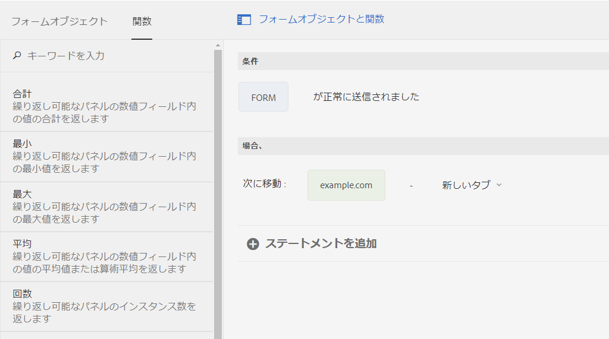

# アダプティブフォームの非同期送信 {#asynchronous-submission-of-adaptive-forms}

これまでの Web フォームは、同期送信用に設定されていました。同期送信では、ユーザーがフォームを送信すると、確認ページ、ありがとうページ、または送信に失敗した場合はエラーページにリダイレクトされます。しかし、現在では、単一ページアプリケーションなどの最新の Web エクスペリエンスが広く使用されるようになっています。こうしたアプリケーションでは、バックグラウンドでクライアントとサーバー間の通信が実行されている間は、Web ページが静的な状態のままになります。非同期送信を設定すると、アダプティブフォームでこのエクスペリエンスを提供できます。

非同期送信では、ユーザーがフォームを送信すると、フォーム開発者は、別のフォームや Web サイトの別のセクションにリダイレクトするなど、別のエクスペリエンスを差し込みます。また、作成者は、別のデータストアへのデータ送信やカスタム解析エンジンの追加など、別のサービスを差し込むこともできます。非同期送信の場合、送信されたフォームデータがサーバー上で検証される際に、フォームが再読み込みされたりフォームの URL が変更されたりすることがないので、アダプティブフォームが単一ページアプリケーションのように動作します。

ここからは、アダプティブフォームの非同期送信について詳しく説明します。

## 非同期送信の設定 {#configure}

アダプティブフォームの非同期送信を設定するには、以下の手順を実行します。

1. アダプティブフォームのオーサリングモードで、フォームコンテナオブジェクトを選択し、 をタップしてプロパティを開きます。
1. 「**[!UICONTROL 送信]**」プロパティセクションで、「**[!UICONTROL 非同期送信を使用]**」を有効にします。
1. 「**[!UICONTROL 送信時]**」セクションで、フォームが正常に送信された場合に実行するオプションを以下のどちらかから選択します。

   * **[!UICONTROL URL にリダイレクト]**：フォームの送信時に、指定の URL またはページにリダイレクトされます。「**[!UICONTROL リダイレクト URL / パス]**」フィールドで URL を指定することも、ページのパスを参照して選択することもできます。
   * **[!UICONTROL メッセージを表示]**：フォームの送信時にメッセージを表示します。「**[!UICONTROL メッセージを表示]**」オプションの下のテキストフィールドにメッセージを入力できます。このテキストフィールドは、リッチテキスト形式をサポートします。

1.  をタップしてプロパティを保存します。

## 非同期送信の仕組み {#how-asynchronous-submission-works}

[!DNL Experience Manager Forms] には、すぐに使用できる、フォーム送信の成功および失敗ハンドラーが用意されています。ハンドラーは、サーバー応答に基づいて実行されるクライアントサイド関数です。フォームが送信されると、データが検証のためにサーバーに転送され、送信の成功またはエラーイベントに関する情報と共に、応答がクライアントに返されます。この情報は、関連するハンドラーにパラメーターとして渡され、関数が実行されます。

また、フォームの作成者と開発者は、フォームレベルでルールを記述して、デフォルトのハンドラーを上書きできます。詳しくは、「[ルールを使用したデフォルトハンドラーの上書き](#custom)」を参照してください。

最初に、成功およびエラーイベントに対するサーバー応答について説明します。

### 送信成功イベントに対するサーバー応答 {#server-response-for-submission-success-event}

送信成功イベントに対するサーバー応答は、以下のような構造になっています。

```json
{oneOf: [
{  properties : {
     contentType : {"type" : "string",  "enum" : ["xmlschema", "jsonschema"]},
    data : {type : "string", description : "Form data in XML or  JSON  format"},
   thankYouOption : {type : "string"}
   }},
  properties : {
     contentType : {"type" : "string",  "enum" : ["xmlschema", "jsonschema"]},
    data : {type : "string", description : "Form data in XML or  JSON  format"},
   thankYouContent: {type: "string"}
   }
]

}
```

フォーム送信が成功した場合に含まれるサーバー応答を以下に示します。

* フォームデータのフォーマットタイプ：XML または JSON
* XML 形式または JSON 形式のフォームデータ
* フォームに設定された、ページにリダイレクトするかメッセージを表示するために選択されたオプション
* フォームに設定された、ページの URL またはメッセージの内容

成功ハンドラーは、サーバー応答を読み取り、それに応じて、設定されたページ URL にリダイレクトしたりメッセージを表示したりします。

### 送信エラーイベントに対するサーバー応答 {#server-response-for-submission-error-event}

送信エラーイベントに対するサーバー応答は、以下のような構造になっています。

```json
{
   errorCausedBy : "<CAPTCHA_VALIDATION or SERVER_SIDE_VALIDATION>",

   errors : [
               { "somExpression" : "<SOM Expression>",
                 "errorMessage"  : "<Error Message>"
               },
               ...
             ]
 }
```

フォーム送信がエラーになった場合に含まれるサーバー応答を以下に示します。

* エラーの理由、失敗した CAPTCHA またはサーバーサイド検証
* 検証が失敗したフィールドの SOM 式と、対応するエラーメッセージを含む、エラーオブジェクトのリスト

エラーハンドラーは、サーバー応答を読み取り、それに応じて、フォーム上にエラーメッセージを表示します。

## ルールを使用したデフォルトハンドラーの上書き {#custom}

フォームの開発者と作成者は、デフォルトのハンドラーを上書きするルールをフォームレベルで作成できます。成功イベントおよびエラーイベントに対するサーバー応答は、フォームレベルで公開されます。開発者は、ルール内で `$event.data` を使用してサーバー応答にアクセスできます。

成功イベントとエラーイベントを処理するためのルールを作成するには、以下の手順を実行します。

1. アダプティブフォームをオーサリングモードで開いて、任意のフォームオブジェクトを選択し、 をタップしてルールエディターを開きます。
1. フォームオブジェクトツリーで「**[!UICONTROL フォーム]**」選択し、「**[!UICONTROL 作成]**」をタップします。
1. 「**[!UICONTROL 正常に送信された]**」または「**[!UICONTROL 送信が失敗した]**」を&#x200B;**[!UICONTROL 状態を選択]**&#x200B;ドロップダウンリストから選択します。
1. 選択した状態の **[!UICONTROL THEN]** アクションを定義します。例えば、「**[!UICONTROL 次に移動]**」を選択し、URL を入力または貼り付けます。「**[!UICONTROL 関数]**」タブを使用して、任意の関数をルールにドラッグすることもできます。

   

1. 「**[!UICONTROL 完了]**」をクリックして、ルールを保存します。
