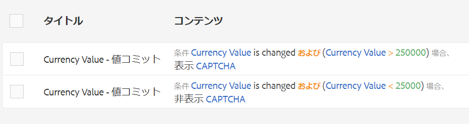

# コアコンポーネントに基づく AEM アダプティブフォームでの Google reCAPTCHA の使用 {#using-reCAPTCHA-in-adaptive-forms}

| 適用先 | 記事リンク |
| -------- | ---------------------------- |
| コアコンポーネントに基づくアダプティブフォーム | この記事 |
| 基盤コンポーネントに基づくアダプティブフォーム | [ここをクリックしてください](/help/forms/captcha-adaptive-forms.md) |

CAPTCHA（コンピュータと人間を区別する完全に自動化された公開チューリングテスト）は、人間と自動化されたプログラム／ボットを区別するために、オンライントランザクションで一般的に使用されるプログラムです。テストを行ってユーザーの反応を評価し、サイトを使用しているのが人間かボットかを判断します。テストが失敗した場合の続行を防ぎ、ボットによるスパムの投稿や悪意のある目的を防止することで、オンライントランザクションの安全性を高めます。

AEM Forms as a Cloud Service は、次の CAPTCHA ソリューションをサポートしています。

* [Google reCAPTCHA](#connect-your-aem-forms-environment-with-recaptcha-service-by-google)
* [hCaptcha](/help/forms/integrate-adaptive-forms-hcaptcha-core-components.md)

## AEM Forms コアコンポーネントと Google による reCAPTCHA サービスとの接続 {#connect-your-forms-environment-with-recaptcha-service-by-google}

フォームの作成者は、Google による reCAPTCHA サービスを使用してアダプティブフォームに CAPTCHA を実装できます。サイトを保護する高度な CAPTCHA 機能を提供します。reCAPTCHA の仕組みについて詳しくは、[Google reCAPTCHA](https://developers.google.com/recaptcha/) を参照してください。これを使用して、フォームの送信時に CAPTCHA の課題を提示します。[!DNL AEM Forms] as a [!DNL Cloud Service] は、Google reCAPTCHA v2 および reCAPTCHA Enterprise をサポートしています。その他のバージョンはサポートされません。また、アダプティブフォームの CAPTCHA は、AEM Forms アプリのオフラインモードではサポートされていません。

要件に基づいて、reCAPTCHA サービスを設定して、次を有効にすることができます。

* [reCAPTCHA Enterprise](#steps-to-implement-reCAPTCHA-enterprise-in-forms-core-components)
* [reCAPTCHA v2](#steps-to-implement-reCAPTCHA-v2-in-forms)

### reCAPTCHA Enterprise の設定  {#steps-to-implement-reCAPTCHA-enterprise-in-forms-core-components}

1. を作成または選択します。 [Google Cloud プロジェクト](https://cloud.google.com/recaptcha-enterprise/docs/set-up-non-google-cloud-environments-api-keys?hl=ja#before-you-begin) を有効にします。 [reCAPTCHA Enterprise API](https://cloud.google.com/recaptcha-enterprise/docs/set-up-non-google-cloud-environments-api-keys?hl=ja#enable-the-recaptcha-enterprise-api).
1. の取得 [プロジェクト ID](https://support.google.com/googleapi/answer/7014113?hl=en#:~:text=To%20locate%20your%20project%20ID,a%20member%20of%20are%20displayed) をクリックし、 [API キー](https://cloud.google.com/recaptcha-enterprise/docs/set-up-non-google-cloud-environments-api-keys?hl=ja#create_an_api_key) および [web サイトのサイトキー](https://cloud.google.com/recaptcha-enterprise/docs/create-key?hl=ja#create-key).
1. クラウドサービス用の設定コンテナを作成します。

   1. **[!UICONTROL ツール／一般／設定ブラウザー]**&#x200B;に移動します。
   1. 次の手順に従って、フォルダーを選択するか、フォルダーを作成し、クラウド設定用にフォルダーを有効にします。
      1. 設定ブラウザーで、フォルダーを選択して「**[!UICONTROL プロパティ]**」をクリックします。
      1. 設定プロパティダイアログで、「**[!UICONTROL クラウド設定]**」を有効にします。
      1. 「**[!UICONTROL 保存して閉じる]**」を選択して設定内容を保存し、ダイアログを閉じます。

1.  のクラウドサービスを設定します[!DNL reCAPTCHA Enterprise]。

   1. Experience Manager オーサーインスタンスで、／**[!UICONTROL クラウドサービス]**&#x200B;に移動します。
   1. 「**[!UICONTROL reCAPTCHA]**」を選択します。設定ページが表示されます。作成した設定コンテナを選択し、「**[!UICONTROL 作成]**」をクリックします。
   1.  としてバージョンを選択し、[!DNL reCAPTCHA Enterprise]名前、reCAPTCHA Enterprise サービスのプロジェクト ID、サイトキーおよび API キー（手順 2 および で取得）を指定します。
   1. キーのタイプを選択します。キーのタイプは、[Google Cloud プロジェクト](https://cloud.google.com/recaptcha-enterprise/docs/set-up-non-google-cloud-environments-api-keys?hl=ja#before-you-begin)で設定したサイトキー（**チェックボックスサイトキー**&#x200B;または&#x200B;**スコアベースのサイトキー**&#x200B;など）と同じにする必要があります。
   1. を指定します。 [0 ～ 1 の範囲のしきい値スコア](https://cloud.google.com/recaptcha-enterprise/docs/interpret-assessment?hl=ja#interpret_scores). スコアがしきい値以上になると、人間のインタラクションを識別し、それ以外の場合はボットのインタラクションとみなされます。
   1. 「**[!UICONTROL 作成]**」を選択して、クラウドサービス設定を作成します。

<!--
    1. In the Edit Component dialog, specify the name, project ID, site key, API key (obtained in steps 2 and 3), select the key type, and enter the threshold score. Select **[!UICONTROL Save Settings]** and then select **[!UICONTROL OK]** to complete the configuration.
-->

reCAPTCHA Enterprise サービスを有効にすると、アダプティブフォームで使用できるようになります。[アダプティブフォームでの CAPTCHA の使用](#using-reCAPTCHA)を参照してください。

<!--

-->

### Google reCAPTCHA v2 の設定 {#steps-to-implement-reCAPTCHA-v2-in-forms}

1. Google から [reCAPTCHA API キーペア](https://www.google.com/recaptcha/admin)を取得します。これには、**サイトキー**&#x200B;と&#x200B;**秘密鍵**&#x200B;が含まれます。

   
1. 設定コンテナを AEM Forms as a Cloud Service 環境に作成します。設定コンテナには、AEM を外部サービスに接続するために使用されるクラウド設定が格納されます。Google で AEM Forms 環境を reCAPTCHA サービスに接続するための設定コンテナを作成および設定するには、次の手順を実行します。
   1. AEM Forms as a Cloud Service インスタンスを開きます。
   1. **[!UICONTROL ツール／一般／設定ブラウザー]**&#x200B;に移動します。設定ブラウザーでは、次の操作を実行できます。
   1. 既存のフォルダーを選択するか、フォルダーを作成します。フォルダーを作成して、そのフォルダーの「クラウド設定」オプションを有効にしたり、既存のフォルダーの「クラウド設定を有効にする」オプションを有効にしたりできます。

      * フォルダーを作成し、それに対して「クラウド設定」オプションを有効にするには、次の手順を実行します。
         1. 設定ブラウザーで「**[!UICONTROL 作成]**」をタップします。
         1. 設定作成ダイアログで、名前とタイトルを指定し、「**[!UICONTROL クラウド設定]**」オプションを選択します。
         1. 「**[!UICONTROL 作成]**」をクリックします
      * 既存のフォルダーに対して「クラウド設定」オプションを有効にするには：
         1. 設定ブラウザーで、フォルダーを選択して「**[!UICONTROL プロパティ]**」を選択します。
         1. 設定プロパティダイアログで、「**[!UICONTROL クラウド設定]**」を有効にします。
         1. 「**[!UICONTROL 保存して閉じる]**」を選択して設定内容を保存し、ダイアログを閉じます。

1. Cloud Service を設定：
   1. AEM オーサーインスタンスで、／**[!UICONTROL クラウドサービス]**&#x200B;に移動し、「**[!UICONTROL reCAPTCHA]**」を選択します。
   1. 前の節で作成または更新した設定コンテナを選択します。「**[!UICONTROL 作成]**」を選択します。
   1. reCAPTCHA サービス用（手順 1 で取得）に&#x200B;**[!UICONTROL タイトル]**、**[!UICONTROL 名前]**、**[!UICONTROL サイトキー]**&#x200B;および **[!UICONTROL 秘密鍵]**&#x200B;を指定します。「**[!UICONTROL 作成]**」を選択します。

   

   reCAPTCHA サービスを設定すると、アダプティブフォームで使用できるようになります。詳しくは、[アダプティブフォームでの Google reCAPTCHA の使用](#using-reCAPTCHA)を参照してください。

アダプティブフォームでの Google reCAPTCHA の使用

## アダプティブフォームで Google reCAPTCHA を使用 {#using-reCAPTCHA}

アダプティブフォームで reCAPTCHA を使用するには：

1. AEM Forms as a Cloud Service インスタンスを開きます。
1. **[!UICONTROL Forms]**／**[!UICONTROL フォームとドキュメント]**&#x200B;に移動します。
1. アダプティブフォームを選択し、「**[!UICONTROL プロパティ]**」を選択します。「**[!UICONTROL 設定コンテナ]**」オプションで AEM Forms を Google の reCAPTCHA サービスに接続するクラウド設定を含む設定コンテナを選択し、「**[!UICONTROL 保存して閉じる]**」を選択します。

   このような設定コンテナがない場合は、[Googleによる reCAPTCHA サービスを使用した AEM Forms 環境の接続](#connect-your-forms-environment-with-recaptcha-service-by-google)の節を参照して、設定コンテナを作成する方法を確認してください。

   

1. アダプティブフォームを選択し、「**[!UICONTROL 編集]**」を選択します。アダプティブフォームエディターでアダプティブフォームが開きます。
1. コンポーネントブラウザーから **[!UICONTROL アダプティブフォーム reCAPTCHA]** コンポーネントをアダプティブフォームにドラッグ＆ドロップします。

   >[!NOTE]
   > * Google reCAPTCHA 検証は時間的制約があり、数分で期限切れになります。そのため、**[!UICONTROL アダプティブフォーム reCAPTCHA]** コンポーネントを&#x200B;**[!UICONTROL 送信]**&#x200B;ボタンのすぐ前に配置することをお勧めします。

1. **[!UICONTROL アダプティブフォーム reCAPTCHA]** コンポーネントを選択し、プロパティ  アイコンを選択します。プロパティダイアログが開きます。次の必須プロパティを指定します。
   * **[!UICONTROL 名前]：** フォームコンポーネントは、フォーム内とルールエディター内の両方で一意の名前で簡単に識別できますが、名前にスペースや特殊文字を含めることはできません。
   * **[!UICONTROL タイトル]：** Captcha ウィジェットのタイトルを指定します。デフォルト値は **Captcha** です。タイトルを表示しない場合は、「**タイトルを非表示にする**」を選択します。タイトルをリッチテキスト形式で編集するには、「**タイトルのリッチテキストを許可**」を選択します。また、タイトルを&#x200B;**非バインドフォーム要素**&#x200B;としてマークすることもできます。
   * **[!UICONTROL Captcha 設定]：**&#x200B;フォームの Google reCAPTCHA ダイアログを表示するには、**reCAPTCHA Enterprise** または **reCAPTCHA v2** の設定ドロップダウンから設定を選択します。
      1. 次を選択した場合、 **reCAPTCHA Enterprise** バージョンの場合、キーのタイプは **チェックボックス** または **スコアベース**&#x200B;の場合、設定時の選択内容に基づきます [web サイトのサイトキー](https://cloud.google.com/recaptcha-enterprise/docs/create-key?hl=ja#create-key):

         >[!NOTE]
         >
         >* クラウド設定で、 **キーの種類** as **チェックボックス**&#x200B;を指定した場合、captcha の検証が失敗すると、カスタマイズされたエラーメッセージがインラインメッセージとして表示されます。
         >* クラウド設定で、 **キーの種類** as **スコアベース**&#x200B;を指定した場合、カスタマイズされたエラーメッセージは、captcha の検証が失敗した場合にポップアップメッセージとして表示されます。

      1. サイズは、「**[!UICONTROL 標準]**」と「**[!UICONTROL コンパクト]**」から選択できます。

     >[!NOTE]
     >* 同様の目的で、環境内に複数のクラウド設定を作成することができます。そのため、サービスは慎重に選択してください。サービスが表示されない場合は、[Googleによる reCAPTCHA サービスを使用した AEM Forms 環境の接続](#connect-your-forms-environment-with-recaptcha-service-by-google)で、AEM Forms 環境と Google の reCAPTCHA サービスを接続する Cloud Service を作成する方法を参照してください。

   * **Captcha サイズ：**「Google reCAPTCHA チャレンジ」ダイアログの表示サイズを選択できます。「**[!UICONTROL コンパクト]**」オプションを選択すると小さいサイズ、「**[!UICONTROL 標準]**」オプションを選択すると比較的大きなサイズの Google reCAPTCHA チャレンジダイアログを表示できます。
次を選択した場合、 **reCAPTCHA v2** バージョン：
      1. reCAPTCHA ウィジェットのサイズを、「**[!UICONTROL 標準]**」または「**[!UICONTROL コンパクト]**」から選択します。
      1. また、「**[!UICONTROL 非表示]** option to show the CAPTCHA chall」オプションを使用して、疑わしいアクティビティの場合にのみ CAPTCHA チャレンジを表示できます。

   アダプティブフォーム上で reCAPTCHA サービスが有効になります。フォームをプレビューして、CAPTCHA が機能していることを確認できます。以下に表示されている **reCAPTCHA による保護**&#x200B;バッジが保護されたフォームに表示されます。

   

1. 「**[!UICONTROL 完了]**」を選択します。

   reCAPTCHA **で保護された** がアダプティブフォームに表示されます。Google reCAPTCHA サービスを使用するように設定されているすべてのアダプティブフォームに表示されます。

   現在、フォームの入力者は Google reCAPTCHA サービスによって提供される課題を正常にクリアした正規のフォームのみを送信できます。

<!--
### Show or hide CAPTCHA component based on rules {#show-hide-captcha}

You can select to show or hide the CAPTCHA component based on rules that you apply on a component in an Adaptive Form. Select the component, select , and select **[!UICONTROL Create]** to create a rule. For more information on creating rules, see [Rule Editor](rule-editor.md).

For example, the CAPTCHA component must display in an Adaptive Form only if the Currency Value field in the form has a value of more than 25000.

Select the **[!UICONTROL Currency Value]** field in the form and create the following rules:

   >[!NOTE]
   >
   > When you select a reCAPTCHA v2 configuration and the size is set to [!UICONTROL Invisible], the show/hide option remains disabled.

   -->

## よくある質問

**Q：アダプティブフォーム内で複数の Captcha コンポーネントを使用できますか。**
**A：** アダプティブフォームでは、複数の Captcha コンポーネントを使用することはできません。また、遅延読み込みのマークが付けられたフラグメントやパネルで Captcha コンポーネントを使用することはお勧めしません。

## 関連トピック {#see-also}

{{see-also}}
