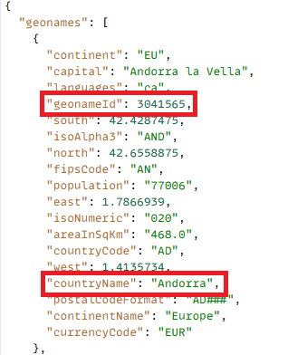
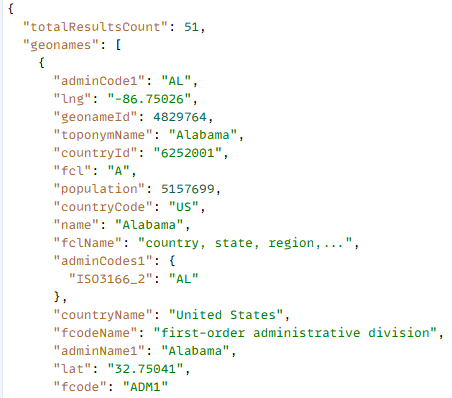
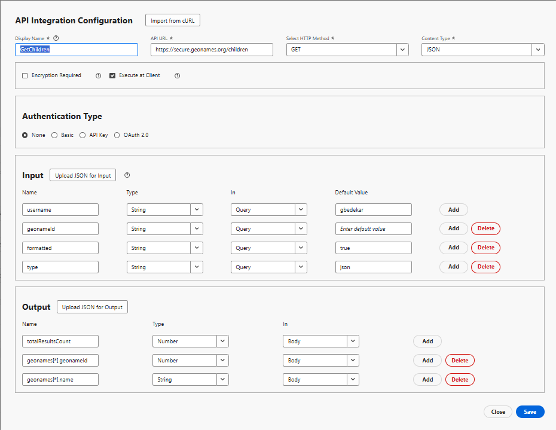

# API 統合を作成

このチュートリアルでは、2 つの API 統合が作成されます

- GetAllCountries 国のリストを返します
- GetChildren - geonameId で表される国または州の直属の子を返します

## GetAllCountries - API 統合設定

- API 統合設定

   - 表示名：GetAllCountries→、システム内のこの API のラベルです。

   - API URL:`https://secure.geonames.org/countryInfoJSON` – 呼び出すエンドポイント。

   - HTTP メソッド：GET - シンプルなGET リクエストを行います。

   - コンテンツタイプ：JSON – 応答は JSON 形式で要求されます。

- オプション :

   - 暗号化は必須オフ - HTTPS 以外の暗号化レイヤーはありません。

   - クライアント側で実行をオン – 呼び出しは、サーバーサイドではなく、クライアント/ブラウザーから実行されます。
- 認証タイプ
   - なし – GeoNames API はヘッダーで OAuth または API キーを必要としないので
- 必要情報：
   - 入力セクションは、API に何が送信されるかを定義します。
   - **username** → type：文字列、クエリで送信されます。デフォルト：gbedekar。
   - すべてのリクエストで、URL に？username=gbedekar が追加されます
- 出力
   - 出力は、JSON 応答から抽出され、使用されるフィールドを定義します。
GeoNames 応答は次のようになります。

  
   - geonames 配列内から 2 つのフィールドをマッピングしました。

     geonames[*].geonameId → as a Number

     geonames[*].countryName → as a String

     [*] は、配列内の国ごとに繰り返されることを意味します。

## GetChildren

geonamesId がクエリパラメーターとして渡される場所の直近の子を GeoNames に要求します

- API 統合設定

   - 表示名：GetAllCountries→、システム内のこの API のラベルです。

   - API URL：呼び出→エンドポイントの `https://secure.geonames.org/children`。

   - HTTP メソッド：GET →簡単なGET リクエストを行っています。

   - コンテンツタイプ：JSON →応答は JSON 形式で要求されます。

- オプション :

   - 暗号化が必要ですオフ→すると、HTTPS 以外の暗号化レイヤーはなくなります。

   - 「クライアントで実行」をオンにすると、呼び出し→サーバーサイドではなくクライアント/ブラウザーから実行されます。
- 認証タイプ
   - なし – GeoNames API はヘッダーで OAuth または API キーを必要としないので
- 必要情報：
   - API に送信される内容を定義します。
   - **username** → type：文字列、クエリで送信されます。デフォルト：gbedekar。
   - すべてのリクエストで、URL に？username=gbedekar が追加されます
   - **geonameId** -> 型：文字列。 geonameId で表される国/州の子を返します
   - **type** => 文字列。 json に設定すると、JSON 形式で応答が返されます。
- 出力
   - JSON 応答から抽出され、使用されるフィールドを定義します。
GeoNames 応答は次のようになります。

  
   - geonames 配列内から 2 つのフィールドをマッピングしました。

     geonames[*].geonameId → as a Number

     geonames[*].name → as a String

     [*] は、配列内の国ごとに繰り返されることを意味します。

