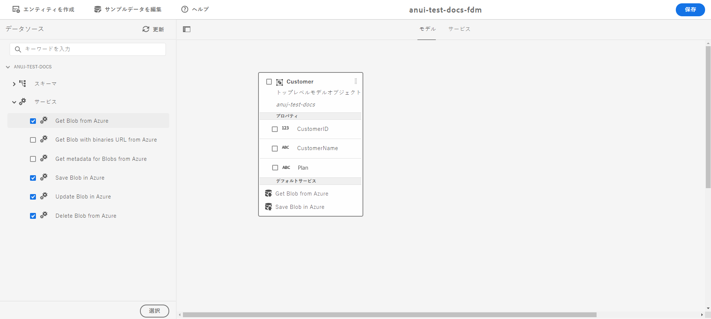

# [!DNL Azure] ストレージの設定 {#configure-azure-storage}

[[!DNL Experience Manager Forms] データ統合](data-integration.md)では、フォームを [!DNL Azure] ストレージサービスと統合するための [!DNL Azure] ストレージ設定を提供します。フォームデータモデルを使用して、[!DNL Azure] サーバーと連携するアダプティブフォームを作成することにより、ビジネスワークフローを使用できるようになります。次に例を示します。

* アダプティブフォームの送信時に、データを [!DNL Azure] に書き込む。
* フォームデータモデル内で定義されているカスタムエンティティを使用して、データを [!DNL Azure] に書き込む（またはその逆の動作）。
* [!DNL Azure] サーバーに対してデータに関するクエリを実行し、アダプティブフォームに事前入力する。
* [!DNL Azure] サーバーからデータを読み取る。

## [!DNL Azure] ストレージ設定の作成 {#create-azure-storage-configuration}

これらの手順を実行する前に、[!DNL Azure] ストレージアカウントと、[!DNL Azure] ストレージアカウントへのアクセスを許可するためのアクセスキーがあることを確認してください。

1. **[!UICONTROL ツール]**／**[!UICONTROL クラウドサービス]**／**[!UICONTROL Azure ストレージ]**&#x200B;に移動します。
1. 設定を作成するフォルダーを選択して、「**[!UICONTROL 作成]**」をタップします。
1. 「**[!UICONTROL タイトル]**」フィールドで設定のタイトルを指定します。
1. 「**[!UICONTROL Azure ストレージアカウント]**」フィールドで [!DNL Azure] ストレージアカウントの名前を指定します。
1. Azure ストレージアカウントにアクセスするためのキーを「**[!UICONTROL Azure アクセスキー]**」フィールドで指定し、「**[!UICONTROL 保存]**」をタップします。

## フォームデータモデルの作成 {#create-azure-form-data-model}

[!DNL Azure] ストレージ設定を作成したら、[フォームデータモデルを作成](create-form-data-models.md)できます。フォームデータモデルの作成時に、[!DNL Azure] 設定を含んだフォルダーを「**[!UICONTROL データソース設定]**」フィールドで指定します。これにより、指定したフォルダーに存在する設定のリストから設定を選択できるようになります。

### フォームデータモデルへの [!DNL Azure] サービスの追加 {#add-azure-services}

フォームデータモデルとデータモデルオブジェクトを作成したら、[!DNL Azure] サービスをフォームデータモデルに追加できます。

[!DNL Azure] サービスを追加するには：

1. 編集モードで、左側のウィンドウの「**[!UICONTROL サービス]**」セクションからサービスを選択し、「**[!UICONTROL 選択]**」をタップします。選択したサービスが、フォームデータモデルの「**[!UICONTROL サービス]**」タブに表示されます。

   

1. 「**[!UICONTROL サービス]**」タブで、サービスを選択して&#x200B;**[!UICONTROL プロパティを編集]**&#x200B;します。サービスに基づいて、サービスの入力または出力モデルオブジェクトを定義します。

1. 「**[!UICONTROL 保存]**」をタップして、フォームデータモデルを保存します。

   使用可能な [!DNL Azure] サービスを次の表に示します。

   <table>
    <tbody>
     <tr>
      <th><strong>サービス名</strong></th>
      <th><strong>説明</strong></th>
     </tr>
     <tr>
      <td>Azure から BLOB を取得</td>
      <td>ID または名前を使用して、Azure ストレージに BLOB として保存されているデータを取得します</td>
     </tr>
     <tr>
      <td>Azure から BLOB とバイナリ URL を取得</td>
      <td>ID または名前を使用して、Azure ストレージに BLOB として保存されているデータとバイナリの URL を取得します</td>
     </tr>
     <tr>
      <td>Azure に BLOB を保存</td>
      <td>BLOB ID を使用して Azure ストレージにデータを保存します</td>
     </tr>
     <tr>
      <td>Azure 内の BLOB を更新</td>
      <td>BLOB ID を使用して Azure ストレージ内のデータを更新します</td>
     </tr>
     <tr>
      <td>Azure から BLOB ID のリストを取得</td>
      <td>入力リクエストで定義された番号に基づいて、Azure から BLOB ID のリストを取得します</td>
     </tr>
     <tr>
      <td>Azure から BLOB の SAS URL を取得</td>
      <td>入力リクエストの BLOB ID に基づいて、Azure から BLOB の SAS URL を取得します</td>
     </tr>
     <tr>
      <td>Azure から BLOB を削除</td>
      <td>BLOB ID を使用して Azure ストレージからデータを削除します</td>
     </tr>
    </tbody>
   </table>

### データモデルオブジェクトプロパティを検索キーとして定義 {#define-data-model-object-as-metadata}

データモデルオブジェクトプロパティを検索キーとして定義するには：

1. 「**[!UICONTROL モデル]**」タブで、データモデルオブジェクトプロパティを選択して「**[!UICONTROL プロパティを編集]**」をタップします。
1. 「**[!UICONTROL 検索キー]**」切り替えオプションをオン状態に切り替えます。このオプションは、プライマリデータ型にのみ使用できます。
1. 「**[!UICONTROL 完了]**」をタップしてから「**[!UICONTROL 保存]**」をタップして、フォームデータモデルを保存します。

データモデルオブジェクトのプロパティを検索キーとして定義した後、ハッシュ値は Azure インデックスタグに格納され、Base64 でエンコードされた値は Azure メタデータに格納されます。

>[!NOTE]
>
>Azure では BLOB ごとに 10 個のタグしか許可されておらず、検索キーとしてマークされたプロパティ値はハッシュ後に Azure インデックスタグに格納されるため、Azure エンティティごとに許可される検索キーは 10 個のみです。
