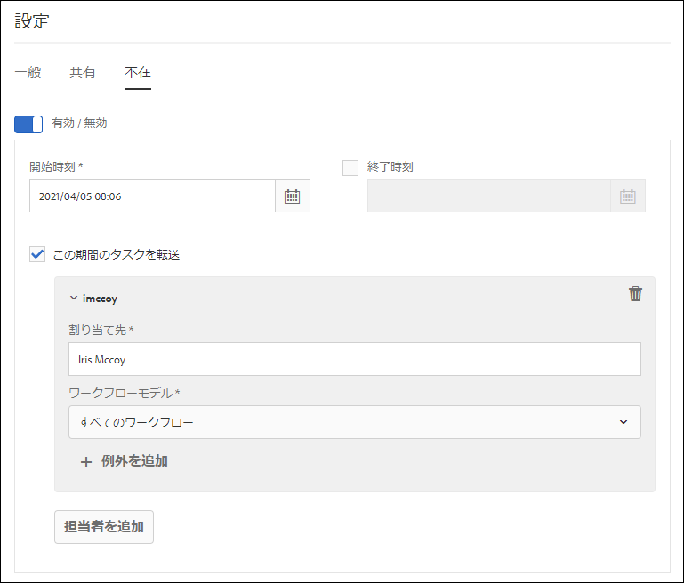

# 不在時の設定 {#configure-out-of-office-settings}

不在にする予定がある場合は、その期間に割り当てられる項目に対して実行する操作を指定できます。

不在設定が有効になる開始日時および終了日時を指定するオプションがあります。タイムゾーンがサーバーとは異なる場合は、クライアントのタイムゾーンが使用されます。

すべての項目が送信されるデフォルトのユーザーを設定できます。また、特定のプロセスの項目を別のユーザーに送信したり、社内に戻るまでインボックスに残しておく例外を指定することもできます。指定した別のユーザーも不在の場合は、さらに別の指定されたユーザーに項目が送信されます。項目を不在でないユーザーに割り当てることができない場合、項目は最初のユーザーのインボックスに残ります。

ワークフローモデルに基づいて項目の委任を分離できます。例えば、ワークフロー A に関連する項目をユーザー A に割り当て、ワークフロー B に関連する項目をユーザー B に割り当てることができます。

>[!NOTE]
>
>* 不在設定を有効にすると、設定を有効にする前にインボックスで使用可能だったすべての項目は、インボックスに残ります。設定を有効にした後に受信した項目のみが委任されます。
>* 不在設定をオフにしても、委任された項目は、自動的には割り当て直されません。クレーム機能を使用して、項目を自分に割り当てることができます。
>* ユーザー A が項目をユーザー B に委任し、ユーザー B がさらにユーザー C に委任すると、項目はユーザー C にのみ割り当てられ、ユーザー B には割り当てられません。
>* 割り当てにループがある場合、タスクは元のユーザーに残ります。例えば、ユーザー A が項目をユーザー B に委任し、ユーザー B がユーザー C に委任し、ユーザー C がユーザー D に委任し、ユーザー D がユーザー B に委任すると、ループが作成されます。この場合、項目は元のユーザーに残ります。上記の例では、ユーザー A が元のユーザーです。

## アカウントの不在設定を有効にする {#enable-out-of-office}

アカウントの不在設定を有効にして、インボックス項目を別のユーザーに委任するには、以下の手順を実行します。

1. AEM インスタンスにログインします。 アイコンをタップし、「**[!UICONTROL すべて表示]**」をタップします。インボックス項目のリストが表示されます。
1. 「**[!UICONTROL 作成]**」ボタンの横にある「」または  アイコンをタップし、「**[!UICONTROL 設定]**」をタップします。設定ダイアログが表示されます。
1. 設定ダイアログの「**[!UICONTROL 不在]**」タブを開きます。
1. 「**[!UICONTROL 有効 / 無効]**」ボタンをタップして、不在設定を有効にします。
1. 設定の&#x200B;**[!UICONTROL 開始時刻]**&#x200B;と&#x200B;**[!UICONTROL 終了時刻]**&#x200B;を指定します。項目は、指定した期間にのみ委任されます。項目を無期限に委任するには、「**[!UICONTROL 終了時刻]**」フィールドを空のままにします。
1. 「**[!UICONTROL この期間のタスクを転送]**」チェックボックスを選択します。このオプションを選択せずに担当者を指定しない場合、項目はどのユーザーにも転送されません。不在で設定が有効になっている場合でも、項目はインボックスに残ります。
1. 「**[!UICONTROL 担当者を追加]**」をタップします。「**[!UICONTROL 割り当て先]**」フィールドに、項目を委任するユーザーを指定します。指定したユーザーに委任する&#x200B;**[!UICONTROL ワークフローモデル]**&#x200B;を指定します。複数のワークフローモデルを選択できます。

   また、ワークフローモデルに関係なく、すべての項目を特定のユーザーに割り当てるには、ワークフローモデルドロップダウンリストから「**[!UICONTROL すべてのワークフロー]**」を選択します。 

   いくつかを除くすべてのワークフローモデルについて、特定のユーザーに項目を割り当てるには、ワークフローモデルドロップダウンリストから「**[!UICONTROL すべてのワークフロー]**」を選択し、「**[!UICONTROL 例外を追加]**」をタップして、除外するワークフローモデルを指定します。
    

   手順を繰り返して、さらに担当者を追加します。 

   >[!NOTE]
   >
   >担当者の順序は重要です。不在設定を有効にしているユーザーに項目が割り当てられると、その項目は、指定された担当者リストに対して、担当者が追加される順序で評価されます。項目が基準を満たすと、その項目が担当者に割り当てられ、次の担当者はチェックされません。

1. 「**[!UICONTROL 保存]**」をタップします。設定は、指定された開始日時に有効になります。不在中にログインしても、設定を変更するまでは不在と見なされます。

これで、不在期間中に割り当てられた項目は、指定された担当者に自動的に割り当てられます。

>[!NOTE]
>
>（フォーム中心のワークフロー項目のみ）ワークフローの「**[!UICONTROL タスクを割り当て]**」ステップの「**[!UICONTROL 担当者が「不在」設定を使用して委任することを許可する]**」オプションを有効にします。前述のオプションが有効になっている項目のみが他のユーザーに委任されます。

## 制限事項 {#limitations}

* グループへの項目の割り当てはサポートされていません。
* 現在、プロジェクトタスクに対する不在を有効にすることはできません。
