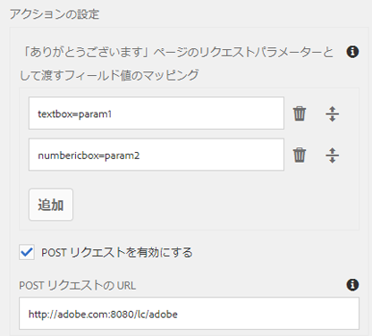

# REST エンドポイントへの送信アクションのアダプティブフォームの設定

設定を使用して REST エンドポイントを指定する機能は早期導入プログラムであり、コアコンポーネントと Edge Delivery Services Forms にのみ適用できます。公式メール ID から `aem-forms-ea@adobe.com` に送信して早期導入プログラムに参加し、機能へのアクセスをリクエストできます。

**[!UICONTROL REST エンドポイントへの送信]**&#x200B;アクションを使用して、送信されたデータを REST URL に POST できます。URL は、内部（フォームがレンダリングされるサーバー）または外部サーバーのどちらのものでも使用できます。

AEM as a Cloud Service では、フォーム送信を処理するための様々な送信アクションが標準で提供されます。これらのオプションについて詳しくは、[アダプティブフォーム送信アクション](/help/forms/aem-forms-submit-action.md)の記事をご覧ください。

## メリット

アダプティブフォームの **[!UICONTROL REST エンドポイントへの送信]**&#x200B;の送信アクションを設定するメリットは次のとおりです。

* RESTful API を通じて、フォームデータと外部システムおよびサービスをシームレスに統合できます。
* アダプティブフォームからのデータ送信を柔軟に処理し、動的で複雑なデータ構造をサポートできます。
* REST エンドポイント URL のパラメーターへのフォームフィールドの動的マッピングをサポートし、適応可能でカスタマイズ可能なデータ送信を行うことができます。

## REST エンドポイントへの送信の送信アクションを設定する {#steps-to-configure-submit-to-restendpoint-submit-action}

>[!BEGINTABS]

>[!TAB 基盤コンポーネント]

基盤コンポーネントに基づくアダプティブフォームの Swagger Open API 仕様に基づいて送信アクションを設定するには：

1. 編集用にアダプティブフォームを開き、アダプティブフォームのコンテナプロパティの「**[!UICONTROL 送信]**」セクションに移動します。
1. **[!UICONTROL 送信アクション]**&#x200B;ドロップダウンリストから、「**[!UICONTROL REST エンドポイントへの送信]**」を選択します。

   

   内部サーバーにデータを POST 送信するには、リソースのパスを指定します。データは、リソースのパスに POST されます。例えば、`/content/restEndPoint` のようになります。このような POST リクエストには、送信リクエストの認証情報が使用されます。このオプションを使用すると、ターゲット REST エンドポイントを直接入力できます。
外部サーバーにデータを POST 送信するには、URL を指定します。URL の形式は、`https://host:port/path_to_rest_end_point` です。POST リクエストを匿名で処理するためのパスを設定してください。
   

   上の例で、ユーザーが `textbox` に入力した情報は、パラメーター `param1` を使用して取得されます。`param1` を使用して取得されるデータを POST するための構文を以下に示します。

   `String data=request.getParameter("param1");`

   同様に、XML データと添付ファイルの POST に使用するパラメーターは、`dataXml` および `attachments` です。

   例えば、この 2 つのパラメーターをスクリプト中で使用して、REST エンドポイントに送信されたデータを解析できます。データを格納および解析するための構文を以下に示します。

   `String data=request.getParameter("dataXml");`
   `String att=request.getParameter("attachments");`

   この例では、`data` が XML データを格納し、`att` が添付ファイルデータを格納します。
**[!UICONTROL REST エンドポイントへの送信]**&#x200B;送信アクションでは、フォームに入力されたデータを HTTP GET リクエストの一部として設定済みの確認ページに送信します。リクエストにフィールド名を追加できます。リクエストのフォーマットを以下に示します。
   `{fieldName}={request parameter name}`

   以下の画像に示されているように、`param1` および `param2` が、**textbox** フィールドおよび **numericbox** フィールドからコピーされた値を持つパラメーターとして、次のアクションに向けて渡されます。

   

   **[!UICONTROL POST リクエストを有効にする]**&#x200B;ことで、リクエストを POST する URL を指定することもできます。フォームをホストする AEM サーバーにデータを送信するには、AEM サーバーのルートパスに対応する相対パスを使用します。例えば、`/content/forms/af/SampleForm.html` のようになります。他のサーバーにデータを送信するには、絶対パスを使用します。

1. 「**[!UICONTROL 完了]**」をクリックします。

>[!TAB コアコンポーネント]

コアコンポーネントに基づくアダプティブフォームの Swagger Open API 仕様に基づいて送信アクションを設定するには：

1. コンテンツブラウザーを開き、アダプティブフォームの&#x200B;**[!UICONTROL ガイドコンテナ]**&#x200B;コンポーネントを選択します。
1. ガイドコンテナプロパティ  アイコンをクリックします。 アダプティブフォームコンテナダイアログボックスが開きます。
1. 「**[!UICONTROL 送信]**」タブをクリックします。
1. **[!UICONTROL 送信アクション]**&#x200B;ドロップダウンリストから、「**[!UICONTROL REST エンドポイントへの送信]**」を選択します。

   

   内部サーバーにデータを POST 送信するには、リソースのパスを指定します。データは、リソースのパスに POST されます。例えば、`/content/restEndPoint` のようになります。このような POST リクエストには、送信リクエストの認証情報が使用されます。

   REST エンドポイントを指定するには、次の 2 つのオプションがあります。

   +++URL

   このオプションを使用すると、ターゲット REST エンドポイントを直接入力できます。
外部サーバーにデータを POST 送信するには、URL を指定します。URL の形式は、`https://host:port/path_to_rest_end_point` です。POST リクエストを匿名で処理するためのパスを設定してください。

   

   上の例で、ユーザーが `textbox` に入力した情報は、パラメーター `param1` を使用して取得されます。`param1` を使用して取得されるデータを POST するための構文を以下に示します。

   `String data=request.getParameter("param1");`

   同様に、XML データと添付ファイルの POST に使用するパラメーターは、`dataXml` および `attachments` です。

   例えば、この 2 つのパラメーターをスクリプト中で使用して、REST エンドポイントに送信されたデータを解析できます。データを格納および解析するための構文を以下に示します。

   `String data=request.getParameter("dataXml");`
   `String att=request.getParameter("attachments");`

   この例では、`data` が XML データを格納し、`att` が添付ファイルデータを格納します。

   **[!UICONTROL REST エンドポイントへの送信]**&#x200B;送信アクションでは、フォームに入力されたデータを HTTP GET リクエストの一部として設定済みの確認ページに送信します。リクエストにフィールド名を追加できます。リクエストのフォーマットを以下に示します。

   `{fieldName}={request parameter name}`

   以下の画像に示されているように、`param1` および `param2` が、**textbox** フィールドおよび **numericbox** フィールドからコピーされた値を持つパラメーターとして、次のアクションに向けて渡されます。

   

   **[!UICONTROL POST リクエストを有効にする]**&#x200B;ことで、リクエストを POST する URL を指定することもできます。フォームをホストする AEM サーバーにデータを送信するには、AEM サーバーのルートパスに対応する相対パスを使用します。例えば、`/content/forms/af/SampleForm.html` のようになります。他のサーバーにデータを送信するには、絶対パスを使用します。

   +++

   +++設定

   このオプションを使用すると、AEM の設定ブラウザー経由で管理される事前定義済みの HTTP 設定を追加できます。サービス REST エンドポイント認証タイプおよびコンテンツタイプ用に作成した設定を選択できます。認証タイプとコンテンツタイプについて詳しくは、[データソースの設定](/help/forms/configure-data-sources.md#configure-restful-services-using-service-endpoint-configure-restful-services-service-endpoint)を参照してください。

   +++

1. 「**[!UICONTROL 完了]**」をクリックします。

>[!TAB ユニバーサルエディター]

ユニバーサルエディターでオーサリングされたアダプティブフォームの Swagger Open API 仕様に基づいて送信アクションを設定するには：

1. アダプティブフォームを編集用に開きます。
1. エディターで **フォームプロパティを編集** 拡張機能をクリックします。

   **フォームプロパティ**&#x200B;ダイアログが表示されます。

   >[!NOTE]
   >
   > * ユニバーサルエディターインターフェイスに **フォームプロパティを編集** アイコンが表示されない場合は、Extension Manager で&#x200B;**フォームプロパティを編集**&#x200B;拡張機能を有効にします。
   > * ユニバーサルエディターで拡張機能を有効または無効にする方法については、[Extension Manager 機能のハイライト](https://developer.adobe.com/uix/docs/extension-manager/feature-highlights/#enablingdisabling-extensions)の記事を参照してください。

1. 「**送信**」タブをクリックし、「**[!UICONTROL REST エンドポイントに送信]**」送信アクションを選択します。

   内部サーバーにデータを POST 送信するには、リソースのパスを指定します。データは、リソースのパスに POST されます。例えば、`/content/restEndPoint` のようになります。このような POST リクエストには、送信リクエストの認証情報が使用されます。

   REST エンドポイントを指定するには、次の 2 つのオプションがあります。

   +++URL

   このオプションを使用すると、ターゲット REST エンドポイントを直接入力できます。
外部サーバーにデータを POST 送信するには、URL を指定します。URL の形式は、`https://host:port/path_to_rest_end_point` です。POST リクエストを匿名で処理するためのパスを設定してください。

   

   上の例で、ユーザーが `textbox` に入力した情報は、パラメーター `param1` を使用して取得されます。`param1` を使用して取得されるデータを POST するための構文を以下に示します。

   `String data=request.getParameter("param1");`

   同様に、XML データと添付ファイルの POST に使用するパラメーターは、`dataXml` および `attachments` です。

   例えば、この 2 つのパラメーターをスクリプト中で使用して、REST エンドポイントに送信されたデータを解析できます。データを格納および解析するための構文を以下に示します。

   `String data=request.getParameter("dataXml");`
   `String att=request.getParameter("attachments");`

   この例では、`data` が XML データを格納し、`att` が添付ファイルデータを格納します。

   **[!UICONTROL REST エンドポイントへの送信]**&#x200B;送信アクションでは、フォームに入力されたデータを HTTP GET リクエストの一部として設定済みの確認ページに送信します。リクエストにフィールド名を追加できます。リクエストのフォーマットを以下に示します。

   `{fieldName}={request parameter name}`

   以下の画像に示されているように、`param1` および `param2` が、**textbox** フィールドおよび **numericbox** フィールドからコピーされた値を持つパラメーターとして、次のアクションに向けて渡されます。

   

   **[!UICONTROL POST リクエストを有効にする]**&#x200B;ことで、リクエストを POST する URL を指定することもできます。フォームをホストする AEM サーバーにデータを送信するには、AEM サーバーのルートパスに対応する相対パスを使用します。例えば、`/content/forms/af/SampleForm.html` のようになります。他のサーバーにデータを送信するには、絶対パスを使用します。

   +++

   +++設定

   このオプションを使用すると、AEM の設定ブラウザー経由で管理される事前定義済みの HTTP 設定を追加できます。サービス REST エンドポイント認証タイプおよびコンテンツタイプ用に作成した設定を選択できます。認証タイプとコンテンツタイプについて詳しくは、[データソースの設定](/help/forms/configure-data-sources.md#configure-restful-services-using-service-endpoint-configure-restful-services-service-endpoint)を参照してください

   +++

1. 「**[!UICONTROL 保存して閉じる]**」をクリックします。

>[!ENDTABS]

<!-- ### Configure submit action based on Service Rest Endpoint {#config-service-endpoint-auth}

1. Open the Content browser, and select the **[!UICONTROL Guide Container]** component of your Adaptive Form.
2. Click the Guide Container properties  icon. The Adaptive Form Container dialog box opens. 
3. Click the  **[!UICONTROL Submission]** tab. 
4. From the **[!UICONTROL Submit Action]** drop-down list, select **[!UICONTROL Submit to Rest endpoint]**.
5. Enable the POST request.
6. Specify the REST endpoint URL.
7. Select the Configuration you have created for your Service Rest Endpoint Authentication Type and the Content Types. To know more about Authentication Type and the Content Types, visit [configure data sources](/help/forms/configure-data-sources.md#configure-restful-services-using-service-endpoint-configure-restful-services-service-endpoint).
    
8. Click Done. -->

## ベストプラクティス

* 外部サーバーにデータを POST する場合は、URL がセキュリティで保護されていることを確認し、POST リクエストを匿名で処理して機密情報を保護するパスを設定します。
* フィールドを REST URL 内のパラメーターとして渡すには、すべてのフィールドが異なる要素名を持っている必要があります。これは、異なるパネルに置かれているフィールドにも適用されます。

## 関連記事

{{af-submit-action}}
