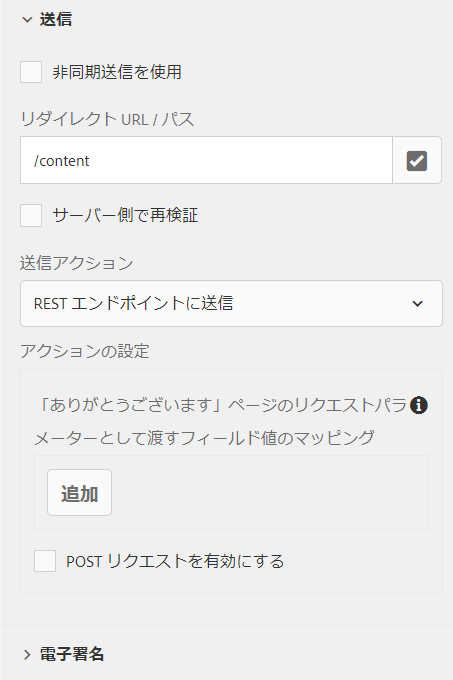

# リダイレクトページの設定 {#configuring-redirect-page}

| バージョン | 記事リンク |
| -------- | ---------------------------- |
| AEM 6.5 | [ここをクリックしてください](https://experienceleague.adobe.com/docs/experience-manager-65/forms/adaptive-forms-basic-authoring/embed-adaptive-form-external-web-page.html?lang=ja) |
| AEM as a Cloud Service | この記事 |

フォーム作成者は、フォーム送信後にユーザーがリダイレクトされるページを各フォームに設定することができます。

1. 編集モードで、コンポーネントを選択し、／**[!UICONTROL アダプティブフォームコンテナ]**&#x200B;をクリックしてから、  をクリックします。

1. サイドバーで、「**[!UICONTROL 送信]**」をクリックします。

1. 「**[!UICONTROL 送信]**」セクションの&#x200B;**[!UICONTROL リダイレクト URL／パス]**&#x200B;にリダイレクトページの URL を指定します。
1. オプションとして、「送信アクション」で、「REST エンドポイントへの送信」の送信アクションについて、リダイレクトページに渡されるパラメーターを設定することができます。

   

   リダイレクトページ設定

フォーム作成者は、次のパラメーターを使用して「ありがとうございました」ページに渡すことができます。 使用可能なすべての送信アクションに対して、`status` と `owner` のパラメーターが渡されます。これら 2 つのパラメーターの他に、追加のパラメーターが次の送信アクションに渡されます。

* **[!UICONTROL REST エンドポイントへの送信]**：フィールド内にパラメーターマッピングのため追加されたパラメータが渡されます。`status` と `owner` のパラメーターは、この送信アクションでは渡されません。詳しくは、[送信アクション「REST エンドポイントへの送信」の設定](configuring-submit-actions.md)を参照してください。

>[!MORELIKETHIS]
>
>* [リダイレクトページまたはお礼のメッセージの設定方法？](/help/forms/configure-redirect-page-or-thank-you-message.md)
