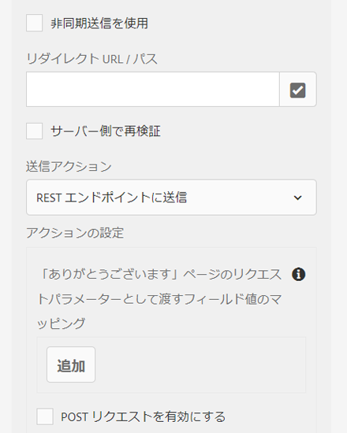

# アダプティブフォーム送信アクション {#configuring-the-submit-action}

| バージョン | 記事リンク |
| -------- | ---------------------------- |
| AEM 6.5 | [ここをクリックしてください](https://experienceleague.adobe.com/docs/experience-manager-65/forms/adaptive-forms-basic-authoring/configuring-submit-actions.html) |
| AEM as a Cloud Service | この記事 |

送信アクションは、ユーザーがアダプティブフォームの「**[!UICONTROL 送信]**」ボタンをクリックしたするときにトリガーされます。アダプティブフォームには、すぐに使用できる送信アクションがいくつか用意されています。すぐに使用できる送信アクションを以下に示します。

* [REST エンドポイントへの送信](#submit-to-rest-endpoint)
* [メールを送信](#send-email)
* [フォームデータモデルを使用して送信](#submit-using-form-data-model)
* [AEM ワークフローを起動](#invoke-an-aem-workflow)
* [SharePoint に送信](#submit-to-sharedrive)
* [OneDrive に送信](#submit-to-onedrive)
* [Azure Blob Storage に送信](#azure-blob-storage)

[デフォルトの送信アクションを拡張](custom-submit-action-form.md)して、独自の送信アクションを作成することもできます。

サイドバーにあるアダプティブフォームコンテナプロパティの「**[!UICONTROL 送信]**」セクションで、送信アクションを設定できます。


<!-- [!NOTE]
>
>Send PDF via Email Submit Action is applicable only to Adaptive Forms that use XFA template as form model. 

>[!NOTE]
>
>Ensure that the [AEM_Installation_Directory]\crx-quickstart\temp\datamanager\ASM folder
>exists. The directory is required to temporarily store attachments. If the directory does not exist, create it. -->

<!--

>[!CAUTION]
>
>If you  [prefill](prepopulate-adaptive-form-fields.md) a form template,  a Form Data Model or schema based Adaptive Form with XML or JSON data complaint to a schema (XML schema, JSON schema , form template, or form data model) that is data does not contain &lt;afData&gt;, &lt;afBoundData&gt;, and &lt;/afUnboundData&gt; tags, then the data of unbounded fields (Unbounded fields are Adaptive Form fields without [bindref](prepopulate-adaptive-form-fields.md) property) of the Adaptive Form is lost. 

>[!CAUTION]
>
>If you [prefill](prepopulate-adaptive-form-fields.md) a form template, a Form Data Model or schema based Adaptive Form with XML or JSON data complaint to a schema (XML schema, JSON schema, or form data model) that does not contain &lt;afData&gt;, &lt;afBoundData&gt;, and &lt;/afUnboundData&gt; tags, then the data of unbounded fields (Unbounded fields are Adaptive Form fields without [bindref](prepopulate-adaptive-form-fields.md) property) of the Adaptive Form is lost.


-->

## REST エンドポイントへの送信 {#submit-to-rest-endpoint}

**[!UICONTROL REST エンドポイントへの送信]**&#x200B;アクションを使用して、送信されたデータを REST URL に POST できます。URL は、内部（フォームがレンダリングされるサーバー）または外部サーバーのどちらのものでも使用できます。

内部サーバーにデータを POST 送信するには、リソースのパスを指定します。データは、リソースのパスに POST されます。例えば、/content/restEndPoint です。このような POST リクエストには、送信リクエストの認証情報が使用されます。

外部サーバーにデータを POST 送信するには、URL を指定します。URL の形式は、`https://host:port/path_to_rest_end_point` です。POST リクエストを匿名で処理するためのパスを設定してください。


上の例で、ユーザーが `textbox` に入力した情報は、パラメーター `param1` を使用して取得されます。`param1` を使用して取得されるデータを POST するための構文を以下に示します。

`String data=request.getParameter("param1");`

同様に、XML データと添付ファイルの POST に使用するパラメーターは、`dataXml` および `attachments` です。

例えば、この 2 つのパラメーターをスクリプト中で使用して、REST エンドポイントに送信されたデータを解析できます。データを格納および解析するための構文を以下に示します。

`String data=request.getParameter("dataXml");`
`String att=request.getParameter("attachments");`

この例では、`data` が XML データを格納し、`att` が添付ファイルデータを格納します。

**[!UICONTROL REST エンドポイントへの送信]**&#x200B;送信アクションでは、フォームに入力されたデータを HTTP GET リクエストの一部として設定済みの確認ページに送信します。リクエストにフィールド名を追加できます。リクエストのフォーマットを以下に示します。

`{fieldName}={request parameter name}`

以下の画像に示されているように、`param1` および `param2` が、**textbox** フィールドおよび **numericbox** フィールドからコピーされた値を持つパラメーターとして、次のアクションに向けて渡されます。


**[!UICONTROL POST リクエストを有効にする]**&#x200B;ことで、リクエストを POST する URL を指定することもできます。フォームをホストする AEM サーバーにデータを送信するには、AEM サーバーのルートパスに対応する相対パスを使用します。例えば、`/content/forms/af/SampleForm.html` のようになります。他のサーバーにデータを送信するには、絶対パスを使用します。

>[!NOTE]
>
>フィールドを REST URL 内のパラメーターとして渡すためには、すべてのフィールドが異なる要素名を持っている必要があります。これは、異なるパネルに置かれているフィールドにも適用されます。

## メールを送信 {#send-email}

「**[!UICONTROL メールを送信]**」送信アクションでは、フォームの送信が完了すると同時に、1 人または複数の受信者にメールが送信されます。生成されるメールには、事前に定義された形式のフォームデータを含めることができます。例えば、以下のテンプレートでは、顧客名、配送先住所、州名、郵便番号が、送信されたフォームデータから取得されます。

    ```
    
    こんにちは ${customer_Name} さん、
    
    以下がデフォルトの配送先住所として設定されています。
    ${customer_Name}、
    ${customer_Shipping_Address}、
    ${customer_State}、
    ${customer_ZIPCode}
    
    よろしくお願いいたします。
    WKND
    
    ```

>[!NOTE]
>
> * フィールドがアダプティブフォームの異なるパネルに配置されている場合でも、すべてのフォームフィールドは異なる要素名を持っている必要があります。
> * AEM as a Cloud Service では、送信メールを暗号化する必要があります。デフォルトでは、送信メールは無効になっています。有効にするには、[アクセスのリクエスト](https://experienceleague.adobe.com/docs/experience-manager-cloud-service/implementing/developing/development-guidelines.html?lang=ja#sending-email)にサポートチケットを送信します。

メールには、添付ファイルとレコードのドキュメント（DoR）を含めることもできます。「**[!UICONTROL レコードのドキュメントを添付]**」オプションを有効にするには、レコードのドキュメント（DoR）を生成するようにアダプティブフォームを設定します。このオプションを有効にして、アダプティブフォームのプロパティからレコードのドキュメントを生成できます。


<!-- ## Send PDF via Email {#send-pdf-via-email}

The **Send PDF via Email** Submit Action sends an email with a PDF containing form data, to one or more recipients on successful submission of the form.

>[!NOTE]
>
>This Submit Action is available for XFA-based Adaptive Forms and XSD-based adaption forms that have the Document of Record template. -->

<!-- ## Invoke a forms workflow {#invoke-a-forms-workflow}

The **Submit to Forms workflow** submit option sends a data xml and file attachments (if any) to an existing Adobe LiveCycle or [!DNL AEM Forms] on JEE process.

For information about how to configure the Submit to forms workflow Submit Action, see [Submitting and processing your form data using forms workflows](submit-form-data-livecycle-process.md). -->

## フォームデータモデルを使用して送信 {#submit-using-form-data-model}

「**[!UICONTROL フォームデータモデルを使用して送信]**」送信アクションでは、フォームデータモデルの特定のデータモデルオブジェクトで送信したアダプティブフォームデータをデータソースに書き込みます。送信アクションの設定時に、データソースに書き戻す送信済みデータを持つデータモデルオブジェクトを選択できます。

さらに、フォームデータモデルとレコードのドキュメント（DoR）を使用して、フォームの添付ファイルをデータソースに送信できます。フォームデータモデルについて詳しくは、[[!DNL AEM Forms]  のデータ統合機能](data-integration.md)を参照してください。

<!--
## Forms Portal Submit Action {#forms-portal-submit-action}

The **Forms Portal Submit Action** option makes form data available through an [!DNL AEM Forms] portal.

For more information about the Forms Portal and Submit Action, see [Drafts and submissions component](draft-submission-component.md). -->

## AEM ワークフローを起動 {#invoke-an-aem-workflow}

「**[!UICONTROL AEM ワークフローを起動]**」送信アクションは、アダプティブフォームを [AEM ワークフロー](https://experienceleague.adobe.com/docs/experience-manager-65/developing/extending-aem/extending-workflows/workflows-models.html?lang=ja#extending-aem)と関連付けます。フォームが送信されると、関連するワークフローがオーサーインスタンスで自動的に起動します。データファイル、添付ファイル、レコードのドキュメントは、ワークフローのペイロードの場所または変数に保存できます。ワークフローが外部データストレージ用にマークされ、外部データストレージ用に設定されている場合、変数オプションのみを使用できます。ワークフローモデルで使用できる変数のリストから選択できます。ワークフローの作成時ではなく、後の段階で外部データストレージの対象としてワークフローがマークされている場合は、必要な変数設定が適切に行われていることを確認します。

送信アクションは、ワークフローのペイロードの場所、またはワークフローが外部データストレージ用にマークされている場合は変数に、以下を配置します。

* **データファイル**：アダプティブフォームに送信されたデータを含みます。「**[!UICONTROL データファイルパス]**」オプションを使用して、ファイル名とペイロードを基準とするファイルのパスを指定できます。例えば、`/addresschange/data.xml` パスは、`addresschange` という名前のフォルダーを作成し、ペイロードを基準に配置します。フォルダー階層を作成せずに、`data.xml` のみを指定して、送信されたデータのみを送信することもできます。ワークフローが外部データストレージ用にマークされている場合は、「変数」オプションを使用し、ワークフローモデルで使用可能な変数のリストから変数を選択します。

* **添付ファイル**：「**[!UICONTROL 添付ファイルのパス]**」オプションを使用して、アダプティブフォームにアップロードされた添付ファイルの保存先となるフォルダー名を指定できます。フォルダーがペイロードを基準に作成されます。ワークフローが外部データストレージ用にマークされている場合は、「変数」オプションを使用し、ワークフローモデルで使用可能な変数のリストから変数を選択します。

* **レコードのドキュメント**：アダプティブフォーム用に生成されたレコードのドキュメントを含みます。「**[!UICONTROL レコードのドキュメントパス]**」オプションを使用して、レコードのドキュメントファイル名と、ペイロードを基準にファイルのパスを指定できます。例えば、`/addresschange/DoR.pdf` パスは、ペイロードを基準に `addresschange` という名前のフォルダーを作成し、ペイロードを基準に `DoR.pdf` を配置します。`DoR.pdf` のみを指定して、フォルダー階層を作成せずに、レコードのドキュメントのみを保存することもできます。ワークフローが外部データストレージ用にマークされている場合は、「変数」オプションを使用し、ワークフローモデルで使用可能な変数のリストから変数を選択します。

「**[!UICONTROL AEM ワークフローを起動]**」送信アクションを使用する前に、**[!UICONTROL AEM DS 設定サービス]**&#x200B;の設定に対して、以下の設定を行います。

* **[!UICONTROL 処理サーバー URL]**：処理サーバーは、Forms または AEM ワークフローがトリガーされるサーバーです。これは、AEM オーサーインスタンスまたは別のサーバーの URL と同じです。

* **[!UICONTROL 処理サーバーのユーザー名]**：ワークフローユーザーのユーザー名

* **[!UICONTROL 処理サーバーのパスワード]**：ワークフローユーザーのパスワード

## SharePoint に送信 {#submit-to-sharedrive}

「**[!UICONTROL SharePoint に送信]**」送信アクションは、アダプティブフォームと Microsoft® SharePoint ストレージを接続します。フォームデータファイル、添付ファイル、またはレコードのドキュメントを、接続された Microsoft Sharepoint ストレージに送信できます。アダプティブフォームで「**[!UICONTROL SharePoint に送信]**」送信アクションを使用するには、次の手順に従います。

1. [SharePoint 設定の作成](#create-a-sharepoint-configuration-create-sharepoint-configuration)：AEM Forms を Microsoft Sharepoint ストレージに接続します。
2. [アダプティブフォームでの「SharePoint に送信」送信アクションの使用](#use-sharepoint-configuartion-in-af)：アダプティブフォームを設定済みの Microsoft® SharePoint に接続します。

### Microsoft SharePoint 設定の作成 {#create-sharepoint-configuration}

AEM Forms を Microsoft® Sharepoint ストレージに接続するには、次の手順に従います。

1. **AEM Forms オーサー**&#x200B;インスタンス／**[!UICONTROL ツール]**／**[!UICONTROL Cloud Services]**／**[!UICONTROL Microsoft® SharePoint]** に移動します。
1. **[!UICONTROL Microsoft® SharePoint]** を選択すると、**[!UICONTROL SharePoint ブラウザー]**&#x200B;にリダイレクトされます。
1. **設定コンテナ**&#x200B;を選択します。設定は、選択した設定コンテナに保存されます。
1. 「**[!UICONTROL 作成]**」をクリックします。SharePoint 設定ウィザードが表示されます。
   
1. 「**[!UICONTROL タイトル]**」、「**[!UICONTROL クライアント ID]**」、「**[!UICONTROL クライアント秘密鍵]**」および「**[!UICONTROL OAuth URL]**」を指定します。OAuth URL のクライアント ID、クライアントの秘密鍵、テナント ID を取得する方法について詳しくは、[Microsoft® のドキュメント](https://learn.microsoft.com/ja-jp/graph/auth-register-app-v2)を参照してください。
   * アプリの `Client ID` と `Client Secret` は Microsoft® Azure Portal から取得できます。
   * Microsoft® Azure Portal で、リダイレクト URI を `https://[author-instance]/libs/cq/sharepoint/content/configurations/wizard.html` として追加します。`[author-instance]` をオーサーインスタンスの URL に置き換えます。
   * API 権限 `offline_access` および `Sites.Manage.All` を追加して、読み取り／書き込み権限を付与します。
   * OAuth URL `https://login.microsoftonline.com/tenant-id/oauth2/v2.0/authorize` を使用します。`<tenant-id>` を Microsoft® Azure Portal のアプリの `tenant-id` に置き換えます。

   >[!NOTE]
   >
   > **クライアント秘密鍵**&#x200B;フィールドは、Azure Active Directory アプリケーションの設定に応じて、必須またはオプションになります。アプリケーションでクライアント秘密鍵を使用するように設定されている場合は、クライアントの秘密鍵を指定する必要があります。

1. 「**[!UICONTROL 接続]**」をクリックします。接続に成功した場合、`Connection Successful` のメッセージが表示されます。

1. **SharePoint サイト**／**ドキュメントライブラリ**／**SharePoint フォルダー**&#x200B;を選択して、データを保存します。

   >[!NOTE]
   >
   >* デフォルトでは、`forms-ootb-storage-adaptive-forms-submission` は選択した SharePoint サイトに存在します。
   >* 選択した SharePoint サイトの `Documents` ライブラリにまだ存在しない場合は、「**フォルダーを作成**」をクリックして、フォルダーを `forms-ootb-storage-adaptive-forms-submission` として作成します。

アダプティブフォームの送信アクションに、この SharePoint サイト設定を使用できるようになりました。

### アダプティブフォームでの SharePoint 設定の使用 {#use-sharepoint-configuartion-in-af}

作成した SharePoin 設定をアダプティブフォーム内で使用すると、データや生成済みレコードのドキュメントを SharePoint フォルダーに保存できます。 アダプティブフォームで SharePoint ストレージ設定を使用するには、次の手順を実行します。
1. [アダプティブフォーム](/help/forms/creating-adaptive-form.md)を作成します。

   >[!NOTE]
   >
   > * SharePoint ストレージを作成したアダプティブ フォームと同じ[!UICONTROL 設定コンテナ]を選択します。
   > * [!UICONTROL 設定コンテナ]が選択されていない場合、グローバルな[!UICONTROL ストレージ設定]フォルダーが送信アクションのプロパティウィンドウに表示されます。

1. 「**送信アクション**」を「**[!UICONTROL SharePoint に送信]**」として選択します。
   
1. データを保存する場所に「**[!UICONTROL ストレージ設定]**」を選択します。
1. 「**[!UICONTROL 保存]**」をクリックして、送信設定を保存します。

フォームを送信すると、データは指定した Microsoft® Sharepoint ストレージに保存されます。
データを保存するフォルダー構造は `/folder_name/form_name/year/month/date/submission_id/data` です。

## OneDrive に送信 {#submit-to-onedrive}

「**[!UICONTROL OneDrive に送信]**」送信アクションでは、アダプティブフォームと Microsoft® OneDrive を接続します。接続されている Microsoft® OneDrive ストレージに、フォーム データ、添付ファイル、またはレコードのドキュメントを送信できます。アダプティブフォームで「[!UICONTROL OneDrive に送信]」送信アクションを使用するには、次の手順に従います。

1. [OneDrive 設定の作成](#create-a-onedrive-configuration-create-onedrive-configuration)：AEM Forms を Microsoft® OneDrive ストレージに接続します。
2. [アダプティブフォームでの「OneDrive に送信」アクションの使用](#use-onedrive-configuration-in-an-adaptive-form-use-onedrive-configuartion-in-af)：アダプティブフォームを
設定済みの Microsoft® OneDrive に接続します。

### Microsoft OneDrive 設定の作成 {#create-onedrice-configuration}

AEM Forms を Microsoft® OneDrive ストレージに接続するには、以下の手順に従います。

1. **AEM Forms オーサー** インスタンス／**[!UICONTROL ツール]**／**[!UICONTROL クラウド サービス]**／**[!UICONTROL Microsoft® OneDrive]** に移動します。
1. **[!UICONTROL Microsoft® OneDrive]**&#x200B;を選択すると、**[!UICONTROL Microsoft® OneDrive ブラウザー]**&#x200B;にリダイレクトされます。
1. **設定コンテナ**&#x200B;を選択します。設定は、選択した設定コンテナに保存されます。
1. 「**[!UICONTROL 作成]**」をクリックします。OneDrive 設定ウィザードが表示されます。

   

1. 「**[!UICONTROL タイトル]**」、「**[!UICONTROL クライアント ID]**」、「**[!UICONTROL クライアント秘密鍵]**」および「**[!UICONTROL OAuth URL]**」を指定します。OAuth URL のクライアント ID、クライアントの秘密鍵、テナント ID を取得する方法について詳しくは、[Microsoft® のドキュメント](https://learn.microsoft.com/ja-jp/graph/auth-register-app-v2)を参照してください。
   * アプリの `Client ID` と `Client Secret` は Microsoft® Azure Portal から取得できます。
   * Microsoft® Azure Portal で、リダイレクト URI を `https://[author-instance]/libs/cq/onedrive/content/configurations/wizard.html` として追加します。`[author-instance]` をオーサーインスタンスの URL に置き換えます。
   * API 権限 `offline_access` および `Files.ReadWrite.All` を追加して、読み取り／書き込み権限を付与します。
   * OAuth URL `https://login.microsoftonline.com/tenant-id/oauth2/v2.0/authorize` を使用します。`<tenant-id>` を Microsoft® Azure Portal のアプリの `tenant-id` に置き換えます。

   >[!NOTE]
   >
   > **クライアント秘密鍵**&#x200B;フィールドは、Azure Active Directory アプリケーションの設定に応じて、必須またはオプションになります。アプリケーションでクライアント秘密鍵を使用するように設定されている場合は、クライアントの秘密鍵を指定する必要があります。

1. 「**[!UICONTROL 接続]**」をクリックします。接続が完了すると `Connection Successful` メッセージが表示されます。

1. **[!UICONTROL OneDrive コンテナ]**／**[OneDrive フォルダー]**&#x200B;を選択して、データを保存します。

   >[!NOTE]
   >
   >* デフォルトでは、`forms-ootb-storage-adaptive-forms-submission` は OneDrive コンテナに存在します。
   > * 「**フォルダーを作成**」をクリックして、まだ存在しない場合は、フォルダーを `forms-ootb-storage-adaptive-forms-submission` として作成します。

アダプティブフォームの送信アクションに、この OneDrive ストレージ設定を使用できるようになりました。

### アダプティブフォームでの OneDrive 設定の使用 {#use-onedrive-configuartion-in-af}

アダプティブフォームで作成した OneDrive ストレージ設定を使用して、データまたは生成済みレコードのドキュメントを OneDrive フォルダーに保存できます。 アダプティブフォームで OneDrive ストレージ設定を使用するには、次の手順を実行します。
1. 「[アダプティブフォーム](/help/forms/creating-adaptive-form.md)」を作成します。

   >[!NOTE]
   >
   > * OneDrive ストレージを作成したアダプティブ フォームと同じ[!UICONTROL 設定コンテナ]を選択します。
   > * [!UICONTROL 設定コンテナ]が選択されていない場合、グローバルな[!UICONTROL ストレージ設定]フォルダーが送信アクションのプロパティウィンドウに表示されます。

1. 「**送信アクション**」を「**[!UICONTROL OneDrive に送信]**」として選択します。
   
1. データを保存する場所に「**[!UICONTROL ストレージ設定]**」を選択します。
1. 「**[!UICONTROL 保存]**」をクリックして、送信設定を保存します。

フォームを送信すると、指定した Microsoft® OneDrive ストレージにデータが保存されます。
データを保存するフォルダー構造は `/folder_name/form_name/year/month/date/submission_id/data` です。

## Azure Blob Storage に送信 {#submit-to-azure-blob-storage}

「**[!UICONTROL Azure Blob Storage に送信]**」送信アクションは、アダプティブフォームを Microsoft Azure Portal に接続します。フォームデータ、ファイル、添付ファイル、またはレコードのドキュメントを、接続された Azure ストレージコンテナに送信できます。 Azure Blob Storage の送信アクションを使用するには、次の手順に従います。

1. [Azure Blob Storage コンテナの作成](#create-a-azure-blob-storage-container-create-azure-configuration)：AEM Forms を Azure Storage コンテナに接続します。
2. [アダプティブフォームでの Azure ストレージ設定の使用 ](#use-azure-storage-configuration-in-an-adaptive-form-use-azure-storage-configuartion-in-af)：アダプティブフォームを、設定済みの Azure ストレージコンテナに接続します。

### Azure Blob Storage コンテナの作成 {#create-azure-configuration}

AEM Forms を Azure ストレージコンテナに接続するには、次の手順に従います。
1. **AEM Forms オーサー**&#x200B;インスタンス／**[!UICONTROL ツール]**／**[!UICONTROL クラウドサービス]**／**[!UICONTROL Azure ストレージ]**&#x200B;に移動します。
1. **[!UICONTROL Azure ストレージ]**&#x200B;を選択すると、**[!UICONTROL Azure ストレージブラウザー]**&#x200B;にリダイレクトされます。
1. **設定コンテナ**&#x200B;を選択します。設定は、選択した設定コンテナに保存されます。
1. 「**[!UICONTROL 作成]**」をクリックします。Azure ストレージ設定の作成ウィザードが表示されます。

   

1. 「**[!UICONTROL タイトル]**」、「**[!UICONTROL Azure ストレージアカウント]**」および「**[!UICONTROL Azure アクセスキー]**」を指定します。

   * `Azure Storage Account` の名前と `Azure Access key` は、Microsoft Azure Portal のストレージアカウントから取得できます。

1. 「**[!UICONTROL 保存]**」をクリックします。

アダプティブフォームの送信アクションに、この Azure ストレージコンテナ設定を使用できるようになりました。

### アダプティブフォームでの Azure ストレージ設定の使用 {#use-azure-storage-configuartion-in-af}

アダプティブフォームで作成した Azure ストレージコンテナ設定を使用して、データや生成済みレコードのドキュメントを Azure ストレージコンテナに保存できます。 アダプティブフォームで Azure ストレージコンテナ設定を使用するには、次の手順を実行します。
1. [アダプティブフォーム](/help/forms/creating-adaptive-form.md)を作成します。

   >[!NOTE]
   >
   > * OneDrive ストレージを作成したアダプティブ フォームと同じ[!UICONTROL 設定コンテナ]を選択します。
   > * [!UICONTROL 設定コンテナ]が選択されていない場合、グローバルな[!UICONTROL ストレージ設定]フォルダーが送信アクションのプロパティウィンドウに表示されます。

1. 「**送信アクション**」を「**[!UICONTROL Azure Blob Storage に送信]**」として選択します。
   

1. データを保存する場所に「**[!UICONTROL ストレージ設定]**」を選択します。
1. 「**[!UICONTROL 保存]**」をクリックして、送信設定を保存します。

フォームを送信すると、データは指定された Azure ストレージコンテナ設定に保存されます。
データを保存するフォルダー構造は `/configuration_container/form_name/year/month/date/submission_id/data` です。

設定の値をセットするには、[AEM SDK を使用して OSGi 設定を生成](https://experienceleague.adobe.com/docs/experience-manager-cloud-service/implementing/deploying/configuring-osgi.html?lang=ja#generating-osgi-configurations-using-the-aem-sdk-quickstart)し、Cloud Service インスタンスに[設定をデプロイ](https://experienceleague.adobe.com/docs/experience-manager-cloud-service/implementing/using-cloud-manager/deploy-code.html?lang=ja#deployment-process)します。

## 同期または非同期送信の使用 {#use-synchronous-or-asynchronous-submission}

送信アクションは、同期または非同期の送信を使用できます。

**同期送信**：これまでの Web フォームは、同期送信用に設定されていました。同期送信では、ユーザーがフォームを送信すると、確認ページ、ありがとうページ、または送信に失敗した場合はエラーページにリダイレクトされます。「**[!UICONTROL 非同期送信を使用]**」オプションを選択して、ユーザーを Web ページにリダイレクトしたり、送信時にメッセージを表示したりできます。



**非同期送信**：単一ページアプリケーションなどの最新の Web エクスペリエンスが広く使用されるようになっています。こうしたアプリケーションでは、バックグラウンドでクライアントとサーバー間の通信が実行されている間、Web ページが静的な状態のままになります。[非同期送信を設定](asynchronous-submissions-adaptive-forms.md)することにより、アダプティブフォームでこうしたエクスペリエンスを実現できます。

## アダプティブフォームでのサーバーサイドの再検証 {#server-side-revalidation-in-adaptive-form}

通常、どのようなオンラインデータ取得システムでも、ビジネスルールを適用するために、開発者はクライアントサイドに何らかの JavaScript 検証を配置します。しかし、最新のブラウザーでは、エンドユーザーが Web Browser DevTools Console などの様々な手法を使用してこれらの検証を回避し、手動で送信を行える方法が存在します。このような手法は、アダプティブフォームにも有効です。フォーム開発者は、多様な検証ロジックを作成できますが、エンドユーザーは、これらの検証ロジックを回避し、無効なデータをサーバーに送信できます。無効なデータは、フォーム作成者が適用したビジネスルールを破ることになります。

サーバーサイドの再検証機能は、アダプティブフォーム作成者がアダプティブフォームのデザイン中に指定した検証を、サーバー上でも実行するための機能です。これは、フォームの検証で表されるデータ送信の漏洩やビジネスルール違反の可能性を阻止します。

### サーバーで検証されるもの {#what-to-validate-on-server-br}

サーバーで再実行される、アダプティブフォームのすぐに使用できる（OOTB）すべてのフィールド検証を以下に示します。

* 必須
* 検証パターン形式文字列
* 検証式

### サーバー側検証の有効化 {#enabling-server-side-validation-br}

サイドバーにある「アダプティブフォームコンテナ」の「**[!UICONTROL サーバー側で再検証]**」を使用して、現在のフォームのサーバーサイド検証を有効または無効にします。


サーバーサイド検証の有効化

エンドユーザーがこれらの検証を回避してフォームを送信した場合、サーバーが再度検証を行います。サーバーサイドでの検証が失敗した場合、送信処理が中止されます。エンドユーザーには、元のフォームが再度表示されます。取得されたデータおよび送信されたデータは、エラーとしてユーザーに表示されます。

>[!NOTE]
>
>サーバーサイド検証により、フォームモデルが検証されます。検証のために別個のクライアントライブラリを作成し、1 つのクライアントライブラリに HTML のスタイルや DOM 操作を混在させないことをお勧めします。

### 検証式でのカスタム関数のサポート {#supporting-custom-functions-in-validation-expressions-br}

**複雑な検証ルール**&#x200B;がある場合、正確な検証スクリプトがカスタム関数の中に存在し、作成者がこれらのカスタム関数をフィールド検証式から呼び出すことがあります。このカスタム関数ライブラリをサーバーサイド検証中に認識させ、利用可能にするために、フォーム作成者は、「アダプティブフォームコンテナ」プロパティの「**[!UICONTROL 基本]**」タブで、AEM クライアントライブラリの名前を設定できます（下記画像を参照）。


検証式でのカスタム関数のサポート

作成者は、アダプティブフォームごとにカスタム JavaScript ライブラリを設定できます。ライブラリには、jQuery および underscore.js サードパーティライブラリに依存する、再利用可能な関数のみを保持します。

## 送信アクションに対するエラー処理 {#error-handling-on-submit-action}

AEM セキュリティおよび堅牢化ガイドラインの一環として、400.jsp、404.jsp、500.jsp などのカスタムエラーページを設定します。これらのハンドラーは、フォーム送信時に 400、404 または 500 エラーが表示される場合に呼び出されます。また、これらのハンドラーは、公開ノードでこれらのエラーコードがトリガーされる場合にも呼び出されます。他の HTTP エラーコード用の JSP ページを作成することもできます。

フォームデータモデルに事前入力したり、`<afData>`、`<afBoundData>` および `</afUnboundData>` タグを含まないデータであるスキーマに対する XML または JSON データの苦情を含むスキーマベースのアダプティブフォームに事前入力すると、アダプティブフォームの境界なしのフィールドのデータは失われます。このスキーマは、XML スキーマ、JSON スキーマまたはフォームデータモデルのいずれかです。境界なしのフィールドは、`bindref` プロパティを持たないアダプティブフォームフィールドです。

<!-- For more information, see [Customizing Pages shown by the Error Handler](/help/sites-developing/customizing-errorhandler-pages.md). -->
