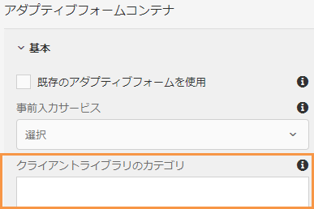

# アダプティブフォーム送信アクション {#configuring-the-submit-action}

送信アクションは、ユーザーがアダプティブフォームの「**[!UICONTROL 送信]**」ボタンをクリックしたするときにトリガーされます。アダプティブフォームには、すぐに使用できる送信アクションがいくつか用意されています。すぐに使用できる送信アクションを以下に示します。

* [REST エンドポイントへの送信](#submit-to-rest-endpoint)
* [電子メールを送信](#send-email)
* [フォームデータモデルを使用して送信](#submit-using-form-data-model)
* [AEM ワークフローを起動](#invoke-an-aem-workflow)

[デフォルトの送信アクションを拡張](custom-submit-action-form.md)して、独自の送信アクションを作成することもできます。

サイドバーにあるアダプティブフォームコンテナプロパティの「**[!UICONTROL 送信]**」セクションで、送信アクションを設定できます。


<!-- [!NOTE]
>
>Send PDF via Email Submit Action is applicable only to Adaptive Forms that use XFA template as form model. 

>[!NOTE]
>
>Ensure that the [AEM_Installation_Directory]\crx-quickstart\temp\datamanager\ASM folder
>exists. The directory is required to temporarily store attachments. If the directory does not exist, create it. -->

<!--

>[!CAUTION]
>
>If you  [prefill](prepopulate-adaptive-form-fields.md) a form template,  a Form Data Model or schema based Adaptive Form with XML or JSON data complaint to a schema (XML schema, JSON schema , form template, or form data model) that is data does not contain &lt;afData&gt;, &lt;afBoundData&gt;, and &lt;/afUnboundData&gt; tags, then the data of unbounded fields (Unbounded fields are Adaptive Form fields without [bindref](prepopulate-adaptive-form-fields.md) property) of the Adaptive Form is lost. 

>[!CAUTION]
>
>If you [prefill](prepopulate-adaptive-form-fields.md) a form template, a Form Data Model or schema based Adaptive Form with XML or JSON data complaint to a schema (XML schema, JSON schema, or form data model) that does not contain &lt;afData&gt;, &lt;afBoundData&gt;, and &lt;/afUnboundData&gt; tags, then the data of unbounded fields (Unbounded fields are Adaptive Form fields without [bindref](prepopulate-adaptive-form-fields.md) property) of the Adaptive Form is lost.


-->


## REST エンドポイントへの送信 {#submit-to-rest-endpoint}

**[!UICONTROL REST エンドポイントへの送信]**&#x200B;アクションを使用して、送信されたデータを REST URL に POST できます。URL は、内部（フォームがレンダリングされるサーバー）または外部サーバーのどちらのものでも使用できます。

内部サーバーにデータを POST 送信するには、リソースのパスを指定します。データは、リソースのパスに POST されます。例えば、/content/restEndPoint です。このような POST リクエストには、送信リクエストの認証情報が使用されます。

外部サーバーにデータを POST 送信するには、URL を指定します。URL の形式は、`https://host:port/path_to_rest_end_point` です。POST リクエストを匿名で処理するためのパスを設定してください。


上の例で、ユーザーが `textbox` に入力した情報は、パラメーター `param1` を使用して取得されます。`param1` を使用して取得されるデータを POST するための構文を以下に示します。

`String data=request.getParameter("param1");`

同様に、XML データと添付ファイルの POST に使用するパラメーターは、`dataXml` および `attachments` です。

例えば、この 2 つのパラメーターをスクリプト中で使用して、REST エンドポイントに送信されたデータを解析できます。データを格納および解析するための構文を以下に示します。

`String data=request.getParameter("dataXml");`
`String att=request.getParameter("attachments");`

この例では、`data` が XML データを格納し、`att` が添付ファイルデータを格納します。

**[!UICONTROL REST エンドポイントへの送信]**&#x200B;送信アクションでは、フォームに入力されたデータを HTTP GET リクエストの一部として設定済みの確認ページに送信します。リクエストにフィールド名を追加できます。リクエストのフォーマットを以下に示します。

`{fieldName}={request parameter name}`

以下の画像に示されているように、`param1` および `param2` が、**textbox** フィールドおよび **numericbox** フィールドからコピーされた値を持つパラメーターとして、次のアクションに向けて渡されます。


**[!UICONTROL POST リクエストを有効にする]**&#x200B;ことで、リクエストを POST する URL を指定することもできます。フォームをホストする AEM サーバーにデータを送信するには、AEM サーバーのルートパスに対応する相対パスを使用します。例えば、`/content/forms/af/SampleForm.html` のようになります。他のサーバーにデータを送信するには、絶対パスを使用します。

>[!NOTE]
>
>フィールドを REST URL 内のパラメーターとして渡すためには、すべてのフィールドが異なる要素名を持っている必要があります。これは、異なるパネルに置かれているフィールドにも適用されます。

## 電子メールを送信 {#send-email}

「**[!UICONTROL 電子メールを送信]**」送信アクションでは、フォームの送信が完了すると同時に、1 人または複数の受信者に電子メールが送信されます。生成される電子メールには、事前に定義された形式のフォームデータを含めることができます。例えば、以下のテンプレートでは、顧客名、配送先住所、州名、郵便番号が、送信されたフォームデータから取得されます。

    ```
    
    こんにちは ${customer_Name} さん、
    
    以下がデフォルトの配送先住所として設定されています。
    ${customer_Name}、
    ${customer_Shipping_Address}、
    ${customer_State}、
    ${customer_ZIPCode}
    
    よろしくお願いいたします。
    WKND
    
    ```

>[!NOTE]
>
> * フィールドがアダプティブフォームの異なるパネルに配置されている場合でも、すべてのフォームフィールドは異なる要素名を持っている必要があります。
> * AEM as a Cloud Service では、送信メールを暗号化する必要があります。デフォルトでは、送信電子メールは無効になっています。有効にするには、[アクセスのリクエスト](https://experienceleague.adobe.com/docs/experience-manager-cloud-service/implementing/developing/development-guidelines.html?lang=ja#sending-email)にサポートチケットを送信します。


電子メールには、添付ファイルとレコードのドキュメント（DoR）を含めることもできます。「**[!UICONTROL レコードのドキュメントを添付]**」オプションを有効にするには、レコードのドキュメント（DoR）を生成するようにアダプティブフォームを設定します。このオプションを有効にして、アダプティブフォームのプロパティからレコードのドキュメントを生成できます。


<!-- ## Send PDF via Email {#send-pdf-via-email}

The **Send PDF via Email** Submit Action sends an email with a PDF containing form data, to one or more recipients on successful submission of the form.

>[!NOTE]
>
>This Submit Action is available for XFA-based Adaptive Forms and XSD-based adaption forms that have the Document of Record template. -->

<!-- ## Invoke a forms workflow {#invoke-a-forms-workflow}

The **Submit to Forms workflow** submit option sends a data xml and file attachments (if any) to an existing Adobe LiveCycle or [!DNL AEM Forms] on JEE process.

For information about how to configure the Submit to forms workflow Submit Action, see [Submitting and processing your form data using forms workflows](submit-form-data-livecycle-process.md). -->

## フォームデータモデルを使用して送信 {#submit-using-form-data-model}

「**[!UICONTROL フォームデータモデルを使用して送信]**」送信アクションでは、フォームデータモデルの特定のデータモデルオブジェクトで送信したアダプティブフォームデータをデータソースに書き込みます。送信アクションの設定時に、データソースに書き戻す送信済みデータを持つデータモデルオブジェクトを選択できます。

さらに、フォームデータモデルとレコードのドキュメント（DoR）を使用して、フォームの添付ファイルをデータソースに送信できます。フォームデータモデルについて詳しくは、[[!DNL AEM Forms]  のデータ統合機能](data-integration.md)を参照してください。

<!--
## Forms Portal Submit Action {#forms-portal-submit-action}

The **Forms Portal Submit Action** option makes form data available through an [!DNL AEM Forms] portal.

For more information about the Forms Portal and Submit Action, see [Drafts and submissions component](draft-submission-component.md). -->

## AEM ワークフローを起動 {#invoke-an-aem-workflow}

「**[!UICONTROL AEM ワークフローを起動]**」送信アクションは、アダプティブフォームを [AEM ワークフロー](https://experienceleague.adobe.com/docs/experience-manager-65/developing/extending-aem/extending-workflows/workflows-models.html?lang=ja#extending-aem)と関連付けます。フォームが送信されると、関連するワークフローがオーサーインスタンスで自動的に起動します。送信アクションは、ワークフローのペイロードの場所に以下を配置します。

* **データファイル**：アダプティブフォームに送信されたデータを含みます。「**[!UICONTROL データファイルパス]**」オプションを使用して、ファイル名とペイロードを基準とするファイルのパスを指定できます。例えば、`/addresschange/data.xml` パスは、`addresschange` という名前のフォルダーを作成し、ペイロードを基準に配置します。フォルダー階層を作成せずに、`data.xml` のみを指定して、送信されたデータのみを送信することもできます。

* **添付ファイル**：「**[!UICONTROL 添付ファイルのパス]**」オプションを使用して、アダプティブフォームにアップロードされた添付ファイルを保存するフォルダー名を指定できます。フォルダーがペイロードを基準に作成されます。

* **レコードのドキュメント**：アダプティブフォーム用に生成されたレコードのドキュメントを含みます。「**[!UICONTROL レコードのドキュメントパス]**」オプションを使用して、レコードのドキュメントファイル名と、ペイロードを基準にファイルのパスを指定できます。例えば、`/addresschange/DoR.pdf` パスは、ペイロードを基準に `addresschange` という名前のフォルダーを作成し、ペイロードを基準に `DoR.pdf` を配置します。`DoR.pdf` のみを指定して、フォルダー階層を作成せずに、レコードのドキュメントのみを保存することもできます。

「**[!UICONTROL AEM ワークフローを起動]**」送信アクションを使用する前に、**[!UICONTROL AEM DS 設定サービス]**&#x200B;の設定に対して、以下の設定を行います。

* **[!UICONTROL 処理サーバー URL]**：処理サーバーは、Forms または AEM ワークフローがトリガーされるサーバーです。これは、AEM オーサーインスタンスまたは別のサーバーの URL と同じです。

* **[!UICONTROL 処理サーバーのユーザー名]**：ワークフローユーザーのユーザー名

* **[!UICONTROL 処理サーバーのパスワード]**：ワークフローユーザーのパスワード

設定の値をセットするには、[AEM SDK](https://experienceleague.adobe.com/docs/experience-manager-cloud-service/implementing/deploying/configuring-osgi.html?lang=ja#generating-osgi-configurations-using-the-aem-sdk-quickstart) を使用して OSGi 設定を生成し、Cloud Service インスタンスに[設定をデプロイ](https://experienceleague.adobe.com/docs/experience-manager-cloud-service/implementing/using-cloud-manager/deploy-code.html?lang=ja#deployment-process)します。

## 同期または非同期送信の使用 {#use-synchronous-or-asynchronous-submission}

送信アクションは、同期または非同期の送信を使用できます。

**同期送信**：これまでの Web フォームは、同期送信用に設定されていました。同期送信では、ユーザーがフォームを送信すると、確認ページ、ありがとうページ、または送信に失敗した場合はエラーページにリダイレクトされます。「**[!UICONTROL 非同期送信を使用]**」オプションを選択して、ユーザーを Web ページにリダイレクトしたり、送信時にメッセージを表示したりできます。


**非同期送信**：単一ページアプリケーションなどの最新の Web エクスペリエンスが広く使用されるようになっています。こうしたアプリケーションでは、バックグラウンドでクライアントとサーバー間の通信が実行されている間、Web ページが静的な状態のままになります。[非同期送信を設定](asynchronous-submissions-adaptive-forms.md)することにより、アダプティブフォームでこうしたエクスペリエンスを実現できます。

## アダプティブフォームでのサーバーサイドの再検証 {#server-side-revalidation-in-adaptive-form}

通常、どのようなオンラインデータ取得システムでも、ビジネスルールを適用するために、開発者はクライアントサイドに何らかの JavaScript 検証を配置します。しかし、最新のブラウザーでは、エンドユーザーが Web Browser DevTools Console などの様々な手法を使用してこれらの検証を回避し、手動で送信を行える方法が存在します。このような手法は、アダプティブフォームにも有効です。フォーム開発者は、多様な検証ロジックを作成できますが、エンドユーザーは、これらの検証ロジックを回避し、無効なデータをサーバーに送信できます。無効なデータは、フォーム作成者が適用したビジネスルールを破ることになります。

サーバーサイドの再検証機能は、アダプティブフォーム作成者がアダプティブフォームのデザイン中に指定した検証を、サーバー上でも実行するための機能です。これは、フォームの検証で表されるデータ送信の漏洩やビジネスルール違反の可能性を阻止します。

### サーバーサイドでの検証対象  {#what-to-validate-on-server-br}

サーバーで再実行される、アダプティブフォームのすぐに使用できる（OOTB）すべてのフィールド検証を以下に示します。

* 必須
* 検証パターン形式文字列
* 検証式

### サーバーサイド検証の有効化 {#enabling-server-side-validation-br}

サイドバーにある「アダプティブフォームコンテナ」の「**[!UICONTROL サーバー側で再検証]**」を使用して、現在のフォームのサーバーサイド検証を有効または無効にします。


サーバーサイド検証の有効化

エンドユーザーがこれらの検証を回避してフォームを送信した場合、サーバーが再度検証を行います。サーバーサイドでの検証が失敗した場合、送信処理が中止されます。エンドユーザーには、元のフォームが再度表示されます。取得されたデータおよび送信されたデータは、エラーとしてユーザーに表示されます。

>[!NOTE]
>
>サーバーサイド検証により、フォームモデルが検証されます。検証のために別個のクライアントライブラリを作成し、1 つのクライアントライブラリに HTML のスタイルや DOM 操作を混在させないことをお勧めします。

### 検証式でのカスタム関数のサポート {#supporting-custom-functions-in-validation-expressions-br}

**複雑な検証ルール**&#x200B;がある場合、正確な検証スクリプトがカスタム関数の中に存在し、作成者がこれらのカスタム関数をフィールド検証式から呼び出すことがあります。このカスタム関数ライブラリをサーバーサイド検証中に認識させ、利用可能にするために、フォーム作成者は、「アダプティブフォームコンテナ」プロパティの「**[!UICONTROL 基本]**」タブで、AEM クライアントライブラリの名前を設定できます（下記画像を参照）。



検証式でのカスタム関数のサポート

作成者は、アダプティブフォームごとにカスタム JavaScript ライブラリを設定できます。ライブラリには、jQuery および underscore.js サードパーティライブラリに依存する、再利用可能な関数のみを保持します。

## 送信アクションに対するエラー処理 {#error-handling-on-submit-action}

AEM セキュリティおよび堅牢化ガイドラインの一環として、400.jsp、404.jsp、500.jsp などのカスタムエラーページを設定します。これらのハンドラーは、フォーム送信時に 400、404 または 500 エラーが表示される場合に呼び出されます。また、これらのハンドラーは、公開ノードでこれらのエラーコードがトリガーされる場合にも呼び出されます。他の HTTP エラーコード用の JSP ページを作成することもできます。

フォームデータモデルに事前入力したり、`<afData>`、`<afBoundData>` および `</afUnboundData>` タグを含まないデータであるスキーマに対する XML または JSON データの苦情を含むスキーマベースのアダプティブフォームに事前入力すると、アダプティブフォームの境界なしのフィールドのデータは失われます。このスキーマは、XML スキーマ、JSON スキーマまたはフォームデータモデルのいずれかです。境界なしのフィールドは、`bindref` プロパティを持たないアダプティブフォームフィールドです。

<!-- For more information, see [Customizing Pages shown by the Error Handler](/help/sites-developing/customizing-errorhandler-pages.md). -->
