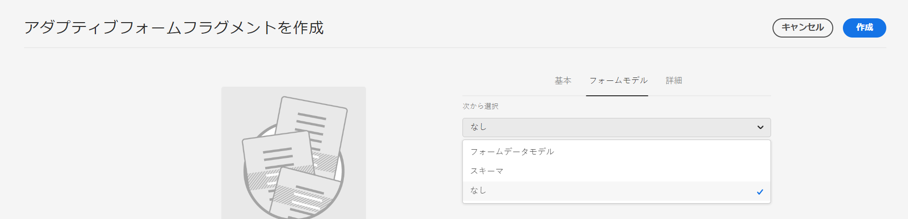
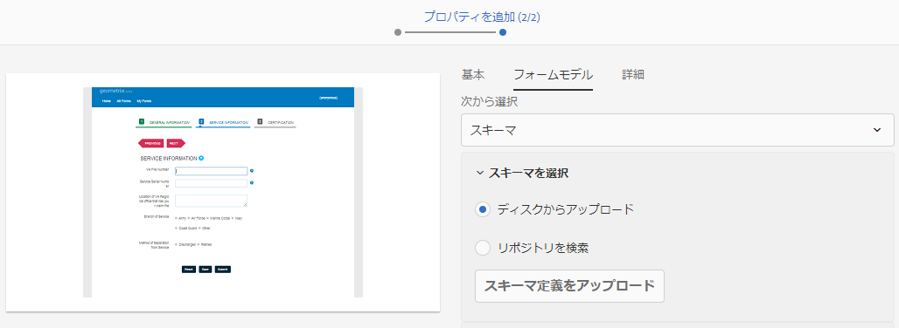
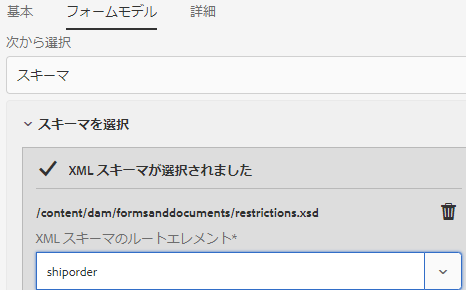

# アダプティブフォームを作成します {#creating-an-adaptive-form}

| バージョン | 記事リンク |
| -------- | ---------------------------- |
| AEM 6.5 | [ここをクリックしてください](https://experienceleague.adobe.com/docs/experience-manager-65/forms/adaptive-forms-basic-authoring/creating-adaptive-form.html?lang=ja#) |
| AEM as a Cloud Service | この記事 |

アダプティブフォームを使用すると、魅力的でレスポンシブ、かつ動的でアダプティブなフォームを作成できます。 AEM Forms は、アダプティブフォームを素早く作成するための、ビジネスユーザーにとってわかりやすいウィザードを提供します。 このウィザードはクイックタブナビゲーションを備えており、アダプティブフォームを作成するための事前設定済みのテンプレート、スタイル設定、フィールド、送信オプションを簡単に選択することができます。

{width="100%" align="center"}

開始する前に、使用可能な Forms コンポーネントのタイプについて学習します。

* [アダプティブフォームコアコンポーネント](https://experienceleague.adobe.com/docs/experience-manager-core-components/using/adaptive-forms/introduction.html?lang=ja)：標準化されたデータキャプチャコンポーネントです。 これらのコンポーネントは、デジタル登録エクスペリエンスのカスタマイズ機能を提供し、開発時間を短縮し、メンテナンスコストを削減します。 開発者は、これらのコンポーネントを簡単にカスタマイズし、スタイルを設定できます。 次にアクセスできます： [https://aemcomponents.dev/](https://aemcomponents.dev/) 使用可能なコアコンポーネントの動作を表示するには **Adobeでは、アダプティブFormsの開発に、最新の拡張可能なコンポーネントを使用することをお勧めします**.

* [アダプティブフォーム基盤コンポーネント](creating-adaptive-form.md)：従来の（古い）データキャプチャコンポーネントです。 引き続きこれらを使用して、既存の基盤コンポーネントベースのアダプティブフォームを編集できます。 新しいフォームを作成する場合は、[アダプティブフォームコアコンポーネントを使用してアダプティブフォームを作成することをお勧めします。](#create-an-adaptive-form-core-components)

>[!BEGINTABS]

>[!TAB コアコンポーネントを使用したアダプティブFormsの作成（推奨）]

アダプティブフォームを作成するには、以下が必要です。

* **お使いの環境でのアダプティブフォームコアコンポーネントの有効化**：アダプティブフォームコアコンポーネントは、プログラムを作成した時点でお使いの環境で有効になります。 お使いの AEM Cloud Service 環境でアダプティブForms コアコンポーネントを有効にするには、最新のツールをインストールします。 ご利用の環境でコアコンポーネントを有効にすると、**アダプティブフォーム（コアコンポーネント）**&#x200B;のテンプレートとキャンバステーマが環境に追加されます。AEM SDK バージョンが 2023.02.0 より前の場合は、2023.02.0 リリースより前にアダプティブフォームのコアコンポーネントがプレリリースの一部であったので、[お使いの環境で `prerelease` フラグが有効になっていることを確認してください](https://experienceleague.adobe.com/docs/experience-manager-cloud-service/content/release-notes/prerelease.html?lang=ja#new-features)。

* **アダプティブフォームテンプレート**：テンプレートは基本構造を提供し、アダプティブフォームのアピアランス（レイアウトとスタイル）を定義します。 これには、特定のプロパティやコンテンツ構造を有するフォーマット済みのコンポーネントが含まれます。 また、テーマと送信アクションを定義するオプションも提供されます。 テーマは、ルックアンドフィールと送信アクションを定義し、アダプティブフォームの送信時に実行するアクションを定義します。 例えば、収集したデータをデータソースに送信する場合などです。 クラウドサービスでは、空白という名前の OOTB テンプレートが提供されます。

   * `blank` テンプレートは、すべての新しい AEM Forms as a Cloud Service プログラムに含まれています。
   * パッケージマネージャーを使用して参照パッケージをインストールし、AEM Forms as a Cloud Service プログラムに `blank` テンプレートを追加できます。
   * 最初から[アダプティブフォームテンプレート（コアコンポーネント）を作成](template-editor.md)することもできます。

* **アダプティブフォームのテーマ**：テーマには、コンポーネントとパネル向けのスタイル設定の詳細が含まれます。 スタイルには、背景カラー、ステートカラー、透明度、配置、サイズなどのプロパティが含まれます。 テーマを適用すると、指定したスタイルが対応するコンポーネントに反映されます。`Canvas` テンプレートは、すべての新しい AEM Forms as a Cloud Service プログラムに含まれています。
  <!-- * You can install the reference package, via package manager, to add the `Canvas` template to your AEM Forms as a Cloud Service program.
    * You can also [create an Adaptive Forms theme (Core Components)](template-editor.md) and deploy it to your AEM Forms as a Cloud Service program. -->

* **権限**：[!DNL forms-users] グループにユーザーを追加します。[!DNL forms-users] グループのメンバーには、アダプティブフォームを作成する権限があります。 フォーム専用のユーザーグループの詳細なリストについて詳しくは、[グループと権限](forms-groups-privileges-tasks.md)を参照してください。

## アダプティブフォームを作成します {#create-an-adaptive-form-core-components}

1. [!DNL Experience Manager Forms] オーサーインスタンスにログインします。 Cloud インスタンスまたはローカル開発インスタンスの場合があります。

1. Experience Manager のログインページに資格情報を入力します。 ログイン後、左上隅の **[!UICONTROL Adobe Experience Manager]**／**[!UICONTROL Forms]**／**[!UICONTROL フォームとドキュメント]**&#x200B;を選択します。

1. **[!UICONTROL 作成]**／**[!UICONTROL アダプティブフォーム]**&#x200B;を選択します。 ウィザードが開きます。 ソースタブで、テンプレートを選択します。

   {width="100%" align="center"}

   テンプレートを選択すると、テンプレートで指定されたテーマと送信アクションが自動的に選択され、**[!UICONTROL 作成]** ボタンが有効になります。 「**[!UICONTROL スタイル]**」または「**[!UICONTROL 送信]**」タブを使用して、別のテーマや送信アクションを選択することができます。 選択したテンプレートでテーマが指定されていない場合、作成ボタンは無効のままです。 「**[!UICONTROL スタイル]**」タブに進み、テーマを手動で選択することができます。

   >[!NOTE]
   >
   >
   > ご利用の環境に&#x200B;**アダプティブフォーム（コアコンポーネント）**&#x200B;テンプレートがない場合は、[ご利用の環境のアダプティブフォームコアコンポーネントを有効にします](setup-local-development-environment.md#enable-adaptive-forms-core-components-for-an-existing-aem-archetype-based-project)。 ご利用の環境でコアコンポーネントを有効にすると、**アダプティブフォーム（コアコンポーネント）**&#x200B;テンプレートが環境に追加されます。

1. 「**[!UICONTROL スタイル]**」タブで、テーマを選択します。

   * 選択したテンプレートでテーマを指定すると、ウィザードでテーマが自動的に選択されます。 「スタイル」タブから別のテーマを選択することもできます。

   * 選択したテンプレートにテーマが指定されていない場合は、「スタイル」タブを使用してテーマを選択することができます。 この「**[!UICONTROL 作成]**」ボタンは、テーマが選択された後にのみ有効になります。

1. （オプション）「データ」タブで、データモデルを選択します。

   * **フォームデータモデル**：[フォームデータモデル（FDM）](data-integration.md)を使用すると、異なるデータソースのエンティティやサービスをアダプティブフォームに統合することができます。作成するアダプティブフォームで、複数のデータソースに対するデータの取得と書き込みが必要になる場合は、フォームデータモデル（FDM）を選択します。

   * **JSON スキーマ**：[JSON スキーマ](adaptive-form-json-schema-form-model.md) コアコンポーネントベースのアダプティブフォームは、生成または消費されるデータの構造を表す JSON スキーマを関連付ける機能により、自社のバックエンドシステムとシームレスに統合できます。 この関連付けにより、作成者はスキーマの要素を使用して、アダプティブフォームにコンテンツを動的に追加できます。 スキーマの要素には、オーサリングプロセスでコンテンツブラウザーの「データモデルオブジェクト」タブから容易にアクセスできます。すべてのフィールドは、作成されたアダプティブフォームに自動的に追加されます。

   デフォルトでは、関連付けられた JSON スキーマのすべてのフィールドが自動的に選択され、対応するアダプティブフォームコンポーネントに変換されるので、オーサリングプロセスを合理化できます。 ウィザードでは、チェックボックスを使用してアダプティブフォームに含めるフィールドを選択できる、さらに便利な機能が用意されています。

1. 「**[!UICONTROL 送信]**」タブで、送信アクションを選択します。

   * テンプレートを選択すると、テンプレートで指定された送信アクションが自動選択されます。 「送信」タブから、別の送信アクションを選択することができます。 「**[!UICONTROL 送信]**」タブには、使用可能なすべての送信アクションが表示されます。

   * 選択したテンプレートで送信アクションが指定されていない場合は、「**[!UICONTROL 送信]**」タブを使用して送信アクションを選択することができます

1. （オプション）「**[!UICONTROL 配信]**」タブで、アダプティブフォームの公開日または非公開日を指定することができます。

1. 「**[!UICONTROL 作成]**」を選択します。 アダプティブフォームを保存するためのタイトル、名前および場所を指定するためのダイアログが表示されます。

   * **[!UICONTROL タイトル]**：フォームの表示名を指定します。 タイトルを指定すると、[!DNL Experience Manager Forms] ユーザーインターフェイス内のフォームを特定しやすくなります。
   * **[!UICONTROL 名前：]**&#x200B;フォームの名前を指定します。 指定された名前のノードがリポジトリーに作成されます。 タイトルを入力し始めると、名前フィールドの値が自動的に生成されます。 候補として入力された値は変更可能です。 「ドキュメント名」フィールドには、英数字、ハイフン、アンダースコアのみを使用できます。 無効な入力は、すべてハイフンに置き換えられます。
   * **[!UICONTROL パス]**：アダプティブフォームを保存する場所を指定します。 アダプティブフォームは、`/content/dam/formsanddocuments` に直接保存することができます。または、`/content/dam/formsanddocuments/adaptiveforms` などのフォルダーを作成して、アダプティブフォームを保存することができます。 フォルダーをパスで使用する前に、必ずフォルダーを作成してください。 「**[!UICONTROL パス]**」フィールドでは、フォルダーは自動的には作成されません。

1. 「**[!UICONTROL 作成]**」を選択します。 アダプティブフォームが作成され、アダプティブフォームエディターで開きます。 エディターに、テンプレートで使用可能なコンテンツが表示されます。  アダプティブフォームのタイプに応じて、関連する <!--XFA form template, XML schema or --> JSON スキーマまたはフォームデータモデル（FDM）に存在するフォーム要素が、サイドバーの&#x200B;**[!UICONTROL コンテンツブラウザー]**&#x200B;の「**[!UICONTROL データモデルオブジェクト]**」タブに表示されます。

これで、 [アダプティブFormsコアコンポーネント](https://experienceleague.adobe.com/docs/experience-manager-core-components/using/adaptive-forms/introduction.html?lang=ja#features) またはスキーマ要素を使用してアダプティブフォームを構築します。

## アダプティブフォームのフォームモデルプロパティの編集 {#edit-form-model-core-components-based-adaptive-forms}

1. アダプティブフォームを選択し、／**[!UICONTROL プロパティを開く]**&#x200B;をクリックします。 フォームプロパティページが開きます。

1. 「**[!UICONTROL フォームモデル]**」タブをクリックし、フォームモデルを選択します。 アダプティブフォームにフォームモデルがない場合は、JSON スキーマまたはフォームデータモデル（FDM）を選択できます。 一方、アダプティブフォームが既にフォームモデルに基づいている場合は、同じタイプの別のフォームモデルに切り替えることもできます。 例えば、フォームが JSON スキーマを使用している場合、別の JSON スキーマに容易に切り替えることができます。同様に、フォームがフォームデータモデル（FDM）を使用している場合は、別のフォームデータモデル（FDM）に切り替えることができます。

1. 「**[!UICONTROL 保存]**」を選択して、プロパティを保存します。

>[!TAB 基盤コンポーネントを使用したアダプティブFormsの作成]

アダプティブフォームを作成するには、以下が必要です。

* **権限**：ユーザーを [!DNL forms-users] に追加し、アダプティブフォームを作成するための権限をユーザーに付与します。フォーム専用のユーザーグループの詳細なリストについては、[グループと権限](forms-groups-privileges-tasks.md)を参照してください。

* **アダプティブフォームのテーマ**：テーマには、コンポーネントとパネル向けのスタイル設定の詳細が含まれます。 スタイルには、背景カラー、ステートカラー、透明度、配置、サイズなどのプロパティが含まれます。テーマを適用すると、指定したスタイルが対応するコンポーネントに反映されます。[テーマを作成する](themes.md)か、[既存のテーマを読み込む](import-export-forms-templates.md#uploading-a-theme)ことができます。一部のサンプル テーマでは、[最新のアーキタイプ](https://experienceleague.adobe.com/docs/experience-manager-core-components/using/developing/archetype/using.html?lang=ja#create-project)をデプロイすることもできます。

* **アダプティブフォームテンプレート**：テンプレートは基本構造を提供し、アダプティブフォームのアピアランス（レイアウトとスタイル）を定義します。 これには、特定のプロパティやコンテンツ構造を有するフォーマット済みのコンポーネントが含まれます。 また、テーマと送信アクションを定義するオプションも提供されます。 テーマは、ルックアンドフィールと送信アクションを定義し、アダプティブフォームの送信時に実行するアクションを定義します。 例えば、収集したデータをデータソースに送信する場合などです。 Cloud Service は、2 種類のテンプレートをサポートしています。

   * **編集可能テンプレート**：編集可能テンプレートを[作成](template-editor.md)するか、[既存の編集可能テンプレートを読み込む](migrate-to-forms-as-a-cloud-service.md)ことができます。また、[最新のアーキタイプ](https://experienceleague.adobe.com/docs/experience-manager-core-components/using/developing/archetype/using.html?lang=ja#:~:text=AEM%20アーキタイプは、次のモジュール,Java%20バンドル。%20it.tests%3A%20are%20Java-based%20integration%20tests.)をデプロイして、編集可能なテンプレートのサンプルを取得することもできます。

   * **静的テンプレート**：これらは従来のテンプレートで、Adobe Managed Services（AMS）およびオンプレミスの AEM Forms のインストール（AEM 6.5 Forms 以前）から移行する顧客にのみ推奨されます。 静的テンプレートに対する既存の投資を引き続き使用することができます。アダプティブフォームを作成する際には、編集可能なテンプレートを使用します。

## アダプティブフォームを作成します {#create-an-adaptive-form-foundation-components}

1. [!DNL Experience Manager Forms] オーサーインスタンスにアクセスします。Cloud インスタンスまたはローカル開発インスタンスの場合があります。

1. Experience Manager のログインページに資格情報を入力します。

   ログイン後、左上隅の **[!UICONTROL Adobe Experience Manager]**／**[!UICONTROL Forms]**／**[!UICONTROL フォームとドキュメント]**&#x200B;を選択します。

1. **[!UICONTROL 作成]**／**[!UICONTROL アダプティブフォーム]**&#x200B;を選択します。ウィザードが開きます。
1. ソースタブで、テンプレートを選択します。

   * 編集可能なテンプレートを選択すると、テンプレートで指定されたテーマと送信アクションが自動的に選択され、「**[!UICONTROL 作成]**」ボタンが有効になります。「**[!UICONTROL スタイル]**」または「**[!UICONTROL 送信]**」タブを使用して、別のテーマや送信アクションを選択することができます。 選択した編集可能テンプレートでテーマが指定されていない場合、作成ボタンは無効のままです。 「**[!UICONTROL スタイル]**」タブに進み、テーマを手動で選択することができます。

     >[!NOTE]
     >
     > アダプティブフォームエディターを使用して、[!UICONTROL レコードのドキュメント]テンプレートを作成することもできます。詳しくは、「[アダプティブフォームエディターでのレコードのドキュメントのサポート](/help/forms/generate-document-of-record-for-non-xfa-based-adaptive-forms.md#document-of-record-support-in-adaptive-form-editor-dor-support-in-adaptiveform)」を参照してください。

   * 静的テンプレートを選択すると、データ、スタイル、送信、配信、プレビューの各オプションは使用できなくなります。 アダプティブフォームを作成する場合は、編集可能なテンプレートを使用することをお勧めします。

1. 「**[!UICONTROL スタイル]**」タブで、テーマを選択します。

   * 選択したテンプレートでテーマを指定すると、ウィザードでテーマが自動的に選択されます。 「スタイル」タブから別のテーマを選択することもできます。
   * 選択したテンプレートにテーマが指定されていない場合は、「スタイル」タブを使用してテーマを選択することができます。 この「**[!UICONTROL 作成]**」ボタンは、テーマが選択された後にのみ有効になります。

1. （オプション）「**[!UICONTROL データ]**」タブで、データモデルを選択します。

   * **フォームデータモデル**：[フォームデータモデル（FDM）](data-integration.md)を使用すると、異なるデータソースのエンティティやサービスをアダプティブフォームに統合することができます。作成するアダプティブフォームで、複数のデータソースに対するデータの取得と書き込みが必要になる場合は、フォームデータモデル（FDM）を選択します。

   * **JSON スキーマ**：[JSON スキーマ](adaptive-form-json-schema-form-model.md)は、組織内のバックエンドシステムによってデータが作成または使用される構造を表します。アダプティブフォームにスキーマを関連付けて、そのスキーマの要素を使用することにより、アダプティブフォームに動的コンテンツを追加できます。スキーマの要素は、アダプティブ フォームを作成するときにコンテンツブラウザーの「データモデルオブジェクト」タブで使用することができ、すべてのフィールドも作成されたアダプティブフォームに追加されます。

   デフォルトでは、データモデルのすべてのフィールドが選択されます。 アダプティブフォームを作成すると、選択したすべてのデータモデルフィールドが、対応するアダプティブフォームのコンポーネントに変換されます。 ウィザードには、アダプティブフォームに含める必要のあるフィールドのみを選択するチェックボックスが表示されます。

   <!-- 
   
   If your JSON schema contains a fragment, the fragment is considered a single unit. You can select or deselect a complete fragment and all the fields of the fragment are selected or deselected accordingly. 
   
   -->

1. 「**[!UICONTROL 送信]**」タブで、送信アクションを選択します。

   * テンプレートを選択すると、テンプレートで指定された送信アクションが自動選択されます。 「送信」タブから、別の送信アクションを選択することができます。 「**[!UICONTROL 送信]**」タブには、使用可能なすべての送信アクションが表示されます。

   * 選択したテンプレートで送信アクションが指定されていない場合は、「**[!UICONTROL 送信]**」タブを使用して送信アクションを選択することができます。

1. （オプション）「配信」タブで、アダプティブフォームの公開日または非公開日を指定することができます。

1. 「**[!UICONTROL 作成]**」を選択します。アダプティブフォームを保存するためのタイトル、名前および場所を指定するためのダイアログが表示されます。

   * **[!UICONTROL タイトル]**：フォームの表示名を指定します。 タイトルを指定すると、[!DNL Experience Manager Forms] ユーザーインターフェイス内のフォームを特定しやすくなります。
   * **[!UICONTROL 名前：]**&#x200B;フォームの名前を指定します。 指定された名前のノードがリポジトリーに作成されます。 タイトルを入力し始めると、名前フィールドの値が自動的に生成されます。 候補として入力された値は変更可能です。 「ドキュメント名」フィールドには、英数字、ハイフン、アンダースコアのみを使用できます。 無効な入力は、すべてハイフンに置き換えられます。
   * **[!UICONTROL パス]**：アダプティブフォームを保存する場所を指定します。 アダプティブフォームは、`/content/dam/formsanddocuments` に直接保存することができます。または、`/content/dam/formsanddocuments/adaptiveforms` などのフォルダーを作成して、アダプティブフォームを保存することができます。 フォルダーをパスで使用する前に、必ずフォルダーを作成してください。 「**[!UICONTROL パス]**」フィールドでは、フォルダーは自動的には作成されません。

1. 「**[!UICONTROL 作成]**」を選択します。アダプティブフォームが作成され、アダプティブフォームエディターで開きます。エディターに、テンプレートで使用可能なコンテンツが表示されます。 作成されたフォームを必要に応じてカスタマイズするためのサイドバーも表示されます。

   アダプティブフォームのタイプに応じて、関連する <!--XFA form template, XML schema or --> JSON スキーマまたはフォームデータモデル（FDM）に存在するフォーム要素が、サイドバーの&#x200B;**[!UICONTROL コンテンツブラウザー]**&#x200B;の「**[!UICONTROL データモデルオブジェクト]**」タブに表示されます。これらの要素もドラッグ＆ドロップしてアダプティブフォームを作成できます。

<!-- ## Create an Adaptive Form based on a Form Data Model {#fdm}

[Data integration](data-integration.md) lets you integrate multiple data sources and bring their entities and services together to create a form data model. It is an extension of JSON schema. You can use a Form Data Model to create an Adaptive Form. The entities or data model objects configured in a Form Data Model are available as data model objects for form authoring. They are bound to respective data sources and used to prefill a form and write submitted data back to the respective data sources. You can also call services configured in a Form Data Model using Adaptive Form rules.

To use a Form Data Model for creating an Adaptive Form:

1. In Form Model tab on Add Properties screen, select **[!UICONTROL Form Data Model]** in the **[!UICONTROL Select From]** drop-down list.

   

1. Select to expand **[!UICONTROL Select Form Data Model]**. All available form data models are listed.Select a from data model.

>[!NOTE]
>
>You can also change the Form Data Model for an Adaptive Form. For detailed steps, see [Edit Form Model properties of an Adaptive Form](#edit-form-model).

## Create an Adaptive Form based on XML or JSON schema {#create-an-adaptive-form-based-on-xml-or-json-schema}

XML and JSON schemas represent the structure in which data is produced or consumed by the back-end system in your organization. You can associate a schema to an Adaptive Form and use its elements to add dynamic content to the Adaptive Form. The elements of the schema are available in the Data Model Object tab of the content browser for authoring Adaptive Forms. You can drag-drop the schema elements to build the form.

See the following documents to understand how to design XML or JSON schema for authoring Adaptive Forms.

* [Creating Adaptive Forms using XML schema](adaptive-form-xml-schema-form-model.md)
* [Creating Adaptive Forms using JSON schema](adaptive-form-json-schema-form-model.md)

Do the following to use XML or JSON schema as form model for an Adaptive Form:

1. On the **[!UICONTROL Add Properties]** step of Adaptive Form creation page, select on the **[!UICONTROL Form Model]** tab.
1. In the Form Model tab, select **[!UICONTROL Schema]** from the **[!UICONTROL Select From]** drop-down field.

1. Select **[!UICONTROL Select Schema]** and do one of the following:

    * **[!UICONTROL Upload from disk]** - Select this option and select Upload Schema Definition to browse and upload an XML schema or JSON schema from your file system. The uploaded schema file resides with the form and is not accessible to other Adaptive Forms.
    * **[!UICONTROL Search in repository]** - Select this option to select from the list of schema definition files available in the repository. Select the XML or JSON schema file as form model. The selected schema is associated with the form by reference and is accessible for use in other Adaptive Forms.

      Ensure that the JSON schema filename ends with **.schema.json**. For example: mySchema.schema.json

   
**Figure:** *Selecting XML or JSON schema*

1. (For XML schema only) After you select or upload an XML Schema, specify a root element of the selected XSD file to map with the Adaptive Form.

   
**Figure:** *Selecting XSD root element*

>[!NOTE]
>
>You can also change the schema for an Adaptive Form. For detailed steps, see [Edit Form Model properties of an Adaptive Form](#edit-form-model2). -->

## アダプティブフォームのフォームモデルプロパティの編集 {#edit-form-model-foundation-components}

アダプティブフォーム（JSON ベースまたはフォームデータモデル（FDM））のフォームモデルを変更することができます。フォームモデルを別のフォームモデルに変更することはできません。

1. アダプティブフォームを選択し、「**プロパティ**」アイコンをクリックします。
1. 「**[!UICONTROL フォームモデル]**」タブを開き、以下のいずれかを実行します。

   * アダプティブフォームにフォームモデルがない場合、別のフォームモデルを選択し、それに従い<!-- a form template, --> XML スキーマ、JSON スキーマ、フォームデータモデル（FDM）を選択することもできます。
   * アダプティブフォームがフォームモデルをベースとしている場合は、同じフォームモデルに別の<!-- form template, --> XML スキーマ、JSON スキーマ、フォームデータモデル（FDM）を選択することもできます。

1. 「**[!UICONTROL 保存]**」を選択して、プロパティを保存します。

アダプティブフォームエディターまたはアダプティブフォームテンプレートエディターから、フォームモデルプロパティを変更することもできます。

1. **[!UICONTROL アダプティブフォームコンテナ（ルート）]**&#x200B;コンポーネントを選択します。
1.  アイコンをクリックして、アダプティブフォームコンテナの&#x200B;**[!UICONTROL プロパティ]**&#x200B;を開きます。
1. 「**[!UICONTROL データモデル]**」タブを選択し、以下のいずれかを実行します。

   * アダプティブフォームにフォームモデルがない場合、フォームモデルを選択し、それに従い<!-- a form template, --> XML スキーマ、JSON スキーマ、フォームデータモデル（FDM）を選択することもできます。
   * アダプティブフォームがフォームモデルに基づいている場合、そのフォームモデルを変更することはできません。別の <!-- form template, --> XML スキーマまたは JSON スキーマを選択するか、同じフォームモデルのフォームデータモデル（FDM）を適宜選択することができます。
1. 「」を選択して、プロパティを保存します。

{width="100%" align="center"}

>[!NOTE]
>
> アダプティブフォームをテンプレートとして保存することもできます。 詳しくは、[アダプティブフォームを使用したテンプレートの作成](/help/forms/template-editor.md#saving-an-adaptive-form-as-template-saving-adaptive-form-as-template)を参照してください。

>[!ENDTABS]

## 次の手順

* [FormsでのAdobe Signの使用](working-with-adobe-sign.md)
* [FormsでのGoogle reCaptcha の使用](captcha-adaptive-forms.md)
* [フォームに繰り返し可能なセクションを追加する](create-forms-repeatable-sections.md)
* [フォームのフィールドの事前入力](prepopulate-adaptive-form-fields.md)

>[!MORELIKETHIS]
>
>* [アダプティブフォームを作成](/help/forms/creating-adaptive-form-core-components.md)
