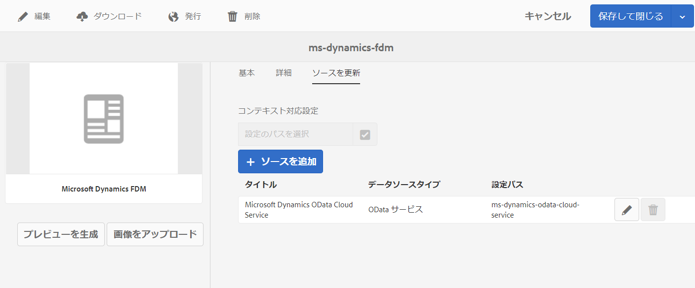

# フォームデータモデル（FDM）の作成 {#create-form-data-model}

| バージョン | 記事リンク |
| -------- | ---------------------------- |
| AEM 6.5 | [ここをクリックしてください](https://experienceleague.adobe.com/docs/experience-manager-65/forms/form-data-model/create-form-data-models.html?lang=ja) |
| AEM as a Cloud Service | この記事 |

[!DNL Experience Manager Forms] のデータ統合機能には、フォームデータモデルを作成して使用するための直感的なユーザーインターフェイスが用意されています。フォームデータモデル（FDM）では、データソースを使用してデータの交換を行いますが、データソースを使用せずにフォームデータモデルを作成することも、データソースを使用してフォームデータモデル（FDM）を作成することもできます。フォームデータモデルの作成方法には、以下の 2 つがあります。データソースを設定しているかどうかに応じていずれかを使用します。

* **事前設定済みデータソースを使用する場合**：[データソースの設定](configure-data-sources.md)の説明に従ってデータソースが既に設定されている場合は、フォームデータモデル（FDM）を作成する際に、それらの事前設定済みデータソースを選択できます。この方法の場合、選択したデータソースのすべてのデータモデルオブジェクト、プロパティ、およびサービスを、フォームデータモデル（FDM）内で使用できます。

* **データソースが設定されていない場合**：フォームデータモデル用のデータソースが設定されていない場合であっても、データソースなしでフォームデータモデル（FDM）を作成できます。フォームデータモデル（FDM）を使用して、アダプティブフォーム <!--and interactive communication--> を作成し、サンプルデータを使用してそれらをテストできます。データソースが使用可能な状態になっている場合は、フォームデータモデル（FDM）をそのデータソースに連結すると、関連するアダプティブフォーム <!--and interactive communications--> 内でその内容が自動的に反映されます。

>[!NOTE]
>
>フォームデータモデル（FDM）の作成と操作を行うには、**fdm-author** グループと **forms-user** グループにメンバーとして属している必要があります。これらのグループのメンバーになるには、[!DNL Experience Manager] 管理者に依頼してください。

## フォームデータモデル（FDM）の作成 {#data-sources}

フォームデータモデル（FDM）内で使用するデータソースが、[データソースの設定](configure-data-sources.md)の説明に従って設定されていることを確認してください。設定されているデータソースに基づいてフォームデータモデル（FDM）を作成するには、以下の手順を実行します。

1. [!DNL Experience Manager] オーサーインスタンスで、**[!UICONTROL フォーム／データ統合]**&#x200B;に移動します。
1. **[!UICONTROL 作成／フォームデータモデル]**&#x200B;を選択します。
1. フォームデータモデルの作成ダイアログで、以下の操作を実行します。

   * フォームデータモデル（FDM）の名前を指定します。
   * （**オプション**）フォームデータモデル（FDM）のタイトル、説明およびタグを指定します。
   * （**オプション、データソースが既に設定されている場合のみ**）「**[!UICONTROL データソース設定]**」フィールドの横にあるチェックマークアイコンを選択し、使用するデータソース用のクラウドサービスが存在する設定ノードを選択します。この操作により、選択した設定ノード内の有効なデータソースだけが、以下のページに選択可能なデータソースとして表示されます。ただし、どの [!DNL Experience Manager] ユーザープロファイルのデータソースも、デフォルトで表示されます。設定ノードを選択しない場合は、すべての設定ノードのデータソースが表示されます。

1. 「**[!UICONTROL 次へ]**」を選択します。

1. （**データソースが既に設定されている場合のみ**）**[!UICONTROL データソースを選択]**&#x200B;画面に、使用可能なデータソースが表示されます（有効なデータソースが存在する場合）。フォームデータモデルで使用するデータソースを選択します。
1. 「**[!UICONTROL 作成]**」を選択し、確認ダイアログで「**[!UICONTROL 開く]**」をクリックして、フォームデータモデルエディターを開きます。

   ここで、フォームデータモデルエディターの UI に表示される各種コンポーネントを確認します。

   ![RESTful サービス、[!DNL Experience Manager] ユーザープロファイル、RDBMS の 3 つのデータソースが含まれているフォームデータモデル](assets/fdm-ui.png)

   A. **[!UICONTROL データソース]** フォームデータモデルのデータソースをリストします。データソースを展開すると、データモデルオブジェクトとサービスが表示されます。

   B. **[!UICONTROL データソース定義を更新]** データソース定義内の変更内容が設定済みデータソースから取得され、フォームデータモデルエディターの「データソース」タブでその変更内容が反映されます。

   C. **[!UICONTROL モデル]** 追加されたデータモデルオブジェクトのコンテンツ領域が表示されます。

   D. **[!UICONTROL サービス]** 追加したデータソースの操作やサービスのコンテンツ領域が表示されます。

   E. **[!UICONTROL ツールバー]** フォームデータモデル（FDM）を操作するためのツールです。フォームデータモデル（FDM）で選択したオブジェクトに応じて、ツールバーに表示されるオプションが多くなります。

   F. **[!UICONTROL 選択項目を追加]** 選択したデータモデルオブジェクトとサービスをフォームデータモデルに追加します。

フォームデータモデルエディターの詳細と、フォームデータモデルエディターを使用してフォームデータモデル（FDM）の操作と設定を行う方法については、[フォームデータモデルの操作](work-with-form-data-model.md)を参照してください。

## データソースの更新 {#update}

既存のフォームデータモデル（FDM）にデータソースを追加、または既存のフォームデータモデル（FDM）のデータソースを更新するには、以下の手順を実行します。

1. **[!UICONTROL Forms／データ統合]**&#x200B;に移動し、データソースを追加または更新するフォームデータモデル（FDM）を選択して、「**[!UICONTROL プロパティ]**」をクリックします。
1. フォームデータモデルのプロパティで、「**[!UICONTROL ソースを更新]**」タブに移動します。

   「**[!UICONTROL ソースを更新]**」タブで、以下の操作を実行します。

   * 「**[!UICONTROL コンテキスト対応設定]**」フィールドで参照アイコンを選択し、追加するデータソースのクラウド設定が存在する設定ノードを指定します。ノードを選択しなかった場合、「**[!UICONTROL ソースを追加]**」を選択すると、`global` ノード内のクラウド設定だけが表示されます。

   * 新しいデータソースを追加する場合は、「**[!UICONTROL ソースを追加]**」を選択し、フォームデータモデル（FDM）に追加するデータソースをクリックします。`global` ノード内で設定されているデータソースと、選択した設定ノード内で構成されているデータソースが、すべて表示されます。

   * 既存のデータソースを、同じタイプの別のデータソースで置き換える場合は、置き換え前のデータソースの「**[!UICONTROL 編集]**」アイコンを選択し、有効なデータソースのリストで、置き換え後のデータソースを選択します。
   * 既存のデータソースを削除する場合は、目的のデータソースの「**[!UICONTROL 削除]**」アイコンを選択します。データソース内のデータモデルオブジェクトがフォームデータモデル（FDM）に追加されている場合、「削除」アイコンは無効になります。

     

1. 「**[!UICONTROL 保存して閉じる]**」を選択して、変更内容を保存します。

>[!NOTE]
>
>フォームデータモデル（FDM）に新しいデータソースを追加するか、フォームデータモデル（FDM）内の既存のデータソースを更新したら、更新後のフォームデータモデル（FDM）が使用されるアダプティブフォーム<!--and interactive communications-->で、連結参照を適切に更新する必要があります。

## 特定の実行モードのコンテキスト対応設定 {#runmode-specific-context-aware-config}

[!UICONTROL フォームデータモデル（FDM）]は、[Sling のコンテキストに対応した設定](https://experienceleague.adobe.com/docs/experience-manager-core-components/using/developing/context-aware-configs.html?lang=ja)を利用して、異なるデータソースパラメーターをサポートし、異なる [!DNL Experience Manager] 実行モードのデータソースと接続します。

[!UICONTROL フォームデータモデル（FDM）]がクラウド設定を使用してパラメーターを保存する場合、この設定をチェックインしてソース管理（Cloud-Manager GIT リポジトリ）を通じてデプロイすると、すべての実行モード（開発、ステージ、実稼動）で同じパラメーターを持つクラウド設定が作成されます。ただし、テスト環境と実稼動環境で異なるデータセットを使用する必要があるユースケースの場合は、異なる [!DNL Experience Manager] 実行モード用のデータソースパラメーター（データソース URL など）を使用します。

これを行うには、データソースのパラメーターと値のペアを含む OSGi 設定を作成する必要があります。この設定は、実行時に[!UICONTROL フォームデータモデル（FDM）]クラウド設定の同じペアを上書きします。OSGi 設定はデフォルトでこれらの実行モードをサポートしているので、実行モードに基づいてデータソースパラメーターを異なる値に上書きできます。

[!UICONTROL フォームデータモデル（FDM）]でデプロイメント固有のクラウド設定を有効にするには：

1. 開発用ローカルインスタンスにクラウド設定を作成します。詳細な手順については、[データソースの設定方法](/help/forms/configure-data-sources.md)を参照してください。

1. クラウド設定をファイルシステムに保存します。
   1. フィルター `/conf/{foldername}/settings/cloudconfigs/fdm` を使用してパッケージを作成します。手順 1 と同じ `{foldername}` を使用します。Azure ストレージ設定用に、`fdm` を `azurestorage` で置き換えます。
   1. パッケージを構築してダウンロードします。詳しくは、[パッケージのアクション](/help/implementing/developing/tools/package-manager.md)を参照してください。

1. クラウド設定を [!DNL Experience Manager] アーキタイププロジェクトに統合します。
   1. ダウンロードしたパッケージを解凍します。
   1. `jcr_root` フォルダーをコピーして、`ui.content`／`src`／`main`／`content` に置きます。
   1. `ui.content`／`src`／`main`／`content`／`META-INF`／`vault`／`filter.xml` を更新して、フィルター `/conf/{foldername}/settings/cloudconfigs/fdm` を含めます。詳しくは、[AEM プロジェクトアーキタイプの ui.content モジュール](https://experienceleague.adobe.com/docs/experience-manager-core-components/using/developing/archetype/uicontent.html?lang=ja)を参照してください。このアーキタイププロジェクトを CM パイプラインを通じてデプロイする場合、同じクラウド設定がすべての環境（または実行モード）にインストールされます。環境に基づいてクラウド設定のフィールド（URL など）の値を変更するには、次の手順で説明する OSGi 設定を使用します。

1. Apache Sling のコンテキスト対応設定を作成します。OSGI 設定の作成手順は次のとおりです。
   1. アーキタイププロジェクトの **OSGi 設定ファイルをセットアップ[!DNL Experience Manager]します。**
PID `org.apache.sling.caconfig.impl.override.OsgiConfigurationOverrideProvider` を使用して OSGi ファクトリー設定ファイルを作成します。実行モードごとに値を変更する必要がある各実行モードフォルダーの下に、同じ名前のファイルを作成します。詳しくは、[ [!DNL Adobe Experience Manager]](/help/implementing/deploying/configuring-osgi.md#creating-sogi-configurations) の OSGi の設定を参照してください。

   1. **OSGI 設定 json を設定します。** Apache Sling Context-Aware Configuration Override Provider の使用手順は次のとおりです。
      1. ローカル開発インスタンス `/system/console/configMgr` で、**[!UICONTROL Apache Sling Context-Aware Configuration Override Provider: SGi configuration]** という名前のファクトリー OSGi 設定を選択します。
      1. 説明を入力します。
      1. 「**[!UICONTROL 有効]**」を選択します。
      1. オーバーライドで、Sling オーバーライド構文の環境に基づいて変更する必要があるフィールドを指定します。詳しくは、[Apache Sling Context-Aware Configuration - Override](https://sling.apache.org/documentation/bundles/context-aware-configuration/context-aware-configuration-override.html#override-syntax) を参照してください。例：`cloudconfigs/fdm/{configName}/url="newURL"`。複数のオーバーライドを追加するには、「**[!UICONTROL +]**」を選択します。
      1. 「**[!UICONTROL 保存]**」を選択します。
      1. OSGi 設定 JSON を取得するには、[AEM SDK Quickstart を使用した OSGi 設定の生成](/help/implementing/deploying/configuring-osgi.md#generating-osgi-configurations-using-the-aem-sdk-quickstart)の手順に従ってください。
      1. 前の手順で作成した OSGi Factory Configuration ファイルに JSON を配置します。
      1. 環境（または実行モード）に基づいて `newURL` の値を変更します。
      1. 実行モードに応じてシークレット値を変更するには、[Cloud Manager API](/help/implementing/deploying/configuring-osgi.md#cloud-manager-api-format-for-setting-properties) を使用してシークレット変数を作成し、後で [OSGi 設定](/help/implementing/deploying/configuring-osgi.md#secret-configuration-values)から参照することができます。
このアーキタイププロジェクトが CM パイプラインを通じてデプロイされる場合、オーバーライドは異なる環境（または実行モード）で異なる値を提供します。

      >[!NOTE]
      >
      >[!DNL Adobe Managed Service] ユーザーは、暗号サポートを使用して秘密鍵の値を暗号化できます。詳しくは、[設定プロパティの暗号化サポート](https://experienceleague.adobe.com/docs/experience-manager-65/administering/security/encryption-support-for-configuration-properties.html#enabling-encryption-support?lang=ja)を参照してください。[サービスパック 6.5.13.0 でコンテキスト対応設定が使用可能](https://experienceleague.adobe.com/docs/experience-manager-65/forms/form-data-model/create-form-data-models.html#runmode-specific-context-aware-config?lang=ja)になったら、値に暗号化されたテキストを配置します。

1. [フォームデータモデルエディター](#data-sources)のデータソース定義を更新するオプションを使用してデータソース定義を更新し、FDM UI を通じて FDM キャッシュを更新し、最新の設定を取得します。

## 次の手順 {#next-steps}

これで、データソースが追加されたフォームデータモデル（FDM）が作成されました。次に、フォームデータモデル（FDM）を編集してデータモデルオブジェクトとサービスの作成と設定を行ったり、データモデルオブジェクト間の関連付けを行ったり、プロパティを編集したり、カスタムのデータモデルオブジェクトとプロパティを追加したり、サンプルデータを生成したりできます。

詳しくは、[フォームデータモデルの操作](work-with-form-data-model.md)を参照してください。

