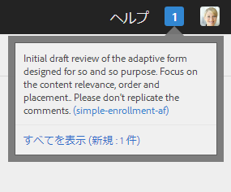
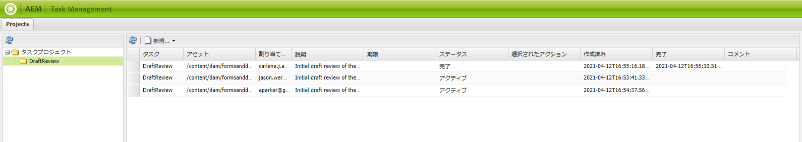

# フォーム内のアセットに対するレビューの作成と管理 {#creating-and-managing-reviews-for-assets-in-forms}

## レビュー {#review}

レビューとは、フォーム内のアセットに対し、1 人または複数のレビュー担当者にコメントを許可するメカニズムです。

## レビューの設定 {#setting-up-a-review}

1. 「フォーム」タブに移動し、フォームを選択します。
1. アセットに進行中のレビューがない場合には、レビューを開始  アイコンがアクションバーに表示されます。レビューを開始  アイコンをクリックします。
1. 以下の情報を入力します。

   * レビュー名：必須。使用可能な文字は、英数字、ハイフンまたはアンダースコアです。
   * レビュー説明：任意。レビューの目的／内容の説明。
   * レビューの期限：任意。レビューが終了する日付です。デッドラインを過ぎている場合、タスクが「期限切れ」と表示されます。
   * レビュー担当者：最低でも 1 人は必須です。コンボボックスを使って、レビュー担当者を追加します。名前を入力すると、一致するすべての名前が表示されます。

1. 残りの詳細情報を入力し、「開始」をクリックします。

### レビューが設定されると発生するアクション {#actions-that-occur-when-a-review-is-set-up}

本セクションでは、レビューが作成・設定された場合に起こるアクションを説明します。

1. 新しいレビュータスクが作成され、レビューの開始者に割り当てられます。
1. すべてのレビュー担当者にレビュータスクが割り当てられます。タスクが通知セクションに表示されます。レビュー担当者は、通知をクリックするか、またはインボックスに移動してタスクを表示することができます。レビュー担当者は、レビュータスクを開いてフォームを表示し、コメントの入力を開始することができます。

   

   レビュー担当者通知アラート

1. コメントボックスは、レビューの開始者およびレビュー担当者が使用することができます。その他のユーザーは、コメントを表示することはできますが、コメントを書き込むことはできません。

## レビューの管理 {#managing-a-review}

>[!NOTE]
>
>修正することができるのは、進行中のレビューのみです。完了しているレビューは修正することができません。

1. 「フォーム」タブに移動し、フォームを選択します。

1. アセットに進行中のレビューがあり、自分がレビューの開始者の場合、アクションバーにレビューを管理  アイコンが表示されます。レビューの開始者のみがレビューを管理（更新／終了）することができます。

   レビューを管理  アイコンをクリックします。

   開始者以外のユーザーに対しては、レビューを管理アイコンは表示されません。

1. 次の情報を含む画面が表示されます。

   * **レビュー名**：編集できません。

   * **レビューの説明**：編集可能です。

   * **レビューの期限**：編集可能です。期限は、現在の日付と時刻よりも後の日付に変更することができます。

   * **レビュー担当者**：編集可能です。レビュー担当者を追加または削除することができます。タスクの期限が切れている場合、期限を現在の日付よりも後に延長した後でなければ、レビュー担当者の追加を行なうことはできません。

1. フィールドを編集し、「更新」をクリックします。

   

   タスクマネージャーで更新状態を確認

1. レビューを終了するには、「終了」をクリックします。

### レビューが修正されると発生するアクション {#actions-that-occur-when-a-review-is-modified}

本セクションでは、レビューが終了・修正された場合に起こるアクションを説明します。

1. レビューの説明が修正された場合、レビュー担当者および開始者の対応するタスクが更新されます。
1. レビューの期限が修正された場合、レビュー担当者の対応するタスクの期限が更新されます。

1. レビュー担当者が削除された場合：

   

   レビュー担当者の削除

   1. 割り当てられているタスクが未完了の場合は、そのタスクが終了します。
   1. レビュー担当者は、アセットにコメントすることができなくなります。

1. レビュー担当者が追加された場合：

   

   レビュー担当者の追加

   1. レビュータスクが作成され、新しく追加されたレビュー担当者に割り当てられます。
   1. 新しく追加されたレビュー担当者は、アセットに対してコメントを追加することができます。

1. レビューが終了した場合：

   1. **レビュー担当者**：各レビュー担当者のそのレビューに関連する未完了のタスクが終了します。レビュー担当者の通知セクションで、タスクが「保留中」と表示されなくなります。
   1. **開始者**：レビュー開始者に割り当てられたタスクは完了とマークされます。レビュー開始者の通知セクションから、タスクが削除されます。
   1. **全員**：レビューが「以前のレビュー」セクションに表示されます。コメントを追加することができなくなります。

