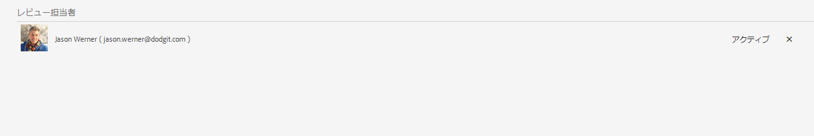

# フォームでのレビューの作成と管理{#creating-and-managing-reviews-to-forms}

[アダプティブフォームの新規作成](/help/forms/creating-adaptive-form-core-components.md)または [AEM Sites ページへのアダプティブフォームの追加](/help/forms/create-or-add-an-adaptive-form-to-aem-sites-page.md)には、最新の拡張可能なデータキャプチャ[コアコンポーネント](https://experienceleague.adobe.com/docs/experience-manager-core-components/using/adaptive-forms/introduction.html?lang=ja)を使用することをお勧めします。これらのコンポーネントは、アダプティブフォームの作成における大幅な進歩を示すものであり、優れたユーザーエクスペリエンスを実現します。この記事では、基盤コンポーネントを使用してアダプティブFormsを作成する古い方法について説明します。 

| バージョン | 記事リンク |
| -------- | ---------------------------- |
| AEM 6.5 | [ここをクリックしてください](https://experienceleague.adobe.com/docs/experience-manager-65/forms/adaptive-forms-advanced-authoring/template-editor.html?lang=ja) |
| AEM as a Cloud Service | この記事 |

## レビュー {#review}

レビューとは、1 人以上のレビュー担当者がフォームにコメントすることを許可するメカニズムです。

## レビューの設定 {#setting-up-a-review}

1. フォームブラウザーに移動し、レビューするフォームを選択します。
1. フォームに進行中のレビューがない場合には、「**レビューを開始**」 アイコンがアクションバーに表示されます。**レビューを開始**  アイコンをクリックします。
1. 以下の情報を入力します。

   * **タイトル**：必須。英数字、ハイフンおよびアンダースコアを含めることができます。
   * **説明**：任意。レビューの目的／内容の説明。
   * **期限**：任意。レビューが終了する日付。期限を過ぎている場合、タスクが「期限切れ」と表示されます。
   * **レビュー担当者名**：少なくとも 1 つは必須です。コンボボックスを使用して、レビュー担当者を追加し、一致するすべての名前の名前リストを入力します。名前を選択し、「**追加**」をクリックします。「**レビュー担当者**」タブの次のセクションには、すべてのレビュー担当者の名前が表示されます。

1. 「**開始**」をクリックして、レビューを開始します。

   >[!NOTE]
   >
   >* 管理者は、フォームユーザーに関連付けられている任意のグループにアクセスできます。
   >* サービスユーザーグループは、レビュー用に選択できません。

### レビューが設定されると発生するアクション {#actions-that-occur-when-a-review-is-set-up}

本セクションでは、レビューが作成・設定された場合に起こるアクションを説明します。

1. 新しいレビュータスクが作成され、選択したレビュー担当者に割り当てられます。
1. すべてのレビュー担当者にレビュータスクが割り当てられます。タスクが通知セクションに表示されます。レビュー担当者は、通知をクリックするか、またはインボックスに移動してタスクを表示することができます。レビュー担当者は、レビュータスクを開いてフォームを表示し、コメントの入力を開始することができます。

   

   レビュー担当者通知アラート

1. フォームのレビュー担当者はコメントボックスを使用できます。他のユーザーはコメントを読むことはできますが、自分で追加することはできません。

## レビューの管理 {#managing-a-review}

>[!NOTE]
>
>* 変更できるのは、進行中のレビューのみです。
>* 完了しているレビューは変更できません。

1. 「フォーム」タブに移動し、フォームを選択します。

1. アセットに進行中のレビューがあり、自分がレビューのイニシエーターの場合、アクションバーに&#x200B;**レビューを管理**  アイコンが表示されます。レビューのイニシエーターのみがレビューを管理（更新／終了）できます。

   **レビューを管理**  アイコンをクリックします。

   開始者以外のユーザーに対しては、レビューを管理アイコンは表示されません。

1. 次の情報を含む画面が表示されます。

   * **レビュー名**：編集できません。

   * **レビューの説明**：編集可能です。

   * **レビューの期限**：編集可能です。期限は、現在の日付と時刻よりも後の日付に変更することができます。

   * **レビュー担当者**：編集可能です。レビュー担当者を追加または削除できます。タスクが期限切れの場合は、期限を現在の日付以降に延長した場合にのみ、レビュー担当者を追加できます。

1. レビューを終了するには、「**レビューを終了**」をクリックします。

### レビューが修正されると発生するアクション {#actions-that-occur-when-a-review-is-modified}

本セクションでは、**レビューの更新／終了**&#x200B;時に発生する動作について説明します。

1. レビューの説明が変更された場合、レビュー担当者およびイニシエーターの対応するタスクが更新されます。
1. レビューの期限が変更された場合、レビュー担当者の対応するタスクの期限が更新されます。

1. レビュー担当者が削除された場合：

   

   レビュー担当者の削除

   1. 未完了の場合、割り当てられたタスクは終了します。
   1. レビュー担当者は、フォームにコメントすることができなくなります。

1. レビュー担当者が追加された場合：

   

   レビュー担当者の追加

   1. レビュータスクが作成され、新しく追加されたレビュー担当者に割り当てられます。
   1. 新しく追加されたレビュー担当者は、フォームに関するコメントを追加することができます。

1. レビューが終了した場合：

   1. **レビュー担当者**：レビュー担当者ごとに、レビューに関連する未完了のタスクが終了します。レビュー担当者の通知セクションに、タスクが「保留中」と表示されなくなります。
   1. **イニシエーター**：レビューイニシエーターに割り当てられたタスクは完了とマークされます。レビューイニシエーターの通知セクションから、タスクが削除されます。
   1. **全員**：レビューが以前のレビューセクションに表示されます。これ以上コメントを追加することはできません。

   
