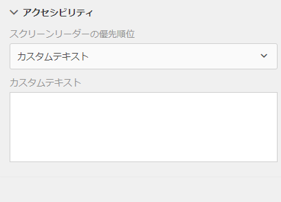
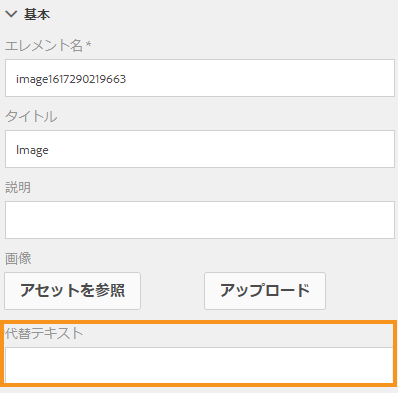

# アクセシブルなアダプティブフォームの作成{#creating-accessible-adaptive-forms}

## はじめに {#introduction}

アクセシブルなフォームとは、特別な支援を必要とするユーザーを含むすべてのユーザーが使用できるフォームを意味します。アダプティブフォームには、ユーザーの様々な能力に合った、使いやすさを向上させる多くの機能が含まれています。アクセシビリティをアダプティブフォームに組み入れることは、可能な限り多くの人がコンテンツにアクセスできるようになるだけでなく、アクセシビリティ標準への準拠が法律で義務付けられている地域にドキュメントを提供するときの必要条件でもあります。[!DNL AEM Forms] は、フォーム開発者がアクセシビリティ標準に準拠できるよう考慮されています。

アダプティブフォームの作成時に、作成者は次の事項を考慮してアクセシブルなアダプティブフォームを作成する必要があります。

* アクセシブルな名前と説明の検査 (ANDI) のアクセシビリティテストツールを使用したフォームの確認
* フォームのコントロールに対する正しいラベルの提供
* 画像の代替テキストの提供
* 十分なカラーコントラストの提供
* フォームのコントロールがキーボードでアクセスできることの確認

## 前提条件

アクセシブルなアダプティブフォームを作成するには、**アクセシブルな名前と説明の検査 (ANDI)** や&#x200B;**アクセシビリティ関連の問題を修正するために開発されたアダプティブフォームテーマ**&#x200B;などのアクセシビリティツールが必要です。

### アクセシビリティテストツールのダウンロードとインストール

アクセシブルな名前と説明の検査 (ANDI) ツールは、Web コンテンツ内のアクセシビリティコンプライアンスに関連する問題を特定して修正でするのに役立ちます。これは、国土安全保障省の Trusted Tester v5 ガイドラインの推奨ツールです。これは、米国社会保障局が Web コンテンツの Section 508 への準拠を確認するために開発したものです。このツールは：

* Web ページ上のアクセシビリティの問題を検出するのに役立ちます
* アクセシビリティを改善するための提案を提供します
* キーボードのアクセシビリティと色のコントラストの問題を検出します
* 標準に準拠し、スクリーンリーダーのコンテンツを明確に識別します

ANDI はすべての主要なインターネットブラウザーで動作します。ツールを設定して使用するための詳細な手順については、[ANDI のドキュメント](https://www.ssa.gov/accessibility/andi/help/install.html)を参照してください。

### Ultramarine-Accessible テーマをダウンロードしてインストールする

Ultramarine-Accessible テーマは、リファレンステーマです。これは、アダプティブフォームで色のコントラストやその他のアクセシビリティ関連の問題を修正する方法を示すのに役立ちます。アドビは、組織で承認されたスタイルに基づいて、実稼働環境用のカスタムテーマを作成することをお勧めします。次の手順を実行して、テーマを AEM インスタンスにアップロードします。

1. テーマパッケージをダウンロードします。
1. AEM インスタンスで **[!UICONTROL Experience Manager]**／**[!UICONTROL ナビゲーション]** ／**[!UICONTROL Forms]** に移動します。
1. **[!UICONTROL 作成]**／**[!UICONTROL ファイルのアップロード]**&#x200B;をタップします。Ultramarine-Accessible-Theme.zip ファイルを選択し、アップロードします。AEM インスタンスにテーマをアップロードします。

## アダプティブフォームのアクセシビリティ対応

次の 4 つの重要な側面に焦点を当てる必要があります。キーボードナビゲーション、色のコントラスト、画像の意味のある代替テキスト、アダプティブフォームをアクセシブルにするためのフォームコントロールの適切なラベル。既存のアダプティブフォームをアクセシブルにするには、次の手順を実行します。

### 1. アクセシブルなテーマを適用し、追加の修正を実行

Ultramarine-Accessible テーマを既存のアダプティブフォームに適用します。テーマを適用するには：

1. アダプティブフォームを編集用に開きます。
1. コンポーネントを選択し、親アイコンをタップします。コンテキストメニューで、「**[!UICONTROL アダプティブフォームコンテナ]**」をタップし、設定アイコンをタップします。
1. プロパティブラウザーで Ultramarine-Accessible テーマを選択し、「**[!UICONTROL 保存]**」アイコンをタップします。
1. ブラウザーウィンドウを更新します。テーマがアダプティブフォームに適用されます。

アクセシブルなテーマを適用した後、以下にリストされている追加の修正を実行します。これらの修正は、アクセシブルなテーマで扱われているアクセシビリティの修正に追加されます。

1. アダプティブフォームのロゴ画像に意味のある代替テキストを追加します。

   アダプティブフォームテンプレートのヘッダーコンポーネントおよびフッターコンポーネントの画像に意味のある代替テキストを提供します。テンプレートを修正し、それを使用してアダプティブフォームを作成すると、アダプティブフォームは、テンプレートのヘッダーとフッターに適用されるすべてのアクセシビリティ関連の修正を継承します。既存のアダプティブフォームの場合、アダプティブフォーム上で変更を加えます。アダプティブフォームテンプレートに加えた変更は、既存のアダプティブフォームに自動的に反映されません。

1. フォーム名を含む見出しコンポーネントをアダプティブフォームに追加します。フォームデザインで会社名を指定する場合は、会社名にも別の見出しコンポーネントを追加します。

   大半のアクセシビリティツールは、ユーザーがコンテンツの階層についてわかるようにして、Web ページの構造を理解できるようにします。アダプティブフォームで組織名とフォーム名のテキストに異なる見出しレベルを設定し、これらのテキストに階層構造を提供します。さらに、各パネルとセクションの前に適切な見出しレベルを持つテキストコンポーネントを使用して、階層を作成します。

   

1. フッターの背景色を、アクセシビリティ標準に従って適切なコントラストを使用するように変更し、テキストの視認性と読みやすさを向上させます。ANDI を使用すれば、フォームの色のコントラストに問題があるかを見つけることができます。また、小さなフォントは使用しないでください。小さなフォントは読みにくいです。

1. 既存のアダプティブフォームのスイッチおよび画像選択コンポーネントを選択（ラジオ）コンポーネントに置き換えます。

1. 既存のアダプティブフォームの数値ステッパーコンポーネントを数値ボックスコンポーネントに置き換えます。

1. 日付入力フィールドを日付選択フィールドに置き換えます。

1. 日付選択コンポーネントの表示、検証、編集パターンを設定します。また、カスタム検証エラーメッセージも設定します。例えば、無効な日付が指定されているとします。日付の正しい形式は YYYY-MM-DD です。

1. 日付選択コンポーネントのカスタムのアクセシビリティテキストを設定します。例えば、生年月日を入力します。スクリーンリーダーは、これらのカスタムアクセシビリティテキストを読み上げます。

1. アダプティブフォームコンポーネントには、長い説明ではなく短い説明を使用します。長い説明を入力すると、ヘルプボタンが追加されます。アダプティブフォームにはヘルプボタンがないことを確認します。

1. 表のすべての読み取り専用セルにカスタムアクセシビリティテキストを追加します。また、テーブルの読み取り専用セルをすべて無効にします。

1. 手書き署名フィールドがアダプティブフォームに存在する場合は削除します。シームレスなデジタル署名を行うために、[!DNL Adobe Sign]を使用するようにアダプティブフォームを設定します。

### 2. フォームのコントロールに対する正しいラベルの提供 {#provide-proper-labels-for-form-controls}

コンポーネントのラベルまたはタイトルにより、フォームコンポーネントの内容が分かります。例えば、「名」というテキストを付ければ、テキストフィールドに名前を入力するようにユーザーに指示することができます。スクリーンリーダーによってアクセシブルにするために、ラベルはフォームコンポーネントにプログラム的に関連付けられます。あるいは、フォームのコントロールは追加のアクセシブル情報で設定されます。

スクリーンリーダーによって認識されるラベルは、表示キャプションと必ずしも同じである必要はありません。場合によっては、コントロールの目的をさらに具体的に説明するものにすることもできます。フォームの各フィールドオブジェクトごとに、アクセシビリティオプションを使用して、スクリーンリーダーがその特定のフォームフィールドを識別するためのものを指定することができます。

アクセシビリティオプションを使用するには、次の手順に従います。

1. コンポーネントを選択して、 をタップします。
1. サイドバーの&#x200B;**[!UICONTROL アクセシビリティ]**&#x200B;をクリックして、必要なアクセシビリティオプションを選択します。

### フォームコンポーネントのアクセシビリティオプション {#accessibility-options-in-form-components}

**カスタムテキスト**&#x200B;フォーム作成者は、アクセシビリティオプションカスタムテキストフィールドにコンテンツを入力します。スクリーンリーダーなどの支援機能は、このカスタムテキストを使用します。ほとんどの事例の場合、タイトル設定を使用することが最も適切です。カスタムのスクリーンリーダーテキストを作成するのは、タイトルや簡単な説明を使用できない場合のみにすることに留意してください。

**簡単な説明** ほとんどのコンポーネントでは、ユーザーがコンポーネントの上にポインターを置くと、実行時に簡単な説明が表示されます。このオプションは、ヘルプコンテンツオプションの簡単な説明フィールドで設定できます。

**タイトル** このオプションを使用すると、[!DNL AEM Forms] はフォームフィールドに関連付けられている表示ラベルをスクリーンリーダーのテキストとして使用できます。

**名前** バインディングタブの名前フィールドに値を指定できます。名前には空白を含めることはできません。

**なし** 「なし」を選択すると、フォームオブジェクトは発行されたフォームに名前が表示されなくなります。フォームのコントロールに対して「なし」を設定することは推奨しません。

>[!NOTE]
>
>* ラジオボタンとチェックボックスには、アクセシビリティのために 2 つだけオプション（カスタムテキストとタイトル）を設定することができます。
>* XFA ベースのアダプティブフォームの場合、アクセシビリティオプションは、XDP に設定されているアクセシビリティオプションから継承されます。XDP のツールヒントは簡単な説明にマッピングされ、キャプションはタイトルにマッピングされます。その他のオプションはそのまま機能します。

### 3. 画像の代替テキストの提供 {#provide-text-equivalents-for-images}

画像を使用すると、一部のユーザーに対して理解度を向上することに役立ちます。ただし、スクリーンリーダーを使用するユーザーに対しては、画像の使用はフォームのアクセシビリティを低下させます。画像を使用する場合は、すべての画像に対して代替テキストを提供してください。

このテキストは、フォーム内のオブジェクトとその目的を説明する内容である必要があります。スクリーンリーダーが画像を検出すると、この代替テキストを読み上げます。画像は常に代替テキストが指定される必要があります。

画像コンポーネントを選択し  をタップします。サイドバーのプロパティで、画像の代替テキストを指定します。

### 4. 十分なカラーコントラストの提供 {#provide-sufficient-color-contrast}

アクセシビリティデザインでは、カラーの使用に対する特別なガイドラインを考慮する必要があります。フォーム作成者は、カラーを使用して様々なフォームのコンポーネントを強調表示することで、フォームの外観を改善できます。ただし、カラーの使い方が不適切だと、障害を持つ人たちがフォームを読むことを困難あるいは不可能にしてしまうことがあります。

視覚障害を持つユーザーは、デジタルコンテンツを読むときに、テキストと背景の間に高いコントラストを必要とします。十分なコントラストがないと、一部のユーザーがフォームを読むことが不可能ではないにしても困難になる場合があります。

デフォルトのフォントと背景（白の背景に黒のコンテンツ）を使用することが推奨されます。デフォルトカラーを変更する場合は、明るい背景に暗い前景またはその逆を選択してください。

<!-- See [Creating custom themes for Adaptive Forms](creating-custom-adaptive-form-themes.md), for more information about changing the color contrast and theme for the Adaptive Forms. -->

### 5. フォームのコントロールがキーボードでアクセスできることの確認 {#ensure-that-form-controls-are-keyboard-accessible}

アクセシブルフォームは、キーボードまたは相当の入力デバイスのみを使用してすべて記入できます。四肢や視覚に障害を持つユーザーはキーボードのみで入力を行わなければならない場合があります。また、マウスを使用できるユーザーでもキーボード入力を好むひとが多くいます。入力の方法を複数用意することで、アクセシブルなフォームが作成できるだけではなく、すべてのユーザーの要望に応えられるフォームが作成できます。

[!DNL AEM Forms]では次のキーボードショートカットが使用できます。

| 動作 | キーボードショートカット |
|---|---|
| 次のフォームへカーソルを移動させます。 | タブ |
| 前のフォームへカーソルを移動させます。 | Shift + Tab |
| 次のパネルに移動します。 | Alt + 右向き矢印 |
| 前のパネルに移動します。 | Alt + 左向き矢印 |
| フォーム内の記入済みデータをリセットします。 | Alt + R |
| フォームを送信します。 | Alt + S |

さらに、アダプティブフォームの&#x200B;**[!UICONTROL 日付選択]**&#x200B;コンポーネントで使用できる様々なキーボードショートカットキーがあります。ショートカットキーを有効にするには、**[!UICONTROL 日付選択]**&#x200B;コンポーネントをタップし、「」をタップしてプロパティを開きます。「**[!UICONTROL パターン]**」セクションで、「**[!UICONTROL タイプ]**」および「**[!UICONTROL パターン]**」ドロップダウンリストを使用して、表示パターンを選択します。プロパティを保存して、**[!UICONTROL 日付選択]**&#x200B;コンポーネントのショートカットキーを使用できるようにします。

アダプティブフォームの日付選択コンポーネントでは、次のキーボードショートカットキーを使用できます。

| 動作 | キーボードショートカット |
|---|---|
| <ul><li>タブフォーカスでカレンダーアイコンがハイライト表示されたら、日付選択コンポーネントのオプションを表示します</li><li>タブフォーカスでオプションがハイライト表示されたら、クリックイベントを実行します</li> | スペースまたは入力 |
| 日付選択コンポーネントのオプションを非表示にします | Esc |
| <ul><li>日付選択コンポーネントで使用可能なオプションを介してカーソルを前方に移動します。</li><li>日付入力フィールドがアクティブなときに、タブのフォーカスをカレンダーアイコンに設定します</li> | タブ |
| 日付選択コンポーネントで使用可能なオプションを介してカーソルを後方に移動します | Shift + Tab |
| <ul><li>タブフォーカスが日付入力フィールドをハイライト表示するときに、日付選択コンポーネントオプションを表示します</li><li>日付選択コンポーネントで使用可能なカレンダー内でカーソルを下に移動します</li> | 下向き矢印 |
| 日付選択コンポーネントで使用可能なカレンダーでカーソルを上に移動します | 上向き矢印 |
| 日付選択コンポーネントで使用可能なカレンダー内でカーソルを後ろに移動します | 左向き矢印 |
| 日付選択コンポーネントで使用可能なカレンダー内でカーソルを前に移動します | 右向き矢印 |
| カレンダーの右向きと左向きのナビゲーション矢印の間にあるキャプションに対してアクションを実行します。 | Shift + 上向き矢印 |
| カレンダーで使用可能な右向きのナビゲーション矢印アイコン「」のアクションを実行します | Shift + 左向き矢印 |
| カレンダーで使用可能な左向きナビゲーション矢印アイコンのアクションを実行します | Shift + 右向き矢印 |

## アクセシビリティツールを使用して、残りのアクセシビリティの問題を見つけます

アクセシブルな名前と説明の検査 (ANDI) は、アダプティブフォームでアクセシビリティコンプライアンスに関連する問題を特定し、修正するのに役立ちます。ANDI ツールを使用してアダプティブフォーム内のアクセシビリティの問題を見つけるには：

1. アダプティブフォームをプレビューモードで開きます。
1. ブックマークした ANDI ツールアイコンをクリックします。ANDI ツールはアダプティブフォームを分析し、アクセシビリティの問題を表示します。このツールの使い方について詳しくは、[ANDI のドキュメント](https://www.ssa.gov/accessibility/andi/help/howtouse.html)を参照してください。
1. ANDI が報告した問題を確認して、修正します。
