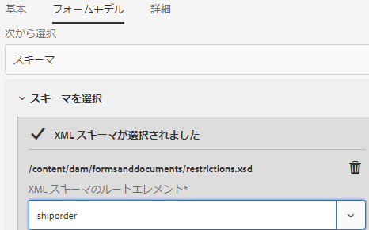

# アダプティブフォームの作成 {#creating-an-adaptive-form}

アダプティブフォームを使用すると、魅力的でレスポンシブ、かつ動的でアダプティブなフォームを作成できます。AEM Formsは、アダプティブFormsをすばやくオーサリングするための、ビジネスユーザーにとってわかりやすいウィザードを提供します。 このウィザードでは、事前設定済みのテンプレート、スタイル設定、フィールド、送信オプションを簡単に選択して、アダプティブフォームを作成するためのクイックタブナビゲーションが用意されています。

<!-- 

You can choose to create an Adaptive Form based on a form model or schema or without a form model. It is important to carefully choose the form model that not only suits your requirements but extends your existing infrastructural investments and assets. You get to choose from the following options to create an Adaptive Form: 

-->

<!-- 

Adaptive Forms allow you to create forms that are engaging, responsive, dynamic, and adaptive. [!DNL AEM Forms] provides an intuitive wizard and out-of-the-box components to create Adaptive Forms. You can choose to create an Adaptive Form based on a form model or schema or without a form model. It is important to carefully choose the form model that not only suits your requirements but extends your existing infrastructural investments and assets. You get to choose from the following options to create an Adaptive Form:

* **Using a form data model**
  [Data integration](data-integration.md) lets you integrate entities and services from disparate data sources in to a Form Data Model that you can use to create Adaptive Forms. Choose Form Data Model if the Adaptive Form you are creating involves fetching and write data from and to multiple data source.

  <!--  * **Using an XDP Form Template**
   It is an ideal form model if you have investments in XFA-based or XDP forms. It provides a direct way to convert your XFA-based forms into Adaptive Forms. Any existing XFA rules are retained in the associated Adaptive Forms. The resulting Adaptive Forms support XFA constructs, such as validations, events, properties, and patterns. 

* **Using an XML Schema Definition (XSD) or a JSON Schema**
   XML and JSON schemas represent the structure in which data is produced or consumed by the back-end system in your organization. You can associate the schema to an Adaptive Form and use its elements to add dynamic content to the Adaptive Form. The elements of the schema will be available for use in the Data Model Objects tab of the Content browser when authoring Adaptive Forms.

* **Using none or without a form model**
   Adaptive Forms created with this option don’t use any form model. The data XML generated from such forms has flat structure with fields and corresponding values. -->

## 前提条件

アダプティブフォームを作成するには、以下が必要です。

* アダプティブフォームテンプレート：テンプレートは基本的な構造を提供し、アダプティブフォームの外観（レイアウトとスタイル）を定義します。 これには、特定のプロパティやコンテンツ構造を有するフォーマット済みのコンポーネントが含まれます。また、テーマと送信アクションを定義するオプションも提供されます。 テーマは、ルックアンドフィールと送信アクションを定義し、アダプティブフォームの送信時に実行するアクションを定義します。 例えば、収集したデータをデータソースに送信する場合などです。 以下が可能です。 [新しいテンプレートを作成](template-editor.md) または既存のテンプレートをインポートします。 また、 [最新のアーキタイプ](https://experienceleague.adobe.com/docs/experience-manager-core-components/using/developing/archetype/using.html?lang=en#:~:text=The%20AEM%20Archetype%20is%20made%20up%20of%20modules%3A,and%20request%20filters.%20it.tests%3A%20are%20Java-based%20integration%20tests.) を参照してください。
* アダプティブフォームのテーマ：テーマには、コンポーネントとパネルのスタイル設定の詳細が含まれます。 スタイルには、背景色、状態色、透明度、配置、サイズなどのプロパティが含まれます。テーマを適用すると、指定したスタイルが対応するコンポーネントに反映されます。[新しいテーマを作成](themes.md)したり、[既存のテーマを読み込んだり](import-export-forms-templates.md#uploading-a-theme)、[サンプルテーマ](https://documentcloud.adobe.com/link/track?uri=urn:aaid:scds:US:2779f80e-16ba-4cd1-a96f-8e2b53f3be25)をダウンロードして読み込んだりできます。また、 [最新のアーキタイプ](https://experienceleague.adobe.com/docs/experience-manager-core-components/using/developing/archetype/using.html?lang=en#:~:text=The%20AEM%20Archetype%20is%20made%20up%20of%20modules%3A,and%20request%20filters.%20it.tests%3A%20are%20Java-based%20integration%20tests.) を参照してください。
* ユーザーを [!DNL forms-users] に追加し、アダプティブフォームを作成するための権限をユーザーに付与します。フォーム専用のユーザーグループの詳細なリストについては、[グループと権限](forms-groups-privileges-tasks.md)を参照してください。

## アダプティブフォームの作成 {#strong-create-an-adaptive-form-strong}

以下の手順を実行して、アダプティブフォームを作成します。

1. [!DNL Experience Manager Forms] オーサーインスタンスにアクセスします。Cloud インスタンスまたはローカル開発インスタンスの場合があります。

1. Experience Manager のログインページに資格情報を入力します。

   ログイン後、左上隅の **[!UICONTROL Adobe Experience Manager]**／**[!UICONTROL フォーム]**／**[!UICONTROL フォームとドキュメント]**&#x200B;をタップします。

1. タップ **[!UICONTROL 作成]**  > **[!UICONTROL アダプティブForms]**. ウィザードが開きます。
1. 「ソース」タブで、テンプレートを選択します。
   * テンプレートを選択すると、テンプレートで指定されたテーマと送信アクションが自動的に選択され、「作成」ボタンが有効になります。 「スタイル」タブまたは「送信」タブに移動して、別のテーマまたは送信アクションを選択できます。
   * 選択したテンプレートにテーマが指定されていない場合、「作成」ボタンは無効のままです。 「スタイル」タブに移動して、テーマを手動で選択できます。
1. 「スタイル」タブで、テーマを選択します。
   * 選択したテンプレートでテーマを指定すると、そのテーマはウィザードで自動的に選択されます。 「スタイル」タブから別のテーマを選択できます。
   * 選択したテンプレートにテーマが指定されていない場合は、「スタイル」タブを使用してテーマを選択できます。 テーマを選択すると、「作成」ボタンが有効になります。
1. （オプション）「Data」タブで、データモデルを選択します。
   * フォームデータモデル：A [フォームデータモデル](data-integration.md) を使用すると、異なるデータソースのエンティティやサービスをアダプティブフォームに統合できます。 作成するアダプティブフォームで、複数のデータソースからのデータの取得および書き込みが必要な場合は、「フォームデータモデル」を選択します。
   * JSON スキーマ：JSON スキーマは、組織のバックエンドシステムによってデータが生成または使用される構造を表します。 アダプティブフォームにスキーマを関連付けて、そのスキーマの要素を使用することにより、アダプティブフォームに動的なコンテンツを追加できます。スキーマの要素は、アダプティブFormsのオーサリング時に、コンテンツブラウザーの「データモデルオブジェクト」タブで使用でき、すべてのフィールドも新しく作成されたアダプティブフォームに追加されます。
1. 「送信」タブで、送信アクションを選択します。
   * テンプレートを選択すると、テンプレートで指定された送信アクションが自動選択されます。 「送信」タブから、別の送信アクションを選択できます。 「送信」タブに、使用可能なすべての送信アクションが表示されます。
   * 選択したテンプレートで送信アクションが指定されていない場合は、「送信」タブを使用して送信アクションを選択できます

1. （オプション）「配信」タブで、アダプティブフォームの発行日または非公開日を指定できます。

1. 「作成」をタップします。タイトル、名前、およびアダプティブフォームの保存場所を指定するためのダイアログが表示されます。

   * **[!UICONTROL タイトル：]**&#x200B;フォームの表示名を指定します。タイトルを指定すると、[!DNL Experience Manager Forms] ユーザーインターフェイス内のフォームを特定しやすくなります。
   * **[!UICONTROL 名前：]**&#x200B;フォームの名前を指定します。指定された名前のノードがリポジトリーに作成されます。タイトルを入力し始めると、名前フィールドの値が自動的に生成されます。候補として入力された値は変更可能です。「ドキュメント名」フィールドには、英数字、ハイフン、アンダースコアのみを使用できます。無効な入力は、すべてハイフンに置き換えられます。
   * **[!UICONTROL パス：]** アダプティブフォームを保存する場所を指定します。 アダプティブフォームは次の場所に直接保存できます。 `/content/dam/formsanddocuments` または、 `/content/dam/formsanddocuments/adaptiveforms` をクリックしてアダプティブフォームを保存します。 フォルダーをパスで使用する前に、必ずフォルダーを作成してください。 「パス」フィールドでは、フォルダーが自動的に作成されることはありません。

1. 「**[!UICONTROL 作成]**」をタップします。アダプティブフォームが作成され、アダプティブFormsエディターで開きます。 エディターに、テンプレートで使用可能なコンテンツが表示されます。 新しく作成されたフォームを必要に応じてカスタマイズするためのサイドバーも表示されます。

   アダプティブフォームのタイプに基づいて、関連する <!--XFA form template, XML schema or --> JSON スキーマまたはフォームデータモデルが **[!UICONTROL データモデルオブジェクト]** タブ **[!UICONTROL コンテンツブラウザー]** サイドバーに表示されます。 これらの要素もアドラッグ＆ドロップしてダプティブフォームを作成できます。

<!-- ## Create an Adaptive Form based on a Form Data Model {#fdm}

[Data integration](data-integration.md) lets you integrate multiple data sources and bring their entities and services together to create a form data model. It is an extension of JSON schema. You can use a Form Data Model to create an Adaptive Form. The entities or data model objects configured in a Form Data Model are available as data model objects for form authoring. They are bound to respective data sources and used to prefill a form and write submitted data back to the respective data sources. You can also call services configured in a Form Data Model using Adaptive Form rules.

To use a Form Data Model for creating an Adaptive Form:

1. In Form Model tab on Add Properties screen, select **[!UICONTROL Form Data Model]** in the **[!UICONTROL Select From]** drop-down list.

   

1. Tap to expand **[!UICONTROL Select Form Data Model]**. All available form data models are listed.Select a from data model.

>[!NOTE]
>
>You can also change the Form Data Model for an Adaptive Form. For detailed steps, see [Edit Form Model properties of an Adaptive Form](#edit-form-model).

## Create an Adaptive Form based on XML or JSON schema {#create-an-adaptive-form-based-on-xml-or-json-schema}

XML and JSON schemas represent the structure in which data is produced or consumed by the back-end system in your organization. You can associate a schema to an Adaptive Form and use its elements to add dynamic content to the Adaptive Form. The elements of the schema are available in the Data Model Object tab of the content browser for authoring Adaptive Forms. You can drag-drop the schema elements to build the form.

See the following documents to understand how to design XML or JSON schema for authoring Adaptive Forms.

* [Creating Adaptive Forms using XML schema](adaptive-form-xml-schema-form-model.md)
* [Creating Adaptive Forms using JSON schema](adaptive-form-json-schema-form-model.md)

Do the following to use XML or JSON schema as form model for an Adaptive Form:

1. On the **[!UICONTROL Add Properties]** step of Adaptive Form creation page, tap on the **[!UICONTROL Form Model]** tab.
1. In the Form Model tab, select **[!UICONTROL Schema]** from the **[!UICONTROL Select From]** drop-down field.

1. Tap **[!UICONTROL Select Schema]** and do one of the following:

    * **[!UICONTROL Upload from disk]** - Select this option and tap Upload Schema Definition to browse and upload an XML schema or JSON schema from your file system. The uploaded schema file resides with the form and is not accessible to other Adaptive Forms.
    * **[!UICONTROL Search in repository]** - Select this option to select from the list of schema definition files available in the repository. Select the XML or JSON schema file as form model. The selected schema is associated with the form by reference and is accessible for use in other Adaptive Forms.

      Ensure that the JSON schema filename ends with **.schema.json**. For example: mySchema.schema.json

   
**Figure:** *Selecting XML or JSON schema*

1. (For XML schema only) After you select or upload an XML Schema, specify a root element of the selected XSD file to map with the Adaptive Form.

   
**Figure:** *Selecting XSD root element*

>[!NOTE]
>
>You can also change the schema for an Adaptive Form. For detailed steps, see [Edit Form Model properties of an Adaptive Form](#edit-form-model). -->

## アダプティブフォームのフォームモデルプロパティの編集 {#edit-form-model}

アダプティブフォーム（JSON ベースまたはフォームデータモデル）のフォームモデルを変更できます。 あるフォームモデルから別のフォームモデルに変更することはできません。

1. アダプティブフォームを選択し、「**プロパティ**」アイコンをタップします。
1. 「**[!UICONTROL フォームモデル]**」タブを開き、以下のいずれかを実行します。

   * アダプティブフォームにフォームモデルがない場合、別のフォームモデルを選択し、それに応じて <!-- a form template, --> XML スキーマ、JSON スキーマまたはフォームデータモデルを選択できます。
   * アダプティブフォームがフォームモデルに基づいている場合、同じフォームモデルに対して別の <!-- form template, --> XML スキーマ、JSON スキーマまたはフォームデータモデルを選択できます。

1. 「**[!UICONTROL 保存]**」をタップして、プロパティを保存します。
