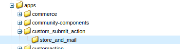
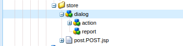
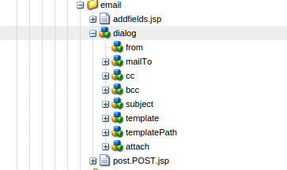
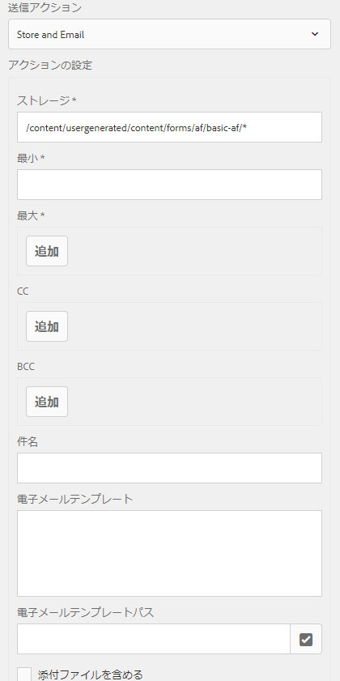
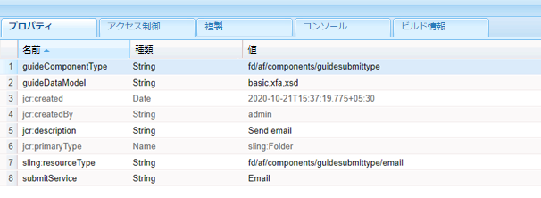
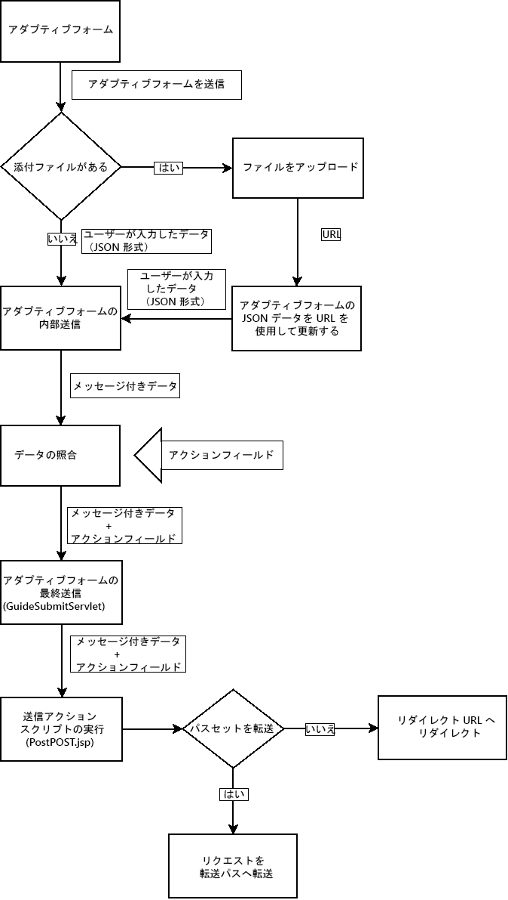

# アダプティブフォーム用のカスタム送信アクションを作成 {#writing-custom-submit-action-for-adaptive-forms}

| バージョン | 記事リンク |
| -------- | ---------------------------- |
| AEM 6.5 | [ここをクリックしてください](https://experienceleague.adobe.com/ja/docs/experience-manager-65/content/forms/customize-aem-forms/custom-submit-action-form) |
| AEM as a Cloud Service（コアコンポーネント） | [ここをクリックしてください](https://experienceleague.adobe.com/ja/docs/experience-manager-cloud-service/content/forms/adaptive-forms-authoring/authoring-adaptive-forms-core-components/create-an-adaptive-form-on-forms-cs/custom-submit-action-for-adaptive-forms-based-on-core-components) |
| AEM as a Cloud Service（基盤コンポーネント） | この記事 |

アダプティブフォームでは、あらかじめ用意された複数の送信アクション（OOTB）を使用できます。送信アクションは、アダプティブフォームで収集されたデータに対して実行されるアクションの詳細を指定します。例えば、メールでのデータの送信などです。

カスタム送信アクションを作成して、[すぐに使える送信アクション](configuring-submit-actions.md)に含まれない機能や、単一の OOTB 送信アクションを介してサポートされない機能を追加できます。例えば、データをワークフローに送信し、そのデータをデータストアに保存し、フォームを送信した人にメール通知を送信し、送信したフォームを承認および却下するプロセスを担当する人にメールを送信するというアクションを、1 つの送信アクションで処理するとします。

## XML データ形式 {#xml-data-format}

XML データは、**`jcr:data`** リクエストパラメーターを使ってサーブレットへと送信されます。送信アクションは、データを処理するためにパラメーターにアクセスすることができます。次のコードは、XML データの形式を説明しています。フォームモデルにバインドされているフィールドは、**`afBoundData`** セクションに表示されます。バインドされていないフィールドは、`afUnoundData` セクションに表示されます。<!--For more information about the format of the `data.xml` file, see [Introduction to prepopulating Adaptive Form fields](prepopulate-adaptive-form-fields.md).-->

```xml
<?xml ?>
<afData>
<afUnboundData>
<data>
<field1>value</field2>
<repeatablePanel>
    <field2>value</field2>
</repeatablePanel>
<repeatablePanel>
    <field2>value</field2>
</repeatablePanel>
</data>
</afUnboundData>
<afBoundData>
<!-- xml corresponding to the Form Model /XML Schema -->
</afBoundData>
</afData>
```

### アクションフィールド {#action-fields}

送信アクションは、HTML の [input](https://developer.mozilla.org/ja/docs/Web/HTML/Element/Input) タグを使って、レンダリングされたフォームの HTML に非表示の入力フィールドを追加することができます。これらの非表示のフィールドには、フォーム送信の処理中に必要な値を含めることができます。フォーム送信時に、これらのフィールド値は、送信アクションが送信処理中に使用することのできるリクエストパラメーターとしてポストバックされます。この入力フィールドは、アクションフィールドと呼ばれます。

例えば、フォームの記入にかかった時間も取得する送信アクションであれば、`startTime` および `endTime` のフィールドを非表示で追加することができます。

スクリプトを使って、フォームがレンダリングされた時間ならびにフォーム送信前の時間を、それぞれ `startTime` および `endTime` フィールドの値として指定することができます。その後、送信アクションのスクリプト `post.jsp` が、リクエストパラメーターを使ってこれらのフィールドにアクセスし、フォームの記入にかかった合計時間を計算することができます。

### 添付ファイル {#file-attachments}

送信アクションは、ファイル添付コンポーネントを使ってアップロードされた添付ファイルを使用することもできます。送信アクションスクリプトは、Sling [RequestParameter API](https://sling.apache.org/apidocs/sling5/org/apache/sling/api/request/RequestParameter.html) を使ってこれらのファイルにアクセスすることができます。API の [isFormField](https://sling.apache.org/apidocs/sling5/org/apache/sling/api/request/RequestParameter.html#isFormField()) メソッドは、リクエストパラメーターがファイルであるかフォームフィールドであるかを特定するのに役立ちます。送信アクション内のリクエストパラメーターを反復することで、ファイル添付パラメーターを特定することができます。

次のサンプルコードは、まず、リクエスト内の添付ファイルを特定します。続いて、このコードは、[Get API](https://sling.apache.org/apidocs/sling5/org/apache/sling/api/request/RequestParameter.html#get()) を使ってファイルにデータを読み込みます。最後に、データを使用してドキュメントオブジェクトを作成し、それをリストに追加します。

```java
RequestParameterMap requestParameterMap = slingRequest.getRequestParameterMap();
for (Map.Entry<String, RequestParameter[]> param : requestParameterMap.entrySet()) {
    RequestParameter rpm = param.getValue()[0];
    if(!rpm.isFormField()) {
        fileAttachments.add(new Document(rpm.get()));
    }
}
```

アダプティブフォームにファイルを添付する場合、サーバーはアダプティブフォームの送信後に添付ファイルを検証し、次の場合にエラーメッセージを返します。

* 添付ファイルには、\ / : * ? を含む（.）文字で開始するファイル名が含まれます。&quot; &lt; > | ; % $ 文字を含むもの、または `nul`、`prn`、`con`、`lpt`、`com` など、Windows オペレーティングシステム用に予約された特殊なファイル名を含む添付ファイル。

* 添付ファイルのサイズが 0 バイト。

* アダプティブフォームで添付ファイルコンポーネントを設定する際に、[サポートされているファイル形式](https://helpx.adobe.com/jp/document-cloud/help/supported-file-formats-fill-sign.html#main-pars_text)セクションで定義されていない添付ファイル形式。

### 転送パスおよびリダイレクト URL {#forward-path-and-redirect-url}

要求されたアクションを実行した後、送信サーブレットは、リクエストを転送パスに転送します。アクションが、setForwardPath API を使って Guide Submit サーブレットに転送パスを作成します。

アクションによって転送パスが指定されない場合、送信サーブレットは、リダイレクト URL を使ってブラウザーをリダイレクトします。作成者は、アダプティブフォーム編集ダイアログの「ありがとうございます」ページ設定を使って、リダイレクト URL を設定します。リダイレクト URL は、送信アクションまたは Guide Submit 内の setRedirectUrl API を通して設定することもできます。また、Guide Submit サーブレット内の setRedirectParameters API を使って、リダイレクト URL に送られるリクエストパラメーターを設定することもできます。

>[!NOTE]
>
>リダイレクト URL は、「ありがとうございます」ページ設定を使って作成者が指定します。[OOTB 送信アクション](configuring-submit-actions.md)は、リダイレクト URL を使って、転送パスによって参照されるリソースからブラウザーをリダイレクトします。
>
>リクエストをリソースまたはサーブレットに転送するカスタム送信アクションを作成することができます。転送パスのリソース処理を実行するスクリプトによるリダイレクト URL へのリクエストのリダイレクトは、処理が完了したときに実行するように設定することをお勧めします。

## 送信アクション {#submit-action}

送信アクションは、次のファイルを含む sling:Folder です。

* **addfields.jsp**：このスクリプトは、レンディション中に HTML ファイルに追加されるアクションフィールドを指定します。post.POST.jsp スクリプトでの送信中に必要な非表示の入力パラメーターの追加には、このスクリプトを使用します。
* **dialog.xml**：このスクリプトは、CQ コンポーネントダイアログに似ています。作成者がカスタマイズする設定情報を提供します。フィールドは、送信アクションを選択するときに、アダプティブフォーム編集ダイアログの送信アクションタブに表示されます。
* **post.POST.jsp**：送信サーブレットは、送信されたデータおよび前のセクションからの追加データで、このスクリプトを呼び出します。このページで言及されるアクションの実行は、post.POST.jsp スクリプトの実行を意味します。送信アクションをアダプティブフォームに登録し、アダプティブフォーム編集ダイアログに表示するには、次のプロパティを `sling:Folder` に追加します。

   * 文字列型の **guideComponentType** および値 **fd/af/components/guidesubmittype**
   * 送信アクションが適用されるアダプティブフォームのタイプを指定する文字列型の **guideDataModel**。<!--**xfa** is supported for XFA-based Adaptive Forms while -->**xsdi** は、XSD ベースのアダプティブフォームでサポートされています。**basic** は、XDP または XSD を使用しないアダプティブフォームでサポートされています。複数のタイプのアダプティブフォームでのアクションを表示するには、対応する文字列を追加します。各文字列はカンマで区切ります。例えば、<!--XFA- and -->XSD ベースのアダプティブフォームでアクションを表示するには、値を <!--**xfa** and--> **xsd** に指定します。

   * 文字列型の **jcr:description**。このプロパティの値は、アダプティブフォーム編集ダイアログの「送信アクション」タブにある送信アクションリストに表示されます。OOTB アクションは、**/libs/fd/af/components/guidesubmittype** の場所にある CRX リポジトリーに存在します。

   * **文字列**&#x200B;型の submitService。詳しくは、「[カスタムアクション用にアダプティブフォームの送信をスケジュール](#schedule-adaptive-form-submission)」を参照してください。

## カスタム送信アクションの作成 {#creating-a-custom-submit-action}

>[!NOTE]
>
> コアコンポーネントのカスタム送信アクションを作成する方法について詳しくは、[アダプティブフォーム（コアコンポーネント）用のカスタム送信アクションの作成](https://experienceleague.adobe.com/ja/docs/experience-manager-cloud-service/content/forms/adaptive-forms-authoring/authoring-adaptive-forms-core-components/create-an-adaptive-form-on-forms-cs/custom-submit-action-for-adaptive-forms-based-on-core-components)を参照してください。

CRX リポジトリーにデータを保存した後にメール送信を行うカスタム送信アクションを作成するには、次の手順を実行します。アダプティブフォームには、CRX リポジトリーにデータを保存する OOTB の送信アクション、コンテンツを格納アクション（非推奨）が含まれています。さらに、AEM には、メール送信に使用される [Mail](https://www.adobe.io/experience-manager/reference-materials/6-5/javadoc/com/day/cq/mailer/package-summary.html) API が含まれています。Mail API を使用する前に、システムコンソールを通して Day CQ Mail サービスを設定します。リポジトリーにデータを保存するには、コンテンツを格納アクション（非推奨）を再利用できます。コンテンツを格納アクション（非推奨）は、CRX リポジトリーの /libs/fd/af/components/guidesubmittype/store にあります。

1. URL https://&lt;server>:&lt;port>/crx/de/index.jspから、CRXDE Lite にログインします。/apps/custom_submit_action フォルダー内に sling:Folder プロパティを持つノードを作成し、名前を store_and_mail に設定します。custom_submit_action フォルダーが存在しない場合は作成します。

   

2. **必須の設定フィールドを指定します。**

   格納アクションに必要な設定を追加します。/libs/fd/af/components/guidesubmittype/store から、格納アクションの **cq:dialog** ノードを、/apps/custom_submit_action/store_and_email のアクションフォルダーにコピーします。

   

3. **作成者にメール設定を促す設定フィールドを指定します。**

   アダプティブフォームには、ユーザーにメールを送信するメール送信アクションもあります。要件に応じて、このアクションをカスタマイズします。/libs/fd/af/components/guidesubmittype/email/dialog に移動します。cq:dialog ノード内のノードを、送信アクションの cq:dialog ノード（/apps/custom_submit_action/store_and_email/dialog）にコピーします。

   

4. **アクションをアダプティブフォーム編集ダイアログで使用できるようにします。**

   次のプロパティを store_and_email ノードに追加します。

   * **文字列**&#x200B;型の **guideComponentType** および値 **fd/af/components/guidesubmittype**

   * **文字列**&#x200B;型の **guideDataModel** および値 **<!--xfa, -->xsd、basic**

   * **文字列**&#x200B;型の **jcr:description**&#x200B;および値 **Store and Email Action**

   * **文字列**&#x200B;型の **submitService** および値 **Store and Email**。詳しくは、「[カスタムアクション用にアダプティブフォームの送信をスケジュール](#schedule-adaptive-form-submission)」を参照してください。

5. 任意のアダプティブフォームを開きます。「**開始**」の隣にある「**編集**」ボタンをクリックし、アダプティブフォームコンテナの **編集** ダイアログを開きます。新しいアクションが、「**送信アクション**」タブに表示されます。**格納およびメール送信アクション**&#x200B;を選択すると、ダイアログノードに追加された設定が表示されます。

   

6. **アクションを使用してタスクを完了します。**

   post.POST.jsp スクリプトをアクションに追加します（/apps/custom_submit_action/store_and_mail/）。

   OOTB の格納アクション（post.POST.jsp スクリプト）を実行します。CQ がコードに提供する [FormsHelper.runAction](https://www.adobe.io/experience-manager/reference-materials/6-5/javadoc/com/day/cq/wcm/foundation/forms/FormsHelper.html#runAction-java.lang.String-java.lang.String-org.apache.sling.api.resource.Resource-org.apache.sling.api.SlingHttpServletRequest-org.apache.sling.api.SlingHttpServletResponse-)（java.lang.String、java.lang.String、org.apache.sling.api.resource.Resource、org.apache.sling.api.SlingHttpServletRequest、org.apache.sling.api.SlingHttpServletResponse） API を、格納アクション内で実行します。次のコードを JSP ファイルに追加します。

   `FormsHelper.runAction("/libs/fd/af/components/guidesubmittype/store", "post", resource, slingRequest, slingResponse);`

   メールを送信するために、コードが受信者のメールアドレスを設定から読み取ります。アクションのスクリプトに設定値を取り込むには、次のコードを使用して現在のリソースのプロパティを読み込みます。同様に、他の設定ファイルも読み取ることができます。

   `ValueMap properties = ResourceUtil.getValueMap(resource);`

   `String mailTo = properties.get("mailTo");`

   最後に、CQ Mail API を使用してメールを送信します。[SimpleEmail](https://commons.apache.org/proper/commons-email/commons-email2-javax/apidocs/org/apache/commons/mail2/javax/SimpleEmail.html) クラスを使って、次に示すとおりに Email Object を作成します。

   >[!NOTE]
   >
   >JSP ファイルの名前が post.POST.jsp になっていることを確認してください。

   ```java
   <%@include file="/libs/fd/af/components/guidesglobal.jsp" %>
   <%@page import="com.day.cq.wcm.foundation.forms.FormsHelper,
          org.apache.sling.api.resource.ResourceUtil,
          org.apache.sling.api.resource.ValueMap,
                   com.day.cq.mailer.MessageGatewayService,
     com.day.cq.mailer.MessageGateway,
     org.apache.commons.mail.Email,
                   org.apache.commons.mail.SimpleEmail" %>
   <%@taglib prefix="sling"
                   uri="https://sling.apache.org/taglibs/sling/1.0" %>
   <%@taglib prefix="cq"
                   uri="https://www.day.com/taglibs/cq/1.0"
   %>
   <cq:defineObjects/>
   <sling:defineObjects/>
   <%
           String storeContent =
                       "/libs/fd/af/components/guidesubmittype/store";
           FormsHelper.runAction(storeContent, "post", resource,
                                   slingRequest, slingResponse);
    ValueMap props = ResourceUtil.getValueMap(resource);
    Email email = new SimpleEmail();
    String[] mailTo = props.get("mailto", new String[0]);
    email.setFrom((String)props.get("from"));
           for (String toAddr : mailTo) {
               email.addTo(toAddr);
      }
    email.setMsg((String)props.get("template"));
    email.setSubject((String)props.get("subject"));
    MessageGatewayService messageGatewayService =
                       sling.getService(MessageGatewayService.class);
    MessageGateway messageGateway =
                   messageGatewayService.getGateway(SimpleEmail.class);
    messageGateway.send(email);
   %>
   ```

   アダプティブフォームでアクションを選択します。アクションによりメールが送信され、データが保存されます。

## カスタムの送信アクションに対する submitService プロパティの使用 {#submitservice-property}

`submitService` プロパティを含むカスタム送信アクションを設定すると、フォームトリガーは送信時に [FormSubmitActionService](https://helpx.adobe.com/jp/experience-manager/6-5/forms/javadocs/com/adobe/aemds/guide/service/FormSubmitActionService.html) を送信します。`FormSubmitActionService` は、`getServiceName` メソッドを使用して `submitService` プロパティの値を取得します。`submitService` プロパティの値に基づいて、サービスは適切な送信メソッドを呼び出します。`FormSubmitActionService` サーバーにアップロードするカスタムバンドルに [!DNL AEM Forms] を含めます。

アダプティブフォームの [!DNL Adobe Sign] を有効にするには、カスタム送信アクションの `sling:Folder` に対するタイプ文字列の `submitService` プロパティを追加します。アダプティブフォームコンテナプロパティの&#x200B;**[!UICONTROL 電子サイン]**&#x200B;セクションで、カスタムの送信アクションの `submitService` プロパティの値を設定した後にのみ、「**[!UICONTROL Adobe Sign を有効にする]**」オプションを選択できます。

<!--As a result of setting an appropriate value for the `submitService` property and enabling [!DNL Adobe Sign], you can schedule the submission of an Adaptive Form to ensure that all configured signers have taken an action on the form. [!DNL Adobe Sign] Configuration Service keeps polling [!DNL Adobe Sign] server at regular intervals to verify the status of signatures. If all the signers complete signing the form, the Submit Action service is started and the form is submitted.-->




<!-- You can't do comments within comments, so I changed comment tags to <start-comment> <end-comment> -->

<!--
## Workflow for a Submit Action {#workflow-for-a-submit-action}

The flowchart depicts the workflow for a Submit Action that is triggered when you click the **[!UICONTROL Submit]** button in an Adaptive Form. The files in the File Attachment component are uploaded to the server, and the form data is updated with the URLs of the uploaded files. Within the client, the data is stored in the JSON format. The client sends an Ajax request to an internal servlet that massages the data you specified and returns it in the XML format. The client collates this data with action fields. It submits the data to the final servlet (Guide Submit servlet) through a Form Submit Action. Then, the servlet forwards the control to the Submit Action. The Submit Action can forward the request to a different sling resource or redirect the browser to another URL.



### XML data format {#xml-data-format}

The XML data is sent to the servlet using the **`jcr:data`** request parameter. Submit Actions can access the parameter to process the data. The following code describes the format of the XML data. The fields that are bound to the Form model appear in the **`afBoundData`** section. Unbound fields appear in the `afUnoundData`section. For more information about the format of the `data.xml` file, see [Introduction to prepopulating Adaptive Form fields](prepopulate-adaptive-form-fields.md).

```xml
<?xml ?>
<afData>
<afUnboundData>
<data>
<field1>value</field2>
<repeatablePanel>
    <field2>value</field2>
</repeatablePanel>
<repeatablePanel>
    <field2>value</field2>
</repeatablePanel>
</data>
</afUnboundData>
<afBoundData>
<start comment> xml corresponding to the Form Model /XML Schema <end comment>
<start comment> </afBoundData> <end comment>
</afData>
```

### Action fields {#action-fields}

A Submit Action can add hidden input fields (using the HTML [input](https://developer.mozilla.org/en/docs/Web/HTML/Element/Input) tag) to the rendered form HTML. These hidden fields can contain values that it needs while processing form submission. When submitting the form, these field values are posted back as request parameters that the Submit Action can use during submission handling. The input fields are called action fields.

For example, a Submit Action that also captures the time taken to fill a form can add the hidden input fields `startTime` and `endTime`.

A script can supply the values of the `startTime` and `endTime` fields when the form renders and before form submission, respectively. The Submit Action script `post.jsp` can then access these fields using request parameters and compute the total time required to fill the form.

### File attachments {#file-attachments}

Submit Actions can also use the file attachments you upload using the File Attachment component. Submit Action scripts can access these files using the sling [RequestParameter API](https://sling.apache.org/apidocs/sling5/org/apache/sling/api/request/RequestParameter.html). The [isFormField](https://sling.apache.org/apidocs/sling5/org/apache/sling/api/request/RequestParameter.html#isFormField()) method of the API helps identify whether the request parameter is a file or a form field. You can iterate over the Request parameters in a Submit Action to identify File Attachment parameters.

The following sample code identifies the file attachments in the request. Next, it reads the data into the file using the [Get API](https://sling.apache.org/apidocs/sling5/org/apache/sling/api/request/RequestParameter.html#get()). Finally, it creates a Document object using the data and appends it to a list.

```java
RequestParameterMap requestParameterMap = slingRequest.getRequestParameterMap();
for (Map.Entry<String, RequestParameter[]> param : requestParameterMap.entrySet()) {
    RequestParameter rpm = param.getValue()[0];
    if(!rpm.isFormField()) {
        fileAttachments.add(new Document(rpm.get()));
    }
}
```

### Forward path and Redirect URL {#forward-path-and-redirect-url}

After performing the required action, the Submit servlet forwards the request to the forward path. An action uses the setForwardPath API to set the forward path in the Guide Submit servlet.

If the action does not provide a forward path, the Submit servlet redirects the browser using the Redirect URL. The author configures the Redirect URL using the Thank You Page configuration in the Adaptive Form Edit dialog. You can also configure the Redirect URL through the Submit Action or the setRedirectUrl API in the Guide Submit servlet. You can also configure the Request parameters sent to the Redirect URL using the setRedirectParameters API in the Guide Submit servlet.

>[!NOTE]
>
>An author provides the Redirect URL (using the Thank You Page Configuration). [OOTB Submit Actions](configuring-submit-actions.md) use the Redirect URL to redirect the browser from the resource that the forward path references.
>
>You can write a custom Submit Action that forwards a request to a resource or servlet. Adobe recommends that the script that performs resource handling for the forward path redirect the request to the Redirect URL when the processing completes.

## Submit Action {#submit-action}

A Submit Action is a sling:Folder that includes the following:

* **addfields.jsp**: This script provides the action fields that are added to the HTML file during rendition. Use this script to add hidden input parameters required during submission in the post.POST.jsp script.
* **dialog.xml**: This script is similar to the CQ Component dialog. It provides configuration information that the author customizes. The fields are displayed in the Submit Actions Tab in the Adaptive Form Edit dialog when you select the Submit Action.
* **post.POST.jsp**: The Submit servlet calls this script with the data that you submit and the additional data in the previous sections. Any mention of running an action in this page implies running the post.POST.jsp script. To register the Submit Action with the Adaptive Forms to display in the Adaptive Form Edit dialog, add these properties to the sling:Folder:

    * **guideComponentType** of type String and value **fd/af/components/guidesubmittype**
    * **guideDataModel** of type String that specifies the type of Adaptive Form for which the Submit Action is applicable. **xfa** is supported for XFA-based Adaptive Forms while **xsd** is supported for XSD-based Adaptive Forms. **basic** is supported for Adaptive Forms that do not use XDP or XSD. To display the action on multiple types of Adaptive Forms, add the corresponding strings. Separate each string by a comma. For example, to make an action visible on XFA- and XSD-based Adaptive Forms, specify the values **xfa** and **xsd** respectively.

    * **jcr:description** of type String. The value of this property is displayed in the Submit Action list in the Submit Actions Tab of the Adaptive Form Edit dialog. The OOTB actions are present in the CRX repository at the location **/libs/fd/af/components/guidesubmittype**.

## Creating a custom Submit Action {#creating-a-custom-submit-action}

Perform the following steps to create a custom Submit Action that saves the data in the CRX repository and then sends you an email. The Adaptive Form contains the OOTB Submit Action Store Content (deprecated) that saves the data in the CRX repository. In addition, CQ provides a [Mail](https://www.adobe.io/experience-manager/reference-materials/6-5/javadoc/com/day/cq/mailer/package-summary.html) API that can be used to send emails. Before using the Mail API, configure the Day CQ Mail service through the system console. You can reuse the Store Content (deprecated) action to store the data in the repository. The Store Content (deprecated) action is available at the location /libs/fd/af/components/guidesubmittype/store in the CRX repository.

1. Log in to CRXDE Lite at the URL https://&lt;server&gt;:&lt;port&gt;/crx/de/index.jsp. Create a node with the property sling:Folder and name store_and_mail in the /apps/custom_submit_action folder. Create the custom_submit_action folder if it does not exist already.

   

1. **Provide the mandatory configuration fields.**

   Add the configuration the Store action requires. Copy the **cq:dialog** node of the Store action from /libs/fd/af/components/guidesubmittype/store to the action folder at /apps/custom_submit_action/store_and_email.

   

1. **Provide configuration fields to prompt the author for email configuration.**

   The Adaptive Form also provides an Email action that sends emails to users. Customize this action based on your requirements. Navigate to /libs/fd/af/components/guidesubmittype/email/dialog. Copy the nodes within the cq:dialog node to cq:dialog node of your Submit Action (/apps/custom_submit_action/store_and_email/dialog).

   

1. **Make the action available in the Adaptive Form Edit dialog.**

   Add the following properties in the store_and_email node:

    * **guideComponentType** of type **String** and value **fd/af/components/guidesubmittype**

    * **guideDataModel** of type **String** and value **xfa, xsd, basic**

    * **jcr:description** of type **String** and value **Store and Email Action**

1. Open any Adaptive Form. Click the **Edit** button next to **Start** to open the **Edit** dialog of the Adaptive Form container. The new action is displayed in the **Submit Actions** Tab. Selecting the **Store and Email Action** displays the configuration added in the dialog node.

   

1. **Use the action to complete a task.**

   Add the post.POST.jsp script to your action. (/apps/custom_submit_action/store_and_mail/).

   Run the OOTB Store action (post.POST.jsp script). Use the [FormsHelper.runAction](https://www.adobe.io/experience-manager/reference-materials/6-5/javadoc/com/day/cq/wcm/foundation/forms/FormsHelper.html#runAction-java.lang.String-java.lang.String-org.apache.sling.api.resource.Resource-org.apache.sling.api.SlingHttpServletRequest-org.apache.sling.api.SlingHttpServletResponse-(java.lang.String, java.lang.String, org.apache.sling.api.resource.Resource, org.apache.sling.api.SlingHttpServletRequest, org.apache.sling.api.SlingHttpServletResponse)) API that CQ provides in your code to run the Store action. Add the following code in your JSP file:

   `FormsHelper.runAction("/libs/fd/af/components/guidesubmittype/store", "post", resource, slingRequest, slingResponse);`

   To send the email, the code reads the recipient's email address from the configuration. To fetch the configuration value in the action's script, read the properties of the current resource using the following code. Similarly you can read the other configuration files.

   `ValueMap properties = ResourceUtil.getValueMap(resource);`

   `String mailTo = properties.get("mailTo");`

   Finally, use the CQ Mail API to send the email. Use the [SimpleEmail](https://commons.apache.org/proper/commons-email/apidocs/org/apache/commons/mail/SimpleEmail.html) class to create the Email Object as depicted below:

   >[!NOTE]
   >
   >Ensure that the JSP file has the name post.POST.jsp.

   ```java
   <%@include file="/libs/fd/af/components/guidesglobal.jsp" %>
   <%@page import="com.day.cq.wcm.foundation.forms.FormsHelper,
          org.apache.sling.api.resource.ResourceUtil,
          org.apache.sling.api.resource.ValueMap,
                   com.day.cq.mailer.MessageGatewayService,
     com.day.cq.mailer.MessageGateway,
     org.apache.commons.mail.Email,
                   org.apache.commons.mail.SimpleEmail" %>
   <%@taglib prefix="sling"
                   uri="https://sling.apache.org/taglibs/sling/1.0" %>
   <%@taglib prefix="cq"
                   uri="https://www.day.com/taglibs/cq/1.0"
   %>
   <cq:defineObjects/>
   <sling:defineObjects/>
   <%
           String storeContent =
                       "/libs/fd/af/components/guidesubmittype/store";
           FormsHelper.runAction(storeContent, "post", resource,
                                   slingRequest, slingResponse);
    ValueMap props = ResourceUtil.getValueMap(resource);
    Email email = new SimpleEmail();
    String[] mailTo = props.get("mailto", new String[0]);
    email.setFrom((String)props.get("from"));
           for (String toAddr : mailTo) {
               email.addTo(toAddr);
      }
    email.setMsg((String)props.get("template"));
    email.setSubject((String)props.get("subject"));
    MessageGatewayService messageGatewayService =
                       sling.getService(MessageGatewayService.class);
    MessageGateway messageGateway =
                   messageGatewayService.getGateway(SimpleEmail.class);
    messageGateway.send(email);
   %>
   ```

   Select the action in the Adaptive Form. The action sends an email and stores the data. 

-->

>[!MORELIKETHIS]
>
>* [アダプティブフォームの送信アクションの設定方法](/help/forms/configure-submit-actions-core-components.md)