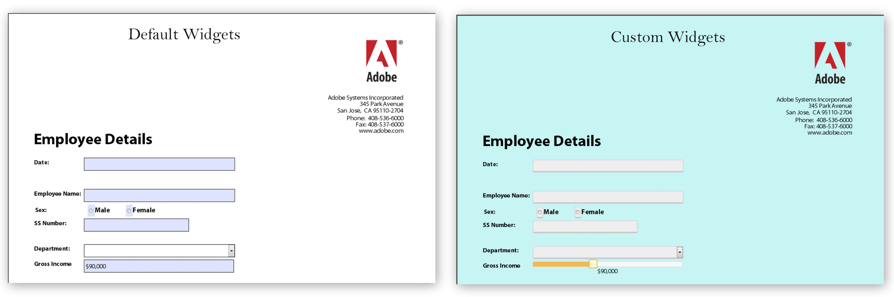

# HTML5 フォームのカスタム外観の作成{#create-custom-appearances-in-html-forms}

<span class="preview"> HTML5 Forms機能は、早期アクセスプログラムの一部として提供されています。 アクセスをリクエストするには、公式（職場）メール ID からaem-forms-ea@adobe.comにメールを送信します。
</span>

Mobile Forms でカスタムウィジェットをプラグインできます。外観フレームワークを使用することで、既存の jQuery ウィジェットの拡張や、独自のカスタムウィジェットの開発を行うことができます。XFA エンジンは様々なウィジェットを使用します。詳しくは、[アダプティブフォームおよび HTML5 フォームの外観フレームワーク](/help/forms/custom-widgets.md)を参照してください。



デフォルトおよびカスタムウェジェットの例

## HTML5 フォームでのカスタムウィジェットの統合 {#integrating-custom-widgets-with-html-forms}

### プロファイルの作成 {#create-a-profile-nbsp}

プロファイルを作成するか、または既存のプロファイルを選択してカスタムウィジェットを追加できます。プロファイル作成について詳しくは、[カスタムプロファイルの作成](/help/forms/custom-profile.md)を参照してください。

### ウィジェットの作成 {#create-a-widget}

HTML5 Forms には、新しいウィジェットを作成するために拡張可能なウィジェットフレームワークの実装が提供されています。この実装は jQuery ウィジェット *abstractWidget* です。これを拡張して新しいウィジェットを作成することができます。新しいウィジェットは、以下に記述する関数を拡張／上書きすることによってのみ、機能させることができます。

<table>
 <tbody>
  <tr>
   <td>関数／クラス</td>
   <td>説明</td>
  </tr>
  <tr>
   <td>render</td>
   <td>レンダリング関数は、ウィジェットのデフォルト HTML 要素のための jQuery オブジェクトを返します。デフォルトの HTML 要素は、フォーカス可能タイプとします。例えば、&lt;a&gt;、&lt;input&gt;、&lt;li&gt; などです。返された要素は $userControl として使用されます。$userControl は上記の制約を指定し、次に AbstractWidget クラスの関数が期待通りに機能します。そうでない場合、一部の一般的な API（フォーカス、クリック）は変更を必要とします。 </td>
  </tr>
  <tr>
   <td>getEventMap</td>
   <td>HTML イベントを XFA イベントに変換するマップを返します。<br /> {<br /> blur: XFA_EXIT_EVENT,<br /> }<br /> この例は、blur が HTML イベントであり、XFA_EXIT_EVENT が対応する XFA イベントであることを示しています。 </td>
  </tr>
  <tr>
   <td>getOptionsMap</td>
   <td>オプションの変更時に実行すべきアクションの詳細を提供するマップを返します。キーはウィジェットに提供されるオプションです。値はそのオプションの変更が検出されたときに毎回呼び出される関数です。ウィジェットは、すべての一般的なオプション（value と displayValue を除く）のハンドラーを提供します</td>
  </tr>
  <tr>
   <td>getCommitValue</td>
   <td>ウィジェットフレームワークは、ウィジェットの値が XFAModel に保存されたときに（例えば textField の終了イベント時に）毎回この関数を読み込みます。実装は、ウィジェットに保存された値を返す必要があります。ハンドラーには、オプションの新しい値が与えられます。</td>
  </tr>
  <tr>
   <td>showValue</td>
   <td>デフォルトでは、XFA でのエントリイベント時に、フィールドの rawValue が表示されます。この関数が呼び出されて、rawValue がユーザーに表示されます。 </td>
  </tr>
  <tr>
   <td>showDisplayValue</td>
   <td>デフォルトでは、XFA での終了イベント時に、フィールドの formattedValue が表示されます。この関数が呼び出されて、formattedValue がユーザーに表示されます。 </td>
  </tr>
 </tbody>
</table>

独自のウィジェットを作成するには、上記で作成されたプロファイルに、上書きされた関数と新しく追加された関数を含む JavaScript ファイルの参照を含めます。例えば、*sliderNumericFieldWidget* は数値フィールドのためのウィジェットです。ヘッダーセクション内のプロファイルでウィジェットを使用するには、次の行を含めます。

```javascript
window.formBridge.registerConfig("widgetConfig" , widgetConfigObject);
```

### XFA スクリプティングエンジンでのカスタムウィジェットの登録 {#register-custom-widget-with-xfa-scripting-engine-nbsp}

カスタムウィジェットのコードが準備されたら、[Form Bridge](https://experienceleague.adobe.com/en/docs/experience-manager-65/content/forms/developer-reference/form-bridge-apis) の `registerConfig` API を使用して、スクリプトエンジンにウィジェットを登録します。それは widgetConfigObject を入力として受け取ります。

```javascript
window.formBridge.registerConfig("widgetConfig",
        {
        ".<field-identifier>":"<name-of-the-widget>"
        }
    );
```

#### widgetConfigObject {#widgetconfigobject}

ウィジェット設定は JSON オブジェクトとして提供（キーと値のペアのコレクション）されます。キーはフィールドを識別し、値はそれらのフィールドで使用するウィジェットを表します。サンプル設定には次のようなものがあります。

```
*{*

*"identifier1" : "customwidgetname",
"identifier2" : "customwidgetname2",
..
}*
```

ここで「identifier」は、特定のフィールド、特定のタイプの一連のフィールド、またはすべてのフィールドを現す jQuery CSS セレクターです。以下には、さまざまなケースでの識別子の値が記載されています。

| 識別子のタイプ | 識別子 | 説明 |
|---|---|---|
| fieldname の名前を持つ特定のフィールド | 識別子：「div.fieldname」 | 「fieldname」の名前を持つすべてのフィールドはウィジェットの使用によりレンダリングされます。 |
| 「type」タイプのすべてのフィールド（ここで type は NumericField、DateField などです。）： | 識別子：「div.type」 | Timefield と DateTimeField の場合、これらのフィールドはまだサポートされていないため、タイプは textfield です。 |
| すべてのフィールド | 識別子：「div.field」 |  |
