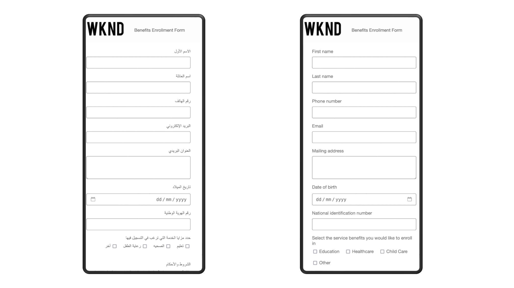

# AEM Forms早期アクセスプログラム

AEM Forms早期アクセスプログラムプログラムは、誰よりも先に最先端の機能に独占的にアクセスし、開発を形作る手助けをするユニークな機会を提供します。 このプログラムでは、次のことが可能です。

* 最先端のテクノロジーに最初にアクセスしてから、普及しましょう。
* 製品チームと共同イノベーションし、製品の未来を共に形作る。 ユースケースを活用して開発を導き、イノベーションが成熟していることを確認し、実際の課題に対処します。
* フィードバックを提供してください。また、リリース前に問題を解決できるようサポートしてくれれば、フルリリース時によりスムーズなユーザーエクスペリエンスを実現できます。

## 早期アクセスプログラムに参加するには？

早期アクセスのイノベーションに関する早期アクセス プログラムへの参加に関心がある場合は、公式アドレスから[aem-forms-ea@adobe.com](mailto:aem-forms-ea@adobe.com)にメールを送信してアクセスをリクエストしてください。 すべてのイノベーションまたは特定のイノベーションに対して利用申請できます。

## 早期アクセスのイノベーション

<!--

### AEM Forms AI Assistant (Gen AI)

Generative AI for Adaptive Forms brings a whole new level of power and ease to your forms development processes. With the help of intelligent AI features, you can build better forms faster than ever before. 

>[!VIDEO](https://video.tv.adobe.com/v/3435527)

The Generative AI capabilities on offer via AEM Forms AI Assistant are: 

* **AI Assistant for Product Queries**: Get instant answers to your AEM form-related questions. Our AI assistant acts as your own personal knowledge base, providing insightful guidance and recommendations directly within the platform.

* **Adaptive Form Generation**: Effortlessly create full-fledged forms with Generative AI Prompts. Our Generative AI automatically generates user-friendly forms that reduce drop-offs and personalize the experience.

* **Panel Generation for Forms**: Let AI do the heavy lifting. Generate pre-built form panels tailored to specific data collection needs. For example, generate sections for collecting payment information, customer preferences, or travel details. Save time and ensure consistency with pre-defined layouts and functionalities.

* **Changing Form Layouts**: Experiment with different layouts and designs using Generative AI Prompts. Try out different layouts like wizard or tabbed views to find the perfect fit for your form. Use Generative AI Prompts to optimize your forms for mobile responsiveness and create visually engaging forms that users love.

* **Configure Submit Action**: Use Generative AI prompts to effortlessly configure a submit action for your form. Choose from a library of pre-built submit actions or from a list of custom submit actions, created and deployed by your own development team.

-->

<!--

### AEM Forms Workfront Fusion Connector

The AEM Forms Workfront Fusion Connector empowers seamless integration between Adobe Experience Manager (AEM) Forms and Adobe Workfront Fusion. Adobe Workfront serves as a work management application, centralizing the entire work lifecycle, while Workfront Fusion acts as the integration platform facilitating connectivity between Workfront and various business applications. 

Using the AEM Forms Workfront Fusion Connector, you can design workflows that are triggered automatically upon submission of an Adaptive Form. For instance, envision a scenario where a workflow is initiated to assign a specific individual the task of reviewing submitted data, allowing approval or rejection of an application based on the information captured through the adaptive form. This streamlined integration enhances efficiency and brings a new level of automation to your workflow processes.

Ready to start? The [submit an Adaptive Form to Adobe Workfront Fusion](/help/forms/submit-adaptive-form-to-workfront-fusion.md) documentation provides a step-by-step guide to use the innovation.

    

-->

### 対話型Forms

対話型Formsのイノベーションにより、あらゆるAEM Sitesページで、使いやすいチャットボットのようなフォームを使用することができます。

会話型Forms コンポーネントをAEM Sites ページにドラッグ&amp;ドロップするだけで、開始できます。 コーディングの必要がないため、誰でも魅力的で使いやすいForms会話体験をすばやく構築できます。

Adobe Conversational Formsの優れた機能：

* **簡単なフォーム検索**：わかりやすい会話型のインターフェイスを通じて、AEM Sitesの任意のページで、必要なフォームを正確に検索できます。
* **チャット形式の完了**：バーチャルアシスタントとチャットするように、質問に一度に1つずつ回答します。 その速さと直感性は、まるで会話のようです。
* **送信前にプレビュー**：送信をクリックする前に、すべての項目を再確認します。 入力済みのフォームをプレビューして、正確性を確保し、直前にミスが発生するのを防ぎます。

会話型Formsは、単なる新しいデザインの枠を超え、ユーザーエクスペリエンスを大きく変革します。  エンゲージメントを高めて、フォームの放棄を減らし、web サイトとのやり取りを、誰もがより楽しめる体験にしましょう。

<!--

### AEM Forms to Marketo Connector

The [AEM Forms to Marketo Connector](/help/forms/integrate-form-to-marketo-engage.md) bridges the gap between your web forms (Adaptive Forms) built with Adobe Experience Manager (AEM) and your marketing automation platform, Marketo. 

When someone submits a form on your website created with AEM Adaptive Forms, the connector ensures that the submitted data is automatically sent to Marketo. This eliminates the need for manual data entry and reduces the risk of errors. 

By streamlining the data transfer process, the connector can help you improve your website's conversion rates. By automatically sending lead data to Marketo, you can ensure that qualified leads are quickly entered into your nurturing programs.

In essence, AEM Forms to Marketo Connector helps you leverage the strengths of both platforms to create a more efficient and effective marketing funnel.

Ready to start? The following articles provides detailed instructions to use the innovation.

* [Integrate Marketo Engage with AEM Forms](/help/forms/integrate-form-to-marketo-engage.md)
* [Integrate an Adaptive Form with Marketo Engage](/help/forms/integrate-adaptive-form-with-marketo-engage.md) 
* [Configure Marketo Engage ad data source for existing Adaptive Forms](/help/forms/use-marketo-engage-data-source-in-form.md)
* [Submit an existing Adaptive Form to Marketo Engage](/help/forms/submit-adaptive-form-to-marketo-engage.md)

-->

### クラウドでのインタラクティブ通信

Interactive Communications on Cloudは、ビジネス通信、ドキュメント、明細書、特典、マーケティングメール、請求書、ウェルカムキットなど、データ主導のインタラクティブ通信を作成、管理、配信するための強力なソリューションです。

#### 主な機能：

* **クラウドベースのエディター**: Windows コンピューターにのみインストールできるAEM Forms デスクトップ Designerとは異なり、Interactive Communications エディターは、インストールが不要な最新のブラウザーで実行されます。 このクラウドベースのアプローチにより、インストールの手間がなくなり、プラットフォーム間のアクセシビリティが向上し、インターネットにアクセスできるあらゆる場所からのコラボレーションが可能になります。

* **ユーザーフレンドリーなデザイン**：直感的なポイント&amp;クリック操作のインターフェイスで、技術的な知識は最小限に抑えられます。

* **データ統合**：動的コンテンツ生成用のスキーマ、データベース、web サービスに接続します。

* **リッチメディア**: テキスト、画像、インタラクティブ要素をシームレスに組み込みます。

* **ドキュメントフラグメント**：複数のドキュメントでモジュール化されたコンテンツブロックを再利用して、一貫性と効率性を高めます。

* **マルチチャネル出力**：規制への準拠を確認しながら、印刷形式とデジタル形式をまたいで統合されたエクスペリエンスを作成します。

* **動的コンテンツ**: ビジネス ロジックとデータ バインディングを使用して、パーソナライズされたコンテンツを生成します。

* **フォーマットの柔軟性**:PDF、HTML、PCL、PostScript®、ZPL形式に出力します。

* **ルールエディター**：直感的なポイント&amp;クリック操作のインターフェイスを使用して、データ主導の動的なアクションをドキュメント内で直接構築できます。 コードを記述することなく、条件付きロジックの定義、ワークフローの自動化、コンテンツのパーソナライズを簡単に行えます。

* **PDF Preview:** データ、ローカル JSON ファイル、またはデータモデルを使用しないインタラクティブ通信をプレビューして、柔軟なデータドリブン型テストを実行できます。
* **カスタムフォント：**&#x200B;複数のデバイスにわたって一貫性のあるブランド化されたPDF レンダリングを確実に行うために、カスタムフォントまたは組織承認済みフォントを埋め込みます。
* **読み込みと書き出し：** フラグメントとデータモデルとのインタラクティブ通信を、環境間でシームレスに移行および再利用します。

* **テンプレートのロック**: テンプレート内のコンテンツとレイアウト要素をロックして、ブランドの整合性を維持し、不正な変更を防止します。

* **コンテンツオーバーフロー**: フローレイアウトの「コンテンツ内でページ区切りを許可」オプションを使用すると、複数ページにわたるスムーズな編集と複雑なドキュメントのテキスト管理を改善できます。

* **XDP ファイル編集**: Microsoft Windows デスクトップでのみ動作するForms Designerではなく、ブラウザーでXDP ファイルを編集できるようになりました。

* **パブリッシュインスタンスでアソシエート UIを呼び出す**：アソシエート UIをパブリッシュインスタンスで直接呼び出せるようになりました。 この機能により、必要な設定、ペイロード構造、呼び出しフローが定義され、統合が簡素化され、環境間のデプロイメントが高速化されます。

##### 動的なページ番号

マスターページに「ページ番号（##）」を自動的に表示し、複数ページのドキュメント間で明確で一貫性のあるページネーションを実現します。

#### ユースケース：

* 財務諸表を作成する金融機関
* 給付通知を合理化する政府機関
* 高品質で安全、かつ法的に準拠したメッセージの作成
* データ駆動型インタラクティブ通信の作成、組み立て、および配信の管理

では、早速開始しましょう。 インタラクティブ通信エディターは、Forms as a Cloud Service デプロイメントの早期アクセスプログラムで使用できます。 アクセスをリクエストするには、組織IDとプログラムの詳細を公式アドレスから[aem-forms-ea@adobe.com](mailto:aem-forms-ea@adobe.com)に電子メールで送信します。

### AEM Forms と Adobe Experience Platform（AEP）の統合

AEM FormsとAdobe Experience Platform（AEP）を連携することで、顧客プロファイルとデータを活用し、フォーム送信にもとづいてパーソナライズされたフォーム体験を実現したり、ワークフローをトリガーしたりできます。 フォームデータをAEPのデータセットに直接送信することで、顧客プロファイルを強化し、顧客とのやり取りについてより深いインサイトを得ることができます。

では、早速開始しましょう。 [AEM FormsとAdobe Experience Platform （AEP）の連携について詳しく見る](/help/forms/aem-forms-aep-connector.md)。

### AEM FORMS HTML5 FORMS

AEM Forms HTML5 Formsを使用すると、既存のXFA （XML Forms Architecture）フォームテンプレートをHTML5形式でレンダリングできるため、XFA ベースのPDFがサポートされていない最新のブラウザーやモバイルデバイスでアクセスできるようになります。 これにより、従来のPDF formsと最新のweb体験のギャップを埋めることができます。

**主な機能：**

* **HTML5 ベースのXFA フォームテンプレートのレンダリング**：既存のXFA ベースのフォームをHTML5形式でレンダリングして、クライアントプラットフォームをHTML5をサポートしているが、XFA FormsでAdobe Readerをサポートしていないモバイルデバイス（Apple iPad、Android タブレット、スマートフォンなど）に拡張します。

* **モバイル対応フォーム**: HTML5 Formsには、モバイル対応の機能が多数用意されています。HTML 5 ブラウザーを使用して、現在のソリューションやワークフローをタブレットやスマートフォンに拡張するのに役立ちます。

* **アクセシビリティのサポート**: HTML5 Formsは、ARIA HTML5 アクセシビリティ標準を使用し、タブ付きナビゲーションをサポートして、JAWSやVoiceOverなどの一般的なスクリーンリーダーと互換性を持たせます。

* **カスタマイズ機能**：既存のウィジェットの外観をカスタマイズしたり、独自のカスタムウィジェットを作成したり、CSSやJavaScriptなどの標準のweb テクノロジーを使用してフォームでカスタムスタイルを使用したりできます。

* **右から左への言語サポート**: HTML5 Formsは、ヘブライ語などの右から左への言語をサポートしており、RTL言語でフォームを表示して入力することができます。

* **添付ファイルのサポート**:HTML5 フォームで添付ファイルをアップロード、プレビュー、送信して、データ収集を強化します。

* **ドラフトの保存**: HTML5 フォームをドラフトとして保存し、後の段階でフォームへの入力を再開します。

では、早速開始しましょう。 このイノベーションの包括的な概要と開始ガイドについては、[HTML5 formsの概要](/help/forms/introductionhtml5.md) ドキュメントを参照してください。

### カスタムコンポーネント用AEM Forms Scaffolder CLI

AEM Forms CLI ツールを使用して、AEM Forms Edge Delivery Servicesの開発を迅速化できます。 このコマンドラインインターフェイスにより、カスタムコンポーネント開発を開始するために必要なコードや配線を即座に生成できます。ボイラープレートや手間は必要ありません。

<!--
not sure what's going on with this video link. cleaned up version below
>[!VIDEO](<https://video.tv.adobe.com/v/3470514/aem-forms> scaffolding-aem-custom component generator-aem-forms cli-aem-forms custom component-aem-forms development tool)
-->

>[!VIDEO](https://video.tv.adobe.com/v/3470514/)

**主な機能：**

* **迅速な基礎モード**：新しいカスタムコンポーネントの構造とコードをすばやく生成し、手動でのセットアップ時間を短縮します。
* **ベストプラクティスの組み込み**：このツールは、AEM Forms Edge Delivery Servicesの推奨パターンに従い、一貫性とメンテナンス性を確保します。
* **開発者の生産性**: CLIが繰り返しのセットアップ タスクを処理する一方で、ビジネス ロジックとUIの構築に重点を置きます。
* **シームレスな統合**：生成されたコンポーネントを使用して、既存のAEM Forms プロジェクトと統合する準備が整いました。

では、早速開始しましょう。 AEM Forms CLI ツールは、Forms as a Cloud Service デプロイメントの早期アクセスプログラムで使用できます。 アクセスをリクエストするには、組織IDとプログラムの詳細を公式アドレスから[aem-forms-ea@adobe.com](mailto:aem-forms-ea@adobe.com)に電子メールで送信します。

### 動的フォームデータ用API統合ツール

API 統合ツールにより、フォーム作成者は、ユーザーの操作に応じて外部の REST API から自動でデータを取得し入力する、動的でインテリジェントなフォームを作成できます。 このコードなしの統合機能は、静的フォームをレスポンシブなデータ収集インターフェイスに変換します。

主な機能は次のとおりです。

* **ビジュアル設定インターフェイス**: カスタムコーディングなしで、直観的なポイント&amp;クリック操作のインターフェイスを通じてAPI統合を作成します
* **リアルタイムデータの入力**：入力されたユーザーに基づいてフォームフィールドを自動的に入力します（例：ユーザーが郵便番号を入力すると、市町村と都道府県を自動入力します）
* **柔軟なAPI サポート**: GET/POST メソッド、認証、およびJSON/XML応答をサポートする、公開されているREST APIに接続します
* **ルールベースのトリガー**：組み込みのルールエンジン（フィールドの変更、フォームイベントなど）を使用してAPI呼び出しをトリガーするタイミングを定義します
* **スマートデータマッピング**: AdobeのJSON解析機能を使用して、API応答データを特定のフォームフィールドにマッピングする方法を設定します
* **ユーザーエクスペリエンスの向上**：手作業によるデータ入力を減らし、データ精度を向上させ、より魅力的なフォームインタラクションを作成します

このツールは、アドレスの自動補完、動的なドロップダウン母集団、外部データベースに対するリアルタイム検証、ユーザーの入力にもとづいて適応するコンテクストに応じたフォームエクスペリエンスの作成などのシナリオで特に役立ちます。

## その他の早期アクセスに関するイノベーション

<!--

### HTML email Templates in Adaptive Forms

Adaptive Forms allows you use [HTML email templates](/help/forms/html-email-templates-in-adaptive-forms.md). HTML email templates enable you to send rich, personalized, and visually appealing emails when a form is submitted. These emails can be customized with form data and enhanced using various email tags, such as images and links. With Adaptive Forms, you can either upload a file containing an HTML template or use a plain-text editor to create these templates.

-->

<!--

### RESTful Web Services Submit Action

Adaptive Forms can now seamlessly send captured data to authenticated external REST endpoints with the new RESTful Web Services Submit Action: 

* Standards Supported: Swagger 2.0 & 3.0 for easy API integration
* Secure Authentication: OAuth 2.0, Basic Auth, API Key, & Custom Authentication
* Flexible Data Formats: Multi-Part Form Data, JSON, & URL-encoded (Key-Value Pairs)

-->

### 右から左（RTL）言語のサポート

Adaptive Formsを右から左（RTL）言語で表示できるようになり、より包括的なユーザーエクスペリエンスと使いやすさが実現しました。

この機能は、アラビア語、ヘブライ語、ウルドゥー語などの言語に対応しており、RTL （Right-to-Left）で書かれ、読み上げられます。これにより、フォームの理解と完了率が向上します。

Adaptive Formsの右から左（RTL）言語サポートでは、次のことが可能です。

* **ユーザー基盤を拡大**：企業は、RTL言語に慣れている世界中の20億人以上の人々にリーチできるようになりました。

* **優れたユーザーエクスペリエンスを提供**: Formsは、右から左への自然なテキストフロー、適切なUI要素の配置、ユーザーの読み方を反映した直感的なレイアウトなどにより、完璧にレンダリングされます。 これにより、フォームの混乱を低減し、完了率を向上できます。

* **モバイルレスポンシブ体験を提供**: モバイル対応機能が組み込まれているため、あらゆるデバイスからFormsにアクセスでき、デスクトップ PC、タブレット、スマートフォンをまたいでスムーズな体験を提供できます。

全体として、Adaptive FormsのRTL言語サポートは、真にグローバルなフォームのデザインを支援し、リーチ、エンゲージメント、包括性を向上させます。

では、早速開始しましょう。 [ アダプティブ FormsのRTL ドキュメント ](/help/forms/supporting-new-language-localization-core-components.md)では、RTL イノベーションを使用するためのステップバイステップガイドを提供しています。

### ボット保護方法の強化

AEM Forms では、Cloudflare Turnstile と hCaptcha という 2 つの一般的な Captcha ソリューションのサポートを追加して、セキュリティ機能を強化しました。 これにより、既に利用可能な Google reCAPTCHA が追加され、ボットやスパムの送信からフォームを保護するためのより多くの選択肢と柔軟性がユーザーに提供されます。

* **Cloudflare Turnstile**：このスムーズな Captcha は、明示的なインタラクションを必要としないシンプルなテストを通じてユーザーを検証します。 フォームにシームレスに統合し、ユーザーエクスペリエンスを向上させます。
* **hCaptcha**：プライバシーに焦点を当てたこの Captcha は、データプライバシーに焦点を当てた、ユーザーフレンドリーな代替手段を提供します。 セキュリティとユーザーエクスペリエンスのバランスを取ることを目的としています。
* **Google reCAPTCHA**：AEM Forms では、引き続き reCAPTCHA v2 と reCAPTCHA Enterprise の両方をサポートし、信頼性が高く確立されたソリューションを提供します。

AEM Forms では、複数の CAPTCHA オプションを提供して、特定のニーズに最適なソリューションを選択できるようになりました。

これらの Captcha ソリューションをアダプティブフォームに統合する準備はできていますか？ アドビのドキュメントでは、[Cloudflare Turnstile](https://experienceleague.adobe.com/ja/docs/experience-manager-cloud-service/content/forms/adaptive-forms-authoring/authoring-adaptive-forms-core-components/create-an-adaptive-form-on-forms-cs/integrate-adaptive-forms-turnstile-core-components)、[hCaptcha](https://experienceleague.adobe.com/ja/docs/experience-manager-cloud-service/content/forms/adaptive-forms-authoring/authoring-adaptive-forms-core-components/create-an-adaptive-form-on-forms-cs/integrate-adaptive-forms-hcaptcha-core-components)、[Google reCAPTCHA](https://experienceleague.adobe.com/ja/docs/experience-manager-cloud-service/content/forms/adaptive-forms-authoring/authoring-adaptive-forms-core-components/create-an-adaptive-form-on-forms-cs/captcha-adaptive-forms-core-components) の各項目について詳しい手順を示しています。

### Doc Assurance API

AEM Forms ドキュメント Assurance APIは、AEM Forms Cloud Service Communication API内の一連のツールで、PDF ドキュメントのセキュリティとユーザーインタラクションを管理できます。

Adobe AssuranceのAPI機能の詳細は、次のとおりです。

* **ドキュメントの暗号化と復号**：コンテンツを暗号化で読み取れなくすることで、ドキュメントを保護します。 ドキュメント全体、コンテンツ、メタデータ、添付ファイルなど、PDFのどの部分が暗号化されるかを制御できます。

* **文書にデジタル署名**：文書にデジタル署名を追加して、検証と改ざん防止の検証を行います。 これは、認定の目的で使用することも、ドキュメントの整合性を確保するために使用することもできます

* **Reader ドキュメントの拡張（PDF ドキュメントの使用権限を適用または編集）**:Adobe Readerの機能を追加の使用権限で拡張することで、インタラクティブなPDF ドキュメントを簡単に共有できます。

  Reader拡張機能（使用権限） APIは、PDF ドキュメントに使用権限を追加します。 これにより、PDF ドキュメントを Adobe Reader で開いた場合には通常使用できない機能（ドキュメントへのコメントの追加、フォームへの入力、ドキュメントの保存など）がアクティブになります。 サードパーティユーザーは、使用権限を付与されたドキュメントを扱うためにソフトウェアまたはプラグインを追加する必要はありません。

  PDF ドキュメントに適切な使用権限が追加されている場合、受信者はAdobe Reader内から有効なアクティビティを実行できます。

全体として、[Doc Assurance API](https://developer.adobe.com/experience-manager-forms-cloud-service-developer-reference/references/docassurance/)は、追加のコントロール レイヤーを追加することで、ドキュメントのセキュリティとコンプライアンスの向上に役立ちます。

### Forms Service API

Forms サービスでは、データキャプチャ用のインタラクティブな PDF フォームを生成します。 また、既存のインタラクティブなPDF フォームとの間でデータを読み込んだり書き出したり、送信されたデータを検証したりするために使用することもできます。 機能の分類を以下に示します。

* **Forms のレンダリング**：AEM Forms Designer を使用して作成したテンプレートからと、オプションで XML データから、インタラクティブな PDF フォームを生成します。 これにより、基本的に、入力可能な PDF フォーム（オプションでデータを事前入力することもできます）が生成されます。

* **データの抽出と読み込み**： 既存の PDF フォームにデータを読み込んだり、入力済みの PDF フォームからデータを抽出したりします。 XDP と XML の両方のデータ形式がサポートされ、XFA 以外の PDF フォーム（AcroForms とも呼ばれます）への読み込みでは、さらに FDF および XFDF データもサポートされます。

* **データの検証**：XDP または XML 形式で送信されたデータを、AEM Forms Designer を使用して作成されたテンプレートに対して検証します。

### ドキュメント生成API

Document Generation APIには、生成されたPDFをAzure Blob Storageに直接アップロードできるオプション機能が含まれています。 Document Generation APIを使用してPDFをAzure Blob Storageに直接アップロードする主な利点は次のとおりです。

* **クラウドストレージとのシームレスな統合**:
生成されたPDFをAzure Blob Storageに直接アップロードすると、ファイルを転送するための手作業やプログラムによる追加手順がなくなり、ワークフローの合理化と効率性の向上が実現します。

* **一元化されたドキュメント管理**:
Azure Blob StorageにPDFを保存すると、ドキュメントを一元管理できるため、様々なユースケースをまたいで、生成されたファイルを簡単に整理、取得、管理できます。

* **セキュリティの向上**: Azureに組み込まれているセキュリティ機能（保管中の暗号化やロールベースのアクセス制御（RBAC）など）を活用することで、機密性の高いドキュメントは保存中も保護されます。

* **カスタマイズ可能なストレージパス**：カスタムディレクトリパスを定義する機能により、生成されたPDFを整理されたアプリケーション固有の場所に保存し、ファイル管理を向上させます。

### ビジュアルルールエディターの機能強化

* [ ダイレクト API統合](/help/forms/api-integration-in-rule-editor.md): アダプティブ Formsのビジュアルルールエディターで、フォームデータモデルを必要とせずにダイレクト API統合がサポートされるようになりました。 API エンドポイントに接続するには、JSON URLを入力するか、cURL コマンドを使用して設定を読み込みます。 統合後、`Invoke Service` アクションを使用してAPIを呼び出すことができます。

* [ イベントペイロードのサポートによるナビゲーションの強化](/help/forms/invoke-service-enhancements-rule-editor.md#use-case-5-use-event-payload-in-navigate-to-action-in-invoke-service)：呼び出しサービスハンドラーの&#x200B;**移動先** アクションは`EVENT_PAYLOAD`をサポートしており、フォーム作成者はイベント応答に基づいてフォローアップアクションを設定できます。

* [入力パラメーターでの関数と数式のサポート ](/help/forms/rule-editor-core-components-user-interface.md#function-and-mathematical-expression-support-in-input-parameters)：入力パラメーターで、関数呼び出しと数式の両方がサポートされるようになりました。これにより、フォーム作成者は動的に計算された値を直接渡せるようになりました。

* [JSON配列からプロパティ値を取得する](/help/forms/invoke-service-enhancements-rule-editor.md#retrieve-property-values-from-a-json-array): カスタム関数を使用してAPIを呼び出し、JSON配列から値を抽出して、フォームフィールドに直接結び付けます。

<!--

### Versioning support in Forms Manager

Forms Manager now supports versioning for Adaptive Forms (Core Components and Foundation Components), form fragments, themes, XDP templates, and binary assets. You can create versions, view history, and restore earlier states from the Forms & Documents console. See [Manage form versions in Forms Manager](/help/forms/manage-form-versions-forms-manager.md).

-->

### フォームコンポーネントのアクセシビリティの向上

アダプティブ Forms コアコンポーネントでは、チェックボックスグループ、ラジオボタングループ、パネルに対して、WCAG準拠のセマンティックマークアップを導入します。 これらのコンポーネントは、`<fieldset>`および`<legend>`要素を活用して、グループラベルと支援テクノロジーのオプションとの間に有意義な関係を確立できるようになりました。 アダプティブ Forms](/help/forms/creating-accessible-adaptive-forms.md#fieldset-legend-accessibility)の[ フィールドセットと凡例のサポートを参照してください。

## 関連トピック

* [AEM Formsの最新イノベーション](/help/forms/latest-innovations.md)

* [AEM Forms as a Cloud Servicesの機能](/help/forms/home.md)

* [AEM 6.5 Forms（AMSおよびオンプレミス）とAEM Forms as a Cloud Services （AEM CS Forms）の違い](/help/forms/notable-changes.md)

