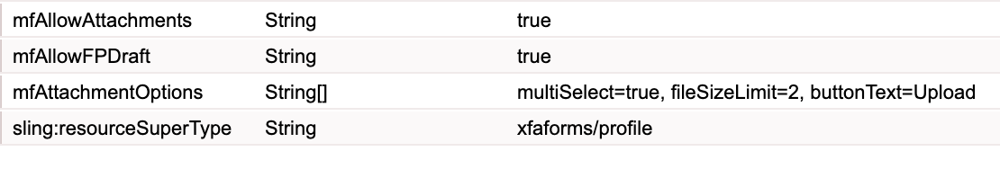

# HTML5 フォームの添付ファイルの有効化 {#enabling-attachments-for-an-html-form}

HTML5 Forms 機能は、早期アクセスプログラムの一部として提供されています。アクセス権をリクエストするには、公式の（勤務先の）メールアドレスから aem-forms-ea@adobe.com にメールを送信してください。

HTML5 フォームで添付ファイルをアップロード、プレビューおよび送信できます。デフォルトでは、添付ファイルサポートは無効になっています。添付ファイルサポートを有効にするには：

1. `mfAttachmentOptions`複数選択文字列プロパティを持つ[カスタムプロファイル](/help/forms/custom-profile.md)を作成してください。`mfAttachmentOptions` プロパティの各文字列は、ファイル添付ウィジェットのオプションを設定するための `property=value` 形式である必要があります。`property` および `value` は、次のいずれかの値を持つことができます。

   | プロパティ | 値 |
   |--- |---|
   | multiSelect | trueまたはfalse (デフォルトではtrue) |
   | fileSizeLimit | MB 単位の数（デフォルトは 2 MB）。 例えば、5 を入力します。 |
   | buttonText | ポップアップウィンドウのボタンテキスト（デフォルトでは 「Attach」） |
   | 同意 | 受け入れるファイルタイプのコンマ区切りリスト（デフォルトでは「audio/*、video/*、image/*、text/*、.pdf」） |

   次に例を示します。

   

   必要に応じて、`mfAttachmentOptions` プロパティのその他のカスタムオプションを指定することもできます。

   >[!NOTE]
   >
   >Microsoft Internet Explorer 9 では、指定された制限を超えたサイズのファイルを添付できます。これは既知の問題です。

1. [メタデータエディター](/help/forms/manage-form-metadata.md)を使用して、上記で HTML5 のフォームのために作成したカスタムプロファイルを選択します。
1. カスタムプロファイルを使用してフォームテンプレートをレンダリングすると、添付ファイルアイコンがフォームツールバーの上に表示されます。

   >[!NOTE]
   >
   >ドラフトと添付ファイル機能を有効にすると、標準のフォームポータルは、ファイルカスタムプロファイルを提供します。**ドラフトとして保存**&#x200B;プロファイルに関する詳細は、[HTML5 フォームをドラフトとして保存](/help/forms/saving-html5-form-draft.md)を参照してください。

1. 添付ファイルアイコンをクリックすると、添付ファイル選択ダイアログボックスが表示されます。ファイルを参照して添付ファイルを選択して&#x200B;**「添付」**&#x200B;をクリックします。

   >[!NOTE]
   >
   >添付ファイルをプレビューするには、添付ファイル名をクリックします。

   >[!NOTE]
   >
   >匿名のユーザーは、ファイルプレビューオプションを使用できません。

## 添付ファイル送信形式 {#attachment-submission-format}

添付ファイルが有効である場合、HTML5 フォームはマルチパート形式のデータを送信します。マルチパート形式で送信するデータには&#x200B;**dataXml**&#x200B;および&#x200B;**添付ファイル**&#x200B;の2つの部分があります。

>[!NOTE]
>
>下位互換性については、`mfAllowAttachments` オプションがオフになっている場合、HTML5 フォームはマルチパート形式のデータを送信しません。**application/xml**&#x200B;形式の単純なデータ xml を送信します。

mfAllowAttachments フラグがオンになっている場合、[送信サービスのプロキシサービス](/help/forms/service-proxy.md)もまたマルチパート形式のデータを dataXml と添付ファイルと共に投稿します。
