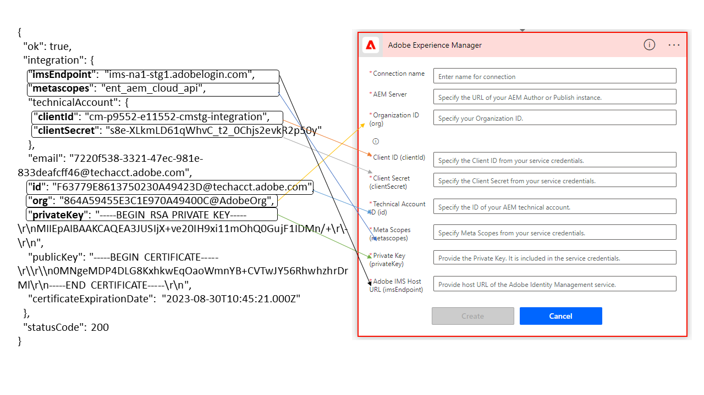

# よくある質問 {#frequently-asked-questions}

* **コードエディターを使用してルールを作成できますか？**
ビジュアルエディターを使用して、ルールを作成できます。[!DNL Forms] as a Cloud Service では、コードエディターは使用できません。アダプティブフォームで、コードエディターを使用して開発されたルールスクリプトを使用する場合は、[移行ユーティリティ](migrate-to-forms-as-a-cloud-service.md)を使用して、コードスクリプトをカスタム関数に変換します。ビジュアルエディターでカスタム関数を使用すると、コードエディターで取得した結果を引き続き取得できます。

* **Cloud Service インスタンスで XFA ベースのアダプティブフォームを作成できますか？**
はい、XFA ベースのアダプティブフォームを Cloud Service インスタンス上に作成できます。ただし、AEM Forms as a Cloud Service SDK（ローカル開発環境）では、XFA ベースのアダプティブフォームのサポートは利用できません。XFA ベースのアダプティブフォームを AEM Forms as a Cloud Service SDK で使用する場合は、使用事例と具体的な要件の詳細をアドビサポートにお問い合わせください。

<!-- * **Can I use an XDP as a Document of Record (DoR) template? Is Forms Designer included in AEM Forms as a Cloud Service license?** 

  Yes, you can use an XDP as a Document of Record template on Cloud Service instances. However, support to use XDP as a Document of Record template is not available for AEM Forms as a Cloud Service SDK (Local development environment). -->

* **コンテンツをオンプレミスや [!DNL Adobe-Managed Services] 環境から [!DNL Forms] as a Cloud Service 環境に移行できますか？**
はい。カスタムコード、コンテンツ、アセットをオンプレミスまたは [!DNL Adobe-Managed Services] 環境から [!DNL Forms] as a Cloud Service 環境に移行できます。手順について詳しくは、[Forms as a Cloud Service への移行](migrate-to-forms-as-a-cloud-service.md)を参照してください。

<!-- You can use package manager or Experience Manager UI to [export and import Forms and related assets](import-export-forms-templates.md), use the migration utility to make your existing assets compatible with [!DNL Forms] as a Cloud Service, use the [Best Practices Analyzer](https://experienceleague.adobe.com/docs/experience-manager-cloud-service/moving/cloud-migration/best-practices-analyzer/overview-best-practices-analyzer.html?lang=ja#best-practices-analyzer) tool to find the features and APIs that require changes and updated before migration, and use the [Content Transfer Tools](https://docs.adobe.com/content/help/ja-JP/experience-manager-cloud-service/moving/home.html) to move your custom code without refactoring it. -->

* **AEM [!DNL Forms] as a Cloud Service [!DNL Java™] API リファレンスドキュメントはどこで入手できますか？**
Java™ API リファレンスドキュメントは、[!DNL Maven Central Repository] からダウンロードできます。ダウンロードするには、以下の手順を実行します。
   1. [[!DNL Maven Central Repository]](https://mvnrepository.com/artifact/com.adobe.aem/aem-forms-sdk-api) に移動します。
   1. [!DNL Experience Manager Forms] SDK の最新バージョンを含むページを探して開きます。
   1. 「すべて表示」オプションをクリックして、すべてのファイルを表示します。
   1. `aem-forms-sdk-api-<version>-javadocs`.jar をダウンロードして抽出します。
   1. index.html ファイルを開き、API リファレンスドキュメントを表示します。

* **アダプティブフォームの [!DNL JavaScript™] API リファレンスはどこで入手できますか？**
[!DNL JavaScript™] API リファレンスドキュメントは、[!DNL  Maven Central Repository] からダウンロードできます。ダウンロードするには、以下の手順を実行します。
   1. [[!DNL Maven Central Repository]](https://mvnrepository.com/artifact/com.adobe.aem/aem-forms-sdk-api) を開きます。
   1. [!DNL Experience Manager Forms] SDK の最新バージョンを含むページを探して開きます。
   1. 「すべて表示」オプションをクリックして、すべてのファイルを表示します。
   1. `aem-forms-sdk-api-<version>-jsdoc.jar` をダウンロードして抽出します。
   1. index.html ファイルを開き、API リファレンスドキュメントを表示します。

* **既存のテーマとテンプレートを引き続き使用できますか？**
はい。[移行ユーティリティ](migrate-to-forms-as-a-cloud-service.md)を使用して [!DNL AEM Forms] as a Cloud Service に移動した後、AEM 6.4 Forms および AEM 6.5 Forms で作成されたテーマを引き続き使用できます。

  また、[!DNL AEM Forms] as a Cloud Service [アーキタイプ](setup-local-development-environment.md#forms-cloud-service-local-development-environment)に基づいてプロジェクトを作成し、含まれるサンプルテーマとテンプレートを使用することもできます。

* **スキーマに準拠したデータを作成できますか？**
はい。アダプティブフォームを作成して、スキーマに準拠したデータを作成できます。

<!-- * **Can I pass custom parameters to the prefill service?**
Custom parameters are planned for an upcoming release. -->

* **セキュリティで保護されたコンテンツをキャッシュできますか？**
セキュリティで保護されたコンテンツのキャッシュ機能は、デフォルトで無効になっています。この機能を有効にするには、[セキュリティで保護されたコンテンツのキャッシュ](https://experienceleague.adobe.com/docs/experience-manager-dispatcher/using/configuring/permissions-cache.html?lang=ja)に記載されている手順を実行します。

* **ローカライズされたアダプティブフォームがありますが、これはローカライズ版をレンダリングしていないのですか？原因と解決方法は何でしょうか？**

  ローカライズされたアダプティブフォームの URL 規則で、URL でのロケールの指定がサポートされるようになりました。新しい URL 規則により、ローカライズされたフォームを Dispatcher または CDN にキャッシュできます。Cloud Service 環境では、`http://host:port/content/forms/af/afName.html?afAcceptLang=<locale>` の代わりに `http://host:port/content/forms/af/<afName>.<locale>.html` の URL 形式を使用して、アダプティブフォームのローカライズ版をリクエストします。アドビでは、Dispatcher または CDN キャッシュを使用することをお勧めします。これにより、事前入力されたフォームのレンダリング速度を向上できます。

* **アダプティブフォームを更新しましたが、顧客は更新されたバージョンを使用できませんか？**
デフォルトでは、CDN は 5 分ごとにキャッシュを更新し、5 分待ってから、更新バージョンを確認します。

* **アダプティブフォームの署名ステップを使用して、ブラウザー内の署名エクスペリエンスを作成できますか？**
いいえ。署名ステップは、[!DNL Forms] as a Cloud Service では使用できません。アダプティブフォームの署名ステップを削除します。署名ステップの代わりに、送信後のアダプティブフォームへの署名をユーザーに許可します。これは、ブラウザー内の署名エクスペリエンスを提供し続けるのに役立ちます。

* **アダプティブフォームで検証ステップを使用できますか？**
いいえ。検証ステップは、[!DNL Forms] as a Cloud Service では使用できません。こうしたフォームを Cloud Service 環境に移動する前に、既存のアダプティブフォームから検証ステップを削除します。

* **アダプティブフォームにグラフを追加できますか？**
はい。アダプティブフォームにグラフを追加できます。アダプティブフォームには、グラフコンポーネントが用意されています。これを使用して、アダプティブフォームにグラフを追加できます。

* **フォームデータモデルをリレーショナルデータベースモデルに接続できますか？**
フォームデータモデルは、[!DNL RESTful web services]、[!DNL SOAP-based web services]、[!DNL OData services] および Experience Manager ユーザープロファイルにデータソースとして接続できます。<!--Support to connect a Form Data Model with a relational database is not available.-->

* **フォームデータモデル（FDM）で認証用にカスタム証明書を使用できますか？**
フォームデータモデル（FDM）は、認証用にカスタム証明書を使用する方法を提供していません。そのため、x509 や 2way SSL などのカスタム証明書はサポートされていません。

* **フォームポータル送信アクションアダプティブフォームを使用できますか？**

  既存のアダプティブフォームを変更して、[REST エンドポイントへ送信](configuring-submit-actions.md#submit-to-rest-endpoint)、[メールを送信](configuring-submit-actions.md#send-email)、[フォームデータモデル（FDM）を使用して送信](configuring-submit-actions.md#submit-using-form-data-model)および [AEM ワークフローを起動](configuring-submit-actions.md#invoke-an-aem-workflow)送信アクションを使用できます。フォームポータルおよびフォームポータル送信アクションは、まだ使用できません。機能の可用性については、毎月のリリースノートに注目してください。

* **[!DNL AEM Forms] アプリを [!DNL AEM Forms] as a Cloud Service** で使用できますか？

  アダプティブフォームではレスポンシブデザインが可能です。これらのフォームは、基になるデバイスに基づいてアピアランス、デザインおよび双方向性を変更します。機能の可用性について毎月のリリースノートをフォローアップしながら、モバイルデバイスでアダプティブフォームを引き続き使用できます。

* **最初の GA リリースに含まれない機能はどれですか？**
フォームポータル、[!DNL AEM Forms] アプリ、Adobe Analytics との統合、Adobe Target との統合は、最初の GA リリースには含まれません。新機能については、毎月のリリースノートを参照してください。

* **[アダプティブフォームを作成するための JSON スキーマ](adaptive-form-json-schema-form-model.md)をデザインしました。JSON スキーマは、アダプティブフォームの一部のコンポーネント用のイベントを定義します。AEM Forms as a Cloud Service はイベントをサポートしていますか？**
Experience Manager 6.5 Forms 環境で JSON スキーマに基づいたアダプティブフォームを作成し、作成したアダプティブフォームを[移行ユーティリティ](migrate-to-forms-as-a-cloud-service.md)を使用して AEM Forms as a Cloud Service に移行できます。ユーティリティは、このようなイベントをクライアントライブラリに変換し、Cloud Service 環境でアダプティブフォームを引き続き使用できます。

<!-- 

* **Is there any AEM Forms as a Cloud Service connector for Microsoft Power Automate?**

  Yes, Adobe provides an Adobe Experience Manager connector to access [Adobe Experience Manager Forms - Communication capabilities](https://experienceleague.adobe.com/docs/experience-manager-cloud-service/content/forms/using-communications/aem-forms-cloud-service-communications-introduction.html?lang=ja) through Microsoft Power Automate. You can create a PDF document that is based on a form design and XML form data or create PostScript (PS), Printer Command Language (PCL), Zebra Printing Language (ZPL) and other Printer Definition Language documents. 

  You can get started with Adobe Experience Manager easily with just a few steps:

  1. Generate the Service credentials: Use Adobe Experience Manager Developer Console to [generate](https://experienceleague.adobe.com/docs/experience-manager-learn/getting-started-with-aem-headless/authentication/service-credentials.html?lang=ja&#generate-service-credentials) the service credentials.  
  
  1. Setup your connection: Add your service credentials to the Adobe Experience Manager Connector. You can get crdential from service credential JSON and copy these credential details to your one-time connection setup:

    * AEM Server
    * Organization ID 
    * Client ID
    * Client Secret
    * Technical Account ID
    * Meta Scopes
    * Private Key - base64 encoded keys are accepted
    * Adobe IMS Host URL

      
    
    

    A sample Service Credential JSON file fields mapped to Adobe Experience Manager connector for Microsoft Power Automate.

    -->
