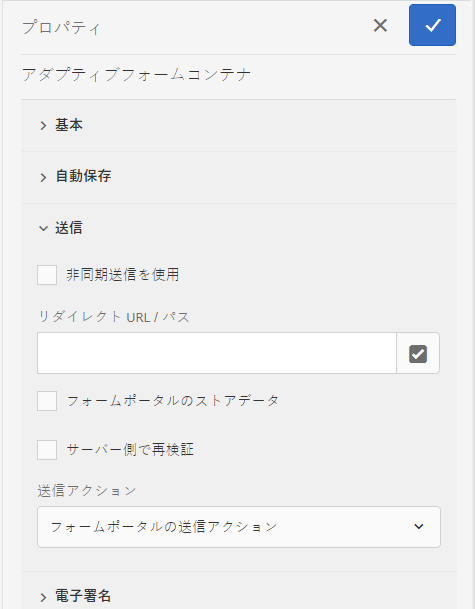

# アダプティブフォームと Microsoft® Power Automate の接続 {#connect-adaptive-form-with-power-automate}

| バージョン | 記事リンク |
| -------- | ---------------------------- |
| AEM 6.5 | [ここをクリックしてください](https://experienceleague.adobe.com/en/docs/experience-manager-65/content/forms/adaptive-forms-basic-authoring/forms-microsoft-power-automate-integration) |
| AEM as a Cloud Service | この記事 |

<span class="preview">GovCloud を使用中に GCC （Government Cloud Computing）テナントに接続する必要がある場合は、公式アドレスから aem-forms-ea@adobe.com にメールを送信して、早期導入プログラムを介したアクセスをリクエストします。</span>

送信時に Microsoft® Power Automate のクラウドフローを実行するように、アダプティブフォームを設定できます。設定済みのアダプティブフォームは、キャプチャされたデータ、添付ファイルおよびレコードのドキュメントを Power Automate クラウドフローに送信して処理します。 Microsoft® Power Automate の機能を活用して、キャプチャされたデータを中心にビジネスロジックを構築し、顧客のワークフローを自動化しながら、カスタムのデータキャプチャエクスペリエンスを構築するのに役立ちます。

アダプティブフォームエディターには「**Microsoft® Power Automate フローの呼び出し**」送信アクションが用意されており、アダプティブフォームのデータ、添付ファイル、レコードのドキュメントを Power Automate クラウドフローに送信できます。

AEM as a Cloud Service では、フォーム送信を処理するための様々な送信アクションが標準で提供されます。これらのオプションについて詳しくは、[アダプティブフォーム送信アクション](/help/forms/aem-forms-submit-action.md)の記事を参照してください。


## メリット

アダプティブフォームを Microsoft® Power Automated と統合した後に実行できる操作の例を以下に示します。

* Power Automate のビジネスプロセスでアダプティブフォームデータを使用する
* Power Automate を使用して、500 を超えるデータソースまたは一般公開されている API にキャプチャしたデータを送信する
* キャプチャしたデータに対する複雑な計算を実行する
* 事前に定義されたスケジュールでアダプティブフォームのデータをストレージシステムに保存する

## 前提条件

アダプティブフォームを Microsoft® Power Automate に接続するには、以下が必要です。

* Microsoft® Power Automate Premium ライセンス。
* アダプティブフォームの送信データを受け入れるための `When an HTTP request is received` トリガーを使用した Microsoft® [Power Automate フロー](https://docs.microsoft.com/ja-jp/power-automate/create-flow-solution)。
* [Forms 作成者](/help/forms/forms-groups-privileges-tasks.md)および [Forms 管理者](/help/forms/forms-groups-privileges-tasks.md)権限を持つ Experience Manager ユーザー
* Microsoft® Power Automate に接続するために使用されるアカウントは、アダプティブフォームからデータを受け取るように設定された Power Automate フローの所有者です

## Forms as a Cloud Service インスタンスを Microsoft® Power Automate に接続する {#connect-forms-server-with-power-automate}

Forms as a Cloud Service インスタンスを Microsoft® Power Automate に接続するには、次の操作を実行します。

1. [Microsoft を作成](#ms-power-automate-application)
1. [Microsoft を作成](#microsoft-power-automate-dataverse-cloud-configuration)
1. [Microsoft を作成](#create-microsoft-power-automate-flow-cloud-configuration)
1. [Microsoft を公開](#publish-microsoft-power-automate-dataverse-cloud-configuration)

### Microsoft® Azure Active Directory アプリケーションを作成します {#ms-power-automate-application}

1. [Azure Portal](https://portal.azure.com/) にログインします。 
1. 左側のナビゲーションから [!UICONTROL Azure Active Directory] を選択します。
1. デフォルトのディレクトリページで、左側のパネルから「[!UICONTROL アプリの登録]」を選択します。
1. アプリ登録ページで、「新規登録」をクリックします。
1. そのページで、名前、サポートされているアカウントタイプおよびリダイレクト URI を指定します。 リダイレクト URI で、次の情報を指定し、「保存」をクリックします。
   * `https://[Forms as a Cloud Service Server]/libs/fd/powerautomate/content/dataverse/config.html`
   * `https://[Forms as a Cloud Service Server]/libs/fd/powerautomate/content/flowservice/config.html`

   

   >[!NOTE]
   >必要に応じて、認証ページから追加のリダイレクト URI を指定することもできます。
   > サポートされるアカウントタイプに対して、ユースケースに応じて、シングルテナント、マルチテナントまたは個人の Microsoft® アカウントを選択します


1. 認証ページで、次のオプションを有効にし、「保存」をクリックします。


   * アクセストークン（暗黙的なフローに使用）
   * ID トークン（暗黙的なフローとハイブリッドフローに使用）

1. API 権限ページで、「`Add a permission`」をクリックします。

1. Microsoft® API で、「`Power Automate`」を選択し、次の権限を選択します。
   * Flows.Manage.All
   * Flows.Read.All
   * GCC 権限（GCC（政府のクラウドコンピューティング）テナントに接続する場合はオプション）
「`Add permissions`」をクリックして、権限を保存します。
1. API 権限ページで、「`Add a permission`」をクリックします。組織で使用している API を選択し、`DataVerse` を検索して `user_impersonation` を有効にし、`Add` 権限をクリックします。
1. （オプション）証明書とシークレットページで、「新しいクライアントシークレット」をクリックします。 「クライアントシークレットの追加」画面で、説明とシークレットの有効期限を入力し、「追加」をクリックします。 シークレットの文字列が生成されます。
1. 組織固有の [Dynamics 環境の URL](https://docs.microsoft.com/ja-jp/power-automate/web-api#compose-http-requests) をメモしておいてください。

### Microsoft® Power Automate Dataverse クラウド設定の作成 {#microsoft-power-automate-dataverse-cloud-configuration}

1. AEM Forms のオーサーインスタンスで、**[!UICONTROL ツール]** ／**[!UICONTROL 一般]**／**[!UICONTROL 設定ブラウザー]**&#x200B;に移動します。
1. **[!UICONTROL 設定ブラウザー]**&#x200B;ページで「**[!UICONTROL 作成]**」を設定します。
1. **[!UICONTROL 設定を作成]**&#x200B;ダイアログで、設定の&#x200B;**[!UICONTROL タイトル]**&#x200B;を指定し、「**[!UICONTROL クラウド設定]**」を有効にして「**[!UICONTROL 作成]**」を選択します。これにより、Cloud Services 用の設定コンテナが作成されます。フォルダー名にスペースが含まれていないことを確認します。
1. **[!UICONTROL ツール]** ／**[!UICONTROL Cloud Services]**／**[!UICONTROL Microsoft® Power Automate Dataverse]** に移動し、前の手順で作成した設定コンテナを開きます。


   >[!NOTE]
   >
   >アダプティブフォームを作成する際に、**[!UICONTROL 設定コンテナ]**&#x200B;フィールドにコンテナ名を指定します。

1. 設定ページで「**[!UICONTROL 作成]**」をタップして、AEM Forms 内に [!DNL Microsoft® Power Automate Flow Service] の設定を作成します。
1. **[!UICONTROL Microsoft® Power Automate の Dataverse Service の設定]**&#x200B;ページで、**[!UICONTROL クライアント ID]**（アプリケーション ID とも呼ばれます）、**[!UICONTROL クライアントシークレット]**、 **[!UICONTROL OAuth URL]** および&#x200B;**[!UICONTROL Dynamics 環境 URL]** を指定します。前のセクションで作成した [Microsoft® Azure Active Directory アプリケーション](#ms-power-automate-application)のクライアント ID、クライアントシークレット、OAuth URL およびDynamics 環境 URL を使用します。Microsoft® Azure Active Directory アプリケーション UI の「エンドポイント」オプションを使用して OAuth URL を検索する

   

1. 「**[!UICONTROL 接続]**」を選択します。必要に応じて、Microsoft® Azure アカウントにログインします。「**[!UICONTROL 保存]**」を選択します。

### Microsoft® Power Automate フローサービスのクラウド設定を作成 {#create-microsoft-power-automate-flow-cloud-configuration}

1. **[!UICONTROL ツール]**／**[!UICONTROL Cloud Services]**／**[!UICONTROL Microsoft® Power Automate フローサービス]**&#x200B;に移動し、前の手順で作成した設定コンテナを開きます。


   >[!NOTE]
   >
   >アダプティブフォームを作成する際に、**[!UICONTROL 設定コンテナ]**&#x200B;フィールドにコンテナ名を指定します。

1. 設定ページで「**[!UICONTROL 作成]**」をタップして、AEM Forms 内に [!DNL Microsoft® Power Automate Flow Service] の設定を作成します。

1. （オプション）GCC テナントに接続するには、「`Connect to Microsoft GCC`」チェックボックスをオンにします。

   >[!NOTE]
   >
   > GCC（政府のクラウドコンピューティング）テナントに接続する場合は、Microsoft Azure Portal で GCC 権限を選択します。


   

1. **[!UICONTROL Microsoft® Power Automate の Dataverse の設定]**&#x200B;ページで、**[!UICONTROL クライアント ID]**（アプリケーション ID とも呼ばれます）、**[!UICONTROL クライアントシークレット]**、**[!UICONTROL OAuth URL]** および&#x200B;**[!UICONTROL Dynamics 環境 URL]** を指定します。 クライアント ID、クライアントシークレット、OAuth URL、Dynamics 環境 ID を使用します。 Microsoft® Azure Active Directory アプリケーション UI の「エンドポイント」オプションを使用して、OAuth URL を検索します。 [マイフロー](https://us.flow.microsoft.com)リンクを開いて「マイフロー」を選択し、URL にリストされている ID を Dynamics 環境 ID として使用します。

1. 「**[!UICONTROL 接続]**」を選択します。必要に応じて、Microsoft® Azure アカウントにログインします。「**[!UICONTROL 保存]**」を選択します。

### Microsoft® Power Automate Dataverse と Microsoft® Power Automate フローサービスのクラウド設定の両方を公開する {#publish-microsoft-power-automate-dataverse-cloud-configuration}

1. **[!UICONTROL ツール]**／**[!UICONTROL Cloud Services]**／**[!UICONTROL Microsoft® Power Automate Dataverse]** に移動し、前の「[Microsoft® Power Automate Dataverse クラウド設定の作成](#microsoft-power-automate-dataverse-cloud-configuration)」セクションで作成した設定コンテナを開きます。
1. `dataverse` 設定を選択し、「**[!UICONTROL 公開]**」を選択します。
1. 公開ページで「**[!UICONTROL すべての設定]**」を選択し、「**[!UICONTROL 公開]**」を選択します。Power Automate Dataverse と Power Automate フローサービスのクラウド設定の両方を公開します。

これで、Forms as a Cloud Service インスタンスが Microsoft® Power Automate に接続されました。アダプティブフォームのデータを Power Automate フローに送信できるようになりました。

## 「Microsoft® Power Automate フローの呼び出し」送信アクションを使用して、Power Automate フローにデータを送信する {#use-the-invoke-microsoft-power-automate-flow-submit-action}

[Forms as a Cloud Service インスタンスを Microsoft® Power Automate に接続](#connect-forms-server-with-power-automate)した後、次の操作を実行して、フォーム送信時に、キャプチャしたデータを Microsoft® フローに送信するようアダプティブフォームを設定します。

>[!BEGINTABS]

>[!TAB 基盤コンポーネント]

1. オーサーインスタンスにログインし、アダプティブフォームを選択して、「**[!UICONTROL プロパティ]**」をクリックします。
1. 設定コンテナで、[Microsoft® Power Automate Dataverse クラウド設定を作成](#microsoft-power-automate-dataverse-cloud-configuration)セクションで作成したコンテナを参照して選択し、「**[!UICONTROL 保存して閉じる]**」を選択します。
1. 編集用にアダプティブフォームを開き、アダプティブフォームのコンテナプロパティの「**[!UICONTROL 送信]**」セクションに移動します。
1. プロパティコンテナで、**[!UICONTROL 送信アクション]**&#x200B;に「**[!UICONTROL Power Automate フローを呼び出す]**」オプションを選択し、「**[!UICONTROL Power Automate フロー]**」を選択します。必要なフローを選択すると、送信時にアダプティブフォームデータが送信されます。

   
1. 「**[!UICONTROL 完了]**」をクリックします。

>[!NOTE]
>
> アダプティブフォームを送信する前に、以下の JSON スキーマを持つ `When an HTTP Request is received` トリガーが Power Automate フローに追加されていることを確認してください。

```
        {
            "type": "object",
            "properties": {
                "attachments": {
                    "type": "array",
                    "items": {
                        "type": "object",
                        "properties": {
                            "filename": {
                                "type": "string"
                            },
                            "data": {
                                "type": "string"
                            },
                            "contentType": {
                                "type": "string"
                            },
                            "size": {
                                "type": "integer"
                            }
                        },
                        "required": [
                            "filename",
                            "data",
                            "contentType",
                            "size"
                        ]
                    }
                },
                "templateId": {
                    "type": "string"
                },
                "templateType": {
                    "type": "string"
                },
                "data": {
                    "type": "string"
                },
                "document": {
                    "type": "object",
                    "properties": {
                        "filename": {
                            "type": "string"
                        },
                        "data": {
                            "type": "string"
                        },
                        "contentType": {
                            "type": "string"
                        },
                        "size": {
                            "type": "integer"
                        }
                    }
                }
            }
        }
```

>[!TAB コアコンポーネント]

1. オーサーインスタンスにログインし、アダプティブフォームを選択して、「**[!UICONTROL プロパティ]**」をクリックします。
1. 設定コンテナで、[Microsoft® Power Automate Dataverse クラウド設定を作成](#microsoft-power-automate-dataverse-cloud-configuration)セクションで作成したコンテナを参照して選択し、「**[!UICONTROL 保存して閉じる]**」を選択します。
1. コンテンツブラウザーを開き、アダプティブフォームの&#x200B;**[!UICONTROL ガイドコンテナ]**&#x200B;コンポーネントを選択します。
1. ガイドコンテナプロパティ  アイコンをクリックします。 アダプティブフォームコンテナダイアログボックスが開きます。
1. 「**[!UICONTROL 送信]**」タブをクリックします。
1. 送信アクションドロップダウンリストから「**[!UICONTROL Power Automate フローを呼び出す]**」オプションを選択し、「**[!UICONTROL Power Automate フロー]**」を選択します。 必要なフローを選択すると、送信時にアダプティブフォームデータが送信されます。

   
1. 「**[!UICONTROL 完了]**」をクリックします。

>[!NOTE]
>
> アダプティブフォームを送信する前に、以下の JSON スキーマを持つ `When an HTTP Request is received` トリガーが Power Automate フローに追加されていることを確認してください。

```
        {
            "type": "object",
            "properties": {
                "attachments": {
                    "type": "array",
                    "items": {
                        "type": "object",
                        "properties": {
                            "filename": {
                                "type": "string"
                            },
                            "data": {
                                "type": "string"
                            },
                            "contentType": {
                                "type": "string"
                            },
                            "size": {
                                "type": "integer"
                            }
                        },
                        "required": [
                            "filename",
                            "data",
                            "contentType",
                            "size"
                        ]
                    }
                },
                "templateId": {
                    "type": "string"
                },
                "templateType": {
                    "type": "string"
                },
                "data": {
                    "type": "string"
                },
                "document": {
                    "type": "object",
                    "properties": {
                        "filename": {
                            "type": "string"
                        },
                        "data": {
                            "type": "string"
                        },
                        "contentType": {
                            "type": "string"
                        },
                        "size": {
                            "type": "integer"
                        }
                    }
                }
            }
        }
```

>[!TAB ユニバーサルエディター]

1. オーサーインスタンスにログインし、アダプティブフォームを選択します。
1. 設定コンテナで、[Microsoft® Power Automate Dataverse クラウド設定を作成](#microsoft-power-automate-dataverse-cloud-configuration)セクションで作成したコンテナを参照して選択し、「**[!UICONTROL 保存して閉じる]**」を選択します。
1. アダプティブフォームを編集用に開きます。
1. エディターで&#x200B;**フォームプロパティを編集**&#x200B;拡張機能をクリックします。
**フォームプロパティ**&#x200B;ダイアログが表示されます。

   >[!NOTE]
   >
   > * ユニバーサルエディターインターフェイスに **フォームプロパティを編集** アイコンが表示されない場合は、Extension Manager で&#x200B;**フォームプロパティを編集**&#x200B;拡張機能を有効にします。
   > * ユニバーサルエディターで拡張機能を有効または無効にする方法については、[Extension Manager 機能のハイライト](https://developer.adobe.com/uix/docs/extension-manager/feature-highlights/#enablingdisabling-extensions)の記事を参照してください。


1. 「**送信**」タブをクリックし、「**[!UICONTROL Power Automate フローを呼び出す]**」送信アクションを選択します。必要なフローを選択すると、送信時にアダプティブフォームデータが送信されます。

   
1. 「**[!UICONTROL 保存して閉じる]**」をクリックします。

>[!NOTE]
>
> アダプティブフォームを送信する前に、以下の JSON スキーマを持つ `When an HTTP Request is received` トリガーが Power Automate フローに追加されていることを確認してください。

```
        {
            "type": "object",
            "properties": {
                "attachments": {
                    "type": "array",
                    "items": {
                        "type": "object",
                        "properties": {
                            "filename": {
                                "type": "string"
                            },
                            "data": {
                                "type": "string"
                            },
                            "contentType": {
                                "type": "string"
                            },
                            "size": {
                                "type": "integer"
                            }
                        },
                        "required": [
                            "filename",
                            "data",
                            "contentType",
                            "size"
                        ]
                    }
                },
                "templateId": {
                    "type": "string"
                },
                "templateType": {
                    "type": "string"
                },
                "data": {
                    "type": "string"
                },
                "document": {
                    "type": "object",
                    "properties": {
                        "filename": {
                            "type": "string"
                        },
                        "data": {
                            "type": "string"
                        },
                        "contentType": {
                            "type": "string"
                        },
                        "size": {
                            "type": "integer"
                        }
                    }
                }
            }
        }
```

>[!ENDTABS]

<!--
## See also

* [Create an Adaptive Form](creating-adaptive-form-core-components.md)
* [Configure a Submit Action](configure-submit-actions-core-components.md)
* [Adobe Experience Manager Connector for Microsoft&reg; Power Automate](https://learn.microsoft.com/en-us/connectors/adobeexperiencemanag/)
* [Connect Adaptive Form to Microsoft&reg; Power Automate](/help/forms/configure-submit-actions-core-components.md#microsoft-power-automate)
-->


## 関連記事

{{af-submit-action}}

<!--

>[!MORELIKETHIS]
>
>* [Connect Adaptive Form to Microsoft Power Automate](/help/forms/configure-submit-actions-core-components.md#microsoft-power-automate)

-->